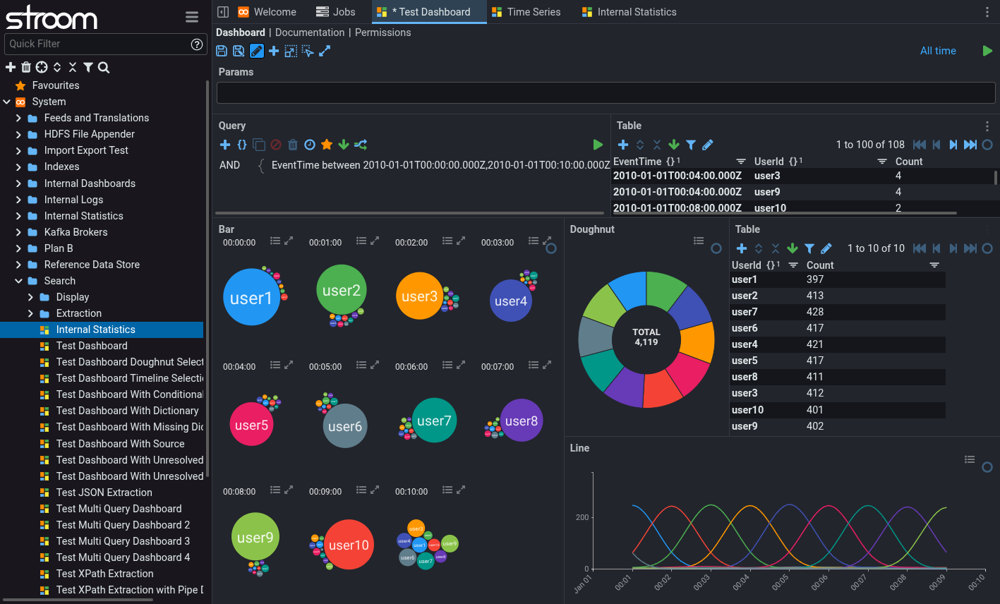
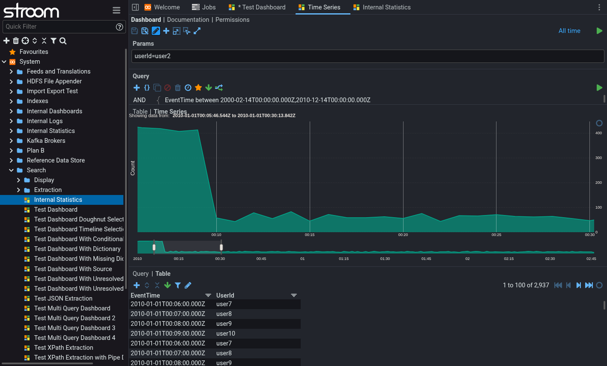
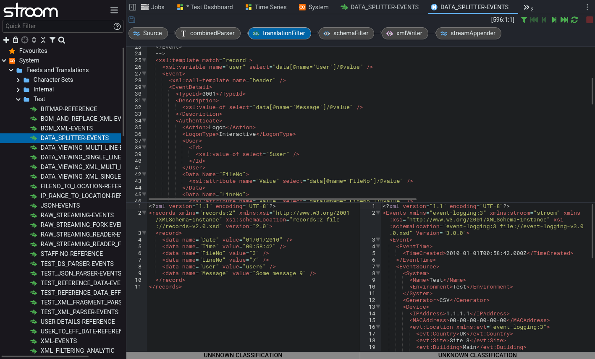

# 

Stroom is a data processing, storage and analysis platform.
It is scalable - just add more CPUs / servers for greater throughput.
It is suitable for processing high volume data such as system logs, to provide valuable insights into IT performance and
usage.

Stroom provides a number of powerful capabilities:

* **Data ingest.** Receive and store large volumes of data such as native format logs.
  Ingested data is always available in its raw form.
* **Data transformation pipelines.** Create sequences of XSL and text operations, in order to normalise or export data
  in any format.
  It is possible to enrich data using lookups and reference data.
* **Integrated transformation development.** Easily add new data formats and debug the transformations if they don't
  work as expected.
* **Scalable Search.** Create multiple indexes with different retention periods.
  These can be sharded across your cluster.
* **Dashboards.** Run queries against your indexes or statistics and view the results within custom visualisations.
* **Statistics.** Record counts or values of items over time, providing answers to questions such as "how many times has
  a specific machine provided data in the last hour/day/month?"

 &emsp;  &emsp;  &emsp; 

## Get Stroom

To run Stroom in docker do the following:

``` bash
# Download and extract Stroom v7.0 stack
bash <(curl -s https://gchq.github.io/stroom-resources/v7.0/get_stroom.sh)

# Navigate into the new stack directory
cd stroom_core_test/stroom_core_test*

# Start the stack
./start.sh
```

For more details on the commands above and any prerequisites
see [Single Node Docker Installation](https://gchq.github.io/stroom-docs/7.0/docs/install-guide/single-node-docker/).

For the releases of the core Stroom product, see [Stroom releases](https://github.com/gchq/stroom/releases). For the
releases of the docker application stacks,
see [Stroom-Resources releases](https://github.com/gchq/stroom-resources/releases).

## Documentation

The Stroom application spans several repositories but we've bundled all the documentation into
one [Stroom Documentation](https://gchq.github.io/stroom-docs/) site.

## Contributing

If you'd like to make a contribution then the details for doing all of that are
in [CONTRIBUTING.md](https://github.com/gchq/stroom/blob/master/CONTRIBUTING.md).

## Repositories

Stroom and its associated libraries, services and content span several repositories:

- [`stroom`](https://github.com/gchq/stroom) - The core Stroom application.
- [`stroom-agent`](https://github.com/gchq/stroom-agent) - An application for capturing and sending log files to Stroom.
- [`stroom-auth`](https://github.com/gchq/stroom-auth) - The OAuth2 authentication service used by Stroom.
- [`stroom-clients`](https://github.com/gchq/stroom-clients) - Various client libraries for sending logs to Stroom.
- [`stroom-content`](https://github.com/gchq/stroom-content) - Packaged content packs for import into Stroom.
- [`stroom-docs`](https://github.com/gchq/stroom-docs) - Documentation for the Stroom family of products.
- [`stroom-expression`](https://github.com/gchq/stroom-expression) - An expression library used in Stroom's dashboards
  and query API.
- [`stroom-headless`](https://github.com/gchq/stroom-headless) - An example of how to run Stroom in headless mode from
  the command line.
- [`stroom-proxy`](https://github.com/gchq/stroom-proxy) - An application that acts as a data receipt proxy for Stroom (
  Legacy v5 only).
- [`stroom-query`](https://github.com/gchq/stroom-query) - A library for querying Stroom's data sources.
- [`stroom-resources`](https://github.com/gchq/stroom-resources) - Configuration for orchestrating stroom in docker
  containers and released docker stacks.
- [`stroom-stats`](https://github.com/gchq/stroom-stats) - An application for storing and querying aggregates of event
  data.
- [`stroom-visualisations-dev`](https://github.com/gchq/stroom-visualisations-dev) - A set of visualisations for use in
  Stroom.
- [`event-logging-schema`](https://github.com/gchq/event-logging-schema) - An XML Schema for describing auditable
  events.
- [`event-logging`](https://github.com/gchq/event-logging) - A JAXB API for the `event-logging` XML Schema.

