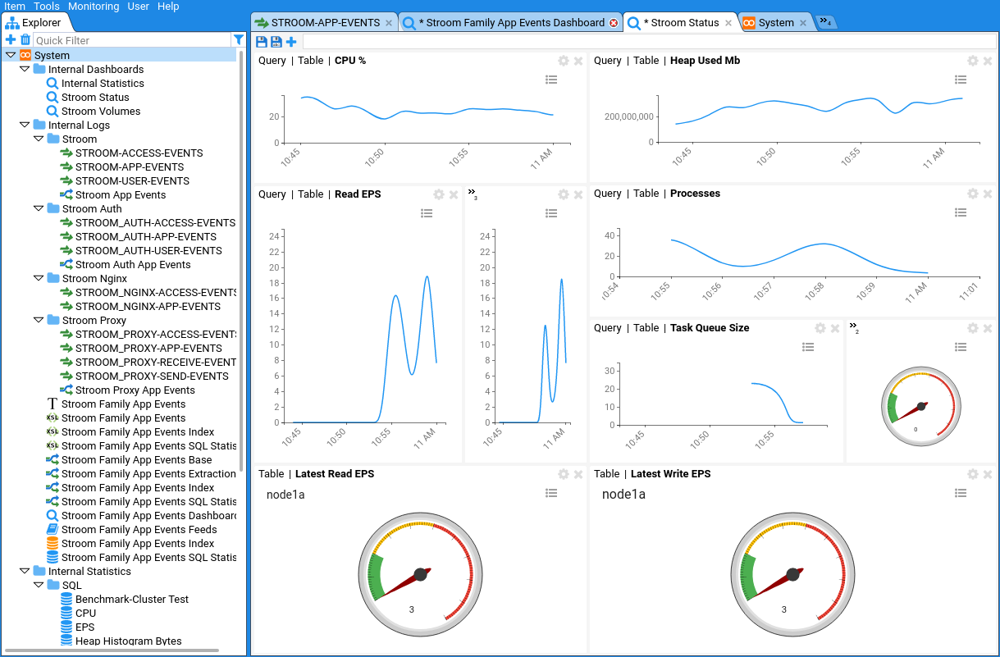

# 

Stroom is a data processing, storage and analysis platform. It is scalable - just add more CPUs / servers for greater throughput. It is suitable for processing high volume data such as system logs, to provide valuable insights into IT performance and usage.

Stroom provides a number of powerful capabilities:

* **Data ingest.** Receive and store large volumes of data such as native format logs. Ingested data is always available in its raw form.
* **Data transformation pipelines.** Create sequences of XSL and text operations, in order to normalise or export data in any format. It is possible to enrich data using lookups and reference data.
* **Integrated transformation development.** Easily add new data formats and debug the transformations if they don't work as expected.
* **Scalable Search.** Create multiple indexes with different retention periods. These can be sharded across your cluster.
* **Dashboards.** Run queries against your indexes or statistics and view the results within custom visualisations.
* **Statistics.** Record counts or values of items over time, providing answers to questions such as "how many times has a specific machine provided data in the last hour/day/month?"

<a title="Dashboard" href="#" onclick="window.location.href='markdown_resources/v6.0.19/stroom-dashboard.png'"></a>

## Get Stroom

To run Stroom in docker do the following:

``` bash
# Download and extract the latest Stroom v6 stack
bash <(curl -s https://gchq.github.io/stroom-resources/get_stroom.sh)

# Navigate into the new stack directory, where xxxx is the directory that has just been created
cd stroom_core/stroom_core-x.y.z

# Start the stack
./start.sh
```

For more details on the commands above and any prerequisites see [Running Stroom in Docker Containers](dev-guide/docker-running.md).

## Documentation

The Stroom application spans several repositories but we've bundled all the documentation into the [`stroom-docs`](https://gchq.github.io/stroom-docs/) repository. 
That's where to look if you want any of these:

- [The main README.md](https://github.com/gchq/stroom-docs/blob/master/README.md)
- [The quick-start guide](https://github.com/gchq/stroom-docs/blob/master/quick-start-guide/quick-start.md)
- [The developer guide](https://github.com/gchq/stroom-docs/tree/master/dev-guide/)
- [The install guide](https://github.com/gchq/stroom-docs/tree/master/install-guide)
- [The user guide](https://github.com/gchq/stroom-docs/tree/master/user-guide)

## Contributing

If you'd like to make a contribution then the details for doing all of that are in [CONTRIBUTING.md](https://github.com/gchq/stroom/blob/master/CONTRIBUTING.md).

## Repositories

Stroom and its associated libraries, services and content span several repositories:

- [`stroom`](https://github.com/gchq/stroom)
- [`stroom-agent`](https://github.com/gchq/stroom-agent)
- [`stroom-annotations`](https://github.com/gchq/stroom-annotations)
- [`stroom-auth`](https://github.com/gchq/stroom-auth)
- [`stroom-clients`](https://github.com/gchq/stroom-clients)
- [`stroom-content`](https://github.com/gchq/stroom-content)
- [`stroom-docs`](https://github.com/gchq/stroom-docs)
- [`stroom-expression`](https://github.com/gchq/stroom-expression)
- [`stroom-headless`](https://github.com/gchq/stroom-headless)
- [`stroom-js`](https://github.com/gchq/stroom-js)
- [`stroom-proxy`](https://github.com/gchq/stroom-proxy)
- [`stroom-query-elastic`](https://github.com/gchq/stroom-query-elastic)
- [`stroom-query`](https://github.com/gchq/stroom-query)
- [`stroom-resources`](https://github.com/gchq/stroom-resources)
- [`stroom-stats`](https://github.com/gchq/stroom-stats)
- [`stroom-visualisations-dev`](https://github.com/gchq/stroom-visualisations-dev)
- [`event-logging-schema`](https://github.com/gchq/event-logging-schema)
- [`event-logging`](https://github.com/gchq/event-logging)

## Build Status

#### **Stroom**
  * [**Master**](https://github.com/gchq/stroom/commits/master) - [](https://travis-ci.org/gchq/stroom)
  * [**6.0.x**](https://github.com/gchq/stroom/commits/6.0) - [](https://travis-ci.org/gchq/stroom/branches)
#### **Stroom Authentication**
  * [**Master**](https://github.com/gchq/stroom-auth/commits/master) - [](https://travis-ci.org/gchq/stroom-auth)
  * [**1.0.x**](https://github.com/gchq/stroom-auth/commits/1.0) - [](https://travis-ci.org/gchq/stroom-auth/branches)
#### **Stroom Resources**
  * [**Master**](https://github.com/gchq/stroom-resources/commits/master) - [](https://travis-ci.org/gchq/stroom-resources)
