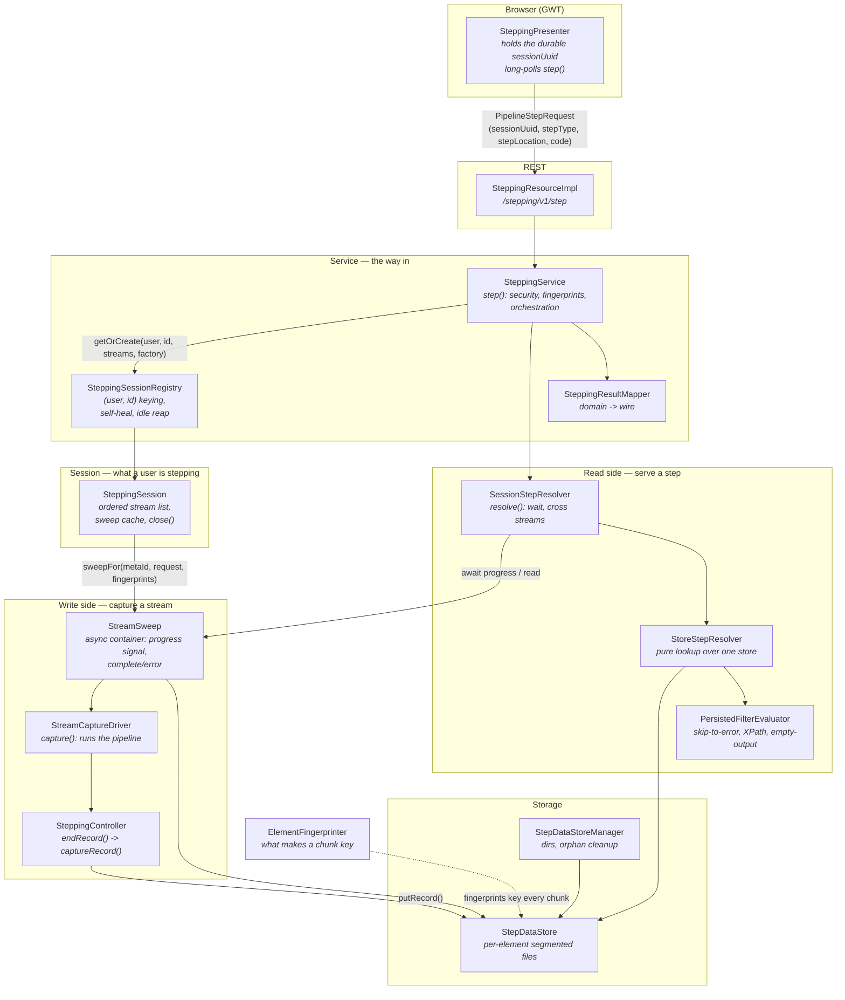
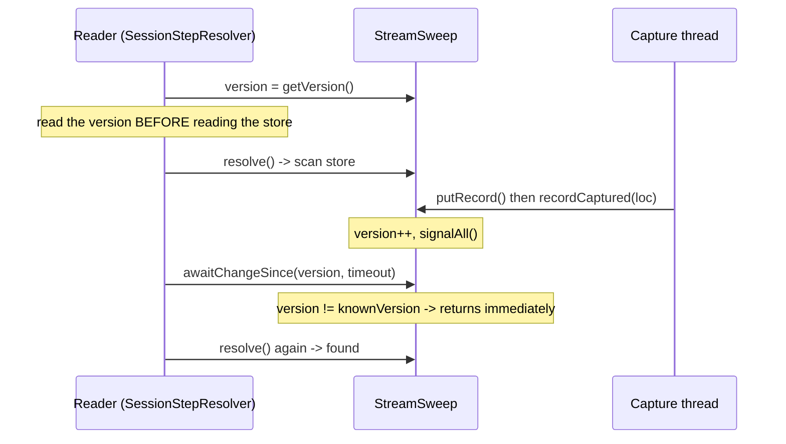
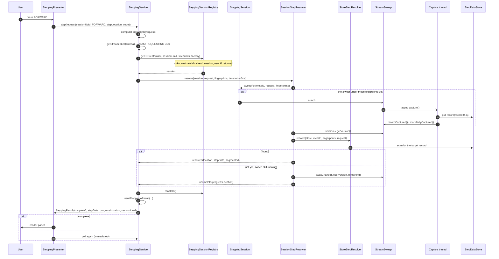

# Pipeline Stepping — Design

How stepping works, from the browser down to the bytes on disk.

Read this before changing anything under `stroom.pipeline.stepping`. It explains the layers, why the
async behaviour is shaped the way it is, and what will bite you if you assume it works the obvious way.

---

## 1. The problem this solves

Stepping lets a user walk a pipeline record by record, seeing every element's input and output, and edit
XSLT with immediate feedback.

The old engine ran **the entire pipeline from source on every keypress**, stopping when it reached the
target record. Stepping to record N therefore cost N pipeline runs — O(N²) for a walk — and there was no
way to be at record 100,000 of a large stream without waiting for a full parse on every step. Results were
held in an in-memory LRU that carried a `// FIXME : ... run out of memory`.

The current engine runs the pipeline **once per stream**, captures every element's IO for every record to
disk, and serves each step by *reading that back*. Stepping is a lookup, not a computation.

The whole design turns on one idea:

> **The store is content-addressed by a fingerprint of an element's configuration.**
> An element's chunk key changes if — and only if — that element or anything upstream of it changed. So
> "what can I reuse?" is answered by a file existing, not by invalidation logic.

---

## 2. Layers

The packages mirror the layers, so the structure is visible before you read any code:

```
stroom.pipeline.stepping/
  fingerprint/  what makes a chunk key      ElementFingerprinter, ElementFingerprints
  store/        bytes on disk               StepDataStore, ElementSegmentFile, StepDataStoreManager,
                                            StepDataStoreException, SteppingConfig
  capture/      the write side              StreamCaptureDriver, StreamSweep, SteppingController,
                                            ElementMonitor, ElementData, StepData, Recorder,
                                            RecordDetector, SteppingFilter
  read/         the read side               SessionStepResolver, StoreStepResolver,
                                            PersistedFilterEvaluator, StagePlanner
  session/      what a user is stepping     SteppingSession, SteppingSessionRegistry
  (root)        the way in                  SteppingService, SteppingResultMapper,
                                            SteppingResourceImpl, SteppingPipelineLookup,
                                            PipelineSteppingModule
```

`capture/` and `read/` never call each other. They meet at `store/` and at `StreamSweep`'s progress signal,
and that is the seam the whole design rests on.



**The one-line summary:** the write side fills a store asynchronously; the read side waits for and reads
from that store. They meet only at `StepDataStore` and at `StreamSweep`'s progress signal.

### Layer responsibilities

One class, one job:

| Layer | Class | Owns |
|---|---|---|
| Client | `SteppingPresenter` | The durable session id; long-polls until a step resolves |
| REST | `SteppingResourceImpl` | Transport only |
| Service | `SteppingService` | The way in: permission check, fingerprints, stream list, orchestration |
| Service | `SteppingSessionRegistry` | Sessions keyed by `(user, id)`; self-heal; idle reap; terminate |
| Service | `SteppingResultMapper` | Domain result → wire `SteppingResult` |
| Service | `SteppingPipelineLookup` | The screen's pre-step lookups; touches no session, store or sweep |
| Session | `SteppingSession` | Which streams exist, which are swept under which fingerprints, teardown |
| Read | `SessionStepResolver` | Waiting, crossing streams, merging stream metadata |
| Read | `StoreStepResolver` | Pure: navigation and filtering over one store. No async |
| Read | `PersistedFilterEvaluator` | Filter matching against captured IO |
| Write | `StreamCaptureDriver` | Runs the pipeline once per stream, capturing every record |
| Write | `StreamSweep` | One stream's capture in flight: its store, metadata and progress signal |
| Write | `SteppingController` | The framework's per-record callback; persists every element's IO |
| Storage | `StepDataStore` | Per-element files for one stream, addressed by record index |
| Storage | `ElementSegmentFile` | One element's file format: appended bytes + offset index |
| Storage | `StepDataStoreManager` | Session directories; orphan cleanup |
| Keys | `ElementFingerprinter` | The fingerprints that make reuse work |

`SteppingService` no longer keys sessions, reaps them, or builds the wire result — those are the three rows
below it. What it still does is the sequence: check permission, compute fingerprints, resolve the stream
list *as the requesting user*, get a session, resolve the step, map the answer.

---

## 3. Fingerprints — why reuse is automatic

`ElementFingerprinter` computes two SHA-256 values per element from the merged `PipelineData` plus the
injected `code` map (the user's unsaved editor content):

- **`ownFingerprint`** — this element's id, type, properties, references and injected code.
- **`cumulativeFingerprint`** — this element's own fingerprint combined with the cumulative fingerprints
  of everything upstream, in link order.

Every chunk is keyed by `cumulativeFingerprint`. That single choice gives, for free:

- **Edit an element** → its cumulative fingerprint changes, and so does every element below it. Everything
  *above* keeps its key and is reused untouched.
- **Revert the edit** → the fingerprints revert to values whose chunks are still on disk. Instant, no work.
- **Change the parser** → every downstream fingerprint changes, so nothing stale can be served.

There is no invalidation logic to get wrong. A chunk is valid because its key says so.

---

## 4. The store

```
{stroom.temp}/stepping/{sessionId}/{metaId}/{partIndex}/{urlEncodedElementId}/{fingerprint}.dat
```

Each `.dat` is a purpose-built segmented file: records appended in order, with an **in-memory offset index**
(`endOffsets`) giving O(1) random access by record index. The index — not a delimiter — is what defines a
record's bytes, which matters: a partial write is invisible, because the index is only extended after the
write succeeds.

> **Base-index awareness.** Record indices are **per part**, and the base differs by detector: SAX detectors
> are 0-based, reader/text detectors are 1-based. `ElementSegmentFile` tracks `baseRecordIndex`
> (`segment = recordIndex - base`) and the store exposes `getFirstRecordIndex`/`getLastRecordIndex`.
> **Never assume records run `0..count-1`.** Navigate by first/last.

`putRecord(location, elements)` is **atomic per record**: every element is serialised and validated, and
every target file opened, *before* anything is appended. A reader can never see half a record.

It is also **idempotent**: an `(element, fingerprint, record)` already present is skipped. Same fingerprint
means same config and code, hence identical output. This is what lets a stream be re-swept after an edit —
the edited element and its downstream get new keys and are written, while untouched elements are left
alone. Without it, a re-sweep would trip the in-order append check on the very first unchanged element.

---

## 5. The async model

This is the part that is easy to get wrong.

### A sweep is a producer; a step is a consumer

`StreamSweep` is one stream's capture in flight. It owns the store, and carries a **version-based progress
signal**:



**Why the version, and not a flag:** a record can land between the reader's scan and its wait. Reading the
version *before* the scan means such a record makes `version != knownVersion`, so the wait returns at once
instead of sleeping through a signal that already fired. That is the lost-wakeup guard — do not "simplify"
it into a boolean.

### Everything must signal

A reader blocks on the sweep, so **every way a capture can end must signal it**:

- normal end → `markFullyCaptured()`
- any failure → `markError(t)` (the driver's `capture()` catches `Throwable`, not `RuntimeException` — an OOM must not
  leave a reader hanging)
- the future is also guarded by a `whenComplete` backstop in `launchSweep`, for anything that dies before
  `capture()` is even entered

A capture that fails **must not** mark complete. `complete` means *"every record this stream will ever have
is now in the store"*, and the resolver will happily navigate past the end of a stream it believes is
finished — straight into the next one, silently skipping the records that were never captured.

### Waiting vs. "there is no such record"

The store holds a **contiguous** range per part, so anything outside it is simply *not captured yet*.
`next()`/`prev()` therefore refuse to step onto a record outside the captured range and return empty, which
`SessionStepResolver` reads as **wait**. Empty only means "no such record — cross into the next stream" once the
sweep is **complete** and the range is final.

> This asymmetry caused a real bug. `next()` was bounded by the high-water mark, so FORWARD waited
> naturally; `prev()` only checked the low bound, so a BACKWARD from a reference ahead of the sweep walked
> *down* over not-yet-captured records, read each absent record as "no match", and landed on record 0.
> Both directions are now bounded. See `TestSteppingSession#testBackwardFromARecordTheSweepHasNotReached…`.

### Lazy sweeping

`SteppingSession.sweepFor(metaId, request, fingerprints)` launches a sweep for a stream **only when a step
targets it** —
never all streams up front. A selection of 500 streams must not read 500 streams because the user pressed
FIRST. Capped by `maxSweptStreamsPerSession`.

### Termination handshake

`closeSession` sets `requestTerminate()` **before** reading `getTaskContext()`; the capture publishes its
task context **before** reading the terminate flag. Whichever thread runs second sees the other's write, so
a queued sweep cannot start after its session closed. **The ordering is load-bearing** — it reads like
redundant code and is not.

### Session lifecycle

`SteppingSession` serialises sweep creation against teardown under one lock. `StepDataStoreManager` requires
this: a create racing a delete would re-create the map entry and directory the delete just removed, leaking
channels and a temp dir forever. Always go through the session.

---

## 6. Control flow — a step, end to end



**`complete` means "this step query resolved"**, not "the stream is captured". The client long-polls with a
40 ms server-side wait, showing progress from `progressLocation` between polls.

### The durable session

`sessionUuid` identifies the server-side session and **must survive across steps**. The presenter preserves
it across FIRST/FORWARD/BACKWARD/LAST/REFRESH and clears it only when the stream selection changes
(`beginStepping`). This is the single thing that makes later steps cheap: drop it and every keypress opens a
new session and re-sweeps the stream from scratch.

`poll()` therefore adopts `response.getSessionUuid()` on **both** branches, not just the incomplete one — a
step that resolves on its first poll would otherwise leave the presenter with no id.

The server **self-heals**: an unknown, reaped or stale id produces a fresh session whose id is returned in
the response and adopted by the client. A step never fails because a session expired; it just re-sweeps.

---

## 7. Worked examples

Assume a selection of three streams `[10, 20, 30]`, ten records each (0-based), and a session already open.

### FIRST
1. `initialStream` → `firstStreamId()` = 10.
2. `sweepFor(10, ...)` → launches a sweep. Streams 20 and 30 are **not** touched.
3. `resolve` → `firstRecord` = `(10, part 0, record 0)` — via `getFirstRecordIndex`, not `0`.
4. Sweep has not reached record 0 yet → `resolve` returns empty → `awaitChangeSince` → capture commits
   record 0 → version bumps → re-scan → found.
5. Result: `(10,0,0)`, `complete=true`.

### FORWARD from (10,0,4)
1. Reference stream 10 is in the session's list → start there.
2. `next(10,0,4)` → record 5 if `5 <= getLastRecordIndex(0)`; otherwise **empty → wait**.
3. `scanForward` from record 5 applies filters; with none, record 5 matches immediately.
4. Result: `(10,0,5)`.

### FORWARD off the end of stream 10
1. `next(10,0,9)` → `9 == last` → no more parts → empty.
2. Sweep is **complete** and version unchanged → this is genuinely the end.
3. `nextStreamId(10)` = 20 → `crossed = true`, request rewritten as **FIRST**.
4. `sweepFor(20, ...)` → stream 20 swept **now**, first time it is needed.
5. Result: `(20,0,0)`.

> If the sweep were **not** complete, step 2 would wait instead. That distinction is the whole reason
> `next`/`prev` must not answer for uncaptured records.

### BACKWARD from (20,0,0)
1. `prev(20,0,0)` → `0 == getFirstRecordIndex` → no earlier part → empty.
2. Stream complete → `prevStreamId(20)` = 10 → request rewritten as **LAST**.
3. LAST needs the true last record, so it `awaitFullyCaptured`s stream 10 before resolving.
4. Result: `(10,0,9)`.

### LAST
1. `initialStream` → `lastStreamId()` = 30.
2. LAST cannot be answered from a partial capture — the last record is not known until the sweep finishes —
   so it `awaitFullyCaptured`s, then resolves `lastRecord`.
3. Result: `(30,0,9)`. This is the one step type that always waits for a whole stream.

### REFRESH at (20,0,3)
1. Reference must be in the session's stream list, or it is ignored.
2. `exists(store, 20, (0,3))` → resolve exactly that record. **REFRESH never crosses streams** — it means
   "show me this record again", usually after an edit.

### Filtered FORWARD (skip to error)
1. `scanForward` walks records applying `PersistedFilterEvaluator` to each.
2. Filter semantics mirror the old `SteppingController.endRecord`: a record matches if **no filters are
   applied**, or if **any applied element's filter matches**.
3. Non-matching records are skipped; the scan runs off the end and crosses streams as above.
4. A filter that matches nothing sweeps every stream in the selection — hence
   `maxSweptStreamsPerSession`.

### Edit an XSLT, then REFRESH
1. The presenter sends the edited `code`; fingerprints change for that element **and everything below it**.
2. `session.refresh` sees a new signature: in-flight sweeps under the old signature are terminated;
   **completed ones are kept**.
3. `sweepFor` keys on `(metaId, signature)` → a miss → a new sweep for the new code. A sweep still
   running under the old signature is terminated **and dropped from the cache** - a terminated sweep is
   an errored one, and keeping it would make the revert below serve that error.
4. The sweep re-runs the pipeline, but `putRecord` **skips** every element whose fingerprint is unchanged —
   so the parser and upstream XSLTs are re-run but not re-written; only the edited element and its
   downstream are stored under new keys.
5. `resolve` assembles the record from a mix: upstream chunks under old keys, edited/downstream under new.

### Revert the edit
1. Fingerprints revert to their previous values.
2. `sweepFor` keys on the **old** signature and finds the **completed sweep still cached**.
3. Result: instant, no capture at all — provided the old fingerprints are still within
   `maxRetainedFingerprintsPerElement` (default 3).

---

## 8. Configuration

`SteppingConfig`, hung off `PipelineConfig` as `pipeline.stepping`:

| Property | Default | Purpose |
|---|---|---|
| `storeSubDir` | `stepping` | Under `{stroom.temp}` |
| `maxRecordsPerStream` | 1,000,000 | Cap per stream |
| `maxBytesPerStream` | 2 GiB | Cap per stream |
| `maxRecordSizeBytes` | 100 MiB | Cap per record per element |
| `maxSweptStreamsPerSession` | 10 | Stops a filtered step sweeping a whole selection |
| `maxRetainedFingerprintsPerElement` | 3 | How many edits back a revert stays free |
| `maxSessionIdleTime` | 10 min | Idle reap |
| `orphanMaxAge` | 1 hour | Age before `cleanupOrphans` deletes a stranded dir |

> **Adding a property?** Two generators must be re-run, or config tests fail:
> ```
> ./gradlew :stroom-config:stroom-config-global-impl:generateConfigProvidersModule
> ./gradlew :stroom-config:stroom-config-app:generateExpectedYaml
> ```
> Note `generateConfigDefaultsYamlFile` is a *different* task that writes the example file, and will not fix
> `TestStroomYamlUtil`.

**Cleanup.** A session deletes its own directory on close. `SteppingStoreCleanup` (a `@ScheduledJob` in
`PipelineModule`) removes orphans left by a hard shutdown — skipping live sessions, and only when older than
`orphanMaxAge`, which is what makes it safe on a running system. `SteppingStoreShutdown` clears the base dir
on clean shutdown.

---

## 9. Tests, and what each is for

| Test | Guards |
|---|---|
| `TestFullTranslationTaskAndStepping` (stroom-app) | **The acceptance gate.** Scripted step sequences over ~11 real feeds, diffed against the committed `~STEPPING~…{input,output}.out` golden corpus. This corpus was produced by the *old* engine, so it is the only thing pinning the rebuild to the original behaviour. `TranslationTest.step` carries the session id across steps, exactly as the UI does. |
| `TestSteppingSessionLifecycle` | Lazy sweep (only stepped streams get a dir) and close deleting the session dir. Has its own class: its sibling shares a database, and `testTranslationTask` adds streams each run. |
| `TestSessionStepping` | Cross-stream FORWARD/LAST agreement between `resolveSession` and `step()`. |
| `TestChunkedCapture` | The synchronous `capture()` entry point agrees with the session path, over four feed types including a reader/text pipeline. |
| `TestStepDataStore` | Base-index awareness, atomicity, idempotency, caps, LRU eviction. |
| `TestStreamSweep` | The progress signal: no lost wakeups, interrupt semantics, terminate handshake. |
| `TestSteppingSession` | Lazy launch, cross-stream nav, the stale-scan race, the BACKWARD-ahead-of-sweep bug, close/cap behaviour. |
| `TestElementFingerprinter` | Sensitivity and stability — a wrong fingerprint serves stale IO or never reuses. |

Integration tests need MySQL on `localhost:3307` (`stroom-resources`: `bounceIt.sh -y stroom-all-dbs`).

---

## 10. Traps

- **Record indices are per part and not always 0-based.** Use `getFirstRecordIndex`/`getLastRecordIndex`.
- **Never `markFullyCaptured()` a failed or terminated capture.** A truncated stream that looks complete makes
  steps silently skip records.
- **Don't let `next`/`prev` answer for uncaptured records.** Empty means "wait" until the sweep completes.
- **Read the sweep version *before* scanning the store**, and re-check it before concluding a completed
  stream has no match — otherwise a record landing mid-scan is stepped over permanently.
- **Don't reorder the terminate handshake** in `closeSession`/`StreamCaptureDriver.capture`.
- **Create stores only via `SteppingSession`**, never `StepDataStoreManager` directly.
- **Resolve streams as the requesting user.** `getStreamIdList` must never run as the processing user, and a
  client-supplied `stepLocation` must be checked with `containsStream` — it is untrusted input.
- **`StagePlanner` has no callers on purpose.** It is the decision logic for the stored-stepping-state
  improvement below, not dead code left by accident.

---

## 11. Future direction — reuse upstream processing on an edit

Editing an XSLT while stepping a large file currently re-sweeps the whole stream. That is O(N) per *edit*
(versus the old O(N) per *step*), and `putRecord` idempotency means only the changed elements are re-*written*
— but the pipeline is still re-*executed* from source, so the parser and every upstream XSLT run again for
nothing. On a large file that upstream cost is the thing the user waits on. Removing it is the point of this
direction.

The store already holds every element's per-record input and output — that is not merely a cache of results,
it is *the stepping state*. So an edited element's input for record N is its upstream element's stored output
for record N, already present under an unchanged fingerprint. Feeding the changed element (and its downstream)
from that, instead of re-running the pipeline above it, is the whole idea.

### Destination: elements as independent async stages

The long-term shape is each element as its own async stage that consumes its upstream's captured output
record-stream and produces its own. The store already record-boundaries every element's output, and
`StreamSweep`'s progress signal is already "wake me when the next record lands", so stages could run
**concurrently** — a downstream stage begins consuming record 0 the moment upstream captures it — and an edit
tears down only the changed stage and its successors, which re-consume the upstream stream that is partly
stored and partly still arriving. This is stepping-specific; live ingest stays the synchronous SAX chain.

### Rejected: hot-swap the element mid-stream

Swapping an element's transformer while the parser is mid-document is not something the engine supports, and
it would leave one element's store holding records 0..N under the old config and N.. under the new — breaking
the invariant that a fingerprint-keyed file is one config throughout. The apparent saving (reuse the in-flight
upstream) collapses anyway, because backfilling the earlier records means re-running the changed element from
its input, i.e. the same replay-from-stored-upstream as below.

### Build order

**1. Change the stored representation first.** SAX events are *not* stored as SAX events today: they are
buffered into a Saxon TinyTree, re-serialised to XML text, then JSON-escaped (see §Storage format below).
Fine for *displaying* IO — all it was ever asked to do — but as the substrate for *re-execution* it is
infoset-equivalent, not faithful (error locators point into the re-serialised string, namespace-declaration
placement shifts), and it costs a serialise on write plus a re-parse on read at every stage boundary. Persist
a faithful, cheap-to-replay event stream instead (a binary SAX event list, or Saxon's own tree
serialisation), keyed exactly as now. The same string currently feeds the UI panes, so the stored form and
the display form must diverge — keep text for display, add the event stream for execution.

**2. Solve state preservation before splitting anything.** This is a hard prerequisite, not a nicety, and
there is **no state-free intermediate** — not even "re-run the whole tail from record 0". Re-running the tail
rebuilds *tail-local* accumulation, but it cannot reproduce state that an **upstream** element deposited into
a shared scope and a downstream element reads, because upstream is the thing you are deliberately not
re-running. Realistic event pipelines always have this: `LocationHolder` is populated by the `SplitFilter`
(high, just below the parser) and read downstream by `stroom:record-no`, `line-from`/`col-from`,
`stroom:source` and the step-highlight; `stroom:put` upstream feeds `stroom:get` downstream via a
`TaskScopeMap`. Split below those without capturing their state and the downstream output is silently wrong.

State comes in two kinds, and they hit the store differently:

- **Element-local accumulation** — `IdEnrichmentFilter.count`, `RecordCountFilter`, `MergeFilter`'s stack.
  Owned by one element, a deterministic function of the records it has seen. Captured per element, keyed like
  IO (element fingerprint + record).
- **Shared / scoped state** — `LocationHolder`, the `stroom:put`/`get` `TaskScopeMap`. Not owned by any one
  element; one element writes it and another reads it across the cut. Captured as a **per-stream, per-record
  scope snapshot**, not a per-element chunk — the put-upstream/get-downstream case is the proof that no
  element you could swap owns that map.

The mechanism is stepping-specific state-capturing variants of the standard stateful elements, plus scope
snapshots for the shared holders, both stored in the state store alongside the IO. Because this is the same
"store more than IO text" change as step 1, design the new store format to carry IO-as-events and state
together.

**Fail closed.** The set of stateful elements and shared holders is open-ended and will grow. If the splitter
meets an element that is neither a known state-capturing variant nor provably stateless, it must **fall back
to a full re-run**, never guess. Same lesson as the XPath-filter gate: never silently ship wrong values, and
coverage can then grow incrementally instead of needing a complete enumeration up front.

**3. Split the processing.** With a faithful representation and state captured, feed the changed element +
downstream from the stored upstream stream and re-run only them. `PipelineFactory.link()`/`getChildElements()`
are already generic over a start element (only the `"Source"` lookup is hard-wired, so
`createFrom(pipelineData, startElementId, …)` is small); `PersistedXPathFilterMatcher` is the precedent for
the driver shape; `XsltFilter` is per-document clean, so the edited element's own pane is correct.

### Fingerprinting is unaffected

Accumulated state is a deterministic function of `(config, upstream output stream)`, and both are already
covered by the cumulative fingerprint — same fingerprint means same config *and* same upstream output, hence
same state. So content-addressing still holds; there is no new invalidation axis. The state is stored so a
downstream stage can be *fed* it without re-deriving it from a re-run of upstream, not because reuse becomes
harder to reason about.

### Non-goal (for now): instant mid-point replay

Re-running the changed element + downstream over the **whole** stream (fed from stored upstream) delivers the
headline win — no repeated upstream cost — and, once state is captured per record, is correct. Starting a
downstream stage at record N *without* processing 0..N-1 (the "instant refresh at record 100,000" behaviour)
is a further step that leans hardest on the per-record state snapshots; treat it as a later goal, proven out
behind a shadow-diff (run full re-run and replay, diff every record) before it is trusted.

### Storage format today (what step 1 changes)

Per element, per record:

```
SAX events
  -> SAXEventRecorder extends TinyTreeBufferFilter   (capture/... , filter/SAXEventRecorder)
       buffered into a Saxon TinyBuilder as a NodeInfo TREE, not an event list
  -> NodeInfoSerializer -> EventListUtils.getXML     (Saxon serialize, METHOD=xml INDENT=no VERSION=1.1)
  -> String -> SharedElementData -> StepDataStore.putRecord: JsonUtil.writeValueAsBytes (JSON-escaped)
```

Only XML stages go through `SAXEventRecorder`; `ReaderRecorder` (reader/text input) and `OutputRecorder`
(writer output) are already plain text. Comments/CDATA are already lost before this point — the filter chain
is `ContentHandler`-only, no `LexicalHandler` anywhere — so that is not a replay regression, but the locator
and namespace-placement drift are.

`StagePlanner` (in `read/`) is the reuse/reprocess decision logic for this direction, and is why it has no
production callers yet.
