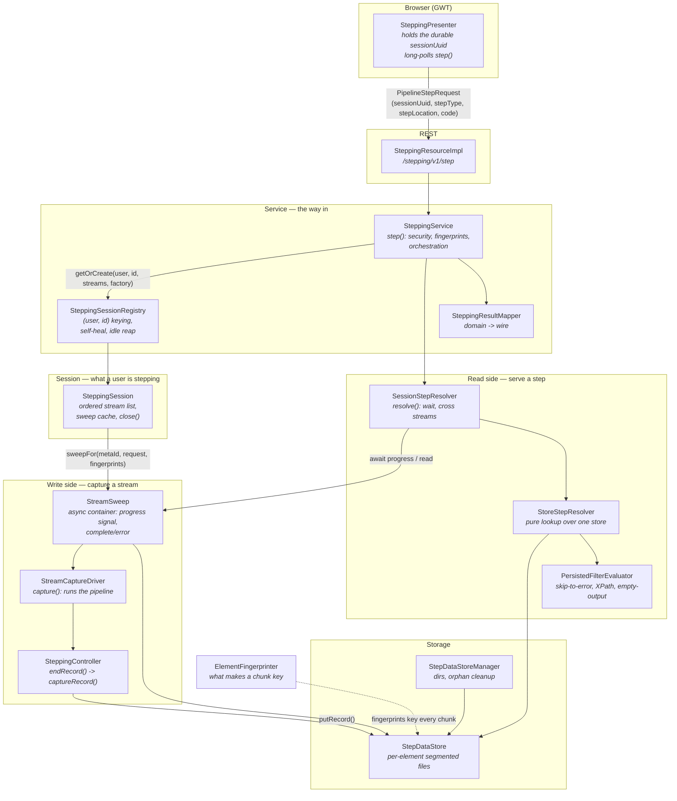
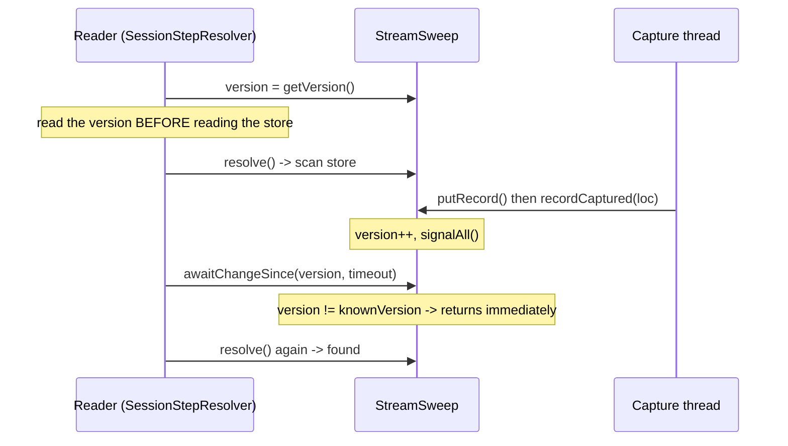
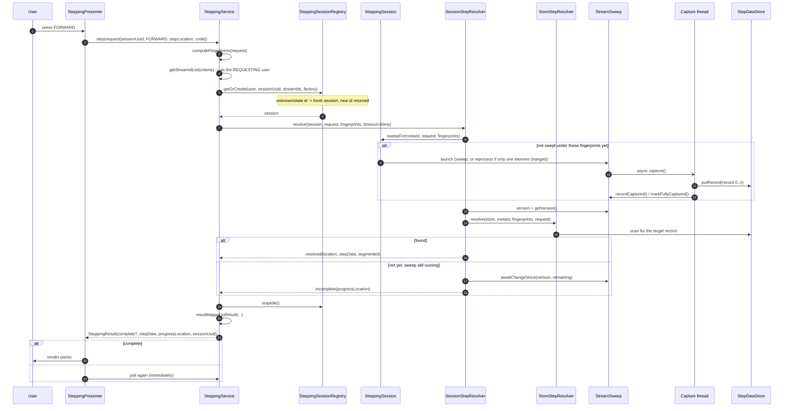

# Pipeline Stepping — Design

How stepping works, from the browser down to the bytes on disk.

Read this before changing anything under `stroom.pipeline.stepping`. It explains the layers, why the
async behaviour is shaped the way it is, and what will bite you if you assume it works the obvious way.

---

## 1. The problem this solves

Stepping lets a user walk a pipeline record by record, seeing every element's input and output, and edit
XSLT with immediate feedback.

The old engine ran **the entire pipeline from source on every keypress**, stopping when it reached the
target record. Stepping to record N therefore cost N pipeline runs — O(N²) for a walk — and there was no
way to be at record 100,000 of a large stream without waiting for a full parse on every step. Results were
held in an in-memory LRU that carried a `// FIXME : ... run out of memory`.

The current engine runs the pipeline **once per stream**, captures every element's IO for every record to
disk, and serves each step by *reading that back*. Stepping is a lookup, not a computation.

The whole design turns on one idea:

> **The store is content-addressed by a fingerprint of an element's configuration.**
> An element's chunk key changes if — and only if — that element or anything upstream of it changed. So
> "what can I reuse?" is answered by a file existing, not by invalidation logic.

---

## 2. Layers

The packages mirror the layers, so the structure is visible before you read any code:

```
stroom.pipeline.stepping/
  fingerprint/  what makes a chunk key      ElementFingerprinter, ElementFingerprints
  store/        bytes on disk               StepDataStore, ElementSegmentFile, StepDataStoreManager,
                                            StepDataStoreException, SteppingConfig,
                                            CapturedElementData, CapturedData,
                                            CapturedElementDataSerializer, CapturedElementDataMapper,
                                            SourceLocationSerializer, RecordScopeState,
                                            RecordScopeStateSerializer
  capture/      the write side              StreamCaptureDriver, ReprocessDriver, StreamSweep,
                                            CaptureWatermark, CapturedRecordFeed,
                                            SteppingController, ElementMonitor, Recorder, RecordDetector,
                                            SteppingFilter
  read/         the read side               SessionStepResolver, StoreStepResolver,
                                            PersistedFilterEvaluator, StagePlanner, ReprocessPlanner,
                                            SteppingGraphBuilder, StageGraphPlanner
  session/      what a user is stepping     SteppingSession, SteppingSessionRegistry
  (root)        the way in                  SteppingService, SteppingResultMapper,
                                            SteppingResourceImpl, SteppingPipelineLookup,
                                            PipelineSteppingModule
```

`capture/` and `read/` never call each other. They meet at `store/` and at the `CaptureWatermark` progress
signal, and that is the seam the whole design rests on.


```mermaid
flowchart TB
    subgraph Browser["Browser (GWT)"]
        SP["SteppingPresenter<br/><i>holds the durable sessionUuid<br/>long-polls step()</i>"]
    end
    subgraph Rest["REST"]
        SR["SteppingResourceImpl<br/><i>/stepping/v1/step</i>"]
    end
    subgraph Service["Service — the way in"]
        SS["SteppingService<br/><i>step(): security, fingerprints,<br/>orchestration</i>"]
        REG["SteppingSessionRegistry<br/><i>(user, id) keying,<br/>self-heal, idle reap</i>"]
        MAP["SteppingResultMapper<br/><i>domain -> wire</i>"]
    end
    subgraph Session["Session — what a user is stepping"]
        SESS["SteppingSession<br/><i>ordered stream list,<br/>sweep cache, close()</i>"]
    end
    subgraph Read["Read side — serve a step"]
        SSR["SessionStepResolver<br/><i>resolve(): wait, cross streams</i>"]
        SSR2["StoreStepResolver<br/><i>pure lookup over one store</i>"]
        PFE["PersistedFilterEvaluator<br/><i>skip-to-error, XPath, empty-output</i>"]
    end
    subgraph Write["Write side — capture a stream"]
        SW["StreamSweep<br/><i>async container: progress signal,<br/>complete/error</i>"]
        SCD["StreamCaptureDriver<br/><i>capture(): runs the pipeline</i>"]
        SC["SteppingController<br/><i>endRecord() -> captureRecord()</i>"]
    end
    subgraph Storage["Storage"]
        SDS["StepDataStore<br/><i>per-element segmented files</i>"]
        SDSM["StepDataStoreManager<br/><i>dirs, orphan cleanup</i>"]
    end
    EF["ElementFingerprinter<br/><i>what makes a chunk key</i>"]

    SP -->|"PipelineStepRequest<br/>(sessionUuid, stepType, stepLocation, code)"| SR
    SR --> SS
    SS -->|"getOrCreate(user, id, streams, factory)"| REG
    REG --> SESS
    SS --> SSR
    SS --> MAP
    SESS -->|"sweepFor(metaId, request, fingerprints)"| SW
    SSR -->|"await progress / read"| SW
    SSR --> SSR2
    SSR2 --> SDS
    SSR2 --> PFE
    SW --> SCD
    SCD --> SC
    SC -->|"putRecord()"| SDS
    SW --> SDS
    SDSM --> SDS
    EF -.->|"fingerprints key every chunk"| SDS
```

**The one-line summary:** the write side fills a store asynchronously; the read side waits for and reads
from that store. They meet only at `StepDataStore` and at the sweep's `CaptureWatermark`.

### Layer responsibilities

One class, one job:

| Layer | Class | Owns |
|---|---|---|
| Client | `SteppingPresenter` | The durable session id; long-polls until a step resolves |
| REST | `SteppingResourceImpl` | Transport only |
| Service | `SteppingService` | The way in: permission check, fingerprints, stream list, orchestration |
| Service | `SteppingSessionRegistry` | Sessions keyed by `(user, id)`; self-heal; idle reap; terminate |
| Service | `SteppingResultMapper` | Domain result → wire `SteppingResult` |
| Service | `SteppingPipelineLookup` | The screen's pre-step lookups; touches no session, store or sweep |
| Session | `SteppingSession` | Which streams exist, which are swept under which fingerprints, teardown |
| Read | `SessionStepResolver` | Waiting, crossing streams, merging stream metadata |
| Read | `StoreStepResolver` | Pure: navigation and filtering over one store. No async |
| Read | `PersistedFilterEvaluator` | Filter matching against captured IO |
| Write | `StreamCaptureDriver` | Runs the pipeline once per stream, capturing every record |
| Write | `ReprocessDriver` | Re-runs an edited element and its downstream from stored upstream output |
| Write | `StreamSweep` | One stream's capture in flight: its store, its per-stream metadata, its task handle |
| Write | `CaptureWatermark` | How far a producer has got, and how a reader waits for it. Held by the sweep |
| Write | `SteppingController` | The framework's per-record callback; persists every element's IO |
| Storage | `StepDataStore` | Per-element files for one stream, addressed by record index |
| Storage | `ElementSegmentFile` | One element's file format: appended bytes + offset index |
| Storage | `StepDataStoreManager` | Session directories; orphan cleanup |
| Keys | `ElementFingerprinter` | The fingerprints that make reuse work |

`SteppingService` no longer keys sessions, reaps them, or builds the wire result — those are the three rows
below it. What it still does is the sequence: check permission, compute fingerprints, resolve the stream
list *as the requesting user*, get a session, resolve the step, map the answer.

---

## 3. Fingerprints — why reuse is automatic

`ElementFingerprinter` computes two SHA-256 values per element from the merged `PipelineData` plus the
injected `code` map (the user's unsaved editor content):

- **`ownFingerprint`** — this element's id, type, properties, references and injected code.
- **`cumulativeFingerprint`** — this element's own fingerprint combined with the cumulative fingerprints
  of everything upstream, in link order.

Every chunk is keyed by `cumulativeFingerprint`. That single choice gives, for free:

- **Edit an element** → its cumulative fingerprint changes, and so does every element below it. Everything
  *above* keeps its key and is reused untouched.
- **Revert the edit** → the fingerprints revert to values whose chunks are still on disk. Instant, no work.
- **Change the parser** → every downstream fingerprint changes, so nothing stale can be served.

There is no invalidation logic to get wrong. A chunk is valid because its key says so.

---

## 4. The store

```
{stroom.temp}/stepping/{sessionId}/{metaId}/{partIndex}/{urlEncodedElementId}/{fingerprint}.dat
{stroom.temp}/stepping/{sessionId}/{metaId}/{partIndex}/__state__.dat
```

Each `.dat` is a purpose-built segmented file: records appended in order, with an **in-memory offset index**
(`endOffsets`) giving O(1) random access by record index. The index — not a delimiter — is what defines a
record's bytes, which matters: a partial write is invisible, because the index is only extended after the
write succeeds.

> **Base-index awareness.** Record indices are **per part**, and the base differs by detector: SAX detectors
> are 0-based, reader/text detectors are 1-based. `ElementSegmentFile` tracks `baseRecordIndex`
> (`segment = recordIndex - base`) and the store exposes `getFirstRecordIndex`/`getLastRecordIndex`.
> **Never assume records run `0..count-1`.** Navigate by first/last.

Alongside the per-element files, each part holds one **`__state__.dat`**: the per-record shared-scope
snapshot (`RecordScopeState` — the source location and the `stroom:put`/`get` map) for state that belongs to no
single element. It carries no fingerprint, because it is a property of the run rather than of one element's
config, and it is skipped when already present so a re-sweep keeps the snapshot the first capture took.

`putRecord(location, elements[, sourceLocation[, scopeMap]])` is **atomic per record**: every element *and*
the state snapshot are serialised and validated, and every target file opened, *before* anything is appended.
A reader can never see half a record.

It is also **idempotent**: an `(element, fingerprint, record)` already present is skipped. Same fingerprint
means same config and code, hence identical output. This is what lets a stream be re-swept after an edit —
the edited element and its downstream get new keys and are written, while untouched elements are left
alone. Without it, a re-sweep would trip the in-order append check on the very first unchanged element.

---

## 5. The async model

This is the part that is easy to get wrong.

### A sweep is a producer; a step is a consumer

`StreamSweep` is one stream's capture in flight. It owns the store and delegates its **version-based
progress signal** to a `CaptureWatermark`, which is the piece a reader actually waits on:


```mermaid
sequenceDiagram
    participant R as Reader (SessionStepResolver)
    participant SW as StreamSweep
    participant C as Capture thread

    R->>SW: version = getVersion()
    Note over R: read the version BEFORE reading the store
    R->>SW: resolve() -> scan store
    C->>SW: putRecord() then recordCaptured(loc)
    Note over SW: version++, signalAll()
    R->>SW: awaitChangeSince(version, timeout)
    Note over SW: version != knownVersion -> returns immediately
    R->>SW: resolve() again -> found
```

**Why the version, and not a flag:** a record can land between the reader's scan and its wait. Reading the
version *before* the scan means such a record makes `version != knownVersion`, so the wait returns at once
instead of sleeping through a signal that already fired. That is the lost-wakeup guard — do not "simplify"
it into a boolean.

### Everything must signal

A reader blocks on the sweep, so **every way a capture can end must signal it**:

- normal end → `markFullyCaptured()`
- any failure → `markError(t)` (the driver's `capture()` catches `Throwable`, not `RuntimeException` — an OOM must not
  leave a reader hanging)
- the future is also guarded by a `whenComplete` backstop in `launchSweep`, for anything that dies before
  `capture()` is even entered

A capture that fails **must not** mark complete. `complete` means *"every record this stream will ever have
is now in the store"*, and the resolver will happily navigate past the end of a stream it believes is
finished — straight into the next one, silently skipping the records that were never captured.

### Waiting vs. "there is no such record"

The store holds a **contiguous** range per part, so anything outside it is simply *not captured yet*.
`next()`/`prev()` therefore refuse to step onto a record outside the captured range and return empty, which
`SessionStepResolver` reads as **wait**. Empty only means "no such record — cross into the next stream" once the
sweep is **complete** and the range is final.

> This asymmetry caused a real bug. `next()` was bounded by the high-water mark, so FORWARD waited
> naturally; `prev()` only checked the low bound, so a BACKWARD from a reference ahead of the sweep walked
> *down* over not-yet-captured records, read each absent record as "no match", and landed on record 0.
> Both directions are now bounded. See `TestSteppingSession#testBackwardFromARecordTheSweepHasNotReached…`.

### Lazy sweeping

`SteppingSession.sweepFor(metaId, request, fingerprints)` launches a sweep for a stream **only when a step
targets it** —
never all streams up front. A selection of 500 streams must not read 500 streams because the user pressed
FIRST. Capped by `maxSweptStreamsPerSession`.

### Termination handshake

`closeSession` sets `requestTerminate()` **before** reading `getTaskContext()`; the capture publishes its
task context **before** reading the terminate flag. Whichever thread runs second sees the other's write, so
a queued sweep cannot start after its session closed. **The ordering is load-bearing** — it reads like
redundant code and is not.

### Session lifecycle

`SteppingSession` serialises sweep creation against teardown under one lock. `StepDataStoreManager` requires
this: a create racing a delete would re-create the map entry and directory the delete just removed, leaking
channels and a temp dir forever. Always go through the session.

---

## 6. Control flow — a step, end to end


```mermaid
sequenceDiagram
    autonumber
    participant U as User
    participant SP as SteppingPresenter
    participant SS as SteppingService
    participant REG as SteppingSessionRegistry
    participant SE as SteppingSession
    participant RR as SessionStepResolver
    participant SR as StoreStepResolver
    participant SW as StreamSweep
    participant CAP as Capture thread
    participant ST as StepDataStore

    U->>SP: press FORWARD
    SP->>SS: step(request{sessionUuid, FORWARD, stepLocation, code})
    SS->>SS: computeFingerprints(request)
    SS->>SS: getStreamIdList(criteria) — as the REQUESTING user
    SS->>REG: getOrCreate(user, sessionUuid, streamIds, factory)
    Note over REG: unknown/stale id -> fresh session, new id returned
    REG-->>SS: session
    SS->>RR: resolve(session, request, fingerprints, timeout=40ms)
    RR->>SE: sweepFor(metaId, request, fingerprints)
    alt not swept under these fingerprints yet
        SE->>SW: launch (sweep, or reprocess if only one element changed)
        SW-)CAP: async capture()
        CAP->>ST: putRecord(record 0..n)
        CAP->>SW: recordCaptured() / markFullyCaptured()
    end
    RR->>SW: version = getVersion()
    RR->>SR: resolve(store, metaId, fingerprints, request)
    SR->>ST: scan for the target record
    alt found
        RR-->>SS: resolved(location, stepData, segmented)
    else not yet, sweep still running
        RR->>SW: awaitChangeSince(version, remaining)
        RR-->>SS: incomplete(progressLocation)
    end
    SS->>REG: reapIdle()
    SS->>SS: resultMapper.toResult(...)
    SS-->>SP: SteppingResult(complete?, stepData, progressLocation, sessionUuid)
    alt complete
        SP->>U: render panes
    else
        SP->>SS: poll again (immediately)
    end
```

**`complete` means "this step query resolved"**, not "the stream is captured". The client long-polls with a
40 ms server-side wait, showing progress from `progressLocation` between polls.

### The durable session

`sessionUuid` identifies the server-side session and **must survive across steps**. The presenter preserves
it across FIRST/FORWARD/BACKWARD/LAST/REFRESH and clears it only when the stream selection changes
(`beginStepping`). This is the single thing that makes later steps cheap: drop it and every keypress opens a
new session and re-sweeps the stream from scratch.

`poll()` therefore adopts `response.getSessionUuid()` on **both** branches, not just the incomplete one — a
step that resolves on its first poll would otherwise leave the presenter with no id.

The server **self-heals**: an unknown, reaped or stale id produces a fresh session whose id is returned in
the response and adopted by the client. A step never fails because a session expired; it just re-sweeps.

---

## 7. Worked examples

Assume a selection of three streams `[10, 20, 30]`, ten records each (0-based), and a session already open.

### FIRST
1. `initialStream` → `firstStreamId()` = 10.
2. `sweepFor(10, ...)` → launches a sweep. Streams 20 and 30 are **not** touched.
3. `resolve` → `firstRecord` = `(10, part 0, record 0)` — via `getFirstRecordIndex`, not `0`.
4. Sweep has not reached record 0 yet → `resolve` returns empty → `awaitChangeSince` → capture commits
   record 0 → version bumps → re-scan → found.
5. Result: `(10,0,0)`, `complete=true`.

### FORWARD from (10,0,4)
1. Reference stream 10 is in the session's list → start there.
2. `next(10,0,4)` → record 5 if `5 <= getLastRecordIndex(0)`; otherwise **empty → wait**.
3. `scanForward` from record 5 applies filters; with none, record 5 matches immediately.
4. Result: `(10,0,5)`.

### FORWARD off the end of stream 10
1. `next(10,0,9)` → `9 == last` → no more parts → empty.
2. Sweep is **complete** and version unchanged → this is genuinely the end.
3. `nextStreamId(10)` = 20 → `crossed = true`, request rewritten as **FIRST**.
4. `sweepFor(20, ...)` → stream 20 swept **now**, first time it is needed.
5. Result: `(20,0,0)`.

> If the sweep were **not** complete, step 2 would wait instead. That distinction is the whole reason
> `next`/`prev` must not answer for uncaptured records.

### BACKWARD from (20,0,0)
1. `prev(20,0,0)` → `0 == getFirstRecordIndex` → no earlier part → empty.
2. Stream complete → `prevStreamId(20)` = 10 → request rewritten as **LAST**.
3. LAST needs the true last record, so it `awaitFullyCaptured`s stream 10 before resolving.
4. Result: `(10,0,9)`.

### LAST
1. `initialStream` → `lastStreamId()` = 30.
2. LAST cannot be answered from a partial capture — the last record is not known until the sweep finishes —
   so it `awaitFullyCaptured`s, then resolves `lastRecord`.
3. Result: `(30,0,9)`. This is the one step type that always waits for a whole stream.

### REFRESH at (20,0,3)
1. Reference must be in the session's stream list, or it is ignored.
2. `exists(store, 20, (0,3))` → resolve exactly that record. **REFRESH never crosses streams** — it means
   "show me this record again", usually after an edit.

### Filtered FORWARD (skip to error)
1. `scanForward` walks records applying `PersistedFilterEvaluator` to each.
2. Filter semantics mirror the old `SteppingController.endRecord`: a record matches if **no filters are
   applied**, or if **any applied element's filter matches**.
3. Non-matching records are skipped; the scan runs off the end and crosses streams as above.
4. A filter that matches nothing sweeps every stream in the selection — hence
   `maxSweptStreamsPerSession`.

### Edit an XSLT, then REFRESH
1. The presenter sends the edited `code`; fingerprints change for that element **and everything below it**.
2. `sweepFor(metaId, request, fingerprints)` keys on `(metaId, signature)` → a miss. A sweep still running
   under the *old* signature is terminated **and dropped from the cache** — a terminated sweep is an errored
   one, and keeping it would make the revert below serve that error. Completed sweeps are kept.
3. `launchFor` asks `ReprocessPlanner` (fed by `SteppingGraphBuilder`) what changed. A single edited element
   whose one upstream neighbour is reusable is the fast path: `launchReprocess` runs `ReprocessDriver` over
   the **edited element and its downstream only**, fed from the parent's stored output under its unchanged
   fingerprint. **The pipeline above the edit is not re-run.** Anything else — first sweep, a change at or
   above the record boundary, a fork, several edits — falls back to `launchSweep`, the normal once-per-stream
   capture.
4. Either way `putRecord` **skips** every `(element, fingerprint, record)` already present, so unchanged
   elements are never rewritten; only the edited element and its downstream are stored under new keys.
5. `resolve` assembles the record from a mix: upstream chunks under old keys, edited/downstream under new —
   navigating within the **reprocess sweep's own** captured range, so a record is not served until the
   reprocess has actually written its changed element.

> This still re-runs the edited element over the *whole stream* to answer a step about *one record*. That is
> the remaining cost, and what §11 is about.

### Revert the edit
1. Fingerprints revert to their previous values.
2. `sweepFor` keys on the **old** signature and finds the **completed sweep still cached**.
3. Result: instant, no capture at all — provided the old fingerprints are still within
   `maxRetainedFingerprintsPerElement` (default 3).

---

## 8. Configuration

`SteppingConfig`, hung off `PipelineConfig` as `pipeline.stepping`:

| Property | Default | Purpose |
|---|---|---|
| `storeSubDir` | `stepping` | Under `{stroom.temp}` |
| `maxRecordsPerStream` | 1,000,000 | Cap per stream |
| `maxBytesPerStream` | 2 GiB | Cap per stream |
| `maxRecordSizeBytes` | 100 MiB | Cap per record per element |
| `maxSweptStreamsPerSession` | 10 | Stops a filtered step sweeping a whole selection |
| `maxRetainedFingerprintsPerElement` | 3 | How many edits back a revert stays free |
| `maxSessionIdleTime` | 10 min | Idle reap |
| `orphanMaxAge` | 1 hour | Age before `cleanupOrphans` deletes a stranded dir |

> **Adding a property?** Two generators must be re-run, or config tests fail:
> ```
> ./gradlew :stroom-config:stroom-config-global-impl:generateConfigProvidersModule
> ./gradlew :stroom-config:stroom-config-app:generateExpectedYaml
> ```
> Note `generateConfigDefaultsYamlFile` is a *different* task that writes the example file, and will not fix
> `TestStroomYamlUtil`.

**Cleanup.** A session deletes its own directory on close. `SteppingStoreCleanup` (a `@ScheduledJob` in
`PipelineModule`) removes orphans left by a hard shutdown — skipping live sessions, and only when older than
`orphanMaxAge`, which is what makes it safe on a running system. `SteppingStoreShutdown` clears the base dir
on clean shutdown.

---

## 9. Tests, and what each is for

| Test | Guards |
|---|---|
| `TestFullTranslationTaskAndStepping` (stroom-app) | **The acceptance gate.** Scripted step sequences over ~11 real feeds, diffed against the committed `~STEPPING~…{input,output}.out` golden corpus. This corpus was produced by the *old* engine, so it is the only thing pinning the rebuild to the original behaviour. `TranslationTest.step` carries the session id across steps, exactly as the UI does. |
| `TestSteppingSessionLifecycle` | Lazy sweep (only stepped streams get a dir) and close deleting the session dir. Has its own class: its sibling shares a database, and `testTranslationTask` adds streams each run. |
| `TestSessionStepping` | Cross-stream FORWARD/LAST agreement between `resolveSession` and `step()`. |
| `TestChunkedCapture` | The synchronous `capture()` entry point agrees with the session path, over four feed types including a reader/text pipeline. |
| `TestReprocessFromStore` (stroom-app) | The load-bearing de-risk: re-running an interior element from its stored input, **without** re-running the parser above it, is byte-identical to the full sweep over a real feed. Also covers `ELEMENT_ONLY` and the `stopAfter` head build. |
| `TestLiveReprocessOnEdit` (stroom-app) | That an edit actually routes to a reprocess rather than a second full sweep, and that the reprocessed output is served for an early record — the readiness gate. |
| `TestSteppingStateFixture` (stroom-app) | **That the fixtures still test anything.** Builds a probe chain and loads a stream carrying a `Meta` child stream, then asserts under a plain full sweep that `stroom:put`/`get`, `stroom:record-no`, `stroom:line-from` and `stroom:meta` all read back real values. The sample feeds exercise none of these, so without it a "reprocessed output == swept output" assertion can pass with both sides empty. Not covered: context reference data. |
| `TestReprocessRestoresScopeState` (stroom-app) | That shared scope survives the split: an upstream `stroom:put` is still visible to a `stroom:get` below an edit, even though the reprocess never re-runs the put. Builds the two-XSLT topology it needs on an in-memory copy of the pipeline, so no sample pipeline is disturbed. Verified to fail (empty probe) with the restore removed. |
| `TestStepDataStore` | Base-index awareness, atomicity, idempotency, caps, LRU eviction, the per-record scope snapshot. |
| `TestRecordScopeStateSerializer` / `TestTaskScopeMap` | The scope snapshot's framing (null/empty/awkward keys and values, >64KB) and the snapshot/restore/clear the stepping path relies on. |
| `TestStreamSweep` | The progress signal: no lost wakeups, interrupt semantics, terminate handshake. |
| `TestSteppingSession` | Lazy launch, cross-stream nav, the stale-scan race, the BACKWARD-ahead-of-sweep bug, close/cap behaviour. |
| `TestElementFingerprinter` | Sensitivity and stability — a wrong fingerprint serves stale IO or never reuses. |
| `TestCaptureWatermark`, `TestCapturedRecordFeed`, `TestCapturedRange`, `TestStageGraphPlanner` | The substrate built for the set-aside stage decomposition and kept for the direction in §11: that every way a producer stops wakes its waiters, that a consumer follows a producer without hanging, that a record is only servable once every contributor has reached it, and where a pipeline may be cut. Liveness tests here assert the wake is **prompt** (a short join against a long await) — asserting only the return value passes even with the signal deleted. |

Integration tests need MySQL on `localhost:3307` (`stroom-resources`: `bounceIt.sh -y stroom-all-dbs`).

---

## 10. Traps

- **Record indices are per part and not always 0-based.** Use `getFirstRecordIndex`/`getLastRecordIndex`.
- **Never `markFullyCaptured()` a failed or terminated capture.** A truncated stream that looks complete makes
  steps silently skip records.
- **Don't let `next`/`prev` answer for uncaptured records.** Empty means "wait" until the sweep completes.
- **Read the sweep version *before* scanning the store**, and re-check it before concluding a completed
  stream has no match — otherwise a record landing mid-scan is stepped over permanently.
- **Don't reorder the terminate handshake** in `closeSession`/`StreamCaptureDriver.capture`.
- **Create stores only via `SteppingSession`**, never `StepDataStoreManager` directly.
- **Resolve streams as the requesting user.** `getStreamIdList` must never run as the processing user, and a
  client-supplied `stepLocation` must be checked with `containsStream` — it is untrusted input.
- **Some `read/` classes have no callers on purpose.** `StageGraphPlanner` and `CapturedRecordFeed` were
  built for the concurrent-stage decomposition that §11 records as set aside, and are kept because the
  direction that replaced it needs them; their javadoc says so. (`StagePlanner` *does* have a caller now —
  `ReprocessPlanner` — so do not go looking for a missing one.)

---

## 11. Direction — from "re-run less" to "re-run one record"

The store holds every element's per-record input and output. That is not merely a cache of results, it is
*the stepping state*: an edited element's input for record N is its upstream element's stored output for
record N, already present under an unchanged fingerprint. Everything here follows from that one fact.

**The first half is shipped.** Editing an XSLT used to re-sweep the whole stream — O(N) per *edit*, versus the
old O(N) per *step* — re-executing the parser and every upstream XSLT for nothing. Feeding the changed element
and its downstream from stored upstream output instead removed that cost; see *Build order* step 3 below,
which describes the live path.

**The second half is not.** What remains is that an edit still re-runs the changed element and its downstream
over the **whole stream**, when the user is looking at one record and wants to see one record. That is the
cost this direction now attacks, and the sections below record how the target changed: away from decomposing
the pipeline into concurrent stages (considered, substrate built, set aside — the prize turned out to be only
pipeline parallelism) and towards materialising the edited element lazily, per record, for the records the
user actually visits.

### Considered and set aside: elements as independent concurrent stages

The long-term shape was going to be each element as its own async stage consuming its upstream's captured
record-stream, all running concurrently. The substrate for it was built (see *What exists* below) and then the
direction was **set aside**, because working through what it would actually deliver showed the prize was much
smaller than it looked:

- **The first capture should not be decomposed at all.** A single sweep runs the whole chain in one streaming
  pass. Splitting it into stages adds a store round-trip between every element and does strictly *more* work.
  Stages only pay off where unchanged ones can be skipped — that is, after an edit.
- **After an edit the work is already minimal.** `ReprocessPlanner` re-runs the changed element and its
  descendants fed from stored upstream, and because fingerprints are cumulative every descendant of an edited
  element changes anyway. So the set of elements that must re-run is identical with or without stages.
- **They already stream.** The re-run elements run as one SAX chain in which each record flows through every
  element immediately. Stages would not shorten that chain.

What stages *would* add is pipeline parallelism — stage A working record 10 while stage B works record 9, on
separate threads, which a single-threaded SAX chain never gets. That is a real prize for long CPU-bound
streams, but it is far narrower than "stop re-running upstream" (already shipped), and it buys it with store
lock contention under N writers, pool exhaustion, and deadlock risk in the live path. It was not judged worth
that trade before the benefit had been measured. Live ingest was never in scope either way; this is all
stepping-specific.

### Direction: materialise the edited element on demand, per record

The transformative case is not parallelism, it is **not doing the work at all**. When an XSLT is edited, what
the user wants is to see the effect *on the record they are looking at*, now. That record's input is already
in the store — it is the unchanged parent's captured output — so serving it requires replaying **one record**
through the edited element, not the stream.

So the direction is to materialise the edited element's output **lazily, per record, for whichever records the
user actually visits**, rather than sweeping it:

- **REFRESH — SHIPPED.** Exactly one record's work, so editing an XSLT and refreshing is effectively instant
  however far into the stream the user is. `SteppingService.onDemandTargetFor` routes a REFRESH that names a
  record to `ReprocessDriver`'s single-record path, which reads that record's stored upstream output, fires it
  through the edited element and captures the result. Measured over 2,000 records: a mid-stream edit went from
  ~670ms to ~21ms and an end-of-stream edit from ~1,120ms to ~20ms, against a 7ms floor for a refresh that
  computes nothing — and, more to the point, the cost stopped scaling with how deep the record is. See
  `TestSteppingMidPointBenchmark`.

  Two things this needed. `SAXRecordDetector` numbers records from the start of a stream, so it takes a base
  index - otherwise a single replayed record is captured as record 0. And an on-demand sweep is cached
  against the **step** that produced it, not against the fingerprint signature: a sweep holding one record,
  cached under the signature, makes the next step at another record find a "complete" sweep that does not
  hold what is wanted, which the resolver reads as "no such record, cross into the next stream".
- **FIRST / NEXT / PREVIOUS / LAST — SHIPPED, while nothing is filtered.** These do not *name* their record,
  so the target is worked out from the unchanged upstream's captured range, which is complete. A filter
  anywhere - even above the edit - falls back to reprocessing the stream, because a filter makes "the next
  record" mean "the next one that matches" and that cannot be known without running records to find out.
  Stepping off the end of a **part** continues into the next one, since a multi-part stream is one stream to
  the user; stepping off the end of the **stream** falls back, because crossing to another stream is the
  resolver's job and that stream may not even be swept yet.

  Making this work needed a correction in the reuse plan, and it is the interesting part. `StagePlanner` asked
  whether an element *had chunks* under the current fingerprint. That was a fair proxy for "reusable" only
  while the sole writer was a sweep that captured all of a stream or none of it; an element materialised a
  record at a time is **present long before it is reusable**, so after a REFRESH had materialised a record or
  two the planner concluded there was nothing left to reprocess and fell back to a full sweep. It now asks
  `StepDataStore.hasCompleteElement`, which is true only if the element holds every record the stream has -
  answered in constant time per part, because a file with no holes holds exactly `last - first + 1` records
  and this runs on every step.
- **A filter on the edited element or below — still reprocesses the stream.** In principle this wants a
  progressive scan: materialise records in the direction of travel until one matches. Usually a handful,
  though a filter matching nothing has to visit everything and there is no way around that; FIRST and LAST
  are the awkward ends, LAST having to work backwards.

  It is not built, and the reason is structural rather than fiddly. Everything on-demand so far fits the
  existing shape - one launch decision per step, then a scan of what it produced. A progressive scan is a
  *loop* between materialising and filter-matching, and those sit on opposite sides of the `capture/` and
  `read/` boundary that the whole design rests on. The tractable form is probably to materialise a bounded
  window ahead in the direction of travel and let the existing long-poll drive successive windows: that keeps
  the layering, terminates, and shows progress between polls. It needs per-session state for where the last
  window ended, and a window size to configure. Until then a filtered step after an edit is correct, just no
  faster than it was.
- **A filter on an unchanged upstream element does not force anything.** Its chunks are present under an
  unchanged fingerprint, so `PersistedFilterEvaluator` evaluates it straight from the store and navigation
  stays a single record. The cost is driven by *where* the filter sits relative to the edit, not by whether a
  filter exists.

**Counters are not a prerequisite.** A single-record replay leaves `IdEnrichmentFilter` and friends reporting
1 rather than their swept value — the already-accepted inaccuracy recorded above, cosmetic and visible rather
than silent corruption. Capturing counter state is a fidelity improvement to schedule on its own merits, not a
blocker for this.

The per-record shared scope, by contrast, *is* load-bearing and is already done: the source location snapshot
and the `stroom:put`/`get` map are both restored before each replayed record. Without them a single-record
replay would show a downstream `stroom:get` as empty and its location functions as defaults — wrong, and
wrong quietly.

#### What has to change first

Two things block on-demand materialisation, both in the parts of the store it is least comfortable to disturb:

1. **The store forbids holes.** `putRecord` enforces in-order contiguous appends per `(element, fingerprint)`
   file and `ElementSegmentFile` indexes by `recordIndex - baseRecordIndex`, so materialising record 5 and then
   record 9 into the same file trips *"expected index 6 but got 9"*. Sparse materialisation needs a sparse
   index. Contained, but it is the invariant that keeps a torn record from ever being visible.
2. **"Complete" and LAST must come from upstream.** The resolver waits for full capture to learn the true last
   record; a sparsely materialised element is never complete, so LAST would hang. The last index has to be
   taken from the unchanged upstream element's range instead. Relatedly `CapturedRange` is `first`/`last` per
   part, which cannot express a hole — a sparse element likely needs `contains(record)`.

#### Measure before building

The deciding number is **wall-clock of a full edited-element-plus-downstream reprocess against stream length**,
on a realistic pipeline. If a typical stream reprocesses in a few hundred milliseconds this is not worth the
store change; if long streams take tens of seconds, on-demand replay is decisive. The same measurement shows
where the filtered-scan degenerate cases start to hurt. The sample feeds are too small to answer it — it needs
a real pipeline and a realistically sized stream.

#### What exists, and how it serves this

The concurrent-stages work was not wasted; it is the substrate this direction needs:

| Built | Serves on-demand replay by |
|---|---|
| `capture/CaptureWatermark` | the progress/terminal-state signal, split out of `StreamSweep` so anything that produces records can own one |
| `capture/CapturedRecordFeed` | the shape a progressive filtered scan wants — consume as records appear, wait, stop on terminal state |
| `MidPipelineScope.ELEMENT_ONLY` | running one element detached, proven byte-identical to the sweep |
| `create(..., stopAfter)` | the source-rooted counterpart, for the head of a pipeline that cannot be fed from the store |
| `CapturedRange.intersectionOf` | what stops FORWARD landing on a record the edited element has not materialised, showing blank panes |
| `read/StageGraphPlanner` | where a pipeline can be cut at all — cuts are only sound where the upstream output is replayable (SAX events); readers, writers and appenders store text, so they travel with their neighbours |
| `TestSteppingStateFixture` | a fixture that actually carries put/get, location and metadata state, with every probe asserted non-empty under a plain sweep so it cannot silently stop testing |

### Rejected: hot-swap the element mid-stream

Swapping an element's transformer while the parser is mid-document is not something the engine supports, and
it would leave one element's store holding records 0..N under the old config and N.. under the new — breaking
the invariant that a fingerprint-keyed file is one config throughout. The apparent saving (reuse the in-flight
upstream) collapses anyway, because backfilling the earlier records means re-running the changed element from
its input, i.e. the same replay-from-stored-upstream as below.

### Build order

**1. Change the stored representation first. — DONE.** Previously SAX events were *not* stored as events:
they were buffered into a Saxon TinyTree, re-serialised to XML text, then JSON-escaped (see §Storage format
below). Fine for *displaying* IO — all it was ever asked to do — but as the substrate for *re-execution* it is
infoset-equivalent, not faithful (error locators point into the re-serialised string, namespace-declaration
placement shifts), and it costs a serialise on write plus a re-parse on read at every stage boundary. XML
elements now persist a faithful, cheap-to-replay binary SAX event list (`xml.event.SaxEventWriter`/
`SaxEventReader`/`EventListSerializer`), keyed exactly as before; text elements still store text. The store
holds this element-specific form as {@code CapturedElementData}; the UI panes are derived on read
(`store.CapturedElementDataMapper`), rendering stored events back through the Saxon tree path so display text
stays byte-identical to the old text store. XPath filters now run directly over the stored events
(`filter.PersistedXPathFilterMatcher`) with no XML re-parse.

**2. Capture the state that survives the cut, before splitting anything.** An edited element is restarted
against the stored upstream stream — and, in the direction above, restarted at a *single* record N without
processing 0..N-1. In that world there is **no state-free intermediate**: an element re-run at record N needs
its accumulated state as of record N-1, and state an **upstream** (not-restarted) element deposited into a
shared scope is unreachable because upstream is the thing you are deliberately not re-running. So state is
captured per record, alongside the IO — this is the same "store more than IO text" change as step 1, so the
store format carries IO-as-events and state together.

This is why the *shared scope* half of it is load-bearing and the *counter* half is not. Source location and
the `stroom:put`/`get` map are deposited by elements that a replay does not re-run, so without the snapshots
they are simply gone; counters belong to the element being re-run, which merely restarts them from 1.

Scope is deliberately narrow. Stepping is an introspection tool with understood limitations, and a replay is
a place where cross-record state is at risk anyway. We capture only the state
whose *correctness users actually rely on* — **source location and counters** — and explicitly drop the rest
rather than pay to preserve it. Two kinds, captured differently:

- **Element-local counters** — `IdEnrichmentFilter.count` (the `EventId` source) and `RecordCountFilter`/
  `RecordCount`. Owned by one element, a deterministic function of the records it has seen. Captured per
  element via a stepping-specific **state-capturing element variant**, keyed like IO (element fingerprint +
  record). This is what lets the *counter-owning element itself* restart mid-stream. (Note `EventId` is also
  written into the event stream as an attribute, so a *downstream* reader of `@EventId` already gets it from
  captured IO — the stored counter serves the different case of restarting the owning element.)
  **Not built, and not a prerequisite for anything.** Without it a replayed record reports 1 where a sweep
  reported its true count — the accepted, visible inaccuracy recorded above. Verified twice since: under the
  shipped reprocess every re-run element starts at record 0 and rebuilds its counter naturally, so nothing
  consumes stored counters today. Schedule this as a fidelity improvement when a user actually needs the
  counts to be right under an edit, not as a gate on the direction below.
- **Shared source location** — `LocationHolder`'s per-record `SourceLocation`. Populated by the `SplitFilter`
  (just below the parser) from the SAX `Locator` and read downstream by `stroom:record-no`, `line-from`/
  `col-from`, `stroom:source` and the step-highlight. Not owned by any one element, so captured as a
  **per-stream, per-record scope snapshot** (a holder snapshot at `endRecord`), not a per-element chunk.

- **Shared `stroom:put`/`get` map. — DONE.** `TaskScopeMap` backs `stroom:put`/`stroom:get` and is
  `@PipelineScoped`, so on the normal path a `get` sees every `put` made earlier in the task. That does not
  survive the split: a reprocess does not re-run the elements above the edit, so their `put`s simply never
  happen and a `get` below the edit would silently return nothing where the full sweep gave it a value.
  `SteppingController.endRecord` snapshots the map into the same per-record scope slot as the source location,
  and `ReprocessDriver` restores that snapshot before replaying each record, so a `get` below the edit sees
  what the elements above it put. Anything the re-run elements put themselves overwrites the restored value as
  they run. Two consequences are accepted: a `get` of a key the *re-run* elements only write **later in the
  same record** sees the previous run's value rather than nothing (a get-before-put is already a pathological
  ordering); and because the snapshot is un-fingerprinted and skip-when-present, an edit that *removes* a
  `put` leaves the old key visible until the session is recreated — the same best-effort trade-off the source
  location makes.

**Dropped, on purpose:** `stroom:put`/`get` **cross-record** state. In stepping, `put`/`get` are scoped to the
**current record** — `get` sees only same-record `put`s — because `SteppingController.endRecord` clears the
map once the record is captured. This deliberately narrows the task-wide scope normal processing gives it:
cross-record shared state cannot survive a reprocess, still less a single-record replay, and behaviour that
works only until you edit something is worse than behaviour that is consistently record-scoped. Cross-record shared
maps are not a stepping feature. `MergeFilter`-style accumulate-to-`endProcessing` aggregation is likewise
best-effort: it has no per-record meaning and is not restartable mid-stream.

**Never fall back to a full re-run.** This reverses an earlier stance. A silent fallback to full reprocessing
is the worst outcome, because it lets a user *unwittingly* re-introduce O(N²) stepping just by adding a
pipeline element or XSLT function that touches unrecognised state. We would rather **reduce the scope of what
is faithful** — accept that some introspection is rough or unavailable — than ever pay the full-scan cost
behind the user's back. Coverage of state kinds grows incrementally; an uncovered one degrades gracefully, it
does not trigger a re-run.

*Source location deserves a note, because two coordinate spaces get conflated.* There is the
**source-parse location** (line/col in the raw source bytes, computed live by `LocationHolder` from the parser
`Locator`) and the **captured-IO location** (positions within the stored SAX-events document — a synthetic
space unrelated to the source). Re-deriving location from replayed events reports the latter, which for source
highlighting is not merely lossy but misleading, as it points into a document the user never saw. Hence the
snapshot:

- **Record-level source location. — DONE (Phase A).** `LocationHolder` already computes a per-record
  `SourceLocation` (a `TextRange`/`DataRange` spanning the record in the source), so it is a clean per-record
  scope snapshot. `SteppingController.endRecord` already holds `locationHolder.getCurrentLocation()`, so it
  snapshots that whole `SourceLocation` into the store as part of the atomic `putRecord` commit; on read,
  `StoreStepResolver.assemble()` enriches the served location with the stored highlight/`DataRange` while
  keeping the resolved step's own `(metaId, part, record)` coordinates. This *adds* fidelity over the previous
  served path, which built `SourceLocation` from only `(metaId, part, record)` with no highlight — a win even
  before the split exists. The snapshot lives in a per-part, un-fingerprinted state file (`store/`:
  `__state__.dat`, one `RecordScopeState` per record via `RecordScopeStateSerializer`, which frames the
  location itself with `SourceLocationSerializer` and carries the `stroom:put` map alongside it), reused
  across downstream edits because source location is an
  upstream property; the trade-off is that editing the *parse/split framing itself* can leave a stale highlight
  until the session is recreated (best-effort, per the philosophy above). Accept that precise **per-element**
  source line/col (what `stroom:line-from`/`col-from` report at element granularity) degrades to record-level
  under replay — it is a live-parse property stored nowhere per element. The reprocess consumer of this snapshot
  is built: `ReprocessDriver` feeds each record's stored `SourceLocation` into `LocationHolder.setReplayLocation`
  before replaying it, so downstream location functions report the source-parse location again even though the
  reprocess runs below the `SplitFilter` that normally populates the holder.
- **Alternative, if per-element source location is ever needed: capture position per SAX event.** Store each
  event's source line/col in the encoded stream, and on replay drive a synthetic `Locator` that reports the
  current event's stored position before firing it, so a downstream element sees the original source
  positions. Faithful, but a larger change: it enlarges the stored form and, because accurate positions are a
  parse-time property (the live locator has moved on by the time events are buffered and re-fired by the
  split), leans on capturing them where they are still live rather than snapshotting at the recorder. Not for
  now; documented so the choice is deliberate.

**3. Split the processing. — LIVE.** On an edit, `SteppingService.launchFor` asks `ReprocessPlanner` (fed by
`SteppingGraphBuilder`, which derives the steppable graph from the store's captured elements plus the pipeline
links) whether the change is the clean single-edit case; if so it runs `ReprocessDriver` into the session's
existing store, reusing the upstream chunks, instead of a full sweep. Anything else — first sweep, a change at
or above the record boundary, a fork, several independent edits — falls back to a full sweep, which is the
normal once-per-stream capture, so reprocess is a pure optimisation, never a correctness dependency.

`PipelineFactory.createFrom(pipelineData, terminator, controller, startElementId)` builds a stepping pipeline
rooted at an interior element (reusing `link()`/`getChildElements()`, generic over a start element), forcing a
`SAXRecordDetector` at the entry because an interior mutator gets none otherwise. `ReprocessDriver` (mirroring
`StreamCaptureDriver`'s scope/holders, and `PersistedXPathFilterMatcher`'s fire-events-into-a-handler shape)
reads each record's stored upstream output events (the feed element's output, under its own unchanged
fingerprint) and replays them into that entry, capturing the reprocessed IO. It also feeds the per-record
`SourceLocation` back into `LocationHolder` (`setReplayLocation`) so downstream location functions stay correct
below the split. `XsltFilter` is per-document clean, so the edited element's own pane is correct.

A reprocess reads record data from the store, but it must still **open the stream** and hold it open for the
whole run, setting `metaHolder.setInputStreamProvider` per part exactly as the capture driver does. Two things
reach for that provider and both degrade *silently* without it: `StreamMetaDataProvider` (so `stroom:meta` and
`stroom:meta-keys` would see an empty attribute map) and `ReferenceData` (so a `stroom:lookup` against the
stream's own **context** child stream would quietly never load, and return nothing). Silence is the danger
here — a step is trusted to show what really happened, so a reprocess that skipped this would serve
convincingly wrong output after an edit. No sample feed carries stream metadata or context data, so this is
covered by parity with `StreamCaptureDriver` rather than by a test.

Because a reprocess writes into a store that already holds the reused upstream at the full record range, the
resolver must not treat a record as ready just because the reused upstream is there: `SessionStepResolver`
navigates within the reprocess *sweep's own* captured range (`StreamSweep.getCapturedFirst/LastRecordIndex`,
passed to `StoreStepResolver` as a `CapturedRange`), so a step waits for the reprocess to write the changed
element before landing on it. For a full sweep the sweep range equals the store range, so this changes nothing.

Proven end-to-end: `TestReprocessFromStore` shows re-running the XSLT from its stored input — without re-running
the parser above it — is byte-identical to the full sweep over a real feed; `TestLiveReprocessOnEdit` shows an
edit routes to a reprocess and serves the reprocessed output correctly for an early-record (`REFRESH` record 0)
step.

### Fingerprinting is unaffected

Accumulated state is a deterministic function of `(config, upstream output stream)`, and both are already
covered by the cumulative fingerprint — same fingerprint means same config *and* same upstream output, hence
same state. So content-addressing still holds; there is no new invalidation axis. The state is stored so a
downstream stage can be *fed* it without re-deriving it from a re-run of upstream, not because reuse becomes
harder to reason about.

### On validating instant mid-point replay

Instant mid-point replay was previously listed here as a non-goal, deferred behind whole-stream re-running.
That has been reversed: it is now the direction (see above), because the whole-stream re-run it was deferred
behind turns out to be the thing worth avoiding, not the safe baseline to build on.

What survives from that earlier framing is how to *trust* it. Replaying a single record is not obviously
equivalent to that record's slice of a full re-run — element-local state is the known divergence, and there
may be others. So the validation is a **shadow-diff**: run the full re-run and the on-demand replay over the
same stream and diff every record, with the known counter divergence explicitly allowed for. That is what
turns "it looked right in the UI" into evidence, and it should exist before the path is trusted, not after.

### Storage format (before and after step 1)

Per element, per record. **Before step 1**, XML stages were stored as re-serialised, JSON-escaped text:

```
SAX events
  -> SAXEventRecorder extends TinyTreeBufferFilter   (capture/... , filter/SAXEventRecorder)
       buffered into a Saxon TinyBuilder as a NodeInfo TREE, not an event list
  -> NodeInfoSerializer -> EventListUtils.getXML     (Saxon serialize, METHOD=xml INDENT=no VERSION=1.1)
  -> String -> SharedElementData -> StepDataStore.putRecord: JsonUtil.writeValueAsBytes (JSON-escaped)
```

**After step 1** (current), `TinyTreeBufferFilter` also tees the live callbacks into a `SimpleEventListBuilder`,
so an XML element captures a faithful `EventList` alongside the TinyTree. `ElementMonitor` stores the element-
specific form — SAX events for XML stages, text for the rest — as `CapturedElementData`:

```
SAX events
  -> SAXEventRecorder extends TinyTreeBufferFilter   (capture/... , filter/SAXEventRecorder)
       TeeContentHandler -> ReceivingContentHandler (TinyBuilder)  AND  SimpleEventListBuilder (EventList)
  -> ElementMonitor: CapturedData.saxEvents(EventListSerializer.toBytes(eventList))   (binary SAX opcodes)
  -> CapturedElementData -> StepDataStore.putRecord: CapturedElementDataSerializer    (binary framing)
```

On read, `CapturedElementDataMapper.toShared` renders each side to the wire `SharedElementData`: SAX events go
back through `EventListUtils.buildNodeInfo` -> `getXML(NodeInfo)` (the same Saxon path as before, so display
text is byte-identical); text sides pass through unchanged.

Only XML stages go through `SAXEventRecorder`; `ReaderRecorder` (reader/text input) and `OutputRecorder`
(writer output) are plain text and are stored as text. Comments/CDATA are lost before this point — the filter
chain is `ContentHandler`-only, no `LexicalHandler` anywhere — so that is not a replay regression, but the
locator and namespace-placement drift of the old text form were (step 1 removes them for the event-backed
sides).

`StagePlanner` (in `read/`) is the reuse/reprocess decision logic for this direction, and is why it has no
production callers yet.
