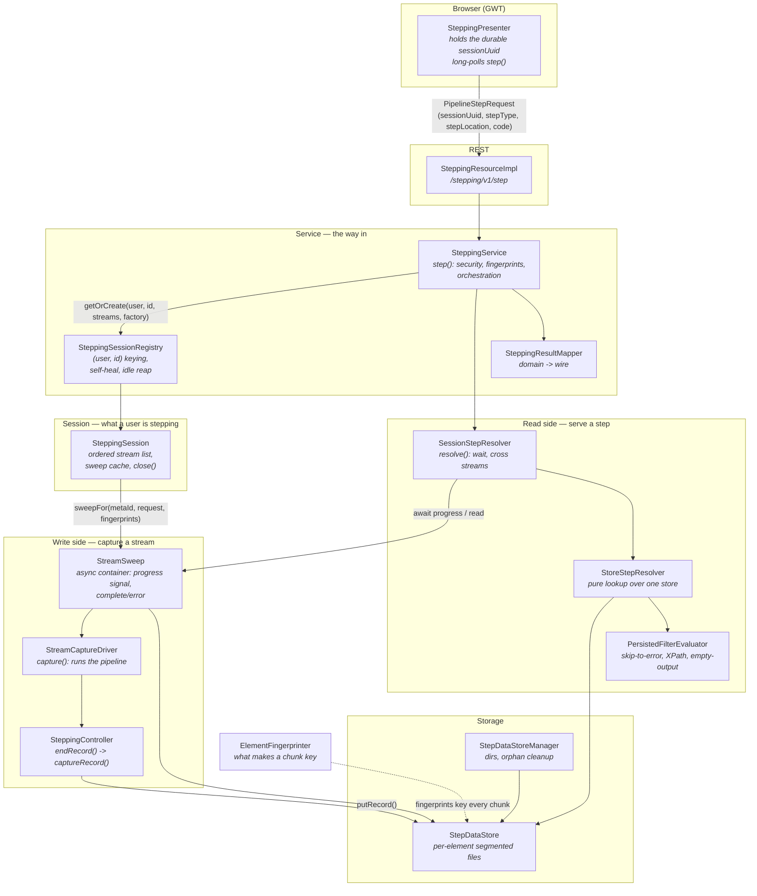
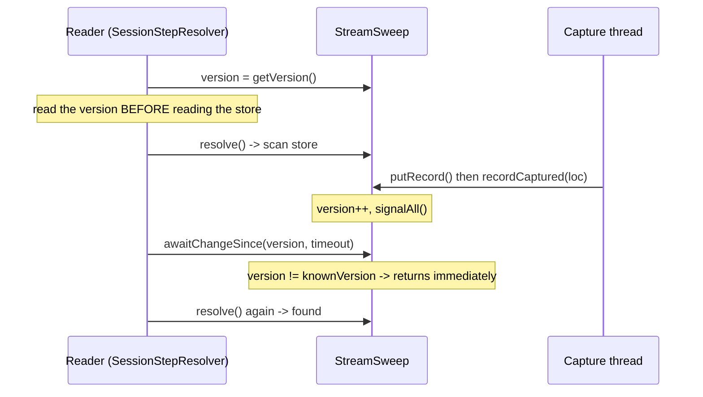
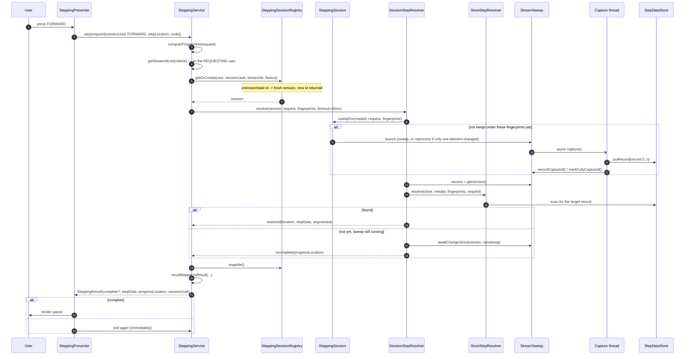

# Pipeline Stepping — Design

How stepping works, from the browser down to the bytes on disk.

Read this before changing anything under `stroom.pipeline.stepping`. It explains the layers, why the
async behaviour is shaped the way it is, and what will bite you if you assume it works the obvious way.

---

## 1. The problem this solves

Stepping lets a user walk a pipeline record by record, seeing every element's input and output, and edit
XSLT with immediate feedback.

The old engine ran **the entire pipeline from source on every keypress**, stopping when it reached the
target record. Stepping to record N therefore cost N pipeline runs — O(N²) for a walk — and there was no
way to be at record 100,000 of a large stream without waiting for a full parse on every step. Results were
held in an in-memory LRU that carried a `// FIXME : ... run out of memory`.

The current engine runs the pipeline **once per stream**, captures every element's IO for every record to
disk, and serves each step by *reading that back*. Stepping is a lookup, not a computation.

The whole design turns on one idea:

> **The store is content-addressed by a fingerprint of an element's configuration.**
> An element's chunk key changes if — and only if — that element or anything upstream of it changed. So
> "what can I reuse?" is answered by a file existing, not by invalidation logic.

### What stepping must guarantee

The requirements, stated once so every later trade-off can point at what it is trading. Mechanisms and
scenarios elsewhere in this document exist to satisfy these; a change that quietly breaks one of them is
wrong even if every test stays green.

**Correctness**

- R1 — *Fidelity.* What stepping shows for a record is what processing would produce for it: same element
  output, same errors and indicators, same `EventId`, same location functions, same `stroom:put`/`get` and
  `stroom:lookup` results. The golden corpus (`TestFullTranslationTaskAndStepping`) pins this against the
  old engine; the state-fixture tests pin the parts the corpus cannot see. Known, deliberate exceptions are
  documented where they occur — an undocumented divergence is a bug.
- R2 — *No half-truths.* A record is either served whole — every pane consistent with every other — or not
  yet. Never a blank pane for an element that would have produced output, never output from a stale config.
  The fingerprint keying and `CapturedRange.intersectionOf` exist for this.
- R3 — *Edits are previews.* Injected code changes what stepping shows and nothing else. Nothing is written
  back; abandoning an edit costs nothing.

**Interactivity**

- R4 — *The step the user repeats most must be the cheapest.* Refreshing the record being looked at after an
  edit is the inner loop of translation development, and its cost must not scale with where the record is in
  the stream (§11: measured at ~20ms, was ~670ms mid-stream).
- R5 — *Paid work is kept.* Capture already done is never discarded while it could still serve a step - not
  by a later step (scenario B), not by an edit below the record boundary (scenario C), not by a revert (free
  while retained, §7).
- R6 — *A step always answers.* Waiting is fine (long-poll, with progress); hanging is not. Every way a
  producer can stop must wake its waiters (§5). A step that cannot be answered says so.

**Scale and resources**

- R7 — *Cost follows what the user looks at.* The ideal spend for a session is proportional to the records
  visited plus one boundary pass over each stream stepped, not to stream length times pipeline depth. The
  scale scenarios and the skeleton sweep (§11) measure the distance from this ideal.
- R8 — *Bounded footprint.* Stepping runs on shared nodes against production data: disk, records and record
  size are capped (§8), sessions are reaped when idle, orphaned stores are cleaned up. The caps are honest
  refusals ("narrow your selection"), not silent truncation. Consequence, worth stating plainly: a stream
  over `maxRecordsPerStream`/`maxBytesPerStream` cannot be fully captured at all today - which is a
  requirement on the *capture set*, not just on speed, and part of why the skeleton sweep matters.
- R9 — *Streams are swept only when stepped.* A 500-stream selection must not cost 500 sweeps because the
  user pressed FIRST (§5, lazy sweeping).

**Sessions and access**

- R10 — *The session is durable and self-healing.* Cheapness comes from the session surviving across steps;
  losing it must degrade to a re-sweep, never to a failure (§6).
- R11 — *Stepping sees what the user may see.* Stream resolution and data access run as the requesting user,
  under the stepping permission. Nothing in the store outlives the session that captured it.

---

## 2. Layers

The packages mirror the layers, so the structure is visible before you read any code:

```
stroom.pipeline.stepping/
  fingerprint/  what makes a chunk key      ElementFingerprinter, ElementFingerprints
  store/        bytes on disk               StepDataStore, ElementSegmentFile, StepDataStoreManager,
                                            StepDataStoreException, SteppingConfig,
                                            CapturedElementData, CapturedData,
                                            CapturedElementDataSerializer, CapturedElementDataMapper,
                                            SourceLocationSerializer, RecordScopeState,
                                            RecordScopeStateSerializer
  capture/      the write side              StreamCaptureDriver, ReprocessDriver, StreamSweep,
                                            CaptureWatermark, CapturedRecordFeed,
                                            SteppingController, ElementMonitor, Recorder, RecordDetector,
                                            SteppingFilter
  read/         the read side               SessionStepResolver, StoreStepResolver,
                                            PersistedFilterEvaluator, StagePlanner, ReprocessPlanner,
                                            SteppingGraphBuilder, StageGraphPlanner
  session/      what a user is stepping     SteppingSession, SteppingSessionRegistry
  (root)        the way in                  SteppingService, SteppingResultMapper,
                                            SteppingResourceImpl, SteppingPipelineLookup,
                                            PipelineSteppingModule
```

`capture/` and `read/` never call each other. They meet at `store/` and at the `CaptureWatermark` progress
signal, and that is the seam the whole design rests on.


```mermaid
flowchart TB
    subgraph Browser["Browser (GWT)"]
        SP["SteppingPresenter<br/><i>holds the durable sessionUuid<br/>long-polls step()</i>"]
    end
    subgraph Rest["REST"]
        SR["SteppingResourceImpl<br/><i>/stepping/v1/step</i>"]
    end
    subgraph Service["Service — the way in"]
        SS["SteppingService<br/><i>step(): security, fingerprints,<br/>orchestration</i>"]
        REG["SteppingSessionRegistry<br/><i>(user, id) keying,<br/>self-heal, idle reap</i>"]
        MAP["SteppingResultMapper<br/><i>domain -> wire</i>"]
    end
    subgraph Session["Session — what a user is stepping"]
        SESS["SteppingSession<br/><i>ordered stream list,<br/>sweep cache, close()</i>"]
    end
    subgraph Read["Read side — serve a step"]
        SSR["SessionStepResolver<br/><i>resolve(): wait, cross streams</i>"]
        SSR2["StoreStepResolver<br/><i>pure lookup over one store</i>"]
        PFE["PersistedFilterEvaluator<br/><i>skip-to-error, XPath, empty-output</i>"]
    end
    subgraph Write["Write side — capture a stream"]
        SW["StreamSweep<br/><i>async container: progress signal,<br/>complete/error</i>"]
        SCD["StreamCaptureDriver<br/><i>capture(): runs the pipeline</i>"]
        SC["SteppingController<br/><i>endRecord() -> captureRecord()</i>"]
    end
    subgraph Storage["Storage"]
        SDS["StepDataStore<br/><i>per-element segmented files</i>"]
        SDSM["StepDataStoreManager<br/><i>dirs, orphan cleanup</i>"]
    end
    EF["ElementFingerprinter<br/><i>what makes a chunk key</i>"]

    SP -->|"PipelineStepRequest<br/>(sessionUuid, stepType, stepLocation, code)"| SR
    SR --> SS
    SS -->|"getOrCreate(user, id, streams, factory)"| REG
    REG --> SESS
    SS --> SSR
    SS --> MAP
    SESS -->|"sweepFor(metaId, request, fingerprints)"| SW
    SSR -->|"await progress / read"| SW
    SSR --> SSR2
    SSR2 --> SDS
    SSR2 --> PFE
    SW --> SCD
    SCD --> SC
    SC -->|"putRecord()"| SDS
    SW --> SDS
    SDSM --> SDS
    EF -.->|"fingerprints key every chunk"| SDS
```

**The one-line summary:** the write side fills a store asynchronously; the read side waits for and reads
from that store. They meet only at `StepDataStore` and at the sweep's `CaptureWatermark`.

### Layer responsibilities

One class, one job:

| Layer | Class | Owns |
|---|---|---|
| Client | `SteppingPresenter` | The durable session id; long-polls until a step resolves |
| REST | `SteppingResourceImpl` | Transport only |
| Service | `SteppingService` | The way in: permission check, fingerprints, stream list, orchestration |
| Service | `SteppingSessionRegistry` | Sessions keyed by `(user, id)`; self-heal; idle reap; terminate |
| Service | `SteppingResultMapper` | Domain result → wire `SteppingResult` |
| Service | `SteppingPipelineLookup` | The screen's pre-step lookups; touches no session, store or sweep |
| Session | `SteppingSession` | Which streams exist, which are swept under which fingerprints, teardown |
| Read | `SessionStepResolver` | Waiting, crossing streams, merging stream metadata |
| Read | `StoreStepResolver` | Pure: navigation and filtering over one store. No async |
| Read | `PersistedFilterEvaluator` | Filter matching against captured IO |
| Write | `StreamCaptureDriver` | Runs the pipeline once per stream, capturing every record |
| Write | `ReprocessDriver` | Re-runs an edited element and its downstream from stored upstream output |
| Write | `StreamSweep` | One stream's capture in flight: its store, its per-stream metadata, its task handle |
| Write | `CaptureWatermark` | How far a producer has got, and how a reader waits for it. Held by the sweep |
| Write | `SteppingController` | The framework's per-record callback; persists every element's IO |
| Storage | `StepDataStore` | Per-element files for one stream, addressed by record index |
| Storage | `ElementSegmentFile` | One element's file format: appended bytes + offset index |
| Storage | `StepDataStoreManager` | Session directories; orphan cleanup |
| Keys | `ElementFingerprinter` | The fingerprints that make reuse work |

`SteppingService` no longer keys sessions, reaps them, or builds the wire result — those are the three rows
below it. What it still does is the sequence: check permission, compute fingerprints, resolve the stream
list *as the requesting user*, get a session, resolve the step, map the answer.

---

## 3. Fingerprints — why reuse is automatic

`ElementFingerprinter` computes two SHA-256 values per element from the merged `PipelineData` plus the
injected `code` map (the user's unsaved editor content):

- **`ownFingerprint`** — this element's id, type, properties, references and injected code.
- **`cumulativeFingerprint`** — this element's own fingerprint combined with the cumulative fingerprints
  of everything upstream, in link order.

Every chunk is keyed by `cumulativeFingerprint`. That single choice gives, for free:

- **Edit an element** → its cumulative fingerprint changes, and so does every element below it. Everything
  *above* keeps its key and is reused untouched.
- **Revert the edit** → the fingerprints revert to values whose chunks are still on disk. Instant, no work.
- **Change the parser** → every downstream fingerprint changes, so nothing stale can be served.

There is no invalidation logic to get wrong. A chunk is valid because its key says so.

---

## 4. The store

```
{stroom.temp}/stepping/{sessionId}/{metaId}/{partIndex}/{urlEncodedElementId}/{fingerprint}.dat
{stroom.temp}/stepping/{sessionId}/{metaId}/{partIndex}/__state__.dat
```

Each `.dat` is a purpose-built segmented file: records appended in order, with an **in-memory offset index**
(`endOffsets`) giving O(1) random access by record index. The index — not a delimiter — is what defines a
record's bytes, which matters: a partial write is invisible, because the index is only extended after the
write succeeds.

> **Base-index awareness.** Record indices are **per part**, and the base differs by detector: SAX detectors
> are 0-based, reader/text detectors are 1-based. `ElementSegmentFile` tracks `baseRecordIndex`
> (`segment = recordIndex - base`) and the store exposes `getFirstRecordIndex`/`getLastRecordIndex`.
> **Never assume records run `0..count-1`.** Navigate by first/last.

Alongside the per-element files, each part holds one **`__state__.dat`**: the per-record shared-scope
snapshot (`RecordScopeState` — the source location and the `stroom:put`/`get` map) for state that belongs to no
single element. It carries no fingerprint, because it is a property of the run rather than of one element's
config, and it is skipped when already present so a re-sweep keeps the snapshot the first capture took.

`putRecord(location, elements[, sourceLocation[, scopeMap]])` is **atomic per record**: every element *and*
the state snapshot are serialised and validated, and every target file opened, *before* anything is appended.
A reader can never see half a record.

It is also **idempotent**: an `(element, fingerprint, record)` already present is skipped. Same fingerprint
means same config and code, hence identical output. This is what lets a stream be re-swept after an edit —
the edited element and its downstream get new keys and are written, while untouched elements are left
alone. Without it, a re-sweep would trip the in-order append check on the very first unchanged element.

---

## 5. The async model

This is the part that is easy to get wrong.

### A sweep is a producer; a step is a consumer

`StreamSweep` is one stream's capture in flight. It owns the store and delegates its **version-based
progress signal** to a `CaptureWatermark`, which is the piece a reader actually waits on:


```mermaid
sequenceDiagram
    participant R as Reader (SessionStepResolver)
    participant SW as StreamSweep
    participant C as Capture thread

    R->>SW: version = getVersion()
    Note over R: read the version BEFORE reading the store
    R->>SW: resolve() -> scan store
    C->>SW: putRecord() then recordCaptured(loc)
    Note over SW: version++, signalAll()
    R->>SW: awaitChangeSince(version, timeout)
    Note over SW: version != knownVersion -> returns immediately
    R->>SW: resolve() again -> found
```

**Why the version, and not a flag:** a record can land between the reader's scan and its wait. Reading the
version *before* the scan means such a record makes `version != knownVersion`, so the wait returns at once
instead of sleeping through a signal that already fired. That is the lost-wakeup guard — do not "simplify"
it into a boolean.

### Everything must signal

A reader blocks on the sweep, so **every way a capture can end must signal it**:

- normal end → `markFullyCaptured()`
- any failure → `markError(t)` (the driver's `capture()` catches `Throwable`, not `RuntimeException` — an OOM must not
  leave a reader hanging)
- the future is also guarded by a `whenComplete` backstop in `launchSweep`, for anything that dies before
  `capture()` is even entered

A capture that fails **must not** mark complete. `complete` means *"every record this stream will ever have
is now in the store"*, and the resolver will happily navigate past the end of a stream it believes is
finished — straight into the next one, silently skipping the records that were never captured.

### Waiting vs. "there is no such record"

The store holds a **contiguous** range per part, so anything outside it is simply *not captured yet*.
`next()`/`prev()` therefore refuse to step onto a record outside the captured range and return empty, which
`SessionStepResolver` reads as **wait**. Empty only means "no such record — cross into the next stream" once the
sweep is **complete** and the range is final.

> This asymmetry caused a real bug. `next()` was bounded by the high-water mark, so FORWARD waited
> naturally; `prev()` only checked the low bound, so a BACKWARD from a reference ahead of the sweep walked
> *down* over not-yet-captured records, read each absent record as "no match", and landed on record 0.
> Both directions are now bounded. See `TestSteppingSession#testBackwardFromARecordTheSweepHasNotReached…`.

### Lazy sweeping

`SteppingSession.sweepFor(metaId, request, fingerprints)` launches a sweep for a stream **only when a step
targets it** —
never all streams up front. A selection of 500 streams must not read 500 streams because the user pressed
FIRST. Capped by `maxSweptStreamsPerSession`.

### Termination handshake

`closeSession` sets `requestTerminate()` **before** reading `getTaskContext()`; the capture publishes its
task context **before** reading the terminate flag. Whichever thread runs second sees the other's write, so
a queued sweep cannot start after its session closed. **The ordering is load-bearing** — it reads like
redundant code and is not.

### Session lifecycle

`SteppingSession` serialises sweep creation against teardown under one lock. `StepDataStoreManager` requires
this: a create racing a delete would re-create the map entry and directory the delete just removed, leaking
channels and a temp dir forever. Always go through the session.

---

## 6. Control flow — a step, end to end


```mermaid
sequenceDiagram
    autonumber
    participant U as User
    participant SP as SteppingPresenter
    participant SS as SteppingService
    participant REG as SteppingSessionRegistry
    participant SE as SteppingSession
    participant RR as SessionStepResolver
    participant SR as StoreStepResolver
    participant SW as StreamSweep
    participant CAP as Capture thread
    participant ST as StepDataStore

    U->>SP: press FORWARD
    SP->>SS: step(request{sessionUuid, FORWARD, stepLocation, code})
    SS->>SS: computeFingerprints(request)
    SS->>SS: getStreamIdList(criteria) — as the REQUESTING user
    SS->>REG: getOrCreate(user, sessionUuid, streamIds, factory)
    Note over REG: unknown/stale id -> fresh session, new id returned
    REG-->>SS: session
    SS->>RR: resolve(session, request, fingerprints, timeout=40ms)
    RR->>SE: sweepFor(metaId, request, fingerprints)
    alt not swept under these fingerprints yet
        SE->>SW: launch (sweep, or reprocess if only one element changed)
        SW-)CAP: async capture()
        CAP->>ST: putRecord(record 0..n)
        CAP->>SW: recordCaptured() / markFullyCaptured()
    end
    RR->>SW: version = getVersion()
    RR->>SR: resolve(store, metaId, fingerprints, request)
    SR->>ST: scan for the target record
    alt found
        RR-->>SS: resolved(location, stepData, segmented)
    else not yet, sweep still running
        RR->>SW: awaitChangeSince(version, remaining)
        RR-->>SS: incomplete(progressLocation)
    end
    SS->>REG: reapIdle()
    SS->>SS: resultMapper.toResult(...)
    SS-->>SP: SteppingResult(complete?, stepData, progressLocation, sessionUuid)
    alt complete
        SP->>U: render panes
    else
        SP->>SS: poll again (immediately)
    end
```

**`complete` means "this step query resolved"**, not "the stream is captured". The client long-polls with a
40 ms server-side wait, showing progress from `progressLocation` between polls.

### The durable session

`sessionUuid` identifies the server-side session and **must survive across steps**. The presenter preserves
it across FIRST/FORWARD/BACKWARD/LAST/REFRESH and clears it only when the stream selection changes
(`beginStepping`). This is the single thing that makes later steps cheap: drop it and every keypress opens a
new session and re-sweeps the stream from scratch.

`poll()` therefore adopts `response.getSessionUuid()` on **both** branches, not just the incomplete one — a
step that resolves on its first poll would otherwise leave the presenter with no id.

The server **self-heals**: an unknown, reaped or stale id produces a fresh session whose id is returned in
the response and adopted by the client. A step never fails because a session expired; it just re-sweeps.

---

## 7. Worked examples

Assume a selection of three streams `[10, 20, 30]`, ten records each (0-based), and a session already open.

### FIRST
1. `initialStream` → `firstStreamId()` = 10.
2. `sweepFor(10, ...)` → launches a sweep. Streams 20 and 30 are **not** touched.
3. `resolve` → `firstRecord` = `(10, part 0, record 0)` — via `getFirstRecordIndex`, not `0`.
4. Sweep has not reached record 0 yet → `resolve` returns empty → `awaitChangeSince` → capture commits
   record 0 → version bumps → re-scan → found.
5. Result: `(10,0,0)`, `complete=true`.

### FORWARD from (10,0,4)
1. Reference stream 10 is in the session's list → start there.
2. `next(10,0,4)` → record 5 if `5 <= getLastRecordIndex(0)`; otherwise **empty → wait**.
3. `scanForward` from record 5 applies filters; with none, record 5 matches immediately.
4. Result: `(10,0,5)`.

### FORWARD off the end of stream 10
1. `next(10,0,9)` → `9 == last` → no more parts → empty.
2. Sweep is **complete** and version unchanged → this is genuinely the end.
3. `nextStreamId(10)` = 20 → `crossed = true`, request rewritten as **FIRST**.
4. `sweepFor(20, ...)` → stream 20 swept **now**, first time it is needed.
5. Result: `(20,0,0)`.

> If the sweep were **not** complete, step 2 would wait instead. That distinction is the whole reason
> `next`/`prev` must not answer for uncaptured records.

### BACKWARD from (20,0,0)
1. `prev(20,0,0)` → `0 == getFirstRecordIndex` → no earlier part → empty.
2. Stream complete → `prevStreamId(20)` = 10 → request rewritten as **LAST**.
3. LAST needs the true last record, so it `awaitFullyCaptured`s stream 10 before resolving.
4. Result: `(10,0,9)`.

### LAST
1. `initialStream` → `lastStreamId()` = 30.
2. LAST cannot be answered from a partial capture — the last record is not known until the sweep finishes —
   so it `awaitFullyCaptured`s, then resolves `lastRecord`.
3. Result: `(30,0,9)`. This is the one step type that always waits for a whole stream.

### REFRESH at (20,0,3)
1. Reference must be in the session's stream list, or it is ignored.
2. `exists(store, 20, (0,3))` → resolve exactly that record. **REFRESH never crosses streams** — it means
   "show me this record again", usually after an edit.

### Filtered FORWARD (skip to error)
1. `scanForward` walks records applying `PersistedFilterEvaluator` to each.
2. Filter semantics mirror the old `SteppingController.endRecord`: a record matches if **no filters are
   applied**, or if **any applied element's filter matches**.
3. Non-matching records are skipped; the scan runs off the end and crosses streams as above.
4. A filter that matches nothing sweeps every stream in the selection — hence
   `maxSweptStreamsPerSession`.

### Edit an XSLT, then REFRESH
1. The presenter sends the edited `code`; fingerprints change for that element **and everything below it**.
2. `sweepFor(metaId, request, fingerprints)` keys on `(metaId, signature)` → a miss. A sweep still running
   under the *old* signature is terminated **and dropped from the cache** — a terminated sweep is an errored
   one, and keeping it would make the revert below serve that error. Completed sweeps are kept.
3. `launchFor` asks `ReprocessPlanner` (fed by `SteppingGraphBuilder`) what changed. A single edited element
   whose one upstream neighbour is reusable is the fast path: `launchReprocess` runs `ReprocessDriver` over
   the **edited element and its downstream only**, fed from the parent's stored output under its unchanged
   fingerprint. **The pipeline above the edit is not re-run.** Anything else — first sweep, a change at or
   above the record boundary, a fork, several edits — falls back to `launchSweep`, the normal once-per-stream
   capture.
4. Either way `putRecord` **skips** every `(element, fingerprint, record)` already present, so unchanged
   elements are never rewritten; only the edited element and its downstream are stored under new keys.
5. `resolve` assembles the record from a mix: upstream chunks under old keys, edited/downstream under new —
   navigating within the **reprocess sweep's own** captured range, so a record is not served until the
   reprocess has actually written its changed element.

> This still re-runs the edited element over the *whole stream* to answer a step about *one record*. That is
> the remaining cost, and what §11 is about.

### Revert the edit
1. Fingerprints revert to their previous values.
2. `sweepFor` keys on the **old** signature and finds the **completed sweep still cached**.
3. Result: instant, no capture at all — provided the old fingerprints are still within
   `maxRetainedFingerprintsPerElement` (default 3).

---

## 8. Configuration

`SteppingConfig`, hung off `PipelineConfig` as `pipeline.stepping`:

| Property | Default | Purpose |
|---|---|---|
| `storeSubDir` | `stepping` | Under `{stroom.temp}` |
| `maxRecordsPerStream` | 1,000,000 | Cap per stream |
| `maxBytesPerStream` | 2 GiB | Cap per stream |
| `maxRecordSizeBytes` | 100 MiB | Cap per record per element |
| `maxSweptStreamsPerSession` | 10 | Stops a filtered step sweeping a whole selection |
| `maxRetainedFingerprintsPerElement` | 3 | How many edits back a revert stays free |
| `maxSessionIdleTime` | 10 min | Idle reap |
| `orphanMaxAge` | 1 hour | Age before `cleanupOrphans` deletes a stranded dir |

> **Adding a property?** Two generators must be re-run, or config tests fail:
> ```
> ./gradlew :stroom-config:stroom-config-global-impl:generateConfigProvidersModule
> ./gradlew :stroom-config:stroom-config-app:generateExpectedYaml
> ```
> Note `generateConfigDefaultsYamlFile` is a *different* task that writes the example file, and will not fix
> `TestStroomYamlUtil`.

**Cleanup.** A session deletes its own directory on close. `SteppingStoreCleanup` (a `@ScheduledJob` in
`PipelineModule`) removes orphans left by a hard shutdown — skipping live sessions, and only when older than
`orphanMaxAge`, which is what makes it safe on a running system. `SteppingStoreShutdown` clears the base dir
on clean shutdown.

---

## 9. Tests, and what each is for

| Test | Guards |
|---|---|
| `TestFullTranslationTaskAndStepping` (stroom-app) | **The acceptance gate.** Scripted step sequences over ~11 real feeds, diffed against the committed `~STEPPING~…{input,output}.out` golden corpus. This corpus was produced by the *old* engine, so it is the only thing pinning the rebuild to the original behaviour. `TranslationTest.step` carries the session id across steps, exactly as the UI does. |
| `TestSkeletonSweptStepping` (stroom-app) | **The skeleton acceptance gate**: the whole golden corpus again with `stepping.skeletonSweep` on. R1 says the mode must be invisible in what is served; this is what says so, for every feed type (including the boundary-less reader/text feeds, which must fall back untouched) and every step type. |
| `TestSteppingSessionLifecycle` | Lazy sweep (only stepped streams get a dir) and close deleting the session dir. Has its own class: its sibling shares a database, and `testTranslationTask` adds streams each run. |
| `TestSessionStepping` | Cross-stream FORWARD/LAST agreement between `resolveSession` and `step()`. |
| `TestChunkedCapture` | The synchronous `capture()` entry point agrees with the session path, over four feed types including a reader/text pipeline. |
| `TestReprocessFromStore` (stroom-app) | The load-bearing de-risk: re-running an interior element from its stored input, **without** re-running the parser above it, is byte-identical to the full sweep over a real feed. Also covers `ELEMENT_ONLY` and the `stopAfter` head build. |
| `TestLiveReprocessOnEdit` (stroom-app) | That an edit actually routes to a reprocess rather than a second full sweep, and that the reprocessed output is served for an early record — the readiness gate. |
| `TestSteppingStateFixture` (stroom-app) | **That the fixtures still test anything.** Builds a probe chain and loads a stream carrying a `Meta` child stream, then asserts under a plain full sweep that `stroom:put`/`get`, `stroom:record-no`, `stroom:line-from` and `stroom:meta` all read back real values. The sample feeds exercise none of these, so without it a "reprocessed output == swept output" assertion can pass with both sides empty. Not covered: context reference data. |
| `TestReprocessRestoresScopeState` (stroom-app) | That shared scope survives the split: an upstream `stroom:put` is still visible to a `stroom:get` below an edit, even though the reprocess never re-runs the put. Builds the two-XSLT topology it needs on an in-memory copy of the pipeline, so no sample pipeline is disturbed. Verified to fail (empty probe) with the restore removed. |
| `TestStepDataStore` | Base-index awareness, atomicity, idempotency, caps, LRU eviction and the pins that override it, the per-record scope snapshot. |
| `TestRecordScopeStateSerializer` / `TestTaskScopeMap` | The scope snapshot's framing (null/empty/awkward keys and values, >64KB) and the snapshot/restore/clear the stepping path relies on. |
| `TestStreamSweep` | The progress signal: no lost wakeups, interrupt semantics, terminate handshake. |
| `TestSteppingSession` | Lazy launch, cross-stream nav, the stale-scan race, the BACKWARD-ahead-of-sweep bug, close/cap behaviour, and the narrow abandonment rule (a downstream edit keeps the running capture; a parser edit does not) with the wait handle it makes possible. |
| `TestElementFingerprinter` | Sensitivity and stability — a wrong fingerprint serves stale IO or never reuses. |
| `TestFilteredStepAfterEdit` (stroom-app) | Filtered navigation after an edit, end to end: the windowed scan is entered (launch counter), lands on genuine matches for FORWARD **and** the awkward FIRST/LAST ends, with unfiltered controls and a no-re-sweep assertion. Its control found the filters-missing-from-the-sweep-key bug. |
| `TestFilteredScanWindow` | The scan window's arithmetic (inclusive ends, clamping, direction reversal, frontier resume, null when dry) and that the size genuinely comes from `filteredScanWindow` - the config default equals the old constant, so only a test that varies it can tell wiring from residue. |
| `TestSteppingContextLookup` (stroom-app) | Context reference data (`stroom:lookup` against the stream's own context child stream) survives a single-record replay. Negative control: nulling `ReprocessDriver`'s one `setInputStreamProvider` call fails exactly this. |
| `TestSteppingCounterReplay` (stroom-app) | A replayed record keeps the `EventId` the sweep gave it. Negative control: disabling the restore fails `expected: 6L but was: 1L`. |
| `TestSweepAndReplaySharingAStore` | A sweep and a replay writing the same store: holes in the shared state file and in a shared-fingerprint element file must not trip the in-order check, both writers stay readable, and a pure sweep still rejects out-of-order appends. |
| `TestSteppingScaleScenarios` (stroom-app) | Scenarios B, C and D by launch counters - C in three parts (edit behind the frontier, edit ahead of it, edit-then-step), D as the skeleton mechanism (one backbone, N materialisations, zero full sweeps, below-boundary pane served). The acceptance tests for build-order stages 1-4. Also that a filtered scan advances across windows. |
| `TestSteppingMidPointBenchmark`, `TestSteppingScenarioBenchmarks` (stroom-app) | The scenario numbers (A; C and D's ceiling). No timing assertions - correctness asserted, wall-clock logged for a human. |
| `TestCaptureWatermark`, `TestCapturedRecordFeed`, `TestCapturedRange`, `TestStageGraphPlanner` | The substrate built for the set-aside stage decomposition and kept for the direction in §11: that every way a producer stops wakes its waiters, that a consumer follows a producer without hanging, that a record is only servable once every contributor has reached it, and where a pipeline may be cut. Liveness tests here assert the wake is **prompt** (a short join against a long await) — asserting only the return value passes even with the signal deleted. |

Integration tests need MySQL on `localhost:3307` (`stroom-resources`: `bounceIt.sh -y stroom-all-dbs`).

---

## 10. Traps

### A sweep and a replay share a store

Editing an XSLT while a sweep of that stream is still running leaves **two producers live on one store**, and
that is now the ordinary case rather than a brief overlap: the sweep is deliberately not abandoned (its
upstream fingerprints are untouched by the edit, so it is producing the very feed the edit needs - see §11,
scenario C), and the materialisation of the edited element writes into the same store beside it.
`StepDataStore` is a monitor - every public method is `synchronized` - so the overlap cannot tear a write, and
element chunks cannot collide because a materialisation writes under the new fingerprints while the sweep
writes under the old. Retention is the other shared resource, and that is what `StepDataStore.pin` guards: a
version a live producer is writing, or a scan is reading, is not evictable however old the LRU thinks it is.

What they do share is the **per-part state file**, which carries no fingerprint by design, and an element file
whenever a sweep and a replay run under the *same* fingerprint. That sharing broke the in-order check:
`nextRecordIndex()` is `base + count`, which is only meaningful for a contiguous file, and materialising a
record on demand punches holes by design. A sweep resuming at record 10 after a replay had written record 50
was rejected with *"expected index 11 but got 10"*. The check now applies only to a file a sweep alone has
written (`ElementSegmentFile.isContiguouslyWritten`), and is kept there because it is what catches a producer
that has lost its place - the bug where a replayed record was captured as record 0. Neither failure needed
concurrency to reproduce; the overlap window only makes them likelier. See
`TestSweepAndReplaySharingAStore`.


- **Record indices are per part and not always 0-based.** Use `getFirstRecordIndex`/`getLastRecordIndex`.
- **Never `markFullyCaptured()` a failed or terminated capture.** A truncated stream that looks complete makes
  steps silently skip records.
- **Don't let `next`/`prev` answer for uncaptured records.** Empty means "wait" until the sweep completes.
- **Read the sweep version *before* scanning the store**, and re-check it before concluding a completed
  stream has no match — otherwise a record landing mid-scan is stepped over permanently.
- **Don't reorder the terminate handshake** in `closeSession`/`StreamCaptureDriver.capture`.
- **Create stores only via `SteppingSession`**, never `StepDataStoreManager` directly.
- **Resolve streams as the requesting user.** `getStreamIdList` must never run as the processing user, and a
  client-supplied `stepLocation` must be checked with `containsStream` — it is untrusted input.
- **Some `read/` classes have no callers on purpose.** `StageGraphPlanner` and `CapturedRecordFeed` were
  built for the concurrent-stage decomposition that §11 records as set aside, and are kept because the
  direction that replaced it needs them; their javadoc says so. (`StagePlanner` *does* have a caller now —
  `ReprocessPlanner` — so do not go looking for a missing one.)

---

## 11. Direction — from "re-run less" to "re-run one record"

The store holds every element's per-record input and output. That is not merely a cache of results, it is
*the stepping state*: an edited element's input for record N is its upstream element's stored output for
record N, already present under an unchanged fingerprint. Everything here follows from that one fact.

**The first half is shipped.** Editing an XSLT used to re-sweep the whole stream — O(N) per *edit*, versus the
old O(N) per *step* — re-executing the parser and every upstream XSLT for nothing. Feeding the changed element
and its downstream from stored upstream output instead removed that cost; see *Build order* step 3 below,
which describes the live path.

**The second half is not.** What remains is that an edit still re-runs the changed element and its downstream
over the **whole stream**, when the user is looking at one record and wants to see one record. That is the
cost this direction now attacks, and the sections below record how the target changed: away from decomposing
the pipeline into concurrent stages (considered, substrate built, set aside — the prize turned out to be only
pipeline parallelism) and towards materialising the edited element lazily, per record, for the records the
user actually visits.

### Considered and set aside: elements as independent concurrent stages

The long-term shape was going to be each element as its own async stage consuming its upstream's captured
record-stream, all running concurrently. The substrate for it was built (see *What exists* below) and then the
direction was **set aside**, because working through what it would actually deliver showed the prize was much
smaller than it looked:

- **The first capture should not be decomposed at all.** A single sweep runs the whole chain in one streaming
  pass. Splitting it into stages adds a store round-trip between every element and does strictly *more* work.
  Stages only pay off where unchanged ones can be skipped — that is, after an edit.
- **After an edit the work is already minimal.** `ReprocessPlanner` re-runs the changed element and its
  descendants fed from stored upstream, and because fingerprints are cumulative every descendant of an edited
  element changes anyway. So the set of elements that must re-run is identical with or without stages.
- **They already stream.** The re-run elements run as one SAX chain in which each record flows through every
  element immediately. Stages would not shorten that chain.

What stages *would* add is pipeline parallelism — stage A working record 10 while stage B works record 9, on
separate threads, which a single-threaded SAX chain never gets. That is a real prize for long CPU-bound
streams, but it is far narrower than "stop re-running upstream" (already shipped), and it buys it with store
lock contention under N writers, pool exhaustion, and deadlock risk in the live path. It was not judged worth
that trade before the benefit had been measured. Live ingest was never in scope either way; this is all
stepping-specific.

### Direction: materialise the edited element on demand, per record

The transformative case is not parallelism, it is **not doing the work at all**. When an XSLT is edited, what
the user wants is to see the effect *on the record they are looking at*, now. That record's input is already
in the store — it is the unchanged parent's captured output — so serving it requires replaying **one record**
through the edited element, not the stream.

So the direction is to materialise the edited element's output **lazily, per record, for whichever records the
user actually visits**, rather than sweeping it:

- **REFRESH — SHIPPED.** Exactly one record's work, so editing an XSLT and refreshing is effectively instant
  however far into the stream the user is. `SteppingService.onDemandTargetFor` routes a REFRESH that names a
  record to `ReprocessDriver`'s single-record path, which reads that record's stored upstream output, fires it
  through the edited element and captures the result. Measured over 2,000 records: a mid-stream edit went from
  ~670ms to ~21ms and an end-of-stream edit from ~1,120ms to ~20ms, against a 7ms floor for a refresh that
  computes nothing — and, more to the point, the cost stopped scaling with how deep the record is. See
  `TestSteppingMidPointBenchmark`.

  Two things this needed. `SAXRecordDetector` numbers records from the start of a stream, so it takes a base
  index - otherwise a single replayed record is captured as record 0. And an on-demand sweep is cached
  against the **step** that produced it, not against the fingerprint signature: a sweep holding one record,
  cached under the signature, makes the next step at another record find a "complete" sweep that does not
  hold what is wanted, which the resolver reads as "no such record, cross into the next stream".
- **FIRST / NEXT / PREVIOUS / LAST — SHIPPED, while nothing is filtered.** These do not *name* their record,
  so the target is worked out from the unchanged upstream's captured range, which is complete. A filter
  anywhere - even above the edit - falls back to reprocessing the stream, because a filter makes "the next
  record" mean "the next one that matches" and that cannot be known without running records to find out.
  Stepping off the end of a **part** continues into the next one, since a multi-part stream is one stream to
  the user; stepping off the end of the **stream** falls back, because crossing to another stream is the
  resolver's job and that stream may not even be swept yet.

  Making this work needed a correction in the reuse plan, and it is the interesting part. `StagePlanner` asked
  whether an element *had chunks* under the current fingerprint. That was a fair proxy for "reusable" only
  while the sole writer was a sweep that captured all of a stream or none of it; an element materialised a
  record at a time is **present long before it is reusable**, so after a REFRESH had materialised a record or
  two the planner concluded there was nothing left to reprocess and fell back to a full sweep. It now asks
  `StepDataStore.hasCompleteElement`, which is true only if the element holds every record the stream has -
  answered in constant time per part, because a file with no holes holds exactly `last - first + 1` records
  and this runs on every step.
- **A filter on the edited element or below — still reprocesses the stream.** In principle this wants a
  progressive scan: materialise records in the direction of travel until one matches. Usually a handful,
  though a filter matching nothing has to visit everything and there is no way around that; FIRST and LAST
  are the awkward ends, LAST having to work backwards.

  **Built, as a windowed scan.** Rather than materialise one record, a filtered navigation step materialises a
  window of them in the direction of travel and lets the resolver scan it; if nothing matches, the client's
  next poll asks again and the window moves on. The structural problem - that a progressive scan is a *loop*
  between materialising (`capture/`) and filter-matching (`read/`), which must not call each other - is
  resolved by **reading the frontier back out of the store**: the records already materialised for that
  element at that fingerprint say where the last window ended, so the next simply starts past them. The two
  sides meet at the store, exactly as everything else here does, and no state is carried between polls.
  `StepDataStore.getElementRecordBound` is that query. Window size is `stepping.filteredScanWindow`,
  defaulting to 50 - large enough that a typical "skip to the next error" lands in a poll or two, small enough
  that a filter matching nothing does not materialise the stream in one go. It is exposed as config because
  the right value depends on the pipeline, and tuning it should not need a rebuild.

  **Verified end to end** by `TestFilteredStepAfterEdit`: under an edit and a `NOT_EMPTY` filter, a `FORWARD`
  from record 0 skips the two non-matching records, lands on record 3, and serves output that genuinely
  matches - with an unfiltered control step asserting the same navigation lands on record 1, so the skip is
  attributable to the filter and not to ordinary movement.

  The awkward ends are covered too. `FIRST` and `LAST` name no record, so there is no position to scan away
  from: each starts at an end of the stream and works inwards, and `LAST` does it backwards, which a `FORWARD`
  test cannot exercise. Filtered `FIRST` lands on the first match rather than record 0, and filtered `LAST` on
  the last match - one back from the end, since the final record does not match - each with an unfiltered
  control pinning where the unfiltered end actually is. Both are answered **without re-sweeping the stream**,
  which is asserted rather than assumed: landing correctly is not enough on its own, because a fallback to a
  full sweep would give the same answer at the cost this engine exists to remove.

  That control found a real defect. An on-demand sweep is cached against the step that produced it, and the
  key was `stepType + ":" + stepLocation`. But an unfiltered `FORWARD` materialises one record while a
  filtered one has to scan a window - same type, same location, different records needed. The filtered step
  was handed the unfiltered step's sweep, found only that one record to scan, and reported *no matching
  record* on a stream that had one. The filters are therefore part of the step's identity and now form part
  of the key. That signature is built field by field: `XPathFilter.toString` includes the `uniqueValues` it
  accumulates *as the step runs*, so a key derived from it would mutate under its own cache entry. Only
  effectively-applied filters contribute, so opening an empty filter pane does not discard a sweep, and the
  stream-keyed entry for full sweeps stays filter-free - a full sweep captures every record whatever the
  filter, and re-sweeping because the user typed in the filter box is precisely what this engine exists to
  stop.

  The earlier reasoning, kept because the rejected options still apply: Everything on-demand so far fits the
  existing shape - one launch decision per step, then a scan of what it produced. A progressive scan is a
  *loop* between materialising and filter-matching, and those sit on opposite sides of the `capture/` and
  `read/` boundary that the whole design rests on. The tractable form is probably to materialise a bounded
  window ahead in the direction of travel and let the existing long-poll drive successive windows: that keeps
  the layering, terminates, and shows progress between polls. It needs per-session state for where the last
  window ended, and a window size to configure. Until then a filtered step after an edit is correct, just no
  faster than it was.
- **A filter on an unchanged upstream element does not force anything.** Its chunks are present under an
  unchanged fingerprint, so `PersistedFilterEvaluator` evaluates it straight from the store and navigation
  stays a single record. The cost is driven by *where* the filter sits relative to the edit, not by whether a
  filter exists.

**Counters were not a prerequisite, and are now done anyway.** A single-record replay used to leave
`IdEnrichmentFilter` reporting 1 rather than its swept value. That is now captured per record and restored on
replay (see *Element-local counters* above); `TestSteppingCounterReplay` pins it, and disabling the restore
makes it fail with `expected: 6L but was: 1L`.

The per-record shared scope, by contrast, *is* load-bearing and is already done: the source location snapshot
and the `stroom:put`/`get` map are both restored before each replayed record. Without them a single-record
replay would show a downstream `stroom:get` as empty and its location functions as defaults — wrong, and
wrong quietly.

### The scale scenarios

The direction above is judged against four concrete scenarios, all on the same imagined stream: 10 million
records, with the user interested in record 1,000,000. They are worth naming because each one exercises a
different rule - the launch decision, the wait, the abandonment rule, and the capture set - and because the
tests and benchmarks that follow are organised around them.

| | Scenario | Expected | Today |
|---|---|---|---|
| A | Refresh record 1M against a **completed** capture | a few ms | **Works** - measured at ~20ms incl. transport, vs ~670ms before §11 |
| B | Step to record 1M while capture has reached 500k | wait for the frontier to pass 1M; keep everything captured so far; launch nothing new | **Works** - the resolver waits on the watermark; no second sweep |
| C | Capture has reached 2M; the user edits the XSLT and refreshes | keep the 2M records of upstream capture; re-run only the edited element and below | **Works** - the capture runs on and only the edited element is materialised; nothing is re-parsed |
| D | Jump straight to record 1M of a stream never swept | capture boundary IO only on the way; materialise below the boundary for that one record | **Built, behind config** - `stepping.skeletonSweep`, default off; the launch policy that turns it on by default for large streams is the remaining piece |

**A** is the shipped §11 work: `TestSteppingMidPointBenchmark` measures it, `TestLiveReprocessOnEdit` pins the
routing.

**B** works because a sweep is *keyed by what it captures, not by what asked for it*: the second step finds
the same sweep under the same `(stream, signature)` key and simply waits on the `CaptureWatermark` until the
frontier passes its record. The wait is irreducible - record 1M's input cannot be known without parsing the
999,999 records before it - so B is "as fast as the first pass over the stream", never faster. What matters
is that it launches nothing and discards nothing.

**C** used to be where three individually reasonable rules compounded against the user - the in-flight sweep
was abandoned on any signature change, `priorCompleteCapture` demanded a *complete* prior capture, and the
reuse gate was `hasCompleteElement`, all records or nothing. The captured chunks were on disk, valid, and
worth two million records of parsing; every reuse decision was all-or-nothing on completeness, so they were
worth exactly nothing. **Lifetime decoupling** removed all three:

1. **Reuse is a span, not a boolean** (`StagePlanner.RecordSpan`, `Coverage`): a step about one record asks
   only whether the feed *holds that record*, which an element captured up to a frontier legitimately does.
   `hasCompleteElement` survives only for whole-stream reprocesses. A REFRESH names its record outright; a
   step *derives* one - "the record after this one", "the first record" - and that arithmetic
   (`SteppingService.demandedRecordFor`) is as valid against a capture in flight as against a finished one,
   which is what stops an edit-then-step being answered the expensive way. The two demands that genuinely
   cannot be derived from a partial capture stay on the whole-stream path: **LAST**, which asks where the
   stream *ends*, and anything **filtered**, where "the next record" means "the next one that matches".
2. **Abandonment is narrow** (`SteppingSession.stillProduces`): an in-flight capture is stopped only if the
   new configuration shares *no* cumulative fingerprint with it. An XSLT edit leaves every element above it
   untouched, so the capture runs on - and what it goes on to write is exactly the feed the edited element is
   replayed from, as well as the pre-edit chunks a revert wants back.
3. **A step the capture has not reached waits for it** (`StreamSweep.waitingOn`,
   `SteppingService.waitForFrontier`) instead of launching a second one. The handle serves nothing - its
   coverage is deliberately empty, because the producer is capturing under a different configuration - and
   carries only the producer's progress signal, so the resolver's existing wait loop does the waiting and
   re-plans each time round. When the frontier passes the record, the ordinary on-demand materialisation
   answers it. This is the fallback for every demand that cannot be named *yet* - a record beyond the
   frontier, a step off the captured end, and LAST, which needs a complete capture however it is served and
   so can only be better off waiting for the one in flight. A filtered step is the exception and does not
   wait: its answer is the next record that *matches*, which a second capture can start finding as it goes.

The wait itself remains irreducible, exactly as in B: an edit that refreshes a record the capture has not
reached still waits for it to be parsed. What changed is that the waiting is done *on the work already
running*, so nothing is re-parsed and nothing is thrown away. Measured on 4,000 records: the mid-sweep edited
refresh launches **zero** full sweeps (it launched one before), and its wall-clock is now bounded by the one
capture's progress rather than by a second capture starting again from record 0 - at 4k the two are within
noise of each other, and the difference is the whole prefix, so it grows with the frontier.

Both risks named when this was designed did materialise and are handled: multiple producers on one store
(§10, *A sweep and a replay share a store* - now the routine case, not the exception), and eviction of a
version still in use, which is what `StepDataStore.pin` exists for.

**D** is the skeleton sweep, next.

Each scenario is pinned by a test or benchmark so the claims above stay honest:

- `TestSteppingScaleScenarios` (stroom-app) - B as a passing test (no second launch, record served); C as
  **three** passing tests - an edit *behind* the running capture's frontier (reprocessed from the partial
  capture), one *ahead* of it (waits on that capture; no second sweep), and an edit followed by a *step*
  rather than a refresh (materialised from the frontier, promptly). They assert the mechanism through the
  launch counters, which is what makes them meaningful at 4,000 records rather than 10M; the third also
  compares its own timing against the LAST that follows it, because "materialised now" and "waited for the
  capture, then materialised" launch exactly the same nothing.
- `TestSteppingScenarioBenchmarks` (stroom-app) - the cost of an edited refresh issued mid-sweep (C's
  number), and the full-sweep vs boundary-only-sweep ratio (D's ceiling). **Measured, 4,000 records,
  2026-07-29:** the edit-and-refresh at the mid record costs **1,585ms mid-sweep, launching zero full
  sweeps** (it launched one, and took 1,427ms, before lifetime decoupling) against **30-33ms after
  completion**. The mid-sweep number is dominated by the irreducible wait for the frontier to reach the mid
  record - at 4,000 records that wait is most of a sweep either way, which is why the number did not fall
  with the fix; what fell is the *work*, from two passes over the stream to one. The full sweep took
  **4,090ms** against **404ms** for the boundary-only truncation: **~90% of sweep cost is transforms and
  below-boundary capture**, so the skeleton sweep's ceiling is roughly a 10x faster first pass. Success for D
  is a skeleton sweep approaching the boundary-only time.
- `TestSteppingMidPointBenchmark` (stroom-app) - A, as before.

**Beyond the headline four**, scenarios that a design answering A-D must not regress, each with where it is
pinned:

- **E - edit/revert cycling.** The other inner loop: try a change, revert it, try another. A revert must be
  free while the prior fingerprints are retained (`maxRetainedFingerprintsPerElement`, default 3) - see §7
  *Revert the edit*. Cycling more distinct edits than the limit retires the oldest versions, so a revert that
  far back costs a re-materialisation; what it must never do is retire a version something is **using**, and
  since narrow abandonment leaves two producers routinely live that is no longer hypothetical.
  `StepDataStore.pin` is the answer: a producer claims the versions it is writing for as long as it runs, a
  resolve claims the ones it is reading for as long as the scan lasts, and the LRU evicts the eldest
  *unpinned* version - giving way on the limit entirely rather than deleting data out from under either.
  Pinned in `TestStepDataStore` (with a negative control: an unpinned version still evicts).
- **F - the filter that matches nothing.** The degenerate end of filtered navigation: on a swept stream it
  is one pass over the store; after an edit it is the windowed scan, which visits everything in
  `filteredScanWindow`-sized steps - correct, bounded per poll, and slow at scale by design (a 10M-record
  stream at the default 50/window is 200k polls). If this ever matters in practice the window wants to grow
  adaptively, not the scan redesigned. Ends by refusal: `maxSweptStreamsPerSession` stops it marching
  through a whole selection.
- **G - multi-part streams.** A part boundary is invisible to the user (§11: navigation crosses parts;
  `neighbourOf` in `SteppingService`), and every store structure is per-part. Any new capture mode must keep
  both properties - a skeleton sweep captures boundary IO *per part* like everything else.
- **H - many streams, lazily.** Selections are lists; only stepped streams are swept (R9). Crossing into a
  stream not yet swept starts its sweep then; a filtered scan crossing streams is F times H and is where the
  caps bite first.
- **The caps are part of the scenario, not background.** The imagined 10M-record stream is not merely slow
  today - it is **uncapturable**: `maxRecordsPerStream` (1M) or `maxBytesPerStream` (2 GiB) trips first and
  the sweep errors with "narrow your selection" (R8). Full capture writes every element's IO for every
  record - the 2 GiB cap divided by a 6-element pipeline is ~35KB of captured IO per record. A skeleton
  sweep writes one element's worth, so the same caps stretch roughly an order of magnitude further, which
  makes it the difference between "cannot step this stream" and "can" - a stronger claim than the 10x
  speed-up, and the reason D is scoped as it is.

### The skeleton sweep — capture only down to the record boundary (built, behind `stepping.skeletonSweep`)

Everything above assumes a sweep captures **every element's IO for every record**. For a 10M-record stream
that is the dominant cost, and most of it is wasted: to answer "show me record 1,000,000" the only thing we
need from records 1..999,999 is *where they are*. Their XSLT output is computed, serialised and written, and
then never looked at.

The proposal is a second sweep mode that captures only the elements **at or above the record boundary** — the
parser and the splitter that decides where a record starts and ends — and materialises everything below it on
demand, per record, using the replay path that already exists. Stepping to record 1,000,000 becomes: parse
forward capturing boundary IO only, then run the downstream elements for that one record.

Per record, a full sweep costs `parse + Σ transform + Σ (buffer, serialise, append)` over every steppable
element. A skeleton sweep costs `parse + one buffer, serialise, append`. The transforms disappear entirely and
the store writes drop by roughly the number of steppable elements. What it does **not** avoid is parsing
forward to the target: record 1,000,000's input cannot be known without reading the 999,999 before it. That
floor is irreducible, and it is the honest limit of the idea.

**The property that makes this more than an optimisation.** A skeleton sweep captures only elements at or
above the record boundary — which are exactly the elements an XSLT edit *below* does not invalidate. So a
skeleton sweep is **fingerprint-stable under downstream editing, by construction**: it never needs abandoning
when the user types, because nothing it captured has changed. That is a direct answer to the "we got to 2M
records and then edited" problem in the section above — the expensive producer becomes the one that never has
to be thrown away.

**How it is built.** The factory complement already existed: `PipelineFactory.create(..., stopAfter)` stops
linking below the named elements, so nothing below them is constructed and no recorder buffers their events.
The boundary is the **parser** - a stepping pipeline's record framing is created immediately after it
(`PipelineFactory` inserts its own single-record `SplitFilter` plus the SAX record detector directly on the
parser's output), so from the parser down one document is one record, and `SteppableElements.boundaryIn`
derives the cut from the `ROLE_PARSER` role (cross-checked against the link-derived boundary in
`TestChunkedCapture`). A reader/text pipeline has no parser, hence no boundary: it is swept in full, exactly
as before.

The launch decision (`SteppingService.backboneFor`) sits at the point where a stream would be fully swept:
with the flag on and a boundary derivable, it launches the capture truncated at the boundary instead - one
backbone per `(stream, boundary fingerprints)`, so every step of an editing session finds the same one and
only a boundary edit keys a fresh one. The one delicate rule is that a step may **never be served from a
backbone directly** - it holds only boundary IO, so every other pane would be blank. The backbone therefore
carries its own cache key (`StreamSweep.cacheKey`): the session owns it (termination, the swept-stream cap,
prior work offered to the launcher, kept across downstream edits by `stillProduces`), but a step's cache
lookup can never produce it, and the resolver only ever receives a wait handle on it. Everything else falls
out of machinery stages 1-3 already built and tested: a completed backbone is a prior complete capture, so
the planner reuses the parser and treats everything below as reprocess; a running one is the live producer
the frontier-wait already knows how to wait on; each visited record is an ordinary on-demand
materialisation. Serving sweeps take their per-stream facts (segmented parts, startup indicators) from the
capture via `StreamSweep.copyStreamMetadataFrom` - a materialisation never learns them itself, which
predates the skeleton mode but becomes ubiquitous under it.

The one bug the skeleton corpus caught was **multi-part navigation** (scenario G doing its job): a
cross-part step's materialisation holds only the neighbouring part's record, so the serving range has a
hole where the reference part is, and `next()`/`prev()` read that hole as "not captured yet" - a completed
sweep then read as "no match in this stream" and every later part of the ZIP feed was skipped. The fix
crosses into a part the range does serve, but only when the reference sits at its own part's true end (per
the store, whose extent the boundary capture fills) - anywhere short of that the absent records really may
be on their way, and crossing would skip them, which is the BACKWARD ahead-of-the-sweep trap in cross-part
form. Pinned both ways in `TestStoreStepResolver`.

**What it gives up, and where that lands.**

- **`LAST` still needs the end of the stream**, so it still parses all of it — but at skeleton cost.
- **Filters below the boundary** cannot be evaluated from the store, because the output being filtered was
  never produced. That is exactly the windowed progressive scan already built for filtered navigation, so the
  machinery exists; a skeleton sweep just makes it the normal case rather than the post-edit case.
- **"Skip to next error" below the boundary** becomes a scan for the same reason: an element that never ran
  recorded no indicators.
- **Counters below the boundary never advance.** The capture-and-restore added for `SteppingCounter` has
  nothing to restore, because the counting element did not run during the sweep. Either the inaccuracy comes
  back for skeleton-swept streams, or such counts have to be *derived* from the record index rather than
  captured — which happens to be right for `IdEnrichmentFilter` when there is one event per record, and wrong
  in general. This needs deciding before the mode is built, not after.
- **Walking many consecutive records** costs a replay each (a few ms) instead of a lookup. Probably fine, and
  the obvious mitigation is to materialise a window around the visited record — again the machinery the
  filtered scan already has.

**The small-stream policy (built).** Under the skeleton sweep, a stream whose extent is at or under
`stepping.eagerMaterialisationRecords` (default 5,000) is materialised in full on the first demand after the
backbone completes - one whole-extent reprocess, and every later step is a store read. Three properties earn
their keep:

- *The extent is known.* Record count cannot be known before parsing, so no pre-launch threshold on it could
  work - but the policy fires after the backbone, which is the extent authority. No metadata lookup, no
  guessing from bytes.
- *The gate is the backbone's fingerprint signature*, so only the un-edited code is ever promoted. An edit
  changes the signature and stays per-record whatever the stream size - the post-edit refresh is the inner
  loop, and eagerly re-running a whole stream on every edit would be the old engine back again.
- *It costs what the full sweep cost.* Measured (`measureTheEagerFirstPass`, 4,000 records, 2026-07-29):
  LAST via full sweep 3,840ms; LAST via backbone + eager materialisation 3,193ms. The split is free - same
  parse, same transforms, meeting at the store - which is what lets "small stream" be policy on one capture
  shape rather than a second architecture. The default threshold is set where the eager pass costs a few
  seconds (~1ms per record of below-boundary work on the sample pipeline).

A step served behind the running backbone's frontier (scenario C machinery) is not delayed by any of this -
promotion applies only once the backbone has completed, and records materialised early are skipped by the
store's idempotent writes. Still to decide: turning `skeletonSweep` on by default, which is a test-churn and
roll-out decision rather than an engineering one - every counter-asserting test encodes the full-sweep-first
launch pattern.

**Measured** (see `TestSteppingScenarioBenchmarks.measureTheSkeletonSweepCeiling`, 4,000 records, sample
event pipeline): the full-pipeline sweep took 3,829ms and the boundary-only truncation 397ms, so ~90% of
sweep cost is below-boundary transforms and capture and the ceiling is roughly a **10x faster first pass**.
The earlier worry - that transforms might be a small fraction and the idea not worth building - is answered:
they are nine-tenths of it. One sample pipeline is one data point; the ratio should be re-taken on a
heavyweight production pipeline before the win is quoted, but the direction is not in doubt.

#### What had to change first — both DONE

Two things blocked on-demand materialisation, both in the parts of the store it was least comfortable to
disturb; both are now in:

1. **The store forbade holes. — DONE.** `putRecord` enforced in-order contiguous appends and
   `ElementSegmentFile` indexed by `recordIndex - baseRecordIndex`, so materialising record 5 then record 9
   tripped *"expected index 6 but got 9"*. The index is now a sparse extent map, `ON_DEMAND` writes mark the
   file out-of-band, and the in-order check applies only to files a sweep alone has written
   (`isContiguouslyWritten` - see §10, which records the bug the shared state file hit on the way). The
   atomicity invariant - a torn record is never visible - survived the change.
2. **"Complete" and LAST come from upstream. — DONE.** The resolver takes stream shape from the unchanged
   upstream element's range rather than from full capture of everything; `CapturedRange` gained
   `contains(record)` and `spanning(bounds, held)` so a sparse element answers "do you hold record N"
   honestly while bounds still come from the element that swept.

#### Measure before building

The deciding number is **wall-clock of a full edited-element-plus-downstream reprocess against stream length**,
on a realistic pipeline. If a typical stream reprocesses in a few hundred milliseconds this is not worth the
store change; if long streams take tens of seconds, on-demand replay is decisive. The same measurement shows
where the filtered-scan degenerate cases start to hurt. The sample feeds are too small to answer it — it needs
a real pipeline and a realistically sized stream.

#### What exists, and how it serves this

The concurrent-stages work was not wasted; it is the substrate this direction needs:

| Built | Serves on-demand replay by |
|---|---|
| `capture/CaptureWatermark` | the progress/terminal-state signal, split out of `StreamSweep` so anything that produces records can own one |
| `capture/CapturedRecordFeed` | the shape a progressive filtered scan wants — consume as records appear, wait, stop on terminal state |
| `MidPipelineScope.ELEMENT_ONLY` | running one element detached, proven byte-identical to the sweep |
| `create(..., stopAfter)` | the source-rooted counterpart, for the head of a pipeline that cannot be fed from the store |
| `CapturedRange.intersectionOf` | what stops FORWARD landing on a record the edited element has not materialised, showing blank panes |
| `read/StageGraphPlanner` | where a pipeline can be cut at all — cuts are only sound where the upstream output is replayable (SAX events); readers, writers and appenders store text, so they travel with their neighbours |
| `TestSteppingStateFixture` | a fixture that actually carries put/get, location and metadata state, with every probe asserted non-empty under a plain sweep so it cannot silently stop testing |

### Target: one durable backbone, disposable downstream

The sections above each solve a piece; this is the shape they compose into - the design the scenarios grade,
and the end state the build order below works towards. It is one idea applied twice:

> **Split every capture at the record boundary.** Above the boundary, one durable producer per stream - the
> *backbone* - that an edit can never invalidate. Below it, materialisation that is cheap enough to throw
> away, produced per record or per window, only for the records the user visits.

The boundary is the right cut because it is where three different lines already coincide:

1. **The fingerprint line.** Editing anything steppable-below-the-boundary changes no fingerprint at or
   above it, so the backbone is *stable under the only kind of edit stepping exists to serve* (R5). It never
   needs the abandonment rule at all.
2. **The record line.** Above the boundary the stream is one document; below it, records exist. Per-record
   work - replay, windowed scans, prefetch - is only expressible below the cut, and everything below the cut
   is per-record by construction.
3. **The state line.** Everything a replayed record needs from "the run so far" travels with the record,
   not with the pipeline: `RecordScopeState` is captured per record and the store keeps the **first**
   capture's snapshot (skipped-if-present), which is the reference version a replay wants. The backbone
   itself deposits the part it produces - source location and the record's extent. The `stroom:put` map and
   counter totals are produced by *below*-boundary elements, so under the backbone model they are captured
   when the below-boundary chain is first materialised for that record - which is why a single-element
   replay is fed from a prior materialisation and not from the backbone alone, and why counters under a
   never-materialised record are an open decision below, not a solved problem.

#### The two producers

**The backbone** (per stream, per session): parses source and captures boundary IO plus per-record state -
what `measureTheSkeletonSweepCeiling` ran as the boundary-only pipeline. Its properties:

- *Durable.* Launched the first time a stream is stepped; runs to completion once; survives every downstream
  edit, every revert, every filter change. The abandonment rule does not apply to it - the only things that
  end it are terminate, session close, and an edit **at or above the boundary** (parser, text converter,
  split), which genuinely invalidates it and falls back to a fresh backbone.
- *The authority on stream shape.* Record count, per-part extents, source locations, state snapshots all
  come from it. LAST asks it. "Does record N exist" asks it. Its `CaptureWatermark` is the frontier
  everything else waits on - nothing ever again waits on "the whole pipeline captured everything".

- *Cheap enough to be routine.* Measured ~10x cheaper than a full sweep, and roughly the caps' order of
  magnitude cheaper in bytes - which is what makes very large streams steppable at all (R8).

**Downstream materialisation** (per fingerprint, per record range): the edited element and below - or on the
first visit, the whole below-boundary chain - replayed from the backbone's stored output. Its properties:

- *Disposable.* Keyed by fingerprint like all IO; an edit simply starts writing under new keys, a revert
  finds the old keys still there, and eviction (`maxRetainedFingerprintsPerElement`) reclaims versions
  nobody asks for. Nothing here is ever "abandoned" - it is just not asked for again.
- *Demand-shaped, and cached by the store alone.* A demand is "records [a,b] under fingerprint F" - one
  record for REFRESH, a window in the direction of travel for navigation and filters, a prefetch window
  around the user's position so walking NEXT is store-reads. `putRecord` skips what is present, so
  re-asking is idempotent by construction and there is **no materialisation identity cache** - no key
  built from the step, no filter signature in a key. (Both exist today, and both have already caused a
  served-the-wrong-sweep bug; a cache whose key must encode "what the step meant" is a bug factory the
  store-as-cache model simply does not have.) The only registry is of *running* producers, so a second
  step attaches to one instead of double-launching. All of it waits on the backbone's frontier, not on
  completion.
- *Complete only ever locally.* "Complete" stops being a special state: every reuse question is a coverage
  query - "does it hold record N", "up to where" - and the old whole-stream completeness is just coverage
  equalling the backbone's extent. `hasCompleteElement` and the completeness gate go with the migration.

There is deliberately **no third kind**. Today's full sweep is the same total work as a backbone plus an
*eager* materialisation of the whole below-boundary chain - parse once, transforms once, meeting at the
store instead of inside one SAX chain - and the boundary pass is ~10% of the cost, so the split is nearly
free. A "small stream" is therefore not a different architecture, just a materialisation window of
"everything, now"; a large one starts with a window around the user. **Eagerness is policy; the capture
shape is not.** The full sweep as a distinct mode survives only through the migration, until stage 4 proves
parity, and then goes - with it goes `priorCompleteCapture`, the completeness gate as a *decision* input,
and the abandonment `removeIf` whose keying has already produced two real bugs.

And **one vocabulary serves both producers.** Today four overlapping abstractions answer the same question -
watermark versions, `CapturedRange` (first/last/contains/spanning/intersection), the files' extent maps,
`getElementRecordBound` - because each was added where a bug surfaced. The target names it once:
**coverage** - per `(element, fingerprint, part)`: *which records are held, and is the extent final?* -
with a change signal for waiters. Containment, bounds, frontier, scan resume, and R2's every-pane
intersection are all queries on coverage; `CapturedRange` becomes its read view rather than a sibling.

#### What changes, per component

| Component | Today | Target |
|---|---|---|
| `SteppingSession` | two producer kinds: stream captures keyed `(stream, signature)`, materialisations tracked only while they run; an in-flight capture is abandoned only when the new configuration shares no fingerprint with it | backbone keyed `(stream, boundary-signature)`; materialisations have **no identity cache** - the store is the cache, the session only tracks running producers; abandonment exists only for a *boundary* edit |
| launch decision (`SteppingService`) | full sweep unless the store - or a running capture, once its frontier arrives - can feed a reprocess of the records asked for | backbone if missing, else materialise against its frontier; full sweep only under the small-stream policy |
| `StagePlanner` / reuse | range-based for any step whose record can be named or derived; `hasCompleteElement` still gates a whole-stream reprocess | range-based: reusable *for the records asked about*; complete-element kept as fast path |
| resolver waits (`SessionStepResolver`) | waits on the one sweep's watermark; LAST waits for full capture | waits on the backbone's watermark for shape, on the materialisation's for content; LAST waits only for the backbone |
| `ReprocessDriver` | single record / window from whatever the store holds, complete or partial | same mechanics, fed from a *partial* backbone up to its frontier - the frontier is the only new input |
| store | in-order per file with `RecordOrder` modes; sparse tolerated as the exception (§10) | sparse, idempotent, atomic, capped - full stop. The order modes and contiguity heuristics go; producer sequencing (the replayed-record-numbered-0 class) is asserted by the producer, which is the only party that knows what order it meant |
| `CapturedRecordFeed` | built, no callers - the wait for a frontier currently happens in the resolver's poll loop instead | the backbone→materialiser join for scans that follow a still-running backbone |
| counters / state | captured per record by the full sweep | captured by the backbone (they sit at/above the boundary or in `RecordScopeState`) - **except** counts owned by below-boundary elements, which never run in a backbone pass; see open decisions |

#### The scenarios, in the end state

| | Scenario | Served by |
|---|---|---|
| A | refresh vs complete capture | unchanged - materialise one record (~20ms) |
| B | step ahead of the frontier | wait on the **backbone** frontier; materialise on arrival - same behaviour, cheaper producer |
| C | edit mid-capture | already fixed ahead of the backbone (narrow abandonment + wait on the frontier); under a backbone it becomes structural - the backbone cannot carry an edited fingerprint at all |
| D | jump to record 1M, never swept | backbone passes the stream once at skeleton cost; one record materialised below |
| E | edit/revert cycling | untouched backbone; versions come and go under retention, pinned while in use |
| F | filter matching nothing | windowed scan over the backbone's extent; still the honest degenerate case |
| G | multi-part | backbone is per-part like every store structure |
| H | many streams | one backbone per *stepped* stream, lazily, as now |

#### Build order, staged to ship

Each stage is independently useful, keeps every existing test green, and has its acceptance named before it
starts - the discipline that caught every real bug so far.

1. **Coverage, and range-based reuse.** Introduce the coverage abstraction (subsuming
   watermark/range/bounds queries) and replace the planner's completeness gate with "covers the records
   asked about". No behaviour change on today's paths - a pure generalisation, provable by the existing
   suites alone. *Acceptance: all green, plus unit tests on coverage in both directions (covers-up-to vs
   asked-beyond).*
2. **Frontier-fed replay, and the store becomes the only cache.** Let `ReprocessDriver` and the resolver
   work against a still-running producer's coverage instead of requiring `isSuccessfullyCaptured` -
   `CapturedRecordFeed` is the join - and make the launch decision idempotent against the store, deleting
   the step-keyed materialisation cache and its filter signature. *Acceptance: a new test in
   `TestSteppingScaleScenarios`: a REFRESH behind the frontier of a running sweep is served without waiting
   for completion and without launching anything. The `TestSteppingSession` keying tests are rewritten
   against the demand model - same behaviours, no identity cache to key wrongly.*
3. **Narrow the abandonment rule.** Abandon an in-flight capture only when the edit invalidates everything
   it is producing, and let a step whose records it has not reached wait on it. With 1+2 in place this *is*
   scenario C. *Acceptance: un-disable `anEditIssuedMidSweepKeepsThePartialUpstreamCapture`; it passes as
   written, and `measureAnEditIssuedMidSweep` launches zero full sweeps.* **Done** - see *The scale
   scenarios* above for what the benchmark did and did not move, and why. Eviction pinning
   (`StepDataStore.pin`) landed first, as the open decision below required.
4. **The backbone as a launch mode.** The boundary-truncated pipeline as a first-class capture, plus the
   small-stream policy threshold. *Acceptance: `measureTheSkeletonSweepCeiling`'s boundary time becomes the
   real first-pass cost for a large stream; a golden-corpus run over a skeleton-swept stream still matches,
   record for record, for every step type.* **The capture mode and the small-stream policy are done, behind
   `stepping.skeletonSweep` (default off)**: the existing `create(..., stopAfter)` head build truncates at
   the parser; `TestSkeletonSweptStepping` runs the whole golden corpus with the flag on (eager threshold
   zero, so the corpus gates the demand-shaped path); the eager policy is measured at parity with the full
   sweep (see *The small-stream policy* above). Remaining from this stage: flipping the default on (a
   roll-out/test-churn decision), the counters marker (below), and the caps decision.*
5. **Demand shaping.** Prefetch windows around the user's position; adaptive window growth for scenario F if
   it proves to matter. *Acceptance: walking NEXT over a skeleton-swept stream costs store-reads, not
   replays, after the first.*

Stages 1-3 need no new capture machinery and fix the worst live deficiency (C). Stage 4 is where the 10x
first pass and the caps headroom arrive. Nothing in 1-3 is throwaway on the path to 4 - the frontier logic
and coverage-based reuse are exactly what a backbone-fed session runs on.

The measure of the design's success is what it lets us **delete**: the materialisation identity cache and
its filter-signature key, `RecordOrder` and the contiguity heuristics, `priorCompleteCapture`, the
completeness gate as a decision input, the abandonment `removeIf`, and three of the four range vocabularies.
Every one of those exists to patch a consequence of "one producer, whole pipeline, whole stream, all or
nothing" - remove the premise and the patches go with it. If, at the end, they are still in the tree, the
target has not actually been reached.

#### Open decisions, to make before the stage that needs them

- **Counters under the backbone - decided: accept and mark.** A record's `EventId` counts events in the
  *translation output* of every record before it, so for a record whose predecessors were never materialised
  it is not merely unstored - it is **unknowable** without doing the work the design exists to avoid.
  Deriving it from the record index is right only when every record yields exactly one event, i.e. wrong in
  general, and a plausible-but-wrong id on the field that identifies events is the worst failure mode here.
  So: counts are exact wherever materialisation has been contiguous from record 0 (the capture/restore built
  for this keeps working), and otherwise served with an *indicative* marker (R1: a documented divergence,
  surfaced in the UI, not silent). No free lunch exists; pretending one might is why this was previously an
  "open decision".
- **Eviction pinning - decided and built** (it was due before stage 3 widened concurrency): the retention LRU
  could evict a fingerprint still being written or read (§ scale scenarios, E). `StepDataStore.pin` returns a
  reference-counted `StorePin` over a set of `(element, fingerprint)` versions; the LRU evicts the eldest
  *unpinned* version and, if every candidate is pinned, exceeds its limit rather than deleting data in use.
  Producers pin for the length of their run (`StreamCaptureDriver`, `ReprocessDriver` - both ends, feed and
  target), and `SessionStepResolver` pins for the length of a scan.
- **The caps** (with stage 4): backbone-only capture changes what `maxRecordsPerStream`/`maxBytesPerStream`
  are protecting against; decide whether they scale with capture mode or stay one-size.
- **Below-boundary error indicators** (before stage 5 makes skeleton the default): "skip to error" on an
  element that has not been materialised has nothing to read; the windowed scan answers it, but the UX of
  "searching..." over a large stream wants deciding, not discovering.

### Rejected: hot-swap the element mid-stream

Swapping an element's transformer while the parser is mid-document is not something the engine supports, and
it would leave one element's store holding records 0..N under the old config and N.. under the new — breaking
the invariant that a fingerprint-keyed file is one config throughout. The apparent saving (reuse the in-flight
upstream) collapses anyway, because backfilling the earlier records means re-running the changed element from
its input, i.e. the same replay-from-stored-upstream as below.

### Build order — how the shipped half was landed

(Historical - the staged order for the *future* work lives in *Target: one durable backbone* above.)

**1. Change the stored representation first. — DONE.** Previously SAX events were *not* stored as events:
they were buffered into a Saxon TinyTree, re-serialised to XML text, then JSON-escaped (see §Storage format
below). Fine for *displaying* IO — all it was ever asked to do — but as the substrate for *re-execution* it is
infoset-equivalent, not faithful (error locators point into the re-serialised string, namespace-declaration
placement shifts), and it costs a serialise on write plus a re-parse on read at every stage boundary. XML
elements now persist a faithful, cheap-to-replay binary SAX event list (`xml.event.SaxEventWriter`/
`SaxEventReader`/`EventListSerializer`), keyed exactly as before; text elements still store text. The store
holds this element-specific form as {@code CapturedElementData}; the UI panes are derived on read
(`store.CapturedElementDataMapper`), rendering stored events back through the Saxon tree path so display text
stays byte-identical to the old text store. XPath filters now run directly over the stored events
(`filter.PersistedXPathFilterMatcher`) with no XML re-parse.

**2. Capture the state that survives the cut, before splitting anything.** An edited element is restarted
against the stored upstream stream — and, in the direction above, restarted at a *single* record N without
processing 0..N-1. In that world there is **no state-free intermediate**: an element re-run at record N needs
its accumulated state as of record N-1, and state an **upstream** (not-restarted) element deposited into a
shared scope is unreachable because upstream is the thing you are deliberately not re-running. So state is
captured per record, alongside the IO — this is the same "store more than IO text" change as step 1, so the
store format carries IO-as-events and state together.

This is why the *shared scope* half of it is load-bearing and the *counter* half is not. Source location and
the `stroom:put`/`get` map are deposited by elements that a replay does not re-run, so without the snapshots
they are simply gone; counters belong to the element being re-run, which merely restarts them from 1.

Scope is deliberately narrow. Stepping is an introspection tool with understood limitations, and a replay is
a place where cross-record state is at risk anyway. We capture only the state
whose *correctness users actually rely on* — **source location and counters** — and explicitly drop the rest
rather than pay to preserve it. Two kinds, captured differently:

- **Element-local counters** — `IdEnrichmentFilter.count` (the `EventId` source) and `RecordCountFilter`/
  `RecordCount`. Owned by one element, a deterministic function of the records it has seen. Captured per
  element via a stepping-specific **state-capturing element variant**, keyed like IO (element fingerprint +
  record). This is what lets the *counter-owning element itself* restart mid-stream. (Note `EventId` is also
  written into the event stream as an attribute, so a *downstream* reader of `@EventId` already gets it from
  captured IO — the stored counter serves the different case of restarting the owning element.)
  **Built.** The inaccuracy was real and exactly as predicted: with the restore disabled, a replay of record
  5 reports `EventId=1` where the sweep reported 6. An element implements `capture.SteppingCounter` to say
  that it carries a running total; `SteppingController` reads every such element's total at the end of each
  record into the record's `RecordScopeState`, and `ReprocessDriver` hands back the **previous** record's
  total before a replay — a count stored at the end of record N-1 being, by definition, what the element had
  counted before record N. Record 0 needs no restore, since a fresh element already starts at zero.

  Two decisions worth keeping. The counts live in the shared-scope snapshot rather than in the element's own
  chunk, even though they are element-local, because chunks are keyed by fingerprint and the count is wanted
  precisely when the fingerprint has just changed — keying it like IO would make it unreadable exactly when
  it is needed. And an element the snapshot says nothing about is left alone rather than zeroed: "was not
  counting" and "had counted nothing" are different, and the first happens whenever a pipeline gains a
  counting element after the sweep. Only `IdEnrichmentFilter` implements the interface, because `EventId` is
  the only one of these counts a user can see in stepping output; a counter used purely for processing
  statistics would be cost for nothing.

  The count is appended to the state format, and the old framing is a strict prefix of the new one, so state
  written by an earlier build reads back as "no counters" rather than failing — which matters because a store
  survives an upgrade mid-session.
- **Context reference data — verified, no capture needed.** `stroom:lookup` against the stream's own context
  child stream is the other thing reached from pipeline scope rather than from the element's input:
  `ReferenceData.getValueFromNestedContextStream` loads it through `metaHolder.getInputStreamProvider()`. It
  needs no snapshot, because `ReprocessDriver` already sets that provider per part and the on-heap context
  store reloads from it — but "needs no snapshot" was an assumption until `TestSteppingContextLookup` showed a
  mid-stream replay resolving the same value the sweep did. Its negative control is worth keeping in mind:
  nulling that one `setInputStreamProvider` call makes the test fail on exactly that assertion, which is what
  establishes the test is load-bearing rather than incidentally green. No sample feed carries a context
  stream, so the fixture loads one and builds a context pipeline itself.
- **Shared source location** — `LocationHolder`'s per-record `SourceLocation`. Populated by the `SplitFilter`
  (just below the parser) from the SAX `Locator` and read downstream by `stroom:record-no`, `line-from`/
  `col-from`, `stroom:source` and the step-highlight. Not owned by any one element, so captured as a
  **per-stream, per-record scope snapshot** (a holder snapshot at `endRecord`), not a per-element chunk.

- **Shared `stroom:put`/`get` map. — DONE.** `TaskScopeMap` backs `stroom:put`/`stroom:get` and is
  `@PipelineScoped`, so on the normal path a `get` sees every `put` made earlier in the task. That does not
  survive the split: a reprocess does not re-run the elements above the edit, so their `put`s simply never
  happen and a `get` below the edit would silently return nothing where the full sweep gave it a value.
  `SteppingController.endRecord` snapshots the map into the same per-record scope slot as the source location,
  and `ReprocessDriver` restores that snapshot before replaying each record, so a `get` below the edit sees
  what the elements above it put. Anything the re-run elements put themselves overwrites the restored value as
  they run. Two consequences are accepted: a `get` of a key the *re-run* elements only write **later in the
  same record** sees the previous run's value rather than nothing (a get-before-put is already a pathological
  ordering); and because the snapshot is un-fingerprinted and skip-when-present, an edit that *removes* a
  `put` leaves the old key visible until the session is recreated — the same best-effort trade-off the source
  location makes.

**Dropped, on purpose:** `stroom:put`/`get` **cross-record** state. In stepping, `put`/`get` are scoped to the
**current record** — `get` sees only same-record `put`s — because `SteppingController.endRecord` clears the
map once the record is captured. This deliberately narrows the task-wide scope normal processing gives it:
cross-record shared state cannot survive a reprocess, still less a single-record replay, and behaviour that
works only until you edit something is worse than behaviour that is consistently record-scoped. Cross-record shared
maps are not a stepping feature. `MergeFilter`-style accumulate-to-`endProcessing` aggregation is likewise
best-effort: it has no per-record meaning and is not restartable mid-stream.

**Never fall back to a full re-run.** This reverses an earlier stance. A silent fallback to full reprocessing
is the worst outcome, because it lets a user *unwittingly* re-introduce O(N²) stepping just by adding a
pipeline element or XSLT function that touches unrecognised state. We would rather **reduce the scope of what
is faithful** — accept that some introspection is rough or unavailable — than ever pay the full-scan cost
behind the user's back. Coverage of state kinds grows incrementally; an uncovered one degrades gracefully, it
does not trigger a re-run.

*Source location deserves a note, because two coordinate spaces get conflated.* There is the
**source-parse location** (line/col in the raw source bytes, computed live by `LocationHolder` from the parser
`Locator`) and the **captured-IO location** (positions within the stored SAX-events document — a synthetic
space unrelated to the source). Re-deriving location from replayed events reports the latter, which for source
highlighting is not merely lossy but misleading, as it points into a document the user never saw. Hence the
snapshot:

- **Record-level source location. — DONE (Phase A).** `LocationHolder` already computes a per-record
  `SourceLocation` (a `TextRange`/`DataRange` spanning the record in the source), so it is a clean per-record
  scope snapshot. `SteppingController.endRecord` already holds `locationHolder.getCurrentLocation()`, so it
  snapshots that whole `SourceLocation` into the store as part of the atomic `putRecord` commit; on read,
  `StoreStepResolver.assemble()` enriches the served location with the stored highlight/`DataRange` while
  keeping the resolved step's own `(metaId, part, record)` coordinates. This *adds* fidelity over the previous
  served path, which built `SourceLocation` from only `(metaId, part, record)` with no highlight — a win even
  before the split exists. The snapshot lives in a per-part, un-fingerprinted state file (`store/`:
  `__state__.dat`, one `RecordScopeState` per record via `RecordScopeStateSerializer`, which frames the
  location itself with `SourceLocationSerializer` and carries the `stroom:put` map alongside it), reused
  across downstream edits because source location is an
  upstream property; the trade-off is that editing the *parse/split framing itself* can leave a stale highlight
  until the session is recreated (best-effort, per the philosophy above). Accept that precise **per-element**
  source line/col (what `stroom:line-from`/`col-from` report at element granularity) degrades to record-level
  under replay — it is a live-parse property stored nowhere per element. The reprocess consumer of this snapshot
  is built: `ReprocessDriver` feeds each record's stored `SourceLocation` into `LocationHolder.setReplayLocation`
  before replaying it, so downstream location functions report the source-parse location again even though the
  reprocess runs below the `SplitFilter` that normally populates the holder.
- **Alternative, if per-element source location is ever needed: capture position per SAX event.** Store each
  event's source line/col in the encoded stream, and on replay drive a synthetic `Locator` that reports the
  current event's stored position before firing it, so a downstream element sees the original source
  positions. Faithful, but a larger change: it enlarges the stored form and, because accurate positions are a
  parse-time property (the live locator has moved on by the time events are buffered and re-fired by the
  split), leans on capturing them where they are still live rather than snapshotting at the recorder. Not for
  now; documented so the choice is deliberate.

**3. Split the processing. — LIVE.** On an edit, `SteppingService.launchFor` asks `ReprocessPlanner` (fed by
`SteppingGraphBuilder`, which derives the steppable graph from the store's captured elements plus the pipeline
links) whether the change is the clean single-edit case; if so it runs `ReprocessDriver` into the session's
existing store, reusing the upstream chunks, instead of a full sweep. Anything else — first sweep, a change at
or above the record boundary, a fork, several independent edits — falls back to a full sweep, which is the
normal once-per-stream capture, so reprocess is a pure optimisation, never a correctness dependency.

`PipelineFactory.createFrom(pipelineData, terminator, controller, startElementId)` builds a stepping pipeline
rooted at an interior element (reusing `link()`/`getChildElements()`, generic over a start element), forcing a
`SAXRecordDetector` at the entry because an interior mutator gets none otherwise. `ReprocessDriver` (mirroring
`StreamCaptureDriver`'s scope/holders, and `PersistedXPathFilterMatcher`'s fire-events-into-a-handler shape)
reads each record's stored upstream output events (the feed element's output, under its own unchanged
fingerprint) and replays them into that entry, capturing the reprocessed IO. It also feeds the per-record
`SourceLocation` back into `LocationHolder` (`setReplayLocation`) so downstream location functions stay correct
below the split. `XsltFilter` is per-document clean, so the edited element's own pane is correct.

A reprocess reads record data from the store, but it must still **open the stream** and hold it open for the
whole run, setting `metaHolder.setInputStreamProvider` per part exactly as the capture driver does. Two things
reach for that provider and both degrade *silently* without it: `StreamMetaDataProvider` (so `stroom:meta` and
`stroom:meta-keys` would see an empty attribute map) and `ReferenceData` (so a `stroom:lookup` against the
stream's own **context** child stream would quietly never load, and return nothing). Silence is the danger
here — a step is trusted to show what really happened, so a reprocess that skipped this would serve
convincingly wrong output after an edit. No sample feed carries stream metadata or context data, so this is
covered by parity with `StreamCaptureDriver` rather than by a test.

Because a reprocess writes into a store that already holds the reused upstream at the full record range, the
resolver must not treat a record as ready just because the reused upstream is there: `SessionStepResolver`
navigates within the reprocess *sweep's own* captured range (`StreamSweep.getCapturedFirst/LastRecordIndex`,
passed to `StoreStepResolver` as a `CapturedRange`), so a step waits for the reprocess to write the changed
element before landing on it. For a full sweep the sweep range equals the store range, so this changes nothing.

Proven end-to-end: `TestReprocessFromStore` shows re-running the XSLT from its stored input — without re-running
the parser above it — is byte-identical to the full sweep over a real feed; `TestLiveReprocessOnEdit` shows an
edit routes to a reprocess and serves the reprocessed output correctly for an early-record (`REFRESH` record 0)
step.

### Fingerprinting is unaffected

Accumulated state is a deterministic function of `(config, upstream output stream)`, and both are already
covered by the cumulative fingerprint — same fingerprint means same config *and* same upstream output, hence
same state. So content-addressing still holds; there is no new invalidation axis. The state is stored so a
downstream stage can be *fed* it without re-deriving it from a re-run of upstream, not because reuse becomes
harder to reason about.

### On validating instant mid-point replay

Instant mid-point replay was previously listed here as a non-goal, deferred behind whole-stream re-running.
That has been reversed: it is now the direction (see above), because the whole-stream re-run it was deferred
behind turns out to be the thing worth avoiding, not the safe baseline to build on.

What survives from that earlier framing is how to *trust* it. Replaying a single record is not obviously
equivalent to that record's slice of a full re-run — element-local state is the known divergence, and there
may be others. So the validation is a **shadow-diff**: run the full re-run and the on-demand replay over the
same stream and diff every record. (The counter divergence this once had to allow for is fixed - counts are
captured and restored - so the diff can now demand equality.) That is what turns "it looked right in the UI"
into evidence, and it should exist before the path is trusted, not after.

### Storage format (before and after step 1)

Per element, per record. **Before step 1**, XML stages were stored as re-serialised, JSON-escaped text:

```
SAX events
  -> SAXEventRecorder extends TinyTreeBufferFilter   (capture/... , filter/SAXEventRecorder)
       buffered into a Saxon TinyBuilder as a NodeInfo TREE, not an event list
  -> NodeInfoSerializer -> EventListUtils.getXML     (Saxon serialize, METHOD=xml INDENT=no VERSION=1.1)
  -> String -> SharedElementData -> StepDataStore.putRecord: JsonUtil.writeValueAsBytes (JSON-escaped)
```

**After step 1** (current), `TinyTreeBufferFilter` also tees the live callbacks into a `SimpleEventListBuilder`,
so an XML element captures a faithful `EventList` alongside the TinyTree. `ElementMonitor` stores the element-
specific form — SAX events for XML stages, text for the rest — as `CapturedElementData`:

```
SAX events
  -> SAXEventRecorder extends TinyTreeBufferFilter   (capture/... , filter/SAXEventRecorder)
       TeeContentHandler -> ReceivingContentHandler (TinyBuilder)  AND  SimpleEventListBuilder (EventList)
  -> ElementMonitor: CapturedData.saxEvents(EventListSerializer.toBytes(eventList))   (binary SAX opcodes)
  -> CapturedElementData -> StepDataStore.putRecord: CapturedElementDataSerializer    (binary framing)
```

On read, `CapturedElementDataMapper.toShared` renders each side to the wire `SharedElementData`: SAX events go
back through `EventListUtils.buildNodeInfo` -> `getXML(NodeInfo)` (the same Saxon path as before, so display
text is byte-identical); text sides pass through unchanged.

Only XML stages go through `SAXEventRecorder`; `ReaderRecorder` (reader/text input) and `OutputRecorder`
(writer output) are plain text and are stored as text. Comments/CDATA are lost before this point — the filter
chain is `ContentHandler`-only, no `LexicalHandler` anywhere — so that is not a replay regression, but the
locator and namespace-placement drift of the old text form were (step 1 removes them for the event-backed
sides).

`StagePlanner` (in `read/`) is the reuse/reprocess decision logic for this direction, and is why it has no
production callers yet.
