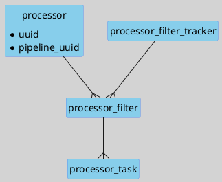

# stroom-process

## Database Tables

```plantuml
@startuml

entity processor {
    * uuid
    * pipeline_uuid
}

entity processor_filter {
}

entity processor_task {
}

entity processor_filter_tracker {
}

processor --{ processor_filter
processor_filter_tracker --{ processor_filter
processor_filter --{ processor_task

' see http://plantuml.com/skinparam & https://github.com/plantuml/plantuml/pull/31

'skinparam handwritten true
'skinparam monochrome reverse
'skinparam backgroundColor DimGrey
'skinparam ClassBackgroundColor DimGrey
'skinparam ClassBorderColor WhiteSmoke
'skinparam backgroundColor transparent

' light theme
skinparam backgroundColor LightGrey
skinparam ClassBackgroundColor SkyBlue
skinparam ClassBorderColor CornflowerBlue

hide circle
hide empty members

@enduml
```
