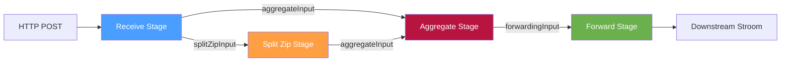
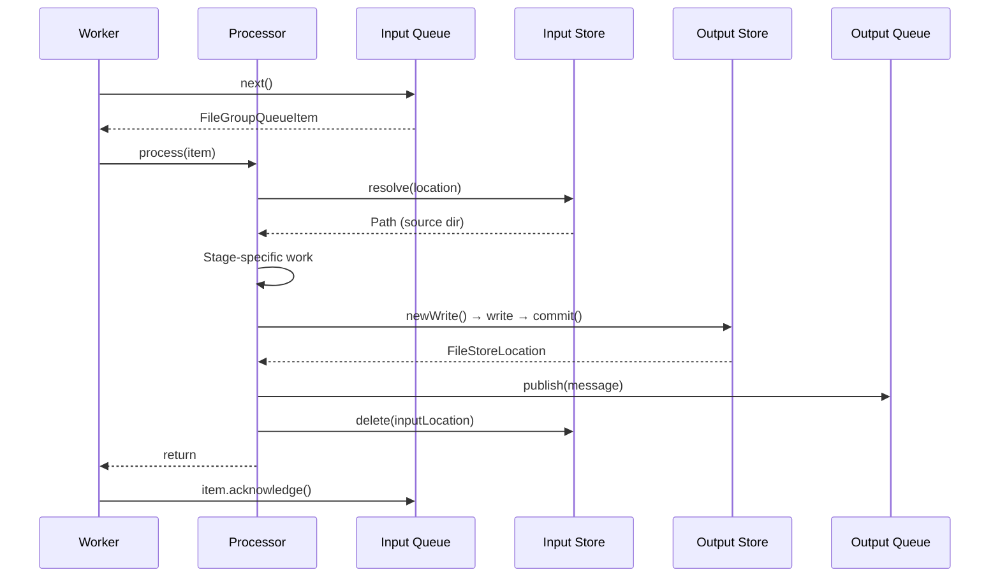
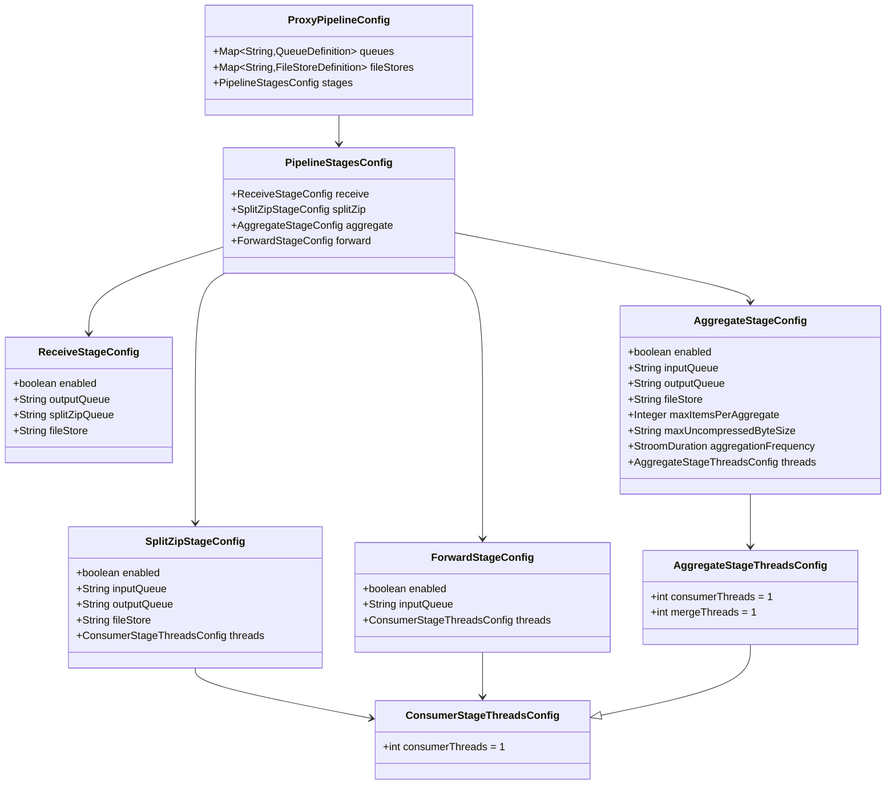
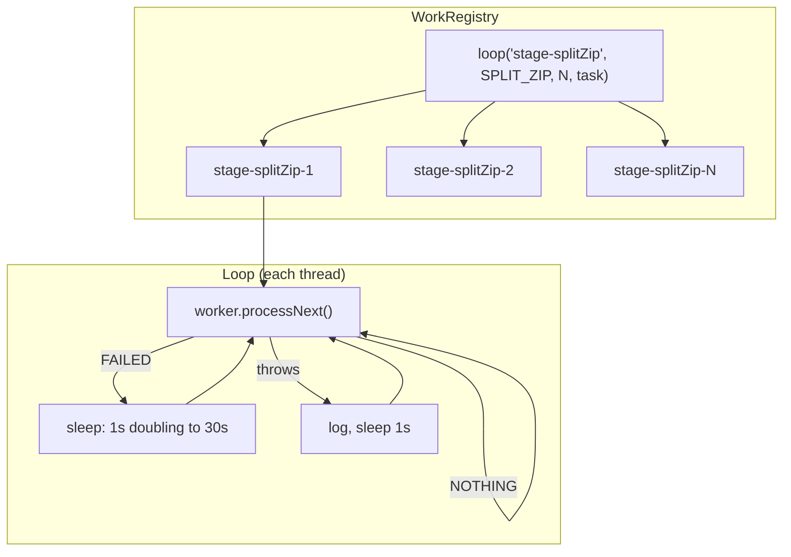

# Stroom Proxy Pipeline — Architecture

[← Back to index](README.md)

## 1. Introduction

This document provides a comprehensive technical reference for the Stroom Proxy pipeline architecture. The pipeline is a staged data-processing system that receives, splits, aggregates, and forwards file groups to downstream Stroom instances. Data flows through a sequence of independent stages connected by pluggable queues, with durable file stores providing persistence between stages.

The design prioritises **zero data loss**, **pluggable queue backends**, and **flexible deployment topologies** — from a single-process proxy to a fully distributed cluster.

## 2. High-Level Architecture



### Data Flow Summary

```
HTTP ──► Receive ──► [splitZipInput] ──► SplitZip ──► [aggregateInput] ──► Aggregate ──► [forwardingInput] ──► Forward ──► Downstream
                 └──────────────────────────────────► [aggregateInput] ──► (single-feed bypass)
```

Each stage:

1. Reads a lightweight **reference message** from its input queue
2. Resolves the referenced file group from a **file store**
3. Performs its stage-specific processing
4. Writes output to its output **file store**
5. Publishes a reference message to its output **queue**
6. Deletes consumed input from the input file store
7. Acknowledges the input queue message

## 3. Core Design Principles

### 3.1 Reference Messages, Not Data Messages

Queue messages are lightweight JSON references (~500 bytes). Actual data lives in file stores. This decouples queue sizing from data volume and allows different queue backends without message-size constraints.

### 3.2 Ownership-Transfer Contract

Every stage follows a strict ordering: **write output → publish message → delete input → acknowledge**. This ensures at-least-once delivery with no data loss. See [§5 Ownership Transfer](#5-ownership-transfer-protocol) for details.

### 3.3 Stage Independence

Each stage only knows its input queue, output queue, and file store. All stages are enabled by default. For distributed deployments, individual stages can be disabled so that each process runs only the stages it is responsible for. Stages can be run in separate processes, scaled independently, and use different queue/store backends.

### 3.4 At-Least-Once Delivery, Not Exactly-Once

The pipeline guarantees that every file group is processed **at least** once. It
does not attempt exactly-once, and **duplicates are an expected outcome**, not a
fault to be designed out.

Every stage writes its output with `FileStore.newWrite()`, which allocates a
fresh sequential path per call. A redelivered message therefore produces a
*second* committed output and a *second* onward message; the file group is
delivered downstream twice. That is the accepted cost of never losing data: the
ownership-transfer ordering in §5 is built so that a crash at any point loses
nothing, and the price of that is a window in which work can be repeated.

Downstream consumers must tolerate duplicate receipt of the same file group.
A redelivered message keeps its `messageId`; a stage re-run after a crash mints
a new one, so there is no key that survives every duplicate.

> `FileStore` offers no replay-safe write. It once did (`newDeterministicWrite`),
> no stage ever called it, and it was removed with the store rewrite; if a caller
> ever needs one it is designed for that caller then.

## 4. Package Structure

All pipeline classes reside in `stroom.proxy.app.pipeline`, organised into sub-packages by concern:

```mermaid
graph TD
    subgraph "stage/ (common infra)"
        FGQW["FileGroupQueueWorker"]
        FGQIP["FileGroupQueueItemProcessor"]
        FGQWC["FileGroupQueueWorkerCounters"]
    end

    subgraph "stage.receive/"
        RSC["ReceiveStageConfig"]
    end

    subgraph "stage.splitzip/"
        SZSC["SplitZipStageConfig"]
        SZS["SplitZipStage"]
    end

    subgraph "stage.aggregate/"
        ASC["AggregateStageConfig"]
        ASTC["AggregateStageThreadsConfig"]
        AB["AggregateBounds"]
        AS["AggregateStage"]
    end

    subgraph "stage.forward/"
        FSC["ForwardStageConfig"]
        FS["ForwardStage"]
        FOS["FanOutStage"]
        GU["GiveUp"]
        LW["LivenessWatch"]
        FD["ForwardDestinations"]
    end

    subgraph "config/"
        PPC["ProxyPipelineConfig"]
        PSC["PipelineStagesConfig"]
        CSTC["ConsumerStageThreadsConfig"]
        PPCV["ProxyPipelineConfigValidator"]
    end

    subgraph "queue/"
        FGQ["FileGroupQueue"]
        FGQM["FileGroupQueueMessage"]
        FGQI["FileGroupQueueItem"]
    end

    subgraph "queue.local/"
        LFGQ["LocalFileGroupQueue"]
    end

    subgraph "queue.sqs/"
        SQSFGQ["SqsFileGroupQueue"]
    end

    subgraph "queue.kafka/"
        KFGQ["KafkaFileGroupQueue"]
    end

    subgraph "store/"
        FS["FileStore"]
        FSW["FileStoreWrite"]
        FSL["FileStoreLocation"]
        FSD["FileStoreDefinition"]
    end

    subgraph "store.filesystem/"
        LFS["FilesystemFileStore"]
    end

    subgraph "store.s3/"
        S3FS["S3FileStore"]
    end

    subgraph "runtime/"
        PPR["ProxyPipelineRuntime"]
        PPA["ProxyPipelineAssembler"]
        PPT["ProxyPipelineTopology"]
        FSR["FileStoreRegistry"]
        FSF["FileStoreFactory"]
        FGQF["FileGroupQueueFactory"]
    end

    subgraph "execution/ (stroom.proxy.app.execution)"
        WR["WorkRegistry"]
        LOOP["Loop / LoopTask / Phase"]
    end

    subgraph "monitor/"
        PHC["PipelineHealthChecks"]
        PMR["PipelineMetricsRegistrar"]
    end

    FGQW --> FGQ
    FGQW --> FGQIP
    RSP --> FS
    RSP --> FGQ
    SZSP --> FSR
    PASP --> FSR
    ASP --> FSR
    FSP --> FSR
    PPL --> PSR
    PSR --> FGQW
    PSC --> RSC
    PSC --> SZSC
    PSC --> PASC
    PSC --> ASC
    PSC --> FSC
    PASTC -.-> CSTC
```



## 5. Ownership-Transfer Protocol



### Crash Recovery Scenarios

| Crash Point | Recovery Behaviour | Cost |
|---|---|---|
| Before output commit | Input still in queue, redelivered, reprocessed | An orphaned uncommitted staging directory |
| After commit, before publish | Input redelivered and fully reprocessed | The first output is committed but referenced by nothing — an orphan; the second is published normally |
| After publish, before input delete | Input redelivered and fully reprocessed | A **duplicate** onward message and output; the file group is delivered downstream twice |
| After delete, before ack | Input redelivered, resolves to nothing, and is **acknowledged** | Nothing. The absent input is proof the work completed (contracts.md R12, §2.6) |

> **The last row is fixed as of 2026-09-03.** It used to read *"the message can never succeed
> and is retried until it dead-letters — even though its work completed"*, and that was recorded here
> as an **accepted cost** with advice for an operator to check by hand. It was not a rare crash
> window: under [contracts.md R1a](contracts.md#1-standing-rulings) a slow acknowledgement or a GC
> pause is enough on a distributed backend, so it was ordinary operation — and on Kafka the offset
> was never committed, which stopped the whole partition.
>
> What resolved it was [R12](contracts.md#26-absence-of-data-means-the-work-was-done): absence of
> data means the work was done. This table is where that becomes obvious — every row above it shows
> the output being made durable and published *before* the input is deleted, so by the time the input
> is gone there is nothing left to do. Kept as a note rather than deleted, because a fix that left
> this row standing would quietly re-establish the contract it removes.
>
> See [contracts.md §2.2](contracts.md#22-a-queue-item-may-point-at-data-that-is-already-gone)
> and the ruling on absence. A queue item pointing at data that is already gone is now ruled an *expected
> state the consumer must handle*, not a trap for an operator to adjudicate. The paragraph
> below describes today's behaviour.

No row loses data. The last one is the operational trap worth knowing: the work
*did* complete — output was committed and published before the input was
deleted — so the failing message in `failed/` or the DLQ represents finished
work, not lost work. Re-driving it will fail again for the same reason. Confirm
the onward message exists before deciding what to do with it.

Orphans left by the first two rows are wasted space rather than lost data; see
[future-work.md](future-work.md) for the proposed cleanup.

## 6. Detailed Stage Documents

Each stage has its own detailed design document with class diagrams, sequence diagrams, and field-level descriptions:

| Stage | Document |
|---|---|
| **Receive** | [stages/receive.md](stages/receive.md) |
| **Split Zip** | [stages/split-zip.md](stages/split-zip.md) |
| **Aggregate** | [stages/aggregate.md](stages/aggregate.md) |
| **Forward** | [stages/forward.md](stages/forward.md) |

## 7. Infrastructure Documents

| Component | Document |
|---|---|
| **Queues** (Local, SQS, Kafka) | [infrastructure/queues.md](infrastructure/queues.md) |
| **File Stores** (Local, S3) | [infrastructure/file-stores.md](infrastructure/file-stores.md) |
| **Runtime & Lifecycle** | [infrastructure/runtime.md](infrastructure/runtime.md) |
| **Entry Points** (HTTP, scanner, events, SQS) | [infrastructure/entry-points.md](infrastructure/entry-points.md) |
The five stage documents above describe the pipeline proper, including retry, back-off and
give-up, which are the forward stage's ([stages/forward.md](stages/forward.md)). One piece of the
data path sits outside it and is covered separately: how data gets *into* the receive stage
([entry-points.md](infrastructure/entry-points.md)). For the end-to-end picture including the
on-disk layout, see [data-path.md](data-path.md).

## 8. Key Data Structures

### 8.1 FileGroupQueueMessage (Record)

The universal reference message carried by all queue implementations:

```java
public record FileGroupQueueMessage(
    int schemaVersion,          // Always 2
    String messageId,           // UUID
    FileStoreLocation fileStoreLocation,  // Where the data lives
    String feed,                // The aggregation key, when single-feed
    String type,
    String producingStage,      // Which stage produced this
    String producerId,          // Which node produced this
    Instant createdTime,        // Creation timestamp
    String traceId,             // Optional correlation ID
    Map<String, String> attributes  // Optional metadata
)
```

### 8.2 FileStoreLocation (Record)

A stable URI-based reference to data in a named file store:

```java
public record FileStoreLocation(
    String storeName,           // Logical store name (e.g. "receiveStore")
    LocationType locationType,  // LOCAL_FILESYSTEM or S3
    String uri,                 // file:///... or s3://bucket/key
    Map<String, String> attributes
)
```

### 8.3 FileGroupQueueItem (Interface)

A leased item from a queue with acknowledgement semantics:

| Method | Purpose |
|---|---|
| `getId()` | Queue-specific lease identifier |
| `getMessage()` | The `FileGroupQueueMessage` |
| `getMetadata()` | Queue-implementation diagnostics |
| `acknowledge()` | Confirm successful processing |
| `fail(Throwable)` | Return to queue for retry |
| `close()` | Release local resources |

## 9. Configuration Model

Each stage has its own typed configuration class with only the fields relevant to that stage.



### Stage-Specific Thread Config

| Stage | Config Class | Fields |
|-------|-------------|--------|
| Receive | none | Receipt runs on its callers' threads |
| Split-Zip | `ConsumerStageThreadsConfig` | `consumerThreads` (default: 1) |
| Aggregate | `AggregateStageThreadsConfig` | `consumerThreads` (claimers, default: 1; more only on Kafka), `mergeThreads` (default: 1) |
| Forward | `ConsumerStageThreadsConfig` | `consumerThreads` (default: 1; the fan-out loop only - each destination's own `threads.consumerThreads`, default 5, drives its deliveries) |

## 10. Thread Model

Every background thread in the proxy is owned by one `WorkRegistry`
([infrastructure/execution.md](infrastructure/execution.md)). Each queue-consuming stage is a
registered loop of `consumerThreads` daemon threads named `stage-<configName>-<n>`:



| Outcome | Delay |
|---|---|
| No item available | None — the queue's `next()` already waited |
| Item processed | None — loop straight round |
| Item **failed** | 1 s, doubling per consecutive failure to a 30 s cap, reset by the next success |
| Task throws | 1 s |

The failure backoff matters more than it looks. `item.fail()` returns the message
to the queue, so without a delay a message that can never succeed is retried as
fast as the thread can run. The count is per thread, not per message —
the pipeline deliberately holds no per-message attempt state — so with N consumer
threads a stuck item is retried roughly N times per interval rather than once.

Queue backends differ in how long `next()` itself blocks — SQS long-polls for up to `waitTime` (default 20 s), Kafka polls with a 100 ms timeout, and local queues wait on the directory — and the loop adds nothing on top of that.

Loops start with consumers before producers (forward first, the sources last) and stop with
producers before consumers, each stop bounded at 30 s before the threads are interrupted. The
health check reports every loop's live thread count against its configured count.
