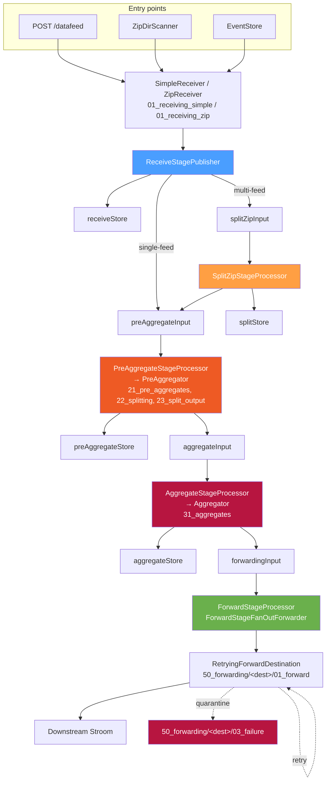

# The End-to-End Data Path

[← Back to architecture overview](architecture.md)

## 1. Purpose

[architecture.md](architecture.md) describes the pipeline as a clean sequence of
five stages joined by queues. That is accurate but incomplete: the proxy runs
**two** queue mechanisms, and the working directories on disk do not map
one-to-one onto the pipeline's logical queue names.

This document gives the whole path — from an inbound byte to a forwarded file
group — and the on-disk layout that goes with it. It is the document to read
when you are looking at a proxy data directory and trying to work out what a
given directory is for.

## 2. Two Queue Tiers

| | `FileGroupQueue` | `DirQueue` |
|---|---|---|
| Package | `stroom.proxy.app.pipeline.queue` | `stroom.proxy.app.handler` |
| Role | Transport **between** pipeline stages | Work queue **inside** a single handler |
| Carries | Reference messages (JSON, ~500 bytes) | Directories, moved atomically in place |
| Backends | Local filesystem, SQS, Kafka | Local filesystem only |
| Cross-process | Yes, with SQS or Kafka | No — single JVM |
| Configurable | Yes, via `pipeline.queues` | No — internal to its handler |
| Used by | All five stages | `PreAggregator`, `Aggregator`, `Forwarder`, `RetryingForwardDestination` |

`DirQueue` is the transport of the pre-pipeline architecture. It was **not**
replaced wholesale — it survives as the intra-handler work-queue primitive,
while `FileGroupQueue` took over everything that crosses a stage boundary. This
is why the pipeline can be distributed across processes even though `DirQueue`
cannot: no `DirQueue` ever spans two stages.

Where the two meet: a stage processor calls into a handler
(`PreAggregator::addDir`, `Aggregator::addDir`, `forwarder.add(dir)`), and that
handler may internally queue the directory on a `DirQueue` before acting on it.

## 3. Full Path



Entry points are covered in [infrastructure/entry-points.md](infrastructure/entry-points.md);
everything downstream of the forward stage in
[infrastructure/forward-retry.md](infrastructure/forward-retry.md).

## 4. On-Disk Layout

### 4.1 Pipeline queues and stores

Both default under the app data directory and are overridable per queue/store
via `pipeline.queues.<name>.path` and `pipeline.fileStores.<name>.path`.

```
data/pipeline/queues/<queueName>/       # FileGroupQueueFactory, DEFAULT_QUEUE_ROOT
  pending/        message-<seq>.json    # awaiting a consumer
  in-flight/                            # claimed by a worker
  failed/                               # item.fail() landed it here
  tmp/                                  # publish staging
  sequence.txt                          # persisted id counter (re-derived at startup)

data/pipeline/file-stores/<storeName>/  # FileStoreFactory, DEFAULT_FILE_STORE_ROOT
  <writerId>/                           # per-writer subtree — see below
  writing/<writerId>/                   # uncommitted writes

```

Split-zip staging is the exception: it lives under the **configured temp
directory**, not the data directory.

```
<path.temp>/pipeline/splitZip/          # split-zip staging, cleared at startup
  split-zip-<n>/                        # one in-progress split
```

Temp is the right home for it — the data is transient, deleted as soon as the
split completes, and the directory is cleared at startup — and being
memory-backed is usually an advantage for a copy-heavy operation. What matters is
that it resolves through `TempDirProvider` and therefore honours `path.temp`,
rather than going to `java.io.tmpdir` outside the proxy's configured paths where
nothing cleaned it.

One sizing note: the *whole* split of a multi-feed file group lands there before
any of it is committed. If `path.temp` resolves to a small tmpfs and your file
groups are large, point it at disk.

`LocalFileGroupQueue` uses `Files.move(ATOMIC_MOVE)` from `pending/` to
`in-flight/` as a lock-free competing-consumer claim, which is what makes
multiple threads on one queue safe without locking.

`LocalFileStore` partitions by `writerId` — a random UUID per store instance
unless supplied. Committed groups go to `<writerId>/`, in-progress writes to
`writing/<writerId>/`. The partitioning is what makes a shared filesystem safe
for multiple proxy nodes: two nodes writing the same logical store never
collide on a path.

S3-backed stores add `data/pipeline/file-stores/s3-<storeName>/` as the local
staging cache (`localCachePath`).

### 4.2 Handler working directories

Centralised in `DirNames`, directly under the app data directory:

| Constant | Directory | Purpose |
|---|---|---|
| `RECEIVING_SIMPLE` | `01_receiving_simple` | Temporary receive area, non-zip data |
| `RECEIVING_ZIP` | `01_receiving_zip` | Temporary receive area, zip data |
| `PRE_AGGREGATES` | `21_pre_aggregates` | Open pre-aggregates accumulating parts |
| `PRE_AGGREGATE_SPLITTING` | `22_splitting` | Temporary splitting area |
| `PRE_AGGREGATE_SPLIT_OUTPUT` | `23_split_output` | Output of pre-aggregate splitting |
| `AGGREGATES` | `31_aggregates` | Where final aggregate zips are formed |
| `FORWARDING` | `50_forwarding` | Per-destination forward/retry/failure areas |

One more is not in `DirNames` — `CleanupDirQueue` hardcodes `99_deleting`, the
staging area directories are moved into before recursive deletion. Its contents
are cleared at startup.

The numeric prefixes are historical ordering hints from the original numbered
phase design, not a sequence the current pipeline walks. They are preserved
because they sort usefully.

> **Legacy directories.** A deployment that predates the pipeline migration may
> still hold `02_split_zip_input_queue`, `03_split_zip_splits`,
> `20_pre_aggregate_input_queue`, `30_aggregate_input_queue`,
> `40_forwarding_input_queue` and `03_received_zip`. These were the
> `DirQueue`-era inter-stage queues, superseded by the `pipeline.queues` entries
> of the same logical names. Nothing reads or writes them now — the constants
> naming them have been removed from `DirNames` — so they can be archived or
> deleted once you have confirmed they are empty.

### 4.3 Forward destinations

```
50_forwarding/<safeDestinationName>/
  01_forward/    DirQueue — first attempt pending
  02_retry/      DirQueue — awaiting back-off expiry
  03_failure/    quarantine; error.log retained per group
```

### 4.4 Entry-point directories

```
zip_file_ingest/          scanned for zip groups (dirScanner.dirs)
zip_file_ingest_failed/   unprocessable zip groups (dirScanner.failureDir)
```

## 5. Where Data Can Accumulate

Useful when diagnosing a proxy that is filling its disk:

| Location | Grows when | Drains when |
|---|---|---|
| `data/pipeline/queues/*/pending` | A stage is disabled, or consumers are slower than producers | Consumers catch up |
| `data/pipeline/queues/*/in-flight` | Workers are stuck, or a process died mid-item | Startup recovery moves them back to `pending` |
| `data/pipeline/queues/*/failed` | Processors are throwing | Never automatically |
| `data/pipeline/file-stores/*` | Normal transit | The consuming stage deletes after ownership transfer |
| `<path.temp>/pipeline/splitZip` | A split is in progress | Deleted when the split finishes, and the whole directory is cleared at startup |
| `21_pre_aggregates` | Aggregates are open and not yet aged out | `closeOldAggregates` closes them |
| `50_forwarding/*/02_retry` | A destination is unreachable | Destination recovers, or `maxRetryAge` expires |
| `50_forwarding/*/03_failure` | Terminal forward failures | **Never** — manual intervention only |
| `zip_file_ingest_failed` | Malformed zip groups | **Never** — manual intervention only |

The last two are quarantines by design. Both should be monitored; neither has
an automatic cleanup.

`in-flight` deserves a specific caution: `LocalFileGroupQueue`'s startup
recovery moves *everything* in `in-flight/` back to `pending/`. That is correct
for a single process restarting, but it is why a local filesystem queue must not
be shared by two JVMs — one starting up would reclaim items the other is
actively processing. Use SQS or Kafka for multi-process deployments.

## 6. Failure Handling by Location

What happens on failure depends entirely on where in the path it occurs.

| Where | Examples | Outcome |
|---|---|---|
| **Receive time** | Authentication failure, receipt policy rejection, invalid or unknown compression, malformed zip, IO error mid-receive | The request fails and the sender gets an error response. Partial temporary receive state is cleaned up where possible. Nothing reaches the pipeline. |
| **Receipt policy drop** | Policy resolves to drop for this feed | Input is consumed or discarded and receive/drop information recorded. Nothing is placed on a downstream queue. A successful receipt may still be returned, depending on policy semantics. |
| **Stage processing** | A processor throws | `FileGroupQueueWorker` calls `item.fail()`. The backend decides what that means: local queues move the message to `failed/` with a `.last-error.txt`; SQS leaves it to redelivery and the redrive policy; Kafka simply does not commit the offset. Input data stays where it is. |
| **Forwarding** | Destination unreachable, rejects the data, or errors | The most elaborate model: recoverable errors go to the destination's retry queue with back-off, unrecoverable ones or exhausted budgets go to `03_failure`. See [infrastructure/forward-retry.md](infrastructure/forward-retry.md). |
| **Dir scanner** | Malformed zip group | Moved to the scanner's `failureDir`. The scan continues; one bad file never halts the walk. |

Deletion anywhere in the path goes through `CleanupDirQueue`, which moves a
directory into `99_deleting/<n>` with an atomic move *before* deleting it
recursively. A crash mid-delete therefore leaves a complete directory in
`99_deleting` rather than a half-deleted one in place; the contents of
`99_deleting` are cleared at startup.

## 7. Crash Safety Across the Whole Path

The pipeline's ownership-transfer contract (write output → publish → delete
input → acknowledge) is documented in
[architecture.md §5](architecture.md#5-ownership-transfer-protocol). Two
boundaries sit outside it:

- **Entry point to receive stage.** The entry point deletes or acknowledges its
  source only after `receive()` returns. A crash mid-receive means the sender
  retries (HTTP), the file is rescanned (dir scanner), or the rolled event file
  is reprocessed at startup (event store). Duplicates are possible; data loss is
  not.
- **Forward stage to destination.** Once the forward stage acknowledges
  `forwardingInput`, the file group's durability is `RetryingForwardDestination`'s
  responsibility, held in `01_forward`/`02_retry` on disk. A crash resumes from
  whatever is in those queues, with `retry.state` preserving the back-off
  schedule.
