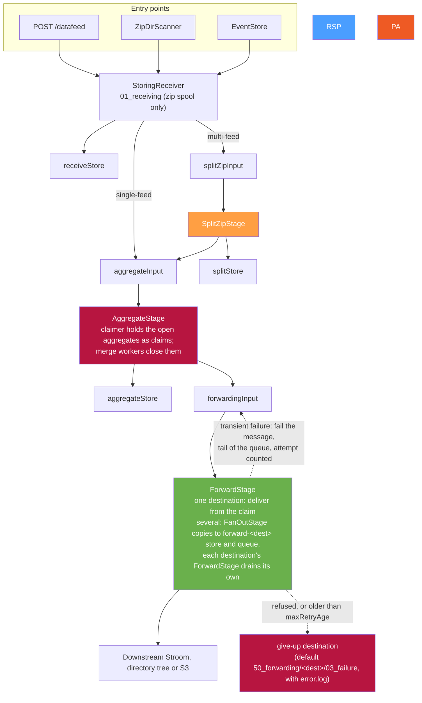

# The End-to-End Data Path

[← Back to architecture overview](architecture.md)

## 1. Purpose

[architecture.md](architecture.md) describes the pipeline as a clean sequence of
five stages joined by queues. That is accurate but incomplete: the proxy runs
**two** queue mechanisms, and the working directories on disk do not map
one-to-one onto the pipeline's logical queue names.

This document gives the whole path — from an inbound byte to a forwarded file
group — and the on-disk layout that goes with it. It is the document to read
when you are looking at a proxy data directory and trying to work out what a
given directory is for.

## 2. One Queue Tier

`FileGroupQueue` (`stroom.proxy.app.pipeline.queue`) is the only queue: the transport between
stages, carrying reference messages (JSON, a few hundred bytes) over a local filesystem, SQS or
Kafka, configured under `pipeline.queues`. There is no work queue inside a handler any more. The
forward stage's retry tier, which moved directories between node-local `DirQueue`s, went when
forwarding was rebuilt to [stages/forward.md](stages/forward.md): a group stays claimed on the
pipeline queue until it is delivered or given up on, and with several destinations the stage fans
out to a pipeline queue and store per destination.

## 3. Full Path



Entry points are covered in [infrastructure/entry-points.md](infrastructure/entry-points.md);
delivery, retry and give-up in [stages/forward.md](stages/forward.md).

## 4. On-Disk Layout

### 4.1 Pipeline queues and stores

Both default under the app data directory and are overridable per queue/store
via `pipeline.queues.<name>.path` and `pipeline.fileStores.<name>.path`.

```
data/pipeline/queues/<queueName>/       # FileGroupQueueFactory, DEFAULT_QUEUE_ROOT
  .queue-owner.lock                     # held by the one process that owns the queue
  pending/        <id>.json             # awaiting a consumer, FIFO by id
  in-flight/                            # claimed by a consumer thread
  failed/                               # given up on after maxDeliveryAttempts
  tmp/                                  # a publish in progress

data/pipeline/file-stores/<storeName>/  # FileStoreFactory, DEFAULT_FILE_STORE_ROOT
  0/001/                                # committed file group 1 (local mode: the root is the writer root)
  1/001/001000/                         # committed file group 1000 - nested so no directory exceeds 1000 entries
  .staging/<id>/                        # a write in progress

```

Split-zip and aggregation write nothing outside the stores: each output goes
straight into a store write handle, so neither has a staging directory of its
own ([stages/split-zip.md](stages/split-zip.md), [stages/aggregate.md](stages/aggregate.md)).

`LocalFileGroupQueue` uses `Files.move(ATOMIC_MOVE)` from `pending/` to
`in-flight/` as a lock-free competing-consumer claim, which is what makes
multiple threads on one queue safe without locking.

`FilesystemFileStore` numbers groups sequentially under a *writer root*. In local
mode that is the store root itself, one numbered tree that survives restarts. In
shared mode (`type: SHARED_FILESYSTEM`) it is `<root>/<startId>/`, a fresh UUID
per process start, so two nodes never share a tree and a node restarting never
reuses one. See [infrastructure/file-stores.md](infrastructure/file-stores.md).

S3-backed stores add `data/pipeline/file-stores/s3-<storeName>/` on the node's
own disk (`localCachePath`) for `staging/` before upload and one `resolve/`
directory per download.

### 4.2 Handler working directories

Centralised in `DirNames`, directly under the app data directory:

| Constant | Directory | Purpose |
|---|---|---|
| `RECEIVING` | `01_receiving` | Receipt's scratch: the spool a zip body is written to before it is read, or with an instant file forwarder the directory a group is built in. Groups themselves are written straight into the receive store |
| `FORWARDING` | `50_forwarding` | Per-destination default give-up directories (`<safeDestinationName>/03_failure`) |

The numeric prefixes are historical ordering hints from the original numbered
phase design, not a sequence the current pipeline walks. They are preserved
because they sort usefully.

> **Legacy directories.** A deployment that predates the pipeline migration may
> still hold `02_split_zip_input_queue`, `03_split_zip_splits`,
> `20_pre_aggregate_input_queue`, `30_aggregate_input_queue`,
> `40_forwarding_input_queue` and `03_received_zip`. These were the
> `DirQueue`-era inter-stage queues, superseded by the `pipeline.queues` entries
> of the same logical names. Nothing reads or writes them now — the constants
> naming them have been removed from `DirNames` — so they can be archived or
> deleted once you have confirmed they are empty.

### 4.3 Forward destinations

```
50_forwarding/<safeDestinationName>/
  03_failure/    the default give-up destination; error.log beside each group
```

A destination's `failureDestination` puts give-up data elsewhere: another directory, or an S3
bucket. In shared mode it must be somewhere every node sees. Nothing else of forwarding is on
local disk: a group waiting to be forwarded is in its pipeline store, and its message on the
pipeline queue.

### 4.4 Entry-point directories

```
zip_file_ingest/          scanned for zip groups (dirScanner.dirs)
zip_file_ingest_failed/   unprocessable zip groups (dirScanner.failureDir)
```

A group replayed into `zip_file_ingest/` is recognised by its `proxy.zip` plus the
sidecars that travel with it: `proxy.meta`, `proxy.entries` and `error.log`. All
three are consumed with the group rather than counted as unknown files.

### 4.5 Quarantines

```
50_forwarding/<dest>/03_failure/   forward gave up: refused, or failing for longer than maxRetryAge (or wherever failureDestination points)
<queue>/failed/                    local queue message exceeded maxDeliveryAttempts (SQS: the DLQ; Kafka: <topic>.failed)
event/failed/                      event file the receiver refused three times
zip_file_ingest_failed/            scanner could not ingest
```

Nothing reads any of these. See **Recovering Data the Proxy Has Given Up On** in
[operations.md](operations.md) for how to replay from them, and in particular why
the zips must not be flattened into one directory.

## 5. Where Data Can Accumulate

Useful when diagnosing a proxy that is filling its disk:

| Location | Grows when | Drains when |
|---|---|---|
| `data/pipeline/queues/*/pending` | A stage is disabled, or consumers are slower than producers | Consumers catch up |
| `data/pipeline/queues/*/in-flight` | Workers are stuck, or a process died mid-item | Startup recovery moves them back to `pending` |
| `data/pipeline/queues/*/failed` | Processors are throwing | Never automatically |
| `data/pipeline/file-stores/*` | Normal transit | The consuming stage deletes after ownership transfer |
| `data/pipeline/file-stores/aggregateStore` and `forward-<dest>` stores, with `forwardingInput` / `forward-<dest>` pending | A destination is unreachable: groups wait on the queue, claimed only while an attempt is being made | Destination recovers, or `maxRetryAge` expires and they are given up on |
| `50_forwarding/*/03_failure` (or the configured `failureDestination`) | Terminal forward failures | **Never** — manual intervention only |
| `zip_file_ingest_failed` | Malformed zip groups | **Never** — manual intervention only |
| `event/failed` | An event file the receiver refused three times | **Never** — manual intervention only |

The last three are quarantines by design. All should be monitored; none has an
automatic cleanup, and each holds real data rather than a marker.

An open aggregate holds nothing on disk: it is the set of inputs the aggregate
stage has claimed on `aggregateInput` and not yet acknowledged, which on a local
queue is what `in-flight/` holds. Data waiting to be aggregated is therefore in
the receive or split store and on the queue, and a restart hands it back.

`in-flight` deserves a specific caution: `LocalFileGroupQueue`'s startup
recovery moves *everything* in `in-flight/` back to `pending/`. That is correct
for a single process restarting, but it is why a local filesystem queue must not
be shared by two JVMs — one starting up would reclaim items the other is
actively processing. Use SQS or Kafka for multi-process deployments.

## 6. Failure Handling by Location

What happens on failure depends entirely on where in the path it occurs.

| Where | Examples | Outcome |
|---|---|---|
| **Receive time** | Authentication failure, receipt policy rejection, invalid or unknown compression, malformed zip, IO error mid-receive | The request fails and the sender gets an error response. Partial temporary receive state is cleaned up where possible. Nothing reaches the pipeline. |
| **Receipt policy drop** | Policy resolves to drop for this feed | Input is consumed or discarded and receive/drop information recorded. Nothing is placed on a downstream queue. A successful receipt may still be returned, depending on policy semantics. |
| **Stage processing** | A processor throws | `FileGroupQueueWorker` calls `item.fail()`: the message goes back to the tail with the attempt counted. Give-up is the mode's: a local queue moves the message to `failed/` at `maxDeliveryAttempts`; an SQS queue's redrive policy moves it to the dead-letter queue; a Kafka queue publishes it to `<topic>.failed`. Input data stays where it is. |
| **Forwarding** | Destination unreachable, rejects the data, or errors | A transient failure fails the message like any other stage's, and the destination backs off in memory before its next attempt on any group; a refusal, or a transient failure on a group older than `maxRetryAge`, writes the group with an `error.log` to the give-up destination and then acknowledges. See [stages/forward.md](stages/forward.md). |
| **Dir scanner** | Malformed zip group | Moved to the scanner's `failureDir`. The scan continues; one bad file never halts the walk. |

**Deletion.** There is one recursive-deletion implementation reachable from the proxy,
`stroom.util.io.FileUtil.deleteDir` — it cannot throw and reports failure by return value, which is
what [contracts.md §3.2](contracts.md#32-cleanup-after-a-durable-step-must-never-throw) requires of
housekeeping that follows a durable step.

Where the delete *is* the operation rather than housekeeping — `FileStore.delete()`, or clearing an
obstruction before a write — it must still fail loudly, and reconstructs a throw from the return
value. Note that `FileUtil.deleteDir` no-ops and returns `true` for anything that is not a directory,
so such a caller has to dispatch on shape.

**Transient state is cleared at start-up, not chased at runtime**
([§3.4](contracts.md#34-transient-state-is-cleared-at-start-up)): staging directories, per-resolve
copies and interrupted move residue all go on the way up. In-flight
*queue* state is the exception — it is recovered rather than discarded, because it is claimable work.

## 7. Crash Safety Across the Whole Path

The pipeline's ownership-transfer contract (write output → publish → delete
input → acknowledge) is documented in
[architecture.md §5](architecture.md#5-ownership-transfer-protocol). Two
boundaries sit outside it:

- **Entry point to receive stage.** The entry point deletes or acknowledges its
  source only after `receive()` returns. A crash mid-receive means the sender
  retries (HTTP), the file is rescanned (dir scanner), or the rolled event file
  is reprocessed at startup (event store). Duplicates are possible; data loss is
  not.
- **Forward stage to destination.** There is no boundary: the forward stage
  acknowledges `forwardingInput` (or its `forward-<dest>` queue) only once the
  destination has accepted the group or the stage has given up on it. A crash
  mid-delivery leaves the message claimed for the mode to release, and the next
  claimant delivers it again: a duplicate downstream at worst
  ([stages/forward.md §5](stages/forward.md#5-failure-traced)).
