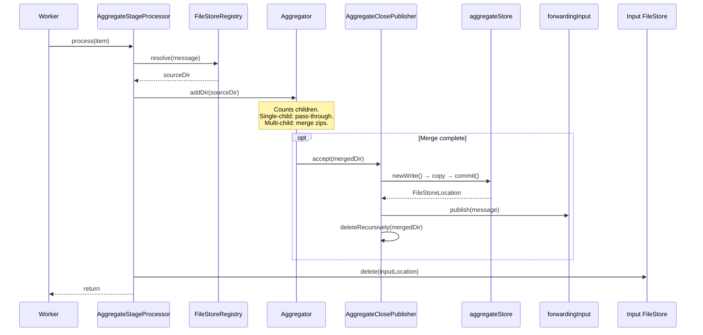
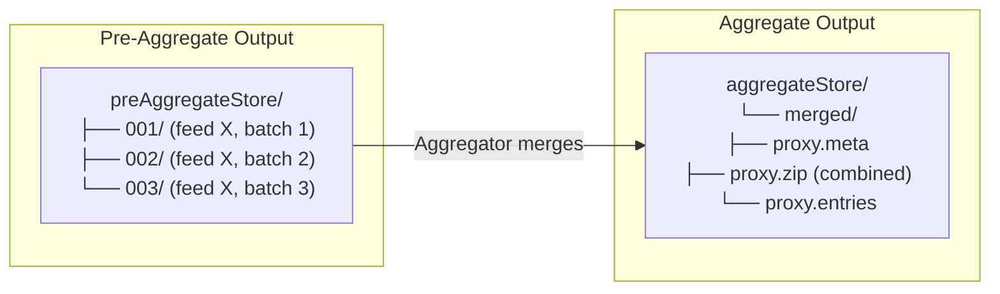

# Detailed Design — Aggregate Stage

[← Back to master](detailed-design.md)

## 1. Purpose

The aggregate stage merges multiple per-feed file-group subdirectories (produced by pre-aggregation) into a single output zip with combined metadata headers. The merged result is published to the forwarding input queue.

Like the pre-aggregate stage, this stage uses a stateful `Aggregator` with a close callback.

## 2. Class Diagram

```mermaid
classDiagram
    class AggregateStageProcessor {
        -FileStoreRegistry fileStoreRegistry
        -AggregateFunction aggregateFunction
        +process(FileGroupQueueItem)
    }

    class FileGroupQueueItemProcessor {
        <<interface>>
        +process(FileGroupQueueItem)
    }

    class AggregateFunction {
        <<functional interface>>
        +addDir(Path sourceDir)
    }

    class AggregateClosePublisher {
        -FileStore outputStore
        -FileGroupQueue outputQueue
        -PipelineStageName stageName
        -String sourceNodeId
        +accept(Path aggregateDir)
    }

    class Aggregator {
        +addDir(Path sourceDir)
        +setDestination(Consumer~Path~)
    }

    AggregateStageProcessor ..|> FileGroupQueueItemProcessor
    AggregateStageProcessor --> AggregateFunction
    AggregateStageProcessor --> FileStoreRegistry
    Aggregator ..|> AggregateFunction : "::addDir"
    Aggregator --> AggregateClosePublisher : destination
    AggregateClosePublisher --> FileStore : aggregateStore
    AggregateClosePublisher --> FileGroupQueue : forwardingInput
```

## 3. Constructor Parameters

| Parameter | Type | Required | Description |
|---|---|---|---|
| `fileStoreRegistry` | `FileStoreRegistry` | Yes | Resolves input message locations |
| `aggregateFunction` | `AggregateFunction` | Yes | Merge logic (wraps `Aggregator::addDir`) |

## 4. Processing Sequence



### Aggregator Internal Logic

The `Aggregator` handles three cases:

1. **Single child** — If the pre-aggregate directory contains only one subdirectory, the data passes through without modification (no zip merge needed).

2. **Multi-child** — Multiple per-feed subdirectories are merged:
   - Zip files from each child are combined into a single output zip
   - Common metadata headers are combined
   - The merged result is written to the destination callback

3. **Empty/Invalid** — Logs a warning and skips.

## 5. Relationship to Pre-Aggregate



## 6. Acknowledgement Contract

Same pattern as all processors — `FileGroupQueueWorker` owns acknowledgement.
