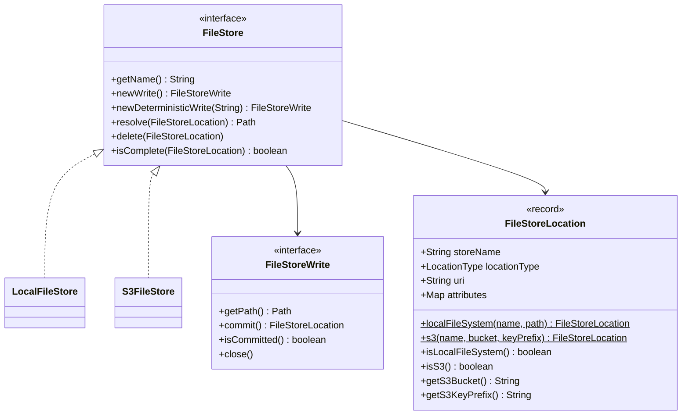
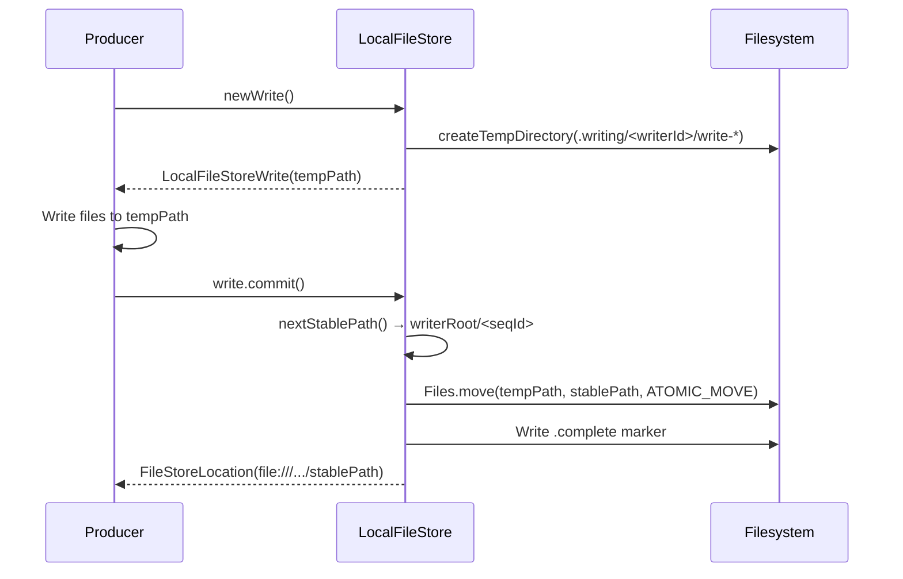
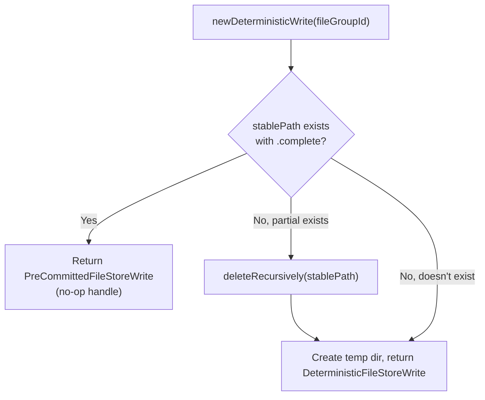
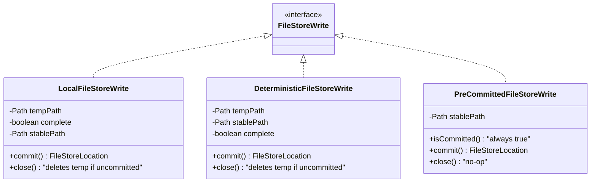
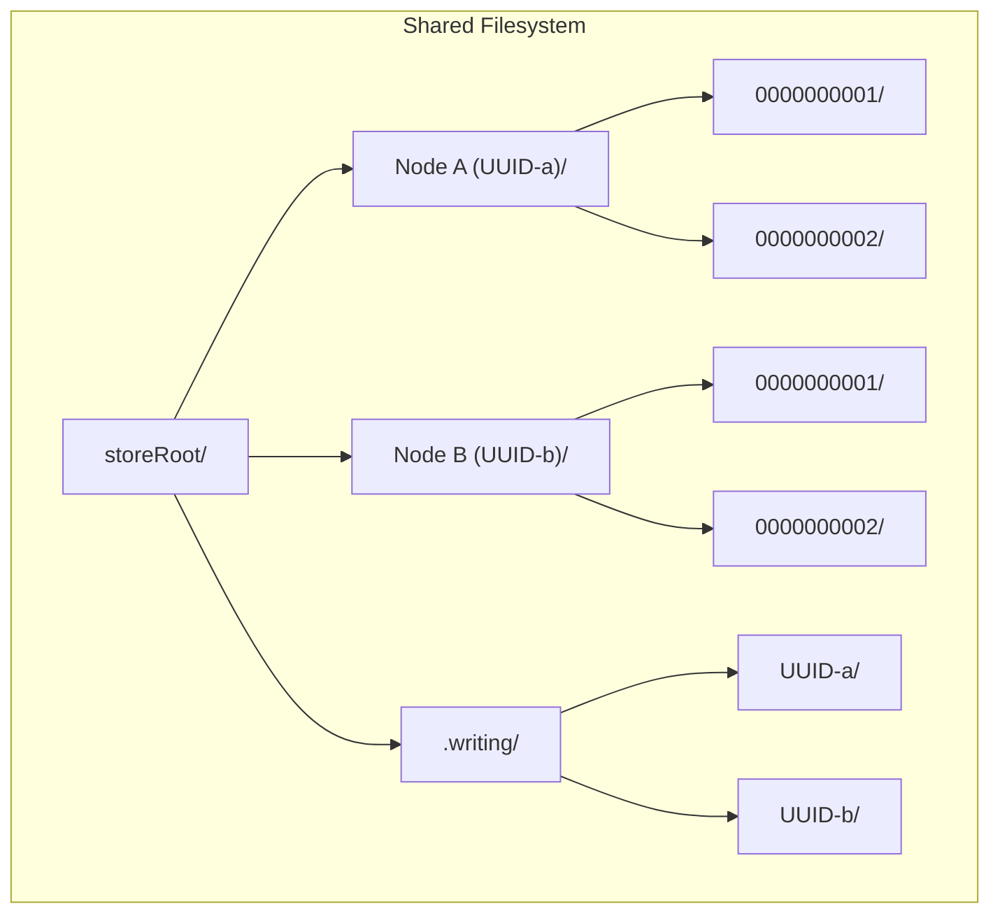
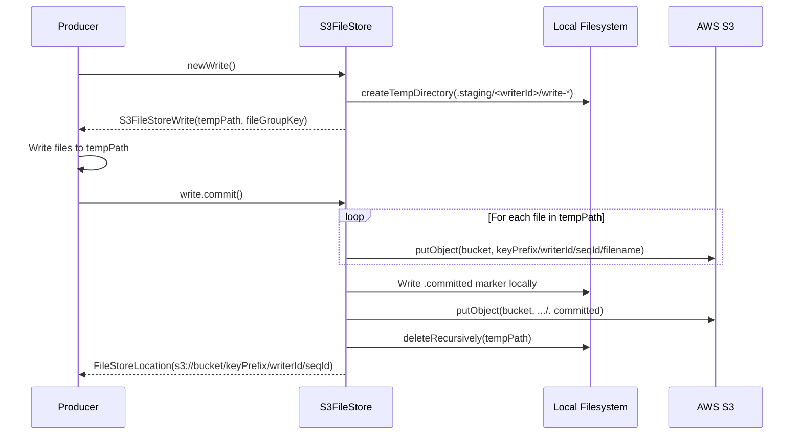
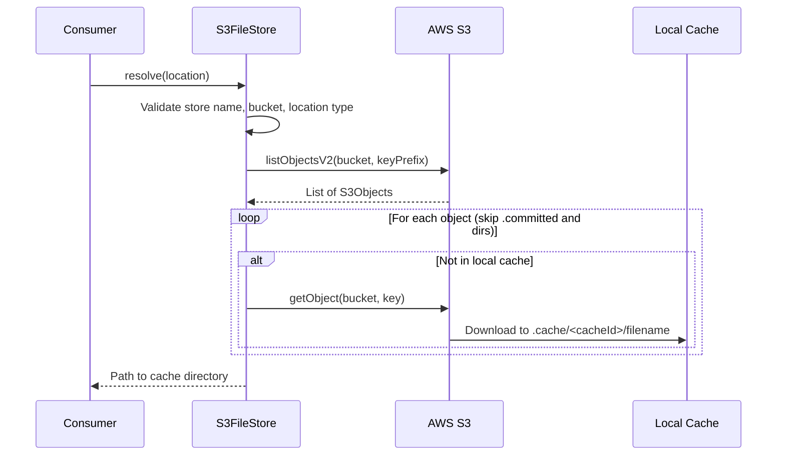
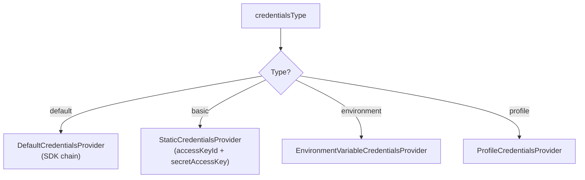
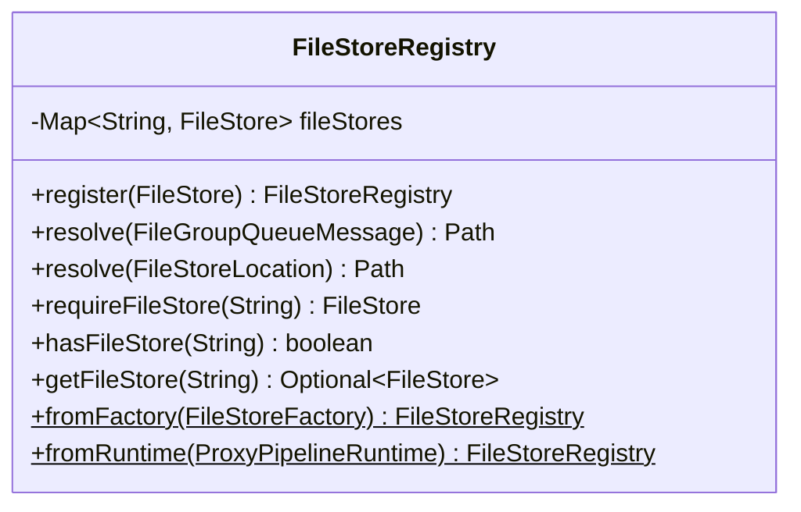
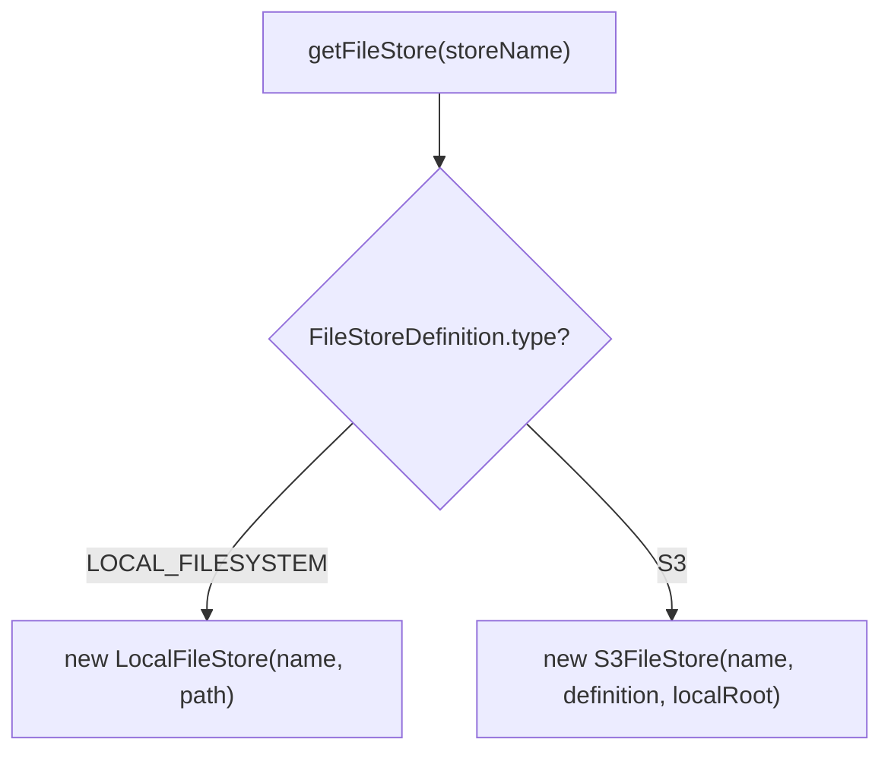

# Detailed Design — File Store Implementations

[← Back to master](detailed-design.md)

## 1. Overview

File stores hold the actual data (file groups: `proxy.meta`, `proxy.zip`, `proxy.entries`). Each stage writes to a named file store. Two backing types are supported: local filesystem and S3.



---

## 2. LocalFileStore

### 2.1 Purpose

Local/shared filesystem implementation. Supports single-node and multi-node deployments with shared filesystems (NFS, EFS, GlusterFS).

### 2.2 Directory Layout

```
<storeRoot>/
├── <writerId>/                    ← Writer directory (UUID per node)
│   ├── 0000000001/                ← Committed file group
│   │   ├── proxy.meta
│   │   ├── proxy.zip
│   │   ├── proxy.entries
│   │   └── .complete              ← Completeness marker
│   ├── 0000000002/
│   └── ...
└── .writing/                      ← Staging area
    └── <writerId>/
        └── write-1234567890/      ← In-progress write
```

### 2.3 Key Fields

| Field | Type | Description |
|---|---|---|
| `name` | `String` | Logical store name |
| `root` | `Path` | Store root directory (absolute, normalised) |
| `writerRoot` | `Path` | `root/<writerId>/` — this node's write directory |
| `tempRoot` | `Path` | `root/.writing/<writerId>/` — staging area |
| `sequence` | `AtomicLong` | Monotonic counter for sequential IDs |

### 2.4 Write Flow (Sequential)



Key properties:
- **Atomic commit** — `Files.move(ATOMIC_MOVE)` ensures consumers never see partial writes
- **Completeness marker** — `.complete` file written as the final step
- **Sequence isolation** — Each writer has its own counter, no cross-node contention

### 2.5 Write Flow (Deterministic)



- **Idempotent** — If the output already exists and is complete, returns a pre-committed handle. Callers can check `isCommitted()` and skip writing.
- **Crash recovery** — If a partial write exists (no `.complete` marker), it is cleaned up before starting fresh.
- Stable path = `writerRoot/<fileGroupId>/`

### 2.6 Write Handle Types



### 2.7 Resolve

```java
Path resolve(FileStoreLocation location)
```

1. Validates `location.storeName()` matches this store
2. Validates `location.locationType()` is `LOCAL_FILESYSTEM`
3. Converts `file:///...` URI to `Path`
4. Validates the path is within the store root (security check)
5. Returns the absolute path

### 2.8 Delete

```java
void delete(FileStoreLocation location)
```

- Calls `resolve()` for validation
- Refuses to delete the store root or writer root (safety guard)
- Idempotent: if path doesn't exist, returns silently
- Recursively deletes the file group directory and all contents

### 2.9 Multi-Node Write Safety

When multiple proxy nodes share a filesystem, each node writes to its own writer directory:



- Each node has an **independent sequence counter**
- No cross-node contention on sequences
- `FileStoreLocation` carries the full absolute path (including writer ID)
- Consumers resolve any node's data via the complete path in the queue message

---

## 3. S3FileStore

### 3.1 Purpose

AWS S3 (or S3-compatible) implementation for distributed deployments with durable cloud storage.

### 3.2 S3 Object Layout

```
s3://<bucket>/<keyPrefix>/<writerId>/<seqId>/
    proxy.meta
    proxy.zip
    proxy.entries
    .committed              ← Commit marker object
```

### 3.3 Local Directory Layout

```
<localRoot>/
├── .staging/                  ← Upload staging
│   └── <writerId>/
│       └── write-*/           ← Files before upload
└── .cache/                    ← Download cache
    └── <cacheId>/             ← Cached file groups from S3
```

### 3.4 Key Fields

| Field | Type | Description |
|---|---|---|
| `name` | `String` | Logical store name |
| `bucket` | `String` | S3 bucket name |
| `keyPrefix` | `String` | Key prefix (normalised with trailing `/`) |
| `s3Client` | `S3Client` | AWS SDK S3 client |
| `localStagingRoot` | `Path` | Local staging directory |
| `localCacheRoot` | `Path` | Local download cache |
| `writerId` | `String` | UUID per node |
| `sequence` | `AtomicLong` | Monotonic counter |

### 3.5 Write Flow



### 3.6 Resolve Flow



- Downloads are cached locally — subsequent resolves skip already-downloaded files
- Cache directory name derived from the key prefix

### 3.7 Delete Flow

1. Lists all objects under the key prefix
2. Deletes each S3 object
3. Cleans up any local cache entry

### 3.8 Credentials



For S3-compatible stores (MinIO, LocalStack), set `endpointOverride` which also enables `forcePathStyle(true)`.

---

## 4. FileStoreRegistry

Central lookup layer that maps logical store names to runtime `FileStore` instances:



- **Thread-safe** — uses `ConcurrentHashMap`
- **Two-step resolution**: `resolve(message)` → extracts `FileStoreLocation` → looks up store by `storeName` → calls `store.resolve(location)`
- Stage processors use the registry rather than holding direct file store references for input resolution

---

## 5. FileStoreFactory

Creates file store instances from `FileStoreDefinition` configuration:



File store instances are cached — the same logical name always returns the same instance.
