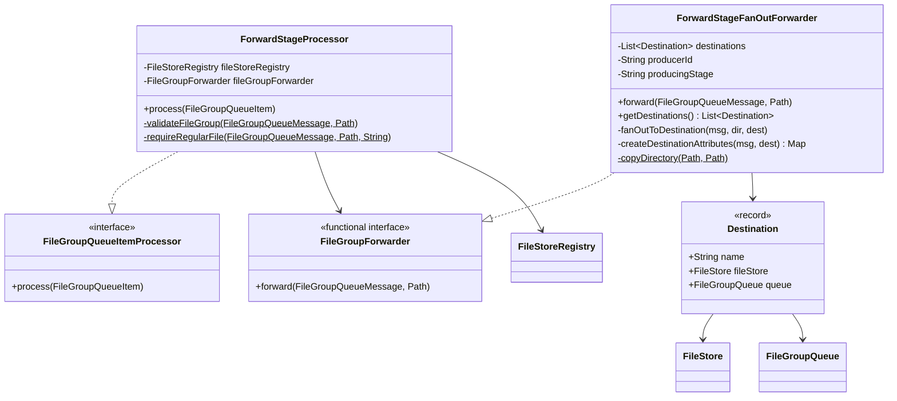
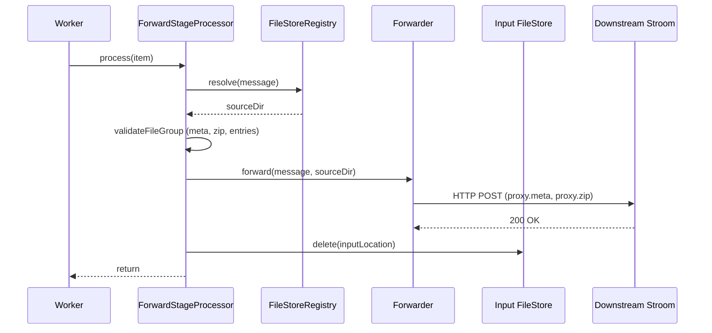
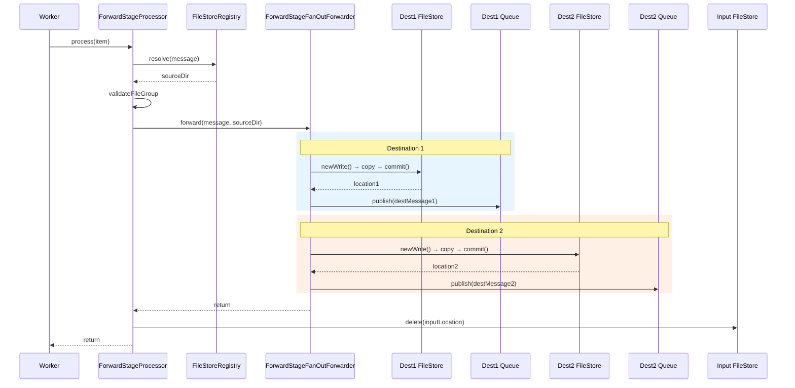
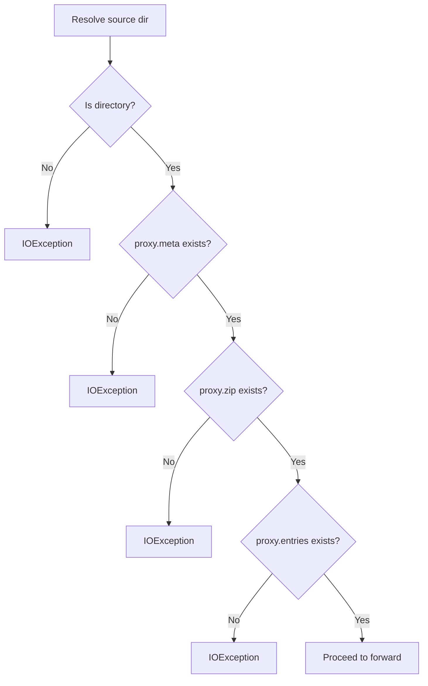

# Detailed Design — Forward Stage

[← Back to master](detailed-design.md)

## 1. Purpose

The forward stage sends fully aggregated data to one or more downstream Stroom instances. It is the terminal stage of the pipeline — it has no output queue. It supports both single-destination and multi-destination (fan-out) forwarding via a pluggable `FileGroupForwarder` interface.

## 2. Class Diagram



## 3. Constructor Parameters

### ForwardStageProcessor

| Parameter | Type | Required | Description |
|---|---|---|---|
| `fileStoreRegistry` | `FileStoreRegistry` | Yes | Resolves input message locations |
| `fileGroupForwarder` | `FileGroupForwarder` | Yes | Pluggable forwarding adapter |

### ForwardStageFanOutForwarder

| Parameter | Type | Required | Description |
|---|---|---|---|
| `destinations` | `List<Destination>` | Yes (≥1) | Target destinations |
| `producerId` | `String` | Yes | Node identifier for provenance |
| `producingStage` | `String` | No | Defaults to `"forwardFanOut"` |

### Destination (Record)

| Field | Type | Description |
|---|---|---|
| `name` | `String` | Logical destination name |
| `fileStore` | `FileStore` | Destination-owned file store |
| `queue` | `FileGroupQueue` | Destination forwarding queue |

## 4. Single-Destination Sequence



In production single-destination mode, the `FileGroupForwarder` is wired as:
```java
(message, sourceDir) -> forwarder.add(sourceDir)
```

## 5. Fan-Out (Multi-Destination) Sequence



### Fan-Out Durability

The critical ordering is:
1. Copy to **all** destination stores and publish **all** destination messages
2. **Then** delete input (done by `ForwardStageProcessor`)
3. **Then** acknowledge input message (done by `FileGroupQueueWorker`)

If a crash occurs after some destinations but not all, the input message is redelivered. Some destinations may receive duplicates (at-least-once), but no destination misses data.

## 6. Destination Message Attributes

Fan-out messages include traceability attributes:

| Attribute Key | Value |
|---|---|
| `forwardDestination` | Logical destination name |
| `sourceMessageId` | Original input message ID |
| `sourceQueueName` | Original input queue name |

Plus any attributes from the source message are copied through.

## 7. File Group Validation

Before forwarding, the processor validates that the file group contains all expected files:



This validation catches broken handoffs early — before forwarding rather than after acknowledgement.

## 8. Responsibility Split

| Responsibility | Owner |
|---|---|
| Resolve input location | `ForwardStageProcessor` |
| Validate file group | `ForwardStageProcessor` |
| Copy to destinations | `ForwardStageFanOutForwarder` |
| Publish destination messages | `ForwardStageFanOutForwarder` |
| Delete input from source store | `ForwardStageProcessor` |
| Acknowledge input message | `FileGroupQueueWorker` |
