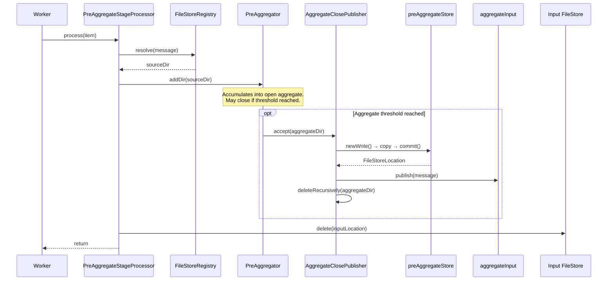
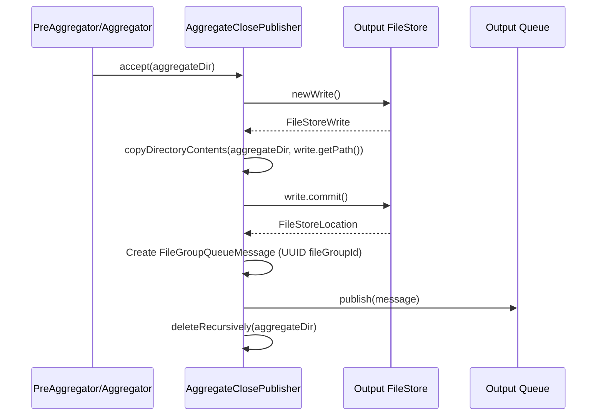
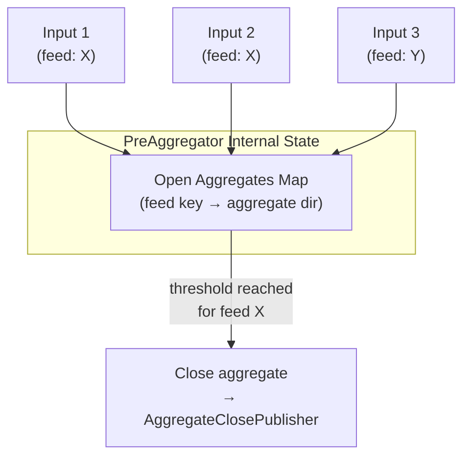

# Detailed Design — Pre-Aggregate Stage

[← Back to master](detailed-design.md)

## 1. Purpose

The pre-aggregate stage accumulates incoming file groups into open aggregates keyed by feed. Aggregates are closed when size/count thresholds or age limits are reached. On closure, the aggregate is written to a file store and a reference message is published to the aggregate input queue.

This stage is **stateful** — it maintains in-memory aggregate state across multiple queue messages, unlike the stateless split-zip and forward stages.

## 2. Class Diagram

```mermaid
classDiagram
    class PreAggregateStageProcessor {
        -FileStoreRegistry fileStoreRegistry
        -PreAggregateFunction preAggregateFunction
        +process(FileGroupQueueItem)
    }

    class FileGroupQueueItemProcessor {
        <<interface>>
        +process(FileGroupQueueItem)
    }

    class PreAggregateFunction {
        <<functional interface>>
        +addDir(Path sourceDir)
    }

    class AggregateClosePublisher {
        -FileStore outputStore
        -FileGroupQueue outputQueue
        -PipelineStageName stageName
        -String sourceNodeId
        +accept(Path aggregateDir)
    }

    class PreAggregator {
        +addDir(Path sourceDir)
        +setDestination(Consumer~Path~)
    }

    PreAggregateStageProcessor ..|> FileGroupQueueItemProcessor
    PreAggregateStageProcessor --> PreAggregateFunction
    PreAggregateStageProcessor --> FileStoreRegistry
    PreAggregator ..|> PreAggregateFunction : "::addDir"
    PreAggregator --> AggregateClosePublisher : destination
    AggregateClosePublisher --> FileStore : preAggregateStore
    AggregateClosePublisher --> FileGroupQueue : aggregateInput
```

## 3. Constructor Parameters

### PreAggregateStageProcessor

| Parameter | Type | Required | Description |
|---|---|---|---|
| `fileStoreRegistry` | `FileStoreRegistry` | Yes | Resolves input message locations |
| `preAggregateFunction` | `PreAggregateFunction` | Yes | Stateful aggregation logic (wraps `PreAggregator::addDir`) |

### AggregateClosePublisher

| Parameter | Type | Required | Description |
|---|---|---|---|
| `outputStore` | `FileStore` | Yes | File store for closed aggregates (`preAggregateStore`) |
| `outputQueue` | `FileGroupQueue` | Yes | Queue for onward messages (`aggregateInput`) |
| `stageName` | `PipelineStageName` | Yes | Stage name for message provenance (`PRE_AGGREGATE`) |
| `sourceNodeId` | `String` | Yes | Node identifier for provenance |

## 4. Processing Sequence



### Step-by-step

1. **Resolve input** — Uses `FileStoreRegistry` to get the source directory from the queue message.

2. **Delegate to PreAggregator** — Calls `preAggregateFunction.addDir(sourceDir)`. The `PreAggregator`:
   - Reads the file group's feed key from the meta file
   - Acquires feed-key-striped locking
   - Adds the data to the open aggregate for that feed key
   - Checks size/count thresholds
   - If thresholds reached, closes the aggregate and calls the destination callback

3. **Aggregate close callback** — The `AggregateClosePublisher`:
   - Copies the aggregate directory into `preAggregateStore`
   - Commits the write
   - Publishes a `FileGroupQueueMessage` to `aggregateInput`
   - Deletes the source aggregate directory

4. **Delete input** — Deletes the consumed input from the source file store.

## 5. AggregateClosePublisher Detail



The `AggregateClosePublisher` is reusable — it's parameterised by stage name so the same class handles both pre-aggregate and aggregate close callbacks. The only differences are the output store, output queue, and stage name used in the message.

## 6. Stateful Nature

Unlike other processors, pre-aggregation is stateful:



- Each feed key maintains an open aggregate directory
- File groups are accumulated into the aggregate for their feed
- Aggregates close when size or count thresholds are met
- A background thread periodically checks for aged aggregates (`closeOldAggregatesThreads`)
- The `PreAggregator` uses feed-key-striped locking for thread safety

## 7. Thread Configuration

| Config Field | Default | Description |
|---|---|---|
| `consumerThreads` | 1 | Workers polling the `preAggregateInput` queue |
| `closeOldAggregatesThreads` | 1 | Background threads that periodically close old aggregates |

## 8. Acknowledgement Contract

Same as all processors — does not call `acknowledge()`/`fail()` directly. The `FileGroupQueueWorker` owns acknowledgement.
