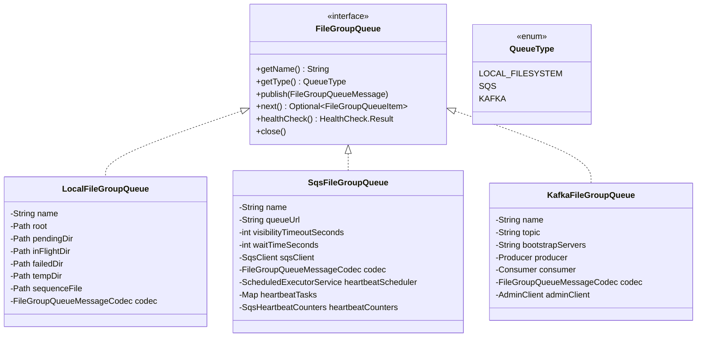
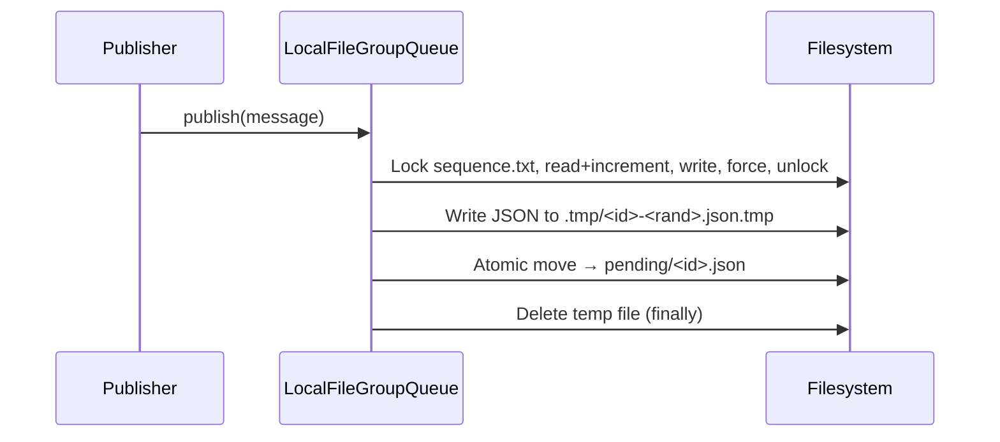
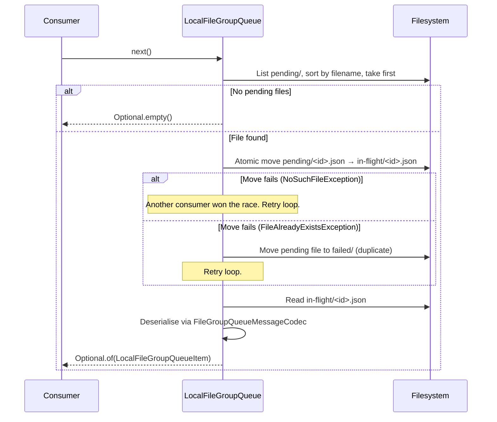
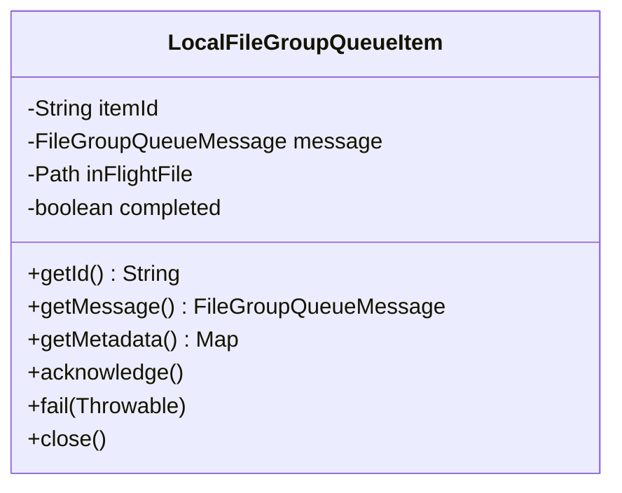
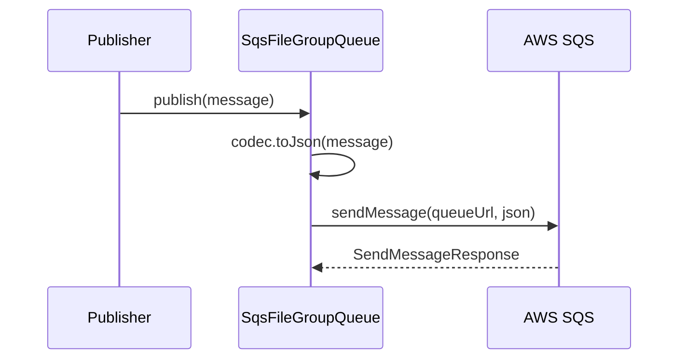
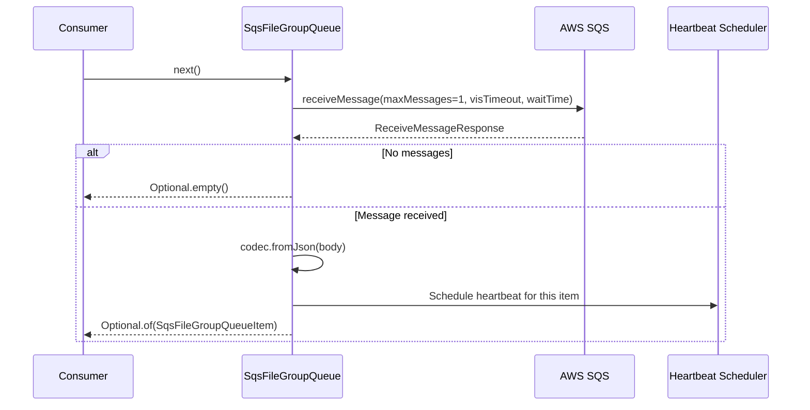
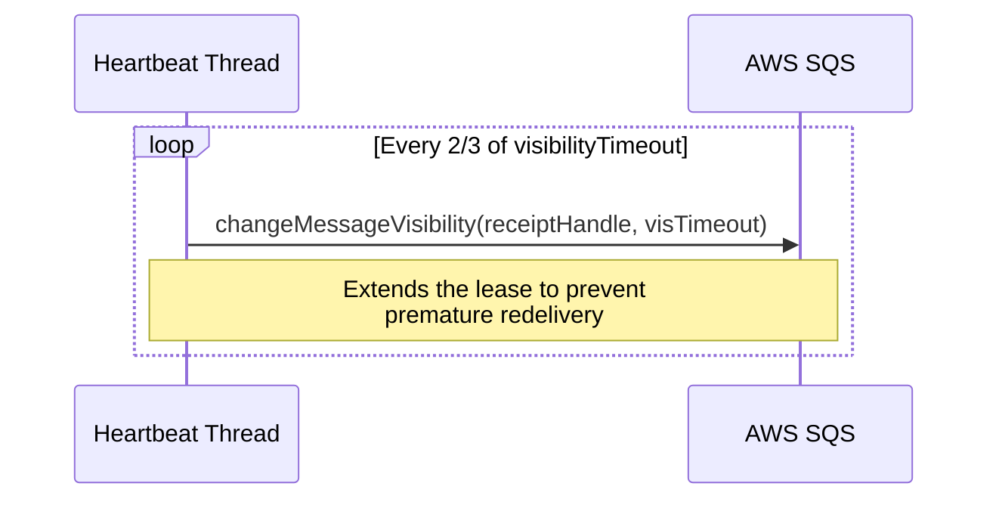
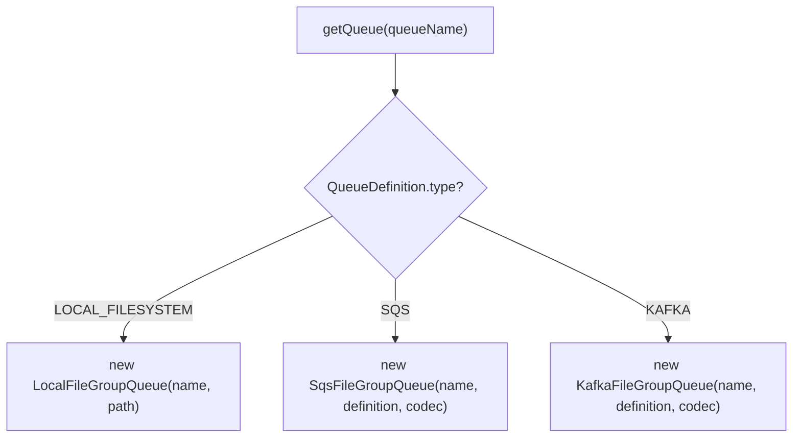

# Detailed Design — Queue Implementations

[← Back to master](detailed-design.md)

## 1. Overview

All queue implementations share the `FileGroupQueue` interface. They transport `FileGroupQueueMessage` instances — lightweight JSON references (~500 bytes) — never moving or mutating the actual file-group data.



---

## 2. LocalFileGroupQueue

### 2.1 Purpose

Filesystem-based queue for single-process deployments, development, and testing. Messages are stored as numbered JSON files.

### 2.2 Directory Layout

```
<queueRoot>/
├── sequence.txt          ← Global sequence counter (file-locked)
├── pending/              ← Messages available to consumers
│   ├── 00000000000000000001.json
│   ├── 00000000000000000002.json
│   └── ...
├── in-flight/            ← Messages leased to consumers
│   └── 00000000000000000003.json
├── failed/               ← Corrupt or duplicate messages
│   ├── 00000000000000000004.duplicate-pending.1714842000000.json
│   └── 00000000000000000004.duplicate-pending.1714842000000.json.error.txt
└── .tmp/                 ← Temp files during publication
```

### 2.3 Publish Flow



Key details:
- **Sequence allocation** uses `FileChannel.lock()` for cross-thread safety
- **Atomic publish** writes to `.tmp/` first, then uses `Files.move(ATOMIC_MOVE)` to `pending/`
- **Sequence width** is 20 digits, zero-padded (`00000000000000000001`)
- The queue validates that `message.queueName()` matches the queue's name

### 2.4 Next (Consume) Flow



- `next()` is **non-blocking** — returns `Optional.empty()` immediately if no messages
- Uses `min()` on filename for FIFO ordering
- Race handling: if another consumer moved the file first, loops to try the next file

### 2.5 LocalFileGroupQueueItem



| Method | Behaviour |
|---|---|
| `acknowledge()` | Deletes the in-flight JSON file |
| `fail(error)` | Moves in-flight file back to `pending/` for retry. Writes `.last-error.txt` alongside. If a pending duplicate exists, moves to `failed/` instead. |
| `close()` | No-op. Unacknowledged items are recovered on queue restart. |

### 2.6 Startup Recovery

On construction, `recoverInFlightMessages()` moves all files from `in-flight/` back to `pending/`. This handles the case where a previous process crashed with leased items. If a pending file with the same name already exists, the in-flight file is moved to `failed/` to prevent duplicates.

### 2.7 Monitoring Methods

| Method | Returns |
|---|---|
| `getApproximatePendingCount()` | Count of `.json` files in `pending/` |
| `getApproximateInFlightCount()` | Count of `.json` files in `in-flight/` |
| `getApproximateFailedCount()` | Count of `.json` files in `failed/` |
| `getOldestPendingItemTime()` | Last-modified time of oldest pending file |

### 2.8 Health Check

Overrides `FileGroupQueue.healthCheck()` to verify:

1. `pending/` directory exists and is writable
2. `in-flight/` directory exists and is writable

If both checks pass, the result includes `pendingCount`, `inFlightCount`, and `failedCount` as detail fields. If either directory check fails, the result is unhealthy with a diagnostic message.

---

## 3. SqsFileGroupQueue

### 3.1 Purpose

AWS SQS-backed queue for distributed deployments with multiple competing consumers.

### 3.2 Configuration

| Field | Default | Description |
|---|---|---|
| `queueUrl` | Required | Full SQS queue URL |
| `visibilityTimeoutSeconds` | 1800 (30 min) | Time before unacked messages reappear |
| `waitTimeSeconds` | 20 (SQS max) | Long-poll wait time |

### 3.3 Publish Flow



### 3.4 Consume Flow



- `next()` uses **SQS long-polling** (blocks up to `waitTimeSeconds`)
- `maxNumberOfMessages` is always 1 to match the `FileGroupQueue` contract

### 3.5 Visibility Heartbeat



- Runs on a single daemon thread named `sqs-heartbeat-<queueName>`
- Interval: `max(1, visibilityTimeout * 2 / 3)` seconds
- Automatically cancelled on `acknowledge()`, `fail()`, or `close()`
- Failures are logged as warnings but don't crash the consumer

### 3.6 SqsFileGroupQueueItem

| Method | Behaviour |
|---|---|
| `acknowledge()` | Stops heartbeat, then `deleteMessage(receiptHandle)` |
| `fail(error)` | Stops heartbeat, then `changeMessageVisibility(receiptHandle, 0)` — makes message immediately available for retry |
| `close()` | Stops heartbeat |

### 3.7 SqsHeartbeatCounters

Thread-safe counters (`LongAdder`) tracking heartbeat operations:

| Counter | Incremented When |
|---|---|
| `attemptCount` | Each visibility extension attempt |
| `successCount` | Successful `changeMessageVisibility` call |
| `failureCount` | Failed visibility extension (exception caught) |
| `cancelledCount` | Heartbeat cancelled on `acknowledge()`/`fail()`/`close()` |

Accessed via `SqsFileGroupQueue.getHeartbeatCounters()`. Exported as Prometheus metrics by `PipelineMetricsRegistrar`.

### 3.8 Health Check

Overrides `FileGroupQueue.healthCheck()` using `GetQueueAttributes` with `ApproximateNumberOfMessages` and `ApproximateNumberOfMessagesNotVisible`. The result includes `queueUrl`, `approximateMessages`, `approximateInFlight`, and `activeHeartbeats` as detail fields. On failure, returns unhealthy with the exception message.

---

## 4. KafkaFileGroupQueue

### 4.1 Purpose

Kafka-backed queue for high-throughput distributed deployments with existing Kafka infrastructure.

### 4.2 Configuration

| Field | Default | Description |
|---|---|---|
| `topic` | Required | Kafka topic name |
| `bootstrapServers` | Required | Comma-separated broker addresses |
| `producer` | `acks=all` | Additional producer properties |
| `consumer` | `group.id=stroom-proxy-<name>` | Additional consumer properties |

### 4.3 Key Design Decisions

- **Record key** = `fileGroupId` → provides partition affinity for related file groups
- **Value** = JSON bytes via `FileGroupQueueMessageCodec`
- **Auto-commit disabled** (`enable.auto.commit=false`) — explicit manual commit on `acknowledge()`
- **Max poll records = 1** to match the single-item `next()` contract
- **Poll timeout** = 100ms (non-blocking-ish)

### 4.4 KafkaFileGroupQueueItem

| Method | Behaviour |
|---|---|
| `getId()` | `"<topic>-<partition>-<offset>"` |
| `acknowledge()` | `consumer.commitSync({TopicPartition → offset+1})` |
| `fail(error)` | No-op (does not commit offset; message redelivered on next poll) |
| `close()` | No-op |

### 4.5 Health Check

Overrides `FileGroupQueue.healthCheck()` using a lazily-created `AdminClient` (double-checked locking with `volatile` field). Calls `describeTopics(topic)` with a 5-second timeout. The result includes `topic` and `partitions` as detail fields. On timeout or failure, returns unhealthy with a diagnostic message. The `AdminClient` is closed when the queue is closed.

---

## 5. FileGroupQueueMessageCodec

Shared JSON serialisation/deserialisation for `FileGroupQueueMessage` used by all queue implementations:

| Method | Description |
|---|---|
| `toBytes(message)` | Serialise to JSON byte array |
| `fromBytes(bytes)` | Deserialise from JSON byte array |
| `toJson(message)` | Serialise to JSON string |
| `fromJson(json)` | Deserialise from JSON string |

Uses Jackson with `@JsonProperty` annotations on the `FileGroupQueueMessage` record.

---

## 6. FileGroupQueueFactory

Creates queue instances from `QueueDefinition` configuration:



Queue instances are cached — the same logical name always returns the same instance.
