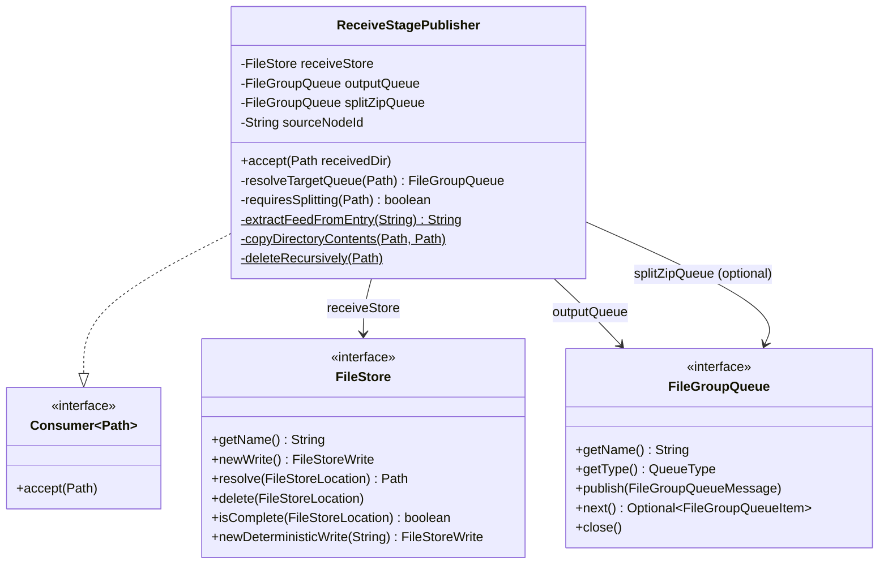
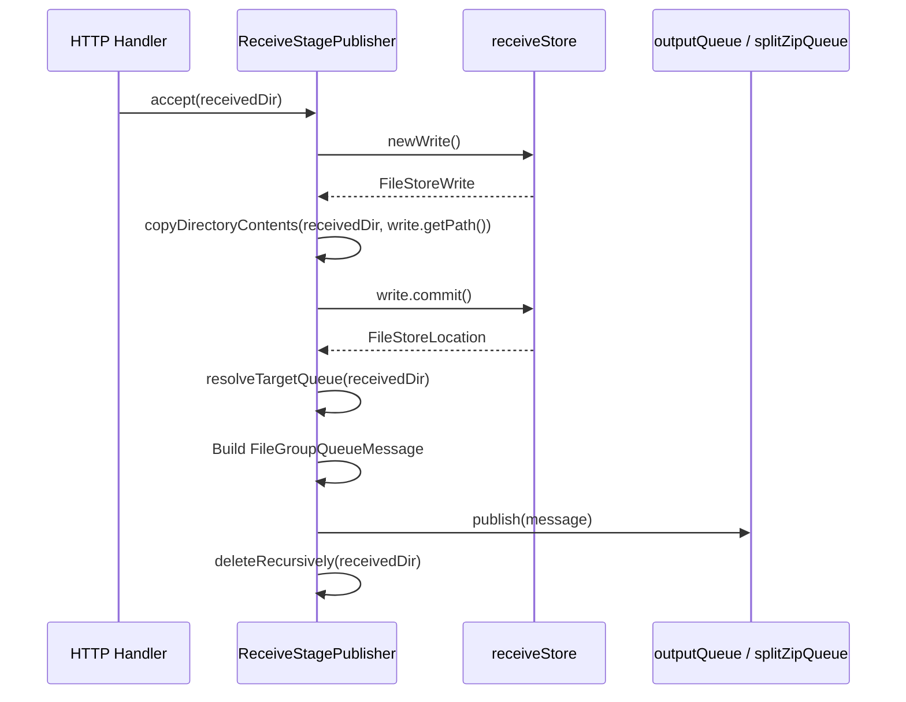
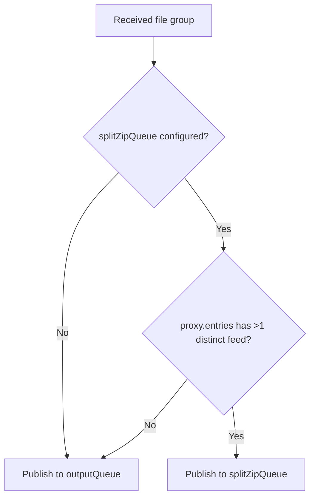
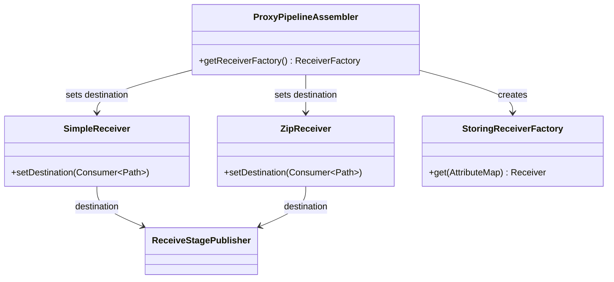

# Detailed Design — Receive Stage

[← Back to master](detailed-design.md)

## 1. Purpose

The receive stage is the entry point of the pipeline. It accepts incoming data via HTTP POST and introduces it into the reference-message pipeline by copying data into a durable file store and publishing a reference message to the next stage's queue.

Unlike all other stages, the receive stage is **not queue-driven** — it is triggered by HTTP requests. It implements `Consumer<Path>` and is set as the `destination` on `SimpleReceiver` and `ZipReceiver`.

## 2. Class Diagram

## 3. Constructor Parameters

| Parameter | Type | Required | Description |
|---|---|---|---|
| `receiveStore` | `FileStore` | Yes | Output file store for received data |
| `outputQueue` | `FileGroupQueue` | Yes | Primary output queue (e.g. `preAggregateInput`) |
| `splitZipQueue` | `FileGroupQueue` | No | Optional queue for multi-feed zips requiring splitting |
| `sourceNodeId` | `String` | Yes | Node identifier for message provenance |

## 4. Processing Sequence

### Step-by-step

1. **Copy to file store** — Opens a new `FileStoreWrite`, copies all files from the temporary receive directory (`proxy.meta`, `proxy.zip`, `proxy.entries`) into the write path, then commits. The commit atomically moves data from the staging area to the stable store and writes a `.complete` marker.

2. **Route decision** — Inspects `proxy.entries` to count distinct feeds. If more than one feed is present and a `splitZipQueue` is configured, the file group is routed to `splitZipQueue`. Otherwise it goes to the primary `outputQueue`.

3. **Publish message** — Creates a `FileGroupQueueMessage` with a new UUID `fileGroupId`, the committed `FileStoreLocation`, and the `receive` producing stage name.

4. **Cleanup** — Recursively deletes the temporary receive directory. The data is now safely in the file store and referenced by the queue message.

## 5. Multi-Feed Routing Logic

The `requiresSplitting()` method reads `proxy.entries` line by line. Each line has format `feed:type` or just `feed`. It extracts the feed portion (before the first colon), counts distinct values using `.distinct().limit(2).count()`, and returns `true` if the count exceeds 1.

If `proxy.entries` is missing or unreadable, splitting is assumed not required (defensive fallback).

## 6. Error Handling

The `accept()` method throws `UncheckedIOException` if any step fails. Because the receive stage is called synchronously from the HTTP handler, the exception propagates to the HTTP response, returning an error to the sender. The sender can retry the POST.

If the process crashes after the file store commit but before the queue publish, the data exists in the file store but is orphaned (no queue message references it). This is a known trade-off — orphaned data can be cleaned up by a background sweep but no data is lost from the sender's perspective because the HTTP response was never sent.

## 7. Integration with HTTP Layer

The `ProxyPipelineAssembler` sets the `ReceiveStagePublisher` as the destination on both `SimpleReceiver` and `ZipReceiver`, then wraps them in a `StoringReceiverFactory`. The servlet layer (`ProxyRequestHandler`) calls `ReceiverFactory.get()` unchanged — it doesn't know about the pipeline.
