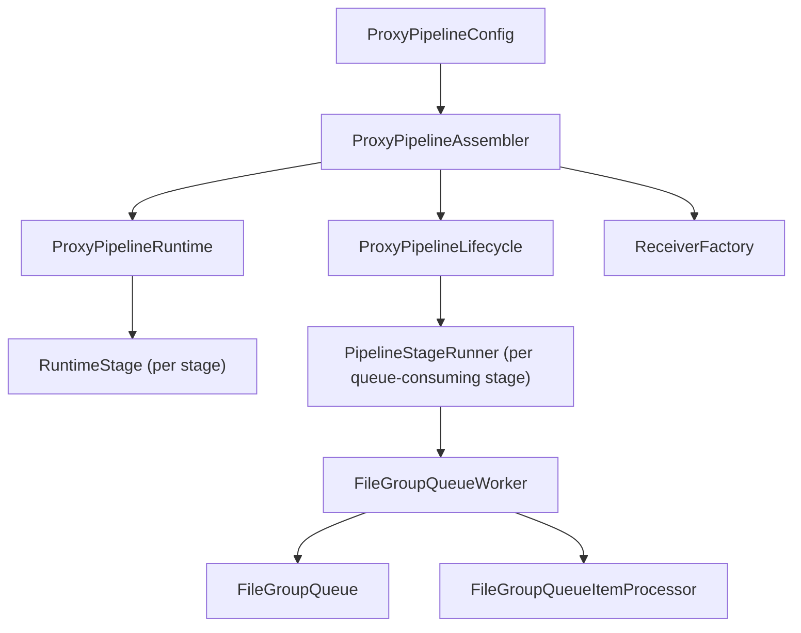
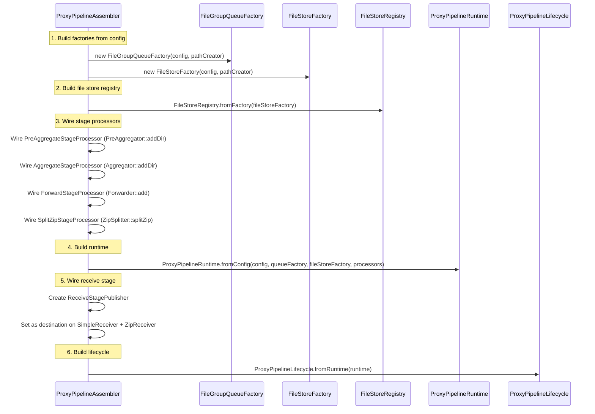
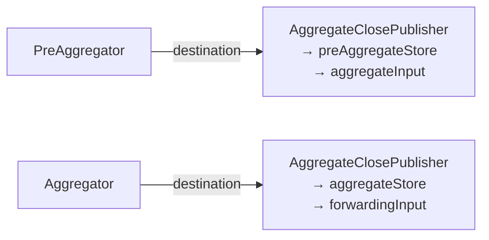
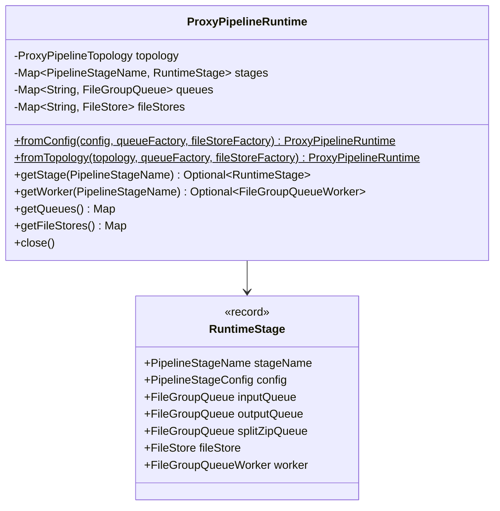
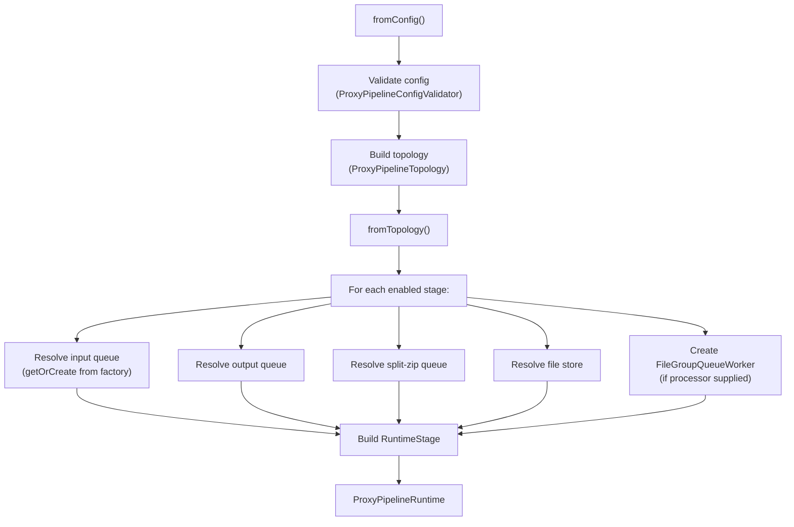
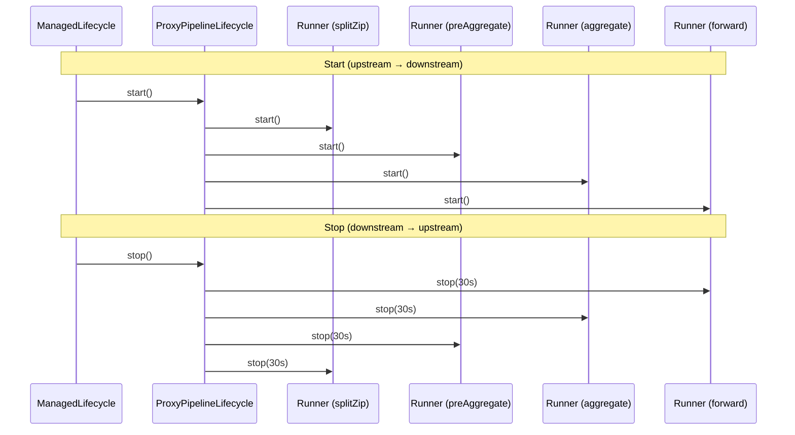
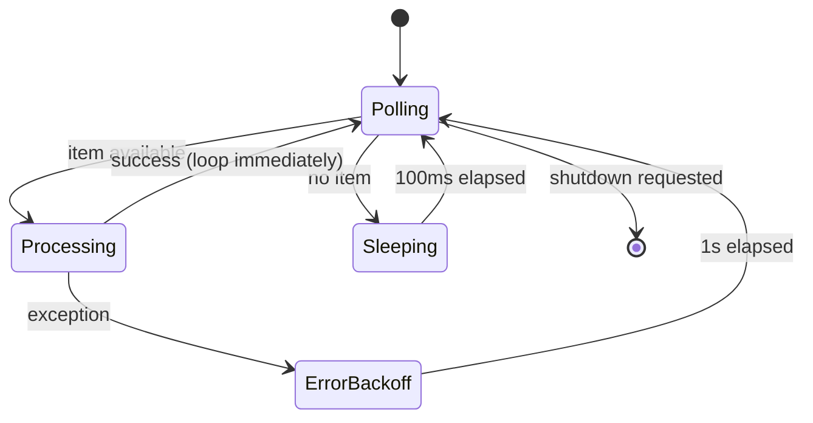
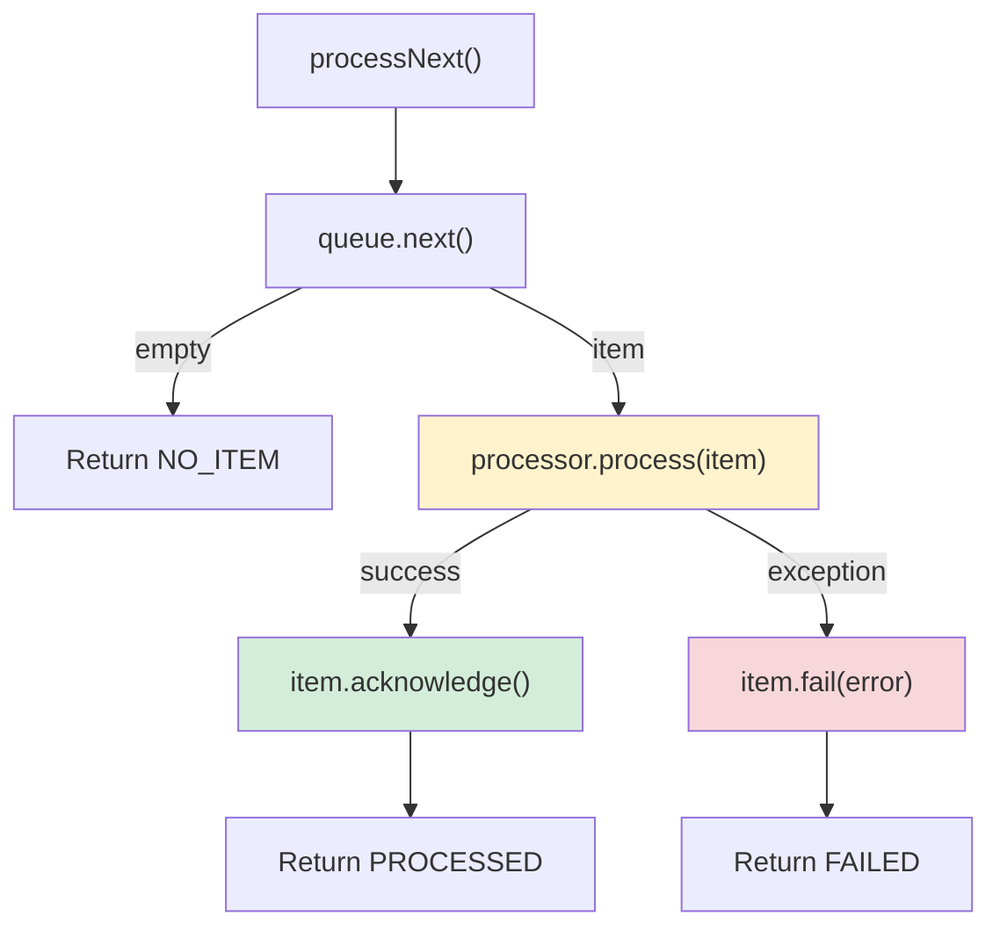
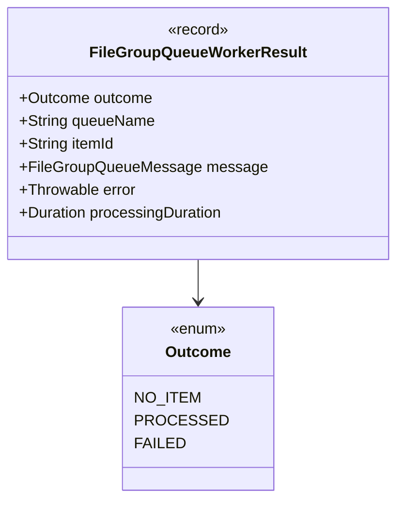
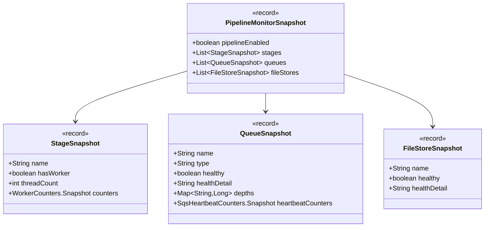

# Detailed Design — Runtime & Lifecycle

[← Back to master](detailed-design.md)

## 1. Overview

The runtime and lifecycle layer assembles the pipeline from configuration, creates queue and file-store instances, wires stage processors to production handlers, and manages the thread lifecycle of queue-consuming stages.

---

## 2. ProxyPipelineAssembler

### 2.1 Purpose

Bridges the new reference-message pipeline to existing production handlers. This is the top-level assembly class that wires everything together.

### 2.2 Assembly Sequence

### 2.3 Stage Processor Wiring

| Stage | Processor | Production Wiring |
|---|---|---|
| **Pre-Aggregate** | `PreAggregateStageProcessor` | `preAggregateFunction` → `PreAggregator::addDir` |
| **Aggregate** | `AggregateStageProcessor` | `aggregateFunction` → `Aggregator::addDir` |
| **Forward** | `ForwardStageProcessor` | `fileGroupForwarder` → `(msg, dir) → forwarder.add(dir)` |
| **Split Zip** | `SplitZipStageProcessor` | `splitFunction` → `ZipSplitter::splitZip` wrapper |

### 2.4 Destination Callback Wiring

Both `PreAggregator` and `Aggregator` have their `destination` (a `Consumer<Path>`) set to an `AggregateClosePublisher`:

### 2.5 Outputs

| Property | Type | Description |
|---|---|---|
| `receiverFactory` | `ReceiverFactory` | For HTTP ingest — `StoringReceiverFactory(simpleReceiver, zipReceiver)` |
| `lifecycle` | `ProxyPipelineLifecycle` | For starting/stopping queue workers |
| `runtime` | `ProxyPipelineRuntime` | Full runtime model |

---

## 3. ProxyPipelineRuntime

### 3.1 Purpose

Immutable runtime model holding the topology, runtime stages, queues, and file stores.

### 3.2 Class Structure

### 3.3 Construction Flow

Queues and file stores are **deduplicated** — if two stages reference the same logical queue/store name, the same instance is shared.

---

## 4. ProxyPipelineLifecycle

### 4.1 Purpose

Manages the start/stop lifecycle of all queue-consuming stage runners.

### 4.2 Start/Stop Sequence

- **Start order**: upstream → downstream
- **Stop order**: downstream → upstream (reverse) — reduces in-flight work by stopping consumers before producers

---

## 5. PipelineStageRunner

### 5.1 Purpose

Manages N consumer threads for a single pipeline stage.

### 5.2 Consumer Loop

### 5.3 Key Properties

| Property | Default | Description |
|---|---|---|
| `threadCount` | From config | Number of consumer threads |
| `emptyPollBackoff` | 100ms | Sleep duration when queue is empty |
| `errorBackoff` | 1s | Sleep duration after unhandled error |

Threads are daemon threads named `stage-<configName>-<n>`.

---

## 6. FileGroupQueueWorker

### 6.1 Purpose

Centralises the queue processing contract. All stages use the same worker, which provides consistent at-least-once semantics, error handling, structured logging, and metrics.

### 6.2 Processing Flow

### 6.3 Counters (FileGroupQueueWorkerCounters)

Thread-safe counters using `LongAdder`:

| Counter | Incremented When |
|---|---|
| `pollCount` | Every call to `processNext()` |
| `emptyPollCount` | Queue returns empty |
| `itemReceivedCount` | Queue returns an item |
| `itemProcessedCount` | `processor.process()` completes without exception |
| `itemAcknowledgedCount` | `item.acknowledge()` succeeds |
| `itemFailedCount` | `item.fail()` succeeds |
| `processorErrorCount` | `processor.process()` throws |
| `acknowledgeErrorCount` | `item.acknowledge()` throws |
| `failErrorCount` | `item.fail()` throws |
| `closeErrorCount` | `item.close()` throws |

### 6.4 MDC Structured Logging

Before calling `processor.process(item)`, the worker sets the following SLF4J MDC keys:

| MDC Key | Source | Description |
|---|---|---|
| `traceId` | `message.traceId()` | End-to-end correlation ID (only set if non-null) |
| `fileGroupId` | `message.fileGroupId()` | Unique file group identifier |
| `messageId` | `message.messageId()` | Queue message ID |
| `stageName` | `queue.getName()` | Pipeline stage name |

All MDC keys are cleared in a `finally` block after processing completes (success or failure).

### 6.5 Result Types

---

## 7. PipelineMonitorProvider

Collects runtime state into an immutable `PipelineMonitorSnapshot` for the admin monitoring endpoint:

The `buildSnapshot()` method now runs `healthCheck()` on each queue and file store, collects queue depths for `LocalFileGroupQueue` instances, and includes `SqsHeartbeatCounters.Snapshot` for SQS queues.

---

## 8. ProxyPipelineManagedLifecycle

Dropwizard `Managed` adapter that calls `lifecycle.start()` on startup and `lifecycle.stop()` on shutdown, integrating the pipeline with the Dropwizard application lifecycle.

---

## 9. PipelineHealthChecks

Aggregated Dropwizard health check implementing `HasHealthCheck`. Registered via `HasHealthCheckBinder` in `ProxyModule` and exposed on the admin `/healthcheck` endpoint.

### 9.1 Behaviour

- When the pipeline is **disabled**: returns healthy with message "Pipeline not enabled"
- When the pipeline is **enabled**: iterates all queues and file stores from the runtime, calling `healthCheck()` on each
- If **all** components are healthy: returns healthy with a components detail map
- If **any** component is unhealthy: returns unhealthy with message "One or more pipeline components are unhealthy" and component-level details

### 9.2 Dependencies

Uses `Provider<ProxyPipelineAssembler>` to lazily access the runtime (queues/stores are created dynamically at assembly time, not at injection time).

---

## 10. PipelineMetricsRegistrar

Registers Codahale gauges for the pipeline runtime. Called from `ProxyCoreModule` immediately after assembler construction. Gauges are bridged to Prometheus format by the existing `PrometheusModule`.

### 10.1 Registered Metrics

| Category | Metrics | Source |
|---|---|---|
| Per-stage items | `items.received`, `items.processed`, `items.acknowledged`, `items.failed` | `FileGroupQueueWorkerCounters` |
| Per-stage errors | `errors.processor`, `errors.acknowledge`, `errors.fail`, `errors.close` | `FileGroupQueueWorkerCounters` |
| Per-stage polls | `polls.total`, `polls.empty` | `FileGroupQueueWorkerCounters` |
| Per-queue depth | `pending`, `inflight`, `failed` | `LocalFileGroupQueue` only |
| Per-queue heartbeat | `heartbeat.attempts`, `heartbeat.successes`, `heartbeat.failures` | `SqsHeartbeatCounters` |

All metrics are prefixed with `stroom.proxy.pipeline.`. Stage metrics include the stage config name; queue metrics include the logical queue name.
