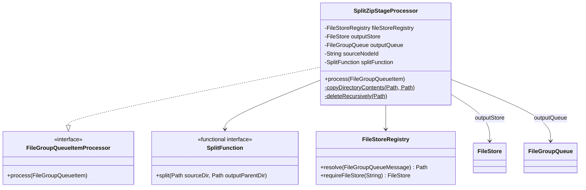
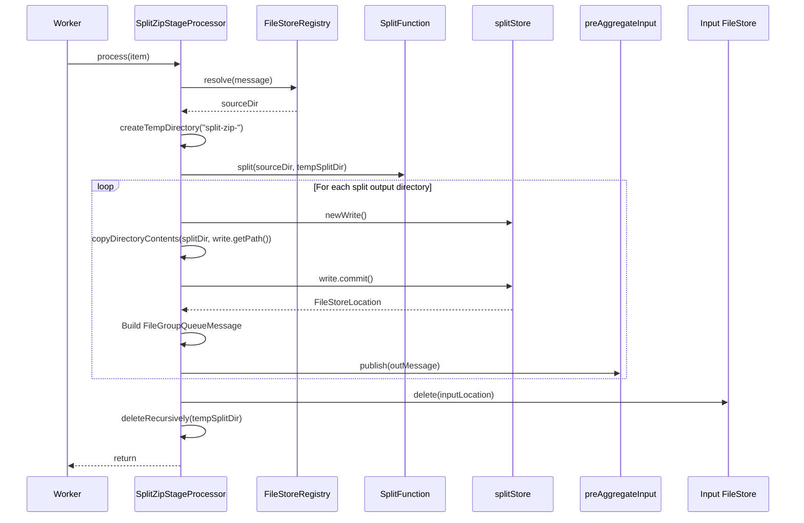
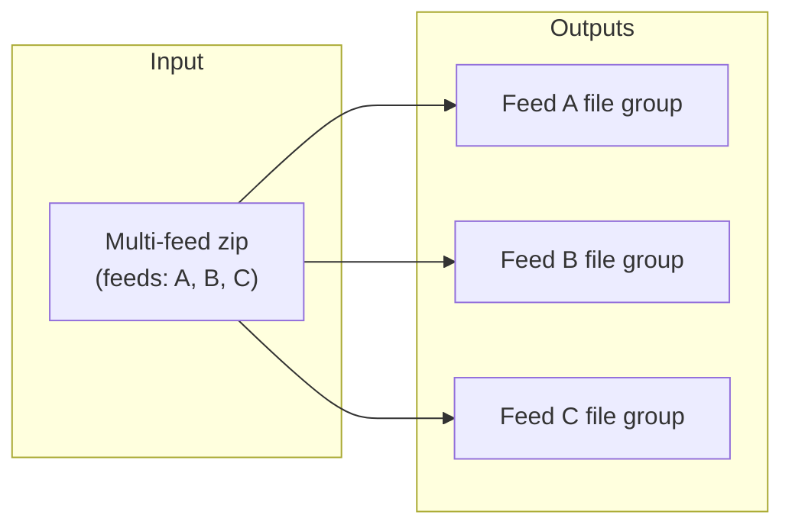

# Detailed Design — Split Zip Stage

[← Back to master](detailed-design.md)

## 1. Purpose

The split zip stage takes multi-feed zip files (file groups containing data from more than one feed) and splits them into one output file group per feed. This ensures downstream aggregation is always per-feed.

This is an **optional** stage — if all incoming data is single-feed, the receive stage routes directly to pre-aggregate, bypassing split zip entirely.

## 2. Class Diagram



## 3. Constructor Parameters

| Parameter | Type | Required | Description |
|---|---|---|---|
| `fileStoreRegistry` | `FileStoreRegistry` | Yes | Resolves input message locations to local paths |
| `outputStore` | `FileStore` | Yes | Output file store for split results (`splitStore`) |
| `outputQueue` | `FileGroupQueue` | Yes | Output queue (`preAggregateInput`) |
| `sourceNodeId` | `String` | Yes | Node identifier for message provenance |
| `splitFunction` | `SplitFunction` | Yes | Pluggable function that performs the actual zip splitting |

## 4. Processing Sequence



### Step-by-step

1. **Resolve input** — Uses `FileStoreRegistry` to resolve the input message's `FileStoreLocation` to a local directory path. Validates it is a directory.

2. **Create temp directory** — Creates a temporary directory for split outputs using `Files.createTempDirectory("split-zip-")`.

3. **Delegate splitting** — Calls `splitFunction.split(sourceDir, tempSplitDir)`. The function writes one child directory per feed into `tempSplitDir`.

4. **Publish each split** — Iterates over child directories of `tempSplitDir`. For each:
   - Opens a `FileStoreWrite` on the output store
   - Copies the split directory contents
   - Commits the write
   - Creates a new `FileGroupQueueMessage` with a fresh UUID and the `splitZip` producing stage
   - Publishes to the output queue

5. **Delete input** — Deletes the consumed input from the source file store (ownership transfer).

6. **Cleanup temp** — Deletes the temporary split directory in a `finally` block.

## 5. SplitFunction — Production Wiring

In production, the `SplitFunction` is wired by `ProxyPipelineAssembler` to delegate to the existing `ZipSplitter`:

```java
(sourceDir, outputParentDir) -> {
    FileGroup fileGroup = new FileGroup(sourceDir);
    AttributeMap attributeMap = new AttributeMap();
    AttributeMapUtil.read(fileGroup.getMeta(), attributeMap);
    Map<FeedKey, List<ZipEntryGroup>> allowedEntries =
        ZipEntryGroup.read(fileGroup.getEntries())
            .stream()
            .collect(Collectors.groupingBy(ZipEntryGroup::getFeedKey));
    ZipSplitter.splitZip(
        fileGroup.getZip(), attributeMap, allowedEntries, outputParentDir);
}
```

This reads the meta file for attributes, groups entries by feed key, and calls the well-tested `ZipSplitter.splitZip()` static method.

## 6. Fan-Out Behaviour

Unlike other stages that produce one output per input, split zip produces **N outputs for 1 input** (one per feed). Each output gets its own `FileGroupQueueMessage` with a unique `fileGroupId` but shares the same `traceId` from the source message for correlation.



## 7. Error Handling

- If the `splitFunction` throws, the exception propagates to the `FileGroupQueueWorker`, which calls `item.fail(error)`. The message is returned to the queue for retry.
- The `finally` block ensures the temporary directory is always cleaned up.
- If some splits have been published but a later split fails, the input message will be retried. Already-published splits may be re-published (at-least-once). Downstream stages handle this via idempotent writes.

## 8. Acknowledgement Contract

The processor does **not** call `item.acknowledge()` or `item.fail()`. The enclosing `FileGroupQueueWorker` owns acknowledgement:
- If `process()` returns normally → worker calls `item.acknowledge()`
- If `process()` throws → worker calls `item.fail(error)`
