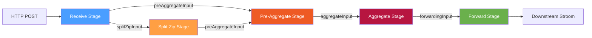
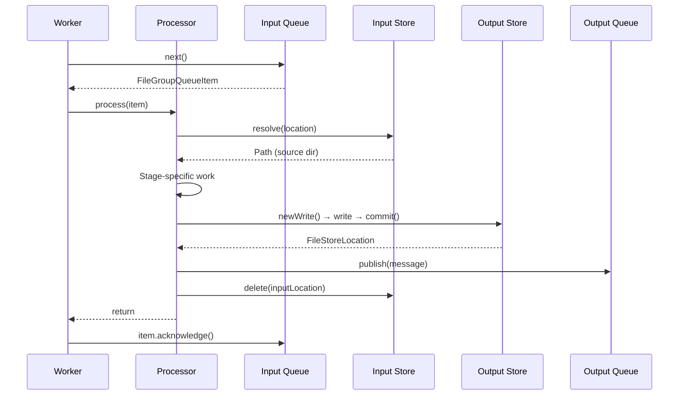
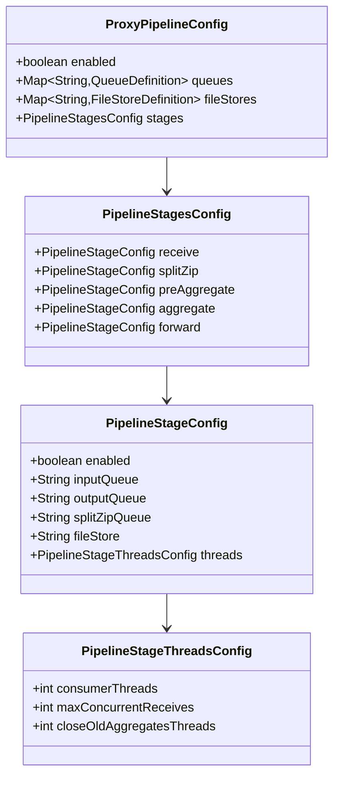
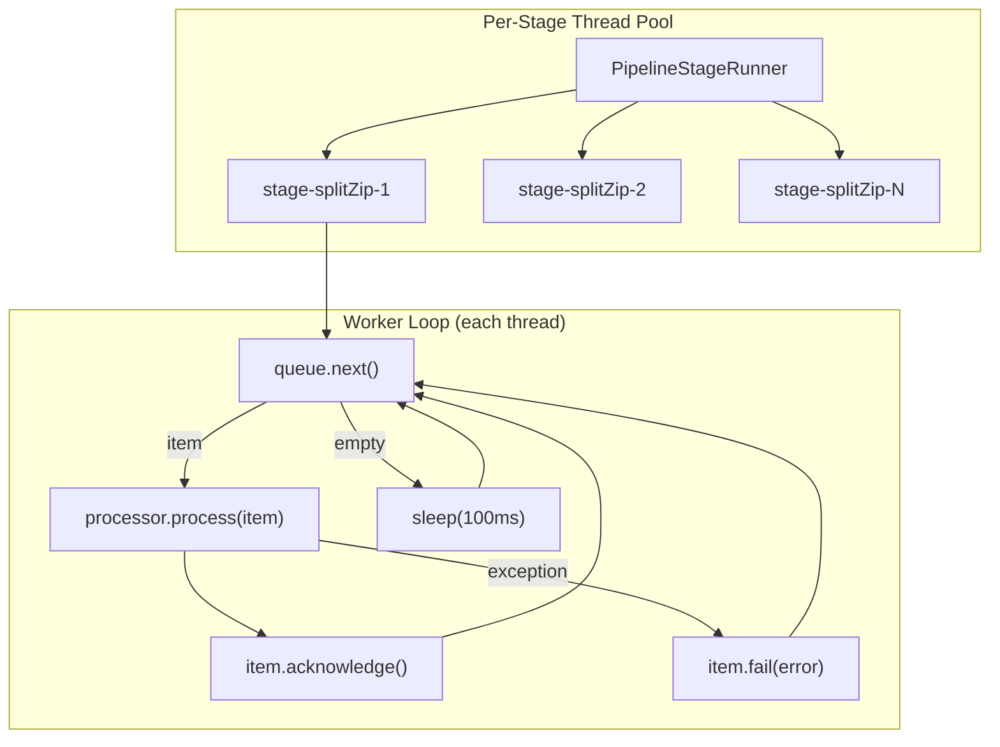

# Stroom Proxy Pipeline — Detailed Design

## 1. Introduction

This document provides a comprehensive technical reference for the Stroom Proxy pipeline architecture. The pipeline is a staged data-processing system that receives, splits, aggregates, and forwards file groups to downstream Stroom instances. Data flows through a sequence of independent stages connected by pluggable queues, with durable file stores providing persistence between stages.

The design prioritises **zero data loss**, **pluggable queue backends**, and **flexible deployment topologies** — from a single-process proxy to a fully distributed cluster.

## 2. High-Level Architecture



### Data Flow Summary

```
HTTP ──► Receive ──► [splitZipInput] ──► SplitZip ──► [preAggregateInput] ──► PreAggregate ──► [aggregateInput] ──► Aggregate ──► [forwardingInput] ──► Forward ──► Downstream
                 └──────────────────────────────────► [preAggregateInput] ──► (single-feed bypass)
```

Each stage:

1. Reads a lightweight **reference message** from its input queue
2. Resolves the referenced file group from a **file store**
3. Performs its stage-specific processing
4. Writes output to its output **file store**
5. Publishes a reference message to its output **queue**
6. Deletes consumed input from the input file store
7. Acknowledges the input queue message

## 3. Core Design Principles

### 3.1 Reference Messages, Not Data Messages

Queue messages are lightweight JSON references (~500 bytes). Actual data lives in file stores. This decouples queue sizing from data volume and allows different queue backends without message-size constraints.

### 3.2 Ownership-Transfer Contract

Every stage follows a strict ordering: **write output → publish message → delete input → acknowledge**. This ensures at-least-once delivery with no data loss. See [§5 Ownership Transfer](#5-ownership-transfer-protocol) for details.

### 3.3 Stage Independence

Each stage only knows its input queue, output queue, and file store. Stages can be enabled/disabled independently, run in separate processes, scaled independently, and use different queue/store backends.

### 3.4 Idempotent Writes

File stores support deterministic write paths (`newDeterministicWrite(id)`) so reprocessing produces the same output path. Combined with `isComplete()` checks, duplicate processing is safe.

## 4. Package Structure

All pipeline classes reside in `stroom.proxy.app.pipeline`. The package contains **51 classes** organised into the following layers:

```mermaid
graph TD
    subgraph "Stage Processors"
        RSP["ReceiveStagePublisher"]
        SZSP["SplitZipStageProcessor"]
        PASP["PreAggregateStageProcessor"]
        ASP["AggregateStageProcessor"]
        FSP["ForwardStageProcessor"]
        FSFOF["ForwardStageFanOutForwarder"]
        ACP["AggregateClosePublisher"]
    end

    subgraph "Worker Infrastructure"
        FGQW["FileGroupQueueWorker"]
        FGQIP["FileGroupQueueItemProcessor"]
        FGQWR["FileGroupQueueWorkerResult"]
        FGQWC["FileGroupQueueWorkerCounters"]
    end

    subgraph "Queue Layer"
        FGQ["FileGroupQueue"]
        LFGQ["LocalFileGroupQueue"]
        SQSFGQ["SqsFileGroupQueue"]
        KFGQ["KafkaFileGroupQueue"]
        FGQM["FileGroupQueueMessage"]
        FGQI["FileGroupQueueItem"]
    end

    subgraph "File Store Layer"
        FS["FileStore"]
        LFS["LocalFileStore"]
        S3FS["S3FileStore"]
        FSW["FileStoreWrite"]
        FSL["FileStoreLocation"]
        FSR["FileStoreRegistry"]
    end

    subgraph "Runtime & Lifecycle"
        PPR["ProxyPipelineRuntime"]
        PPA["ProxyPipelineAssembler"]
        PPL["ProxyPipelineLifecycle"]
        PSR["PipelineStageRunner"]
        PPT["ProxyPipelineTopology"]
    end

    FGQW --> FGQ
    FGQW --> FGQIP
    RSP --> FS
    RSP --> FGQ
    SZSP --> FSR
    PASP --> FSR
    ASP --> FSR
    FSP --> FSR
    PPR --> PPT
    PPL --> PSR
    PSR --> FGQW
```



## 5. Ownership-Transfer Protocol



### Crash Recovery Scenarios

| Crash Point | Recovery Behaviour |
|---|---|
| Before output commit | Input still in queue, redelivered, reprocessed |
| After commit, before publish | Input redelivered; deterministic writes detect existing output |
| After publish, before input delete | Input redelivered; output already exists (idempotent) |
| After delete, before ack | Input redelivered but source gone; fails to dead-letter |

## 6. Detailed Stage Documents

Each stage has its own detailed design document with class diagrams, sequence diagrams, and field-level descriptions:

| Stage | Document |
|---|---|
| **Receive** | [detailed-design-receive.md](detailed-design-receive.md) |
| **Split Zip** | [detailed-design-split-zip.md](detailed-design-split-zip.md) |
| **Pre-Aggregate** | [detailed-design-pre-aggregate.md](detailed-design-pre-aggregate.md) |
| **Aggregate** | [detailed-design-aggregate.md](detailed-design-aggregate.md) |
| **Forward** | [detailed-design-forward.md](detailed-design-forward.md) |

## 7. Infrastructure Documents

| Component | Document |
|---|---|
| **Queues** (Local, SQS, Kafka) | [detailed-design-queues.md](detailed-design-queues.md) |
| **File Stores** (Local, S3) | [detailed-design-file-stores.md](detailed-design-file-stores.md) |
| **Runtime & Lifecycle** | [detailed-design-runtime.md](detailed-design-runtime.md) |

## 8. Key Data Structures

### 8.1 FileGroupQueueMessage (Record)

The universal reference message carried by all queue implementations:

```java
public record FileGroupQueueMessage(
    int schemaVersion,          // Always 1
    String messageId,           // UUID
    String queueName,           // Logical queue name
    String fileGroupId,         // Logical file group identifier
    FileStoreLocation fileStoreLocation,  // Where the data lives
    String producingStage,      // Which stage produced this
    String producerId,          // Which node produced this
    Instant createdTime,        // Creation timestamp
    String traceId,             // Optional correlation ID
    Map<String, String> attributes  // Optional metadata
)
```

### 8.2 FileStoreLocation (Record)

A stable URI-based reference to data in a named file store:

```java
public record FileStoreLocation(
    String storeName,           // Logical store name (e.g. "receiveStore")
    LocationType locationType,  // LOCAL_FILESYSTEM or S3
    String uri,                 // file:///... or s3://bucket/key
    Map<String, String> attributes
)
```

### 8.3 FileGroupQueueItem (Interface)

A leased item from a queue with acknowledgement semantics:

| Method | Purpose |
|---|---|
| `getId()` | Queue-specific lease identifier |
| `getMessage()` | The `FileGroupQueueMessage` |
| `getMetadata()` | Queue-implementation diagnostics |
| `acknowledge()` | Confirm successful processing |
| `fail(Throwable)` | Return to queue for retry |
| `close()` | Release local resources |

## 9. Configuration Model



## 10. Thread Model



Each `PipelineStageRunner` manages N daemon threads named `stage-<configName>-<n>`. Threads poll in a loop with 100ms empty-poll backoff (local queues) or long-poll blocking (SQS/Kafka). Errors trigger a 1-second backoff before retrying.
