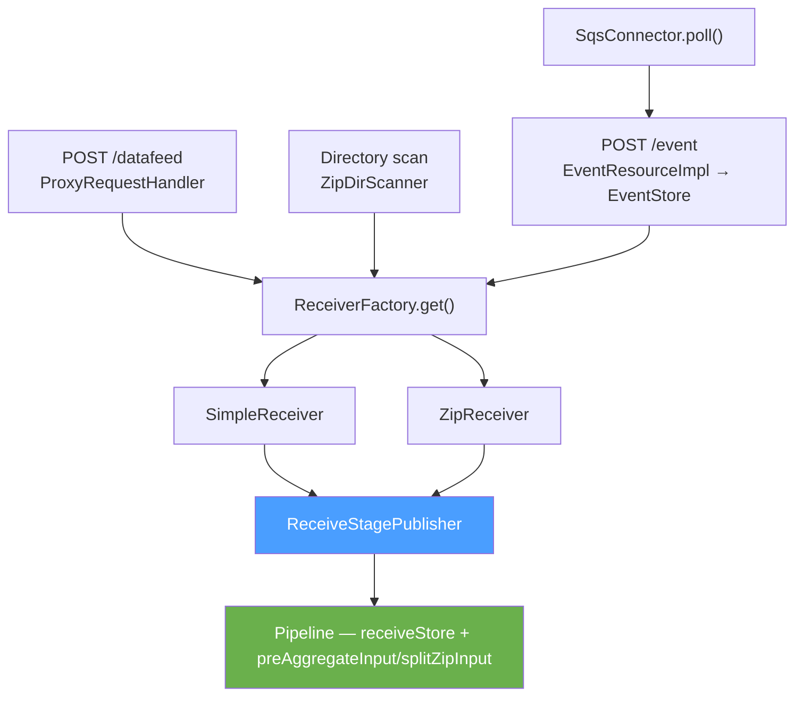

# Detailed Design — Pipeline Entry Points

[← Back to architecture overview](../architecture.md)

## 1. Purpose

[stages/receive.md](../stages/receive.md) documents the receive stage from
`ReceiveStagePublisher` onwards. This document covers what sits in front of it:
the four ways data enters the proxy, and the security contract they share.

All four converge on the same place. `ProxyPipelineAssembler` sets
`ReceiveStagePublisher` as the destination on both `SimpleReceiver` and
`ZipReceiver` and wraps them in a `StoringReceiverFactory`; every entry point
obtains a `Receiver` from that factory and calls `receive()`. Nothing upstream
of that call knows the pipeline exists.

## 2. The Processing-User Contract

**Every entry point must call `receive()` inside
`CommonSecurityContext.asProcessingUser(...)`.** This is an invariant with no
enforcement — a new entry point that omits it will fail at the feed status
lookup rather than at construction.

The reason is that receipt filtering consults feed status, which requires an
identity, and no entry point's own user carries the permission for it:

- **HTTP** authenticates a sender, but that sender has no right to query
  downstream feed status. `ProxyRequestHandler` authenticates first, then
  elevates for the whole receive.
- **Directory scan** has no sender at all — a file on disk carries no
  authenticated identity. The trust boundary is write access to the scanned
  directory.
- **Event store** forwards on a scheduled thread, long after the originating
  request's own elevation has gone out of scope, and also at startup for files
  left behind by a previous run.

The receivers themselves must **not** elevate. `SimpleReceiver` and
`ZipReceiver.filterAllowedEntries()` both carry comments to that effect;
elevating there would mask a missing elevation at a caller and make the
boundary impossible to reason about.

One consequence is worth recording: because the dir-scanner path elevates
unconditionally, a receipt policy that discriminated on *sender identity* would
be vacuous for scanned files. Such a policy would need its own answer for this
path rather than relying on the blanket elevation.

## 3. HTTP Datafeed — `ProxyRequestHandler`

The primary path. Per request it:

1. Builds an `AttributeMap` from the request headers and generates a receipt ID.
2. Authenticates the sender and normalises the declared compression
   (`AttributeMapUtil.validateAndNormaliseCompression`), rejecting unknown
   values with `StroomStatusCode.UNKNOWN_COMPRESSION`.
3. Records content length against `dataReceiptMetrics`. A `Content-Length` of
   zero is logged and skipped — no receiver is created.
4. Elevates to the processing user, resolves a `Receiver` from
   `ReceiverFactory`, and streams the request body into it.
5. Returns `200` with the receipt ID as the response body.

Failures are converted to a `StroomStreamException` and logged via `logStream`,
so the sender receives a Stroom status code rather than a bare stack trace.

`StoringReceiverFactory` picks `ZipReceiver` or `SimpleReceiver` based on the
declared compression, which is what determines whether the receive stage
publishes to `splitZipInput` or straight to `preAggregateInput`.

## 4. Directory Scanning — `ZipDirScanner`

For data placed on disk by another process — a remote store copied in, or an
upstream proxy writing to a shared volume.

`ProxyLifecycle` registers a `"ZIP Dir Scanner"` frequency executor running
every `scanFrequency`. Each `scan()` is `synchronized`, so scans never overlap
even if one runs long.

| `dirScanner` property | Default | Purpose |
|---|---|---|
| `enabled` | `true` | Checked per scan, so it can be toggled at runtime |
| `dirs` | `["zip_file_ingest"]` | Directories to scan |
| `failureDir` | `"zip_file_ingest_failed"` | Where unprocessable groups go |
| `scanFrequency` | `PT1M` | Scan period |

A scanned unit is a *zip group*: a zip file plus its optional sidecar metadata.
`createAttributeMap()` derives the attribute map from the sidecar, then the
whole receive runs under `asProcessingUser`. On success the zip and its
sidecars are deleted; the receiver has already cloned the data into the
pipeline's receive store, so deleting the source is the ownership handoff.

Error handling is layered to keep the scan running: `processZipFile` swallows
per-file exceptions so one bad zip does not halt the directory walk, `scanDir`
swallows per-directory exceptions, and `scan()` swallows everything so the
scheduled executor fires again next period. A scan that found nothing logs at
`DEBUG`; one that processed anything logs counts and duration at `INFO`.

## 5. Event Ingest — `EventStore`

`EventResourceImpl` accepts individual events over REST. Rather than pushing
each event through the pipeline, `EventStore` appends them to open store files
per `FeedKey`, and rolls those files on age or size.

`ProxyLifecycle` registers two executors, of deliberately different kinds:

| Executor | Method | Kind |
|---|---|---|
| `"Event Store - roll"` | `eventStore::tryRoll` | frequency, every `rollFrequency` |
| `"Event Store - forward"` | `eventStore::forwardNext` | parallel, one thread, re-invoked in a loop |

Rolling is periodic, so a frequency executor fits. Forwarding is not: it is a
blocking consumer of the bounded `forwardQueue` that rolling feeds. Each
`forwardNext()` call takes **one** file, forwards it, and returns, leaving the
parallel executor to call it again. An earlier version registered a
`forwardAll()` loop as a *frequency* executor, where the first invocation never
returned and the configured frequency was silently ignored.

Forwarding reconstructs an `AttributeMap` from the `FeedKey` (feed and type
headers) and feeds the file through
`receiverFactory.get(attributeMap).receive(...)` with `"event-store"` as the
request URI. The file is deleted only if `receive()` returned without throwing.

### Rolling must not block inside the appender map

`stores` is a `ConcurrentHashMap<FeedKey, EventAppender>`, and `put`, `tryRoll`
and `roll` all mutate it through `compute()`. Enqueuing a rolled file blocks
once `forwardQueue` is full — that bound is the intended backpressure — so the
enqueue happens *after* `compute()` returns, not inside the remapping function.
`compute()` holds the bin lock for the duration of the function, so blocking
there stalled every other feed hashing to the same bin, and `ConcurrentHashMap`
documents that the function must be short and non-blocking. The pattern is to
capture the rolled file in an `AtomicReference` inside `compute()` and enqueue
it outside. `TestEventStoreRolling` pins this down by asserting a blocked
writer's stack contains `LinkedBlockingQueue.put` but not
`ConcurrentHashMap.compute`.

Startup also processes files left behind by a previous run, which is the second
reason this path elevates explicitly: at that point no request context exists at
all.

## 6. SQS Connector — `SqsConnector`

Not to be confused with `SqsFileGroupQueue`. That is a *pipeline* queue moving
reference messages between stages; `SqsConnector` is an *ingest* path that
consumes application messages from an external SQS queue and writes them into
the event store.

`ProxyLifecycle` creates one connector per entry in `proxyConfig.sqsConnectors`
and registers an `"SQS - poll"` frequency executor for each. `poll()` issues a
`ReceiveMessageRequest` with the configured `waitTimeSeconds` long-poll, and
each message becomes an event in `EventStore` — so this path reaches the
pipeline via §5 rather than directly.

## 7. Adding an Entry Point

A new entry point needs to:

1. Obtain a `Receiver` from `ReceiverFactory` — do not construct `SimpleReceiver`
   or `ZipReceiver` directly, or the pipeline destination will not be wired.
2. Wrap the `receive()` call in `CommonSecurityContext.asProcessingUser(...)`.
3. Build an `AttributeMap` carrying at minimum the feed name; type if known.
4. Only delete or acknowledge its source *after* `receive()` returns normally.
5. Swallow per-item exceptions if it is driven by a scheduled executor, so one
   bad item does not stop the schedule.
