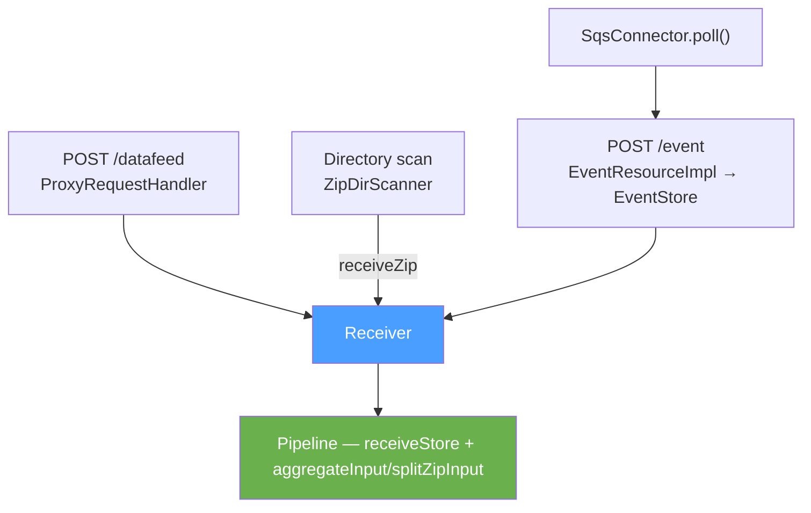

# Detailed Design — Pipeline Entry Points

[← Back to architecture overview](../architecture.md)

## 1. Purpose

[stages/receive.md](../stages/receive.md) documents the receiver. This document covers what sits
in front of it: the four ways data enters the proxy, and the security contract they share.

All four converge on the one `Receiver` bound in Guice - the pipeline's `StoringReceiver`, an
`InstantForwardReceiver` when a forwarder is instant, or a `RefusingReceiver` on a node whose
receive stage is disabled. Every entry point calls `receive()` or, for a zip already on disk,
`receiveZip()`. Nothing upstream of that call knows the pipeline exists.

## 2. The Processing-User Contract

**Every entry point must call `receive()` inside
`CommonSecurityContext.asProcessingUser(...)`.** This is an invariant with no
enforcement — a new entry point that omits it will fail at the feed status
lookup rather than at construction.

The reason is that receipt filtering consults feed status, which requires an
identity, and no entry point's own user carries the permission for it:

- **HTTP** authenticates a sender, but that sender has no right to query
  downstream feed status. `ProxyRequestHandler` authenticates first, then
  elevates for the whole receive.
- **Directory scan** has no sender at all — a file on disk carries no
  authenticated identity. The trust boundary is write access to the scanned
  directory.
- **Event store** receives rolled files on a scheduled thread, long after the
  originating request's own elevation has gone out of scope.

The receiver itself must **not** elevate ([stages/receive.md P6](../stages/receive.md#2-the-contract));
elevating there would mask a missing elevation at a caller and make the
boundary impossible to reason about.

One consequence is worth recording: because the dir-scanner path elevates
unconditionally, a receipt policy that discriminated on *sender identity* would
be vacuous for scanned files. Such a policy would need its own answer for this
path rather than relying on the blanket elevation.

## 3. HTTP Datafeed — `ProxyRequestHandler`

The primary path. Per request it:

1. Builds an `AttributeMap` from the request headers and generates a receipt ID.
2. Authenticates the sender and normalises the declared compression
   (`AttributeMapUtil.validateAndNormaliseCompression`), rejecting unknown
   values with `StroomStatusCode.UNKNOWN_COMPRESSION`.
3. Records content length against `dataReceiptMetrics`. A `Content-Length` of
   zero is logged and skipped — no receiver is created.
4. Elevates to the processing user and streams the request body into the
   `Receiver`.
5. Returns `200` with the receipt ID as the response body.

Failures are converted to a `StroomStreamException` and logged via `logStream`,
so the sender receives a Stroom status code rather than a bare stack trace.

The receiver reads the declared compression to decide whether the body is a
zip; what it publishes to depends on how many feeds the body turns out to hold.

## 4. Directory Scanning — `ZipDirScanner`

For data placed on disk by another process — a remote store copied in, or an
upstream proxy writing to a shared volume.

`ProxyLifecycle` registers a `zip-dir-scanner` schedule with the work registry
running every `scanFrequency`. A schedule never overlaps itself.

| `dirScanner` property | Default | Purpose |
|---|---|---|
| `enabled` | `true` | Checked per scan, so it can be toggled at runtime |
| `dirs` | `["zip_file_ingest"]` | Directories to scan |
| `failureDir` | `"zip_file_ingest_failed"` | Where unprocessable groups go |
| `scanFrequency` | `PT1M` | Scan period |

A scanned unit is a *zip group*: a zip file plus its optional sidecar metadata.
`createAttributeMap()` derives the attribute map from the sidecar, then
`receiveZip()` runs under `asProcessingUser`, reading the zip in place. On
success the zip and its sidecars are deleted; the receiver has already committed
the data to the receive store, so deleting the source is the ownership handoff.

Error handling is layered to keep the scan running: `processZipFile` swallows
per-file exceptions so one bad zip does not halt the directory walk, `scanDir`
swallows per-directory exceptions, and `scan()` swallows everything so the
scheduled executor fires again next period. A scan that found nothing logs at
`DEBUG`; one that processed anything logs counts and duration at `INFO`.

## 5. Event Ingest — `EventStore`

`EventResourceImpl` accepts individual events over REST. Rather than pushing each
event through the pipeline, `EventStore` batches them: `accept` applies the
receipt policy and appends the event to an open file for its `FeedKey`, with the
write forced to disk when `durability` says so, and the sender gets its receipt
id only then. The design in full is [events.md](events.md).

`ProxyLifecycle` registers one schedule with the `WorkRegistry`
([execution.md](execution.md)):

| Name | Method | Kind |
|---|---|---|
| `event-store-roll` | `eventStore::tryRoll` | schedule in `INGRESS`, every `rollFrequency` |

A roll is a receipt. The tick closes every open file that is due - older than
`maxAge`, or at `maxEventCount` or `maxByteCount` - and then hands every closed
file in the directory to the `Receiver` as a plain body with `"event-store"` as
the source, deleting it when `receive()` returns. Nothing is queued in memory,
and nothing is special at start-up: a file a previous run left behind is a closed
file, received on the first tick after a trailing partial line is trimmed. A file
the receiver refuses three times moves to `event/failed/`.

The attribute map the receiver sees is rebuilt from the first event's stored
headers, feed, type and receipt id, so the policy check at roll sees what the
sender sent and the receipt id chain continues. The roll runs as the processing
user, which is the second reason this path elevates explicitly: no request
context exists on the schedule's thread.

`ReceiveDataHelper`, which the resource uses, authenticates the sender, builds
the attribute map with a fresh receipt id, elevates, and maps whatever the store
throws to the status the sender should see. The policy decision is the store's,
so the SQS connector below makes it through the same call.

## 6. SQS Connector — `EventStoreSqsConnector`

Not to be confused with `SqsFileGroupQueue`. That is a *pipeline* queue moving
reference messages between stages; the connector is an *ingest* path that
consumes application messages from an external SQS queue and writes them into
the event store.

`ProxyLifecycle` creates one connector per entry in `proxyConfig.sqsConnectors`
and registers an `sqs-poll` schedule for each, in `INGRESS` before the roll so
that it stops first. `poll()` long-polls with the configured wait, bounded
batches per poll, and for each message builds an attribute map from its
attributes, refuses one with no `Feed`, and calls `EventStore.accept` as the
processing user. Accepted or dropped, the message is deleted. Refused, or failed
for any other reason, it is left on the queue and redelivered by SQS; the bound
on that is the queue's own redrive policy.

## 7. Adding an Entry Point

A new entry point needs to:

1. Inject the `Receiver` — do not construct one, or the wrong one may be
   built for the configuration.
2. Wrap the `receive()` call in `CommonSecurityContext.asProcessingUser(...)`.
3. Build an `AttributeMap` carrying at minimum the feed name; type if known.
4. Only delete or acknowledge its source *after* `receive()` returns normally.
5. Swallow per-item exceptions if it is driven by a scheduled executor, so one
   bad item does not stop the schedule.
