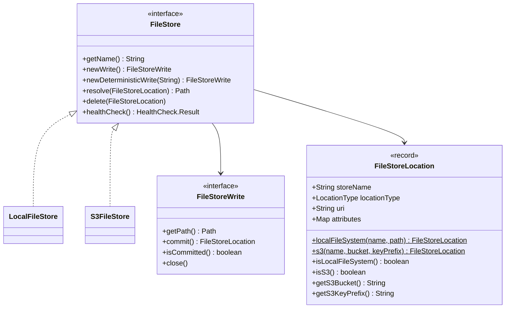
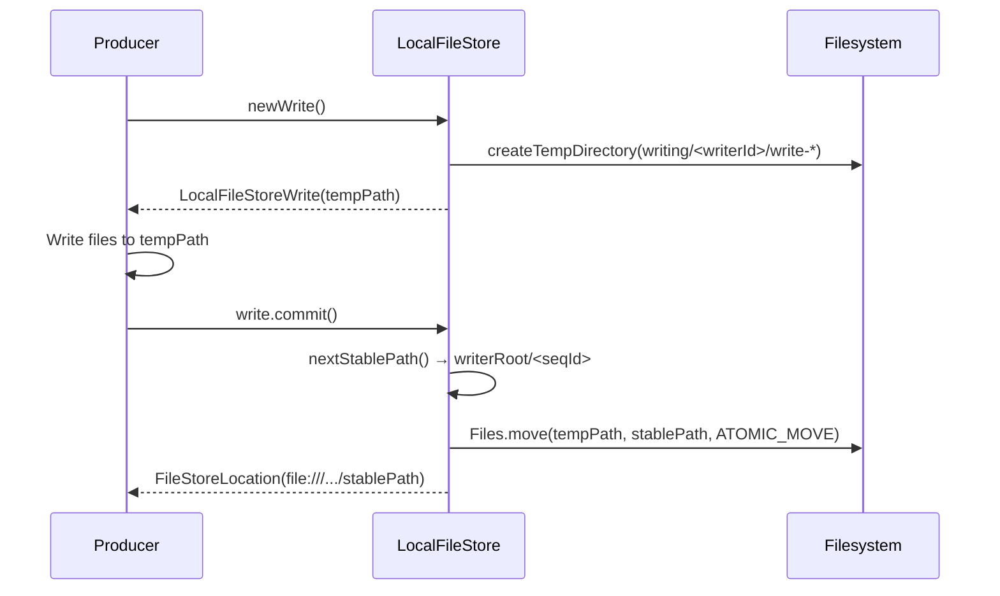
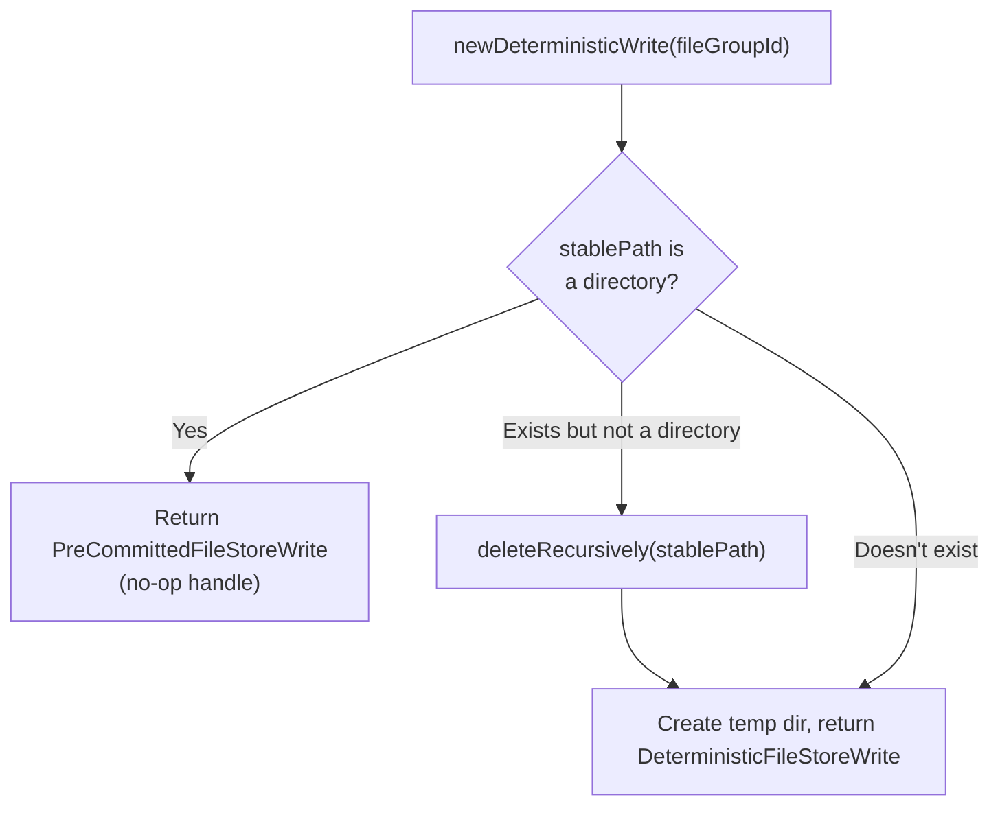
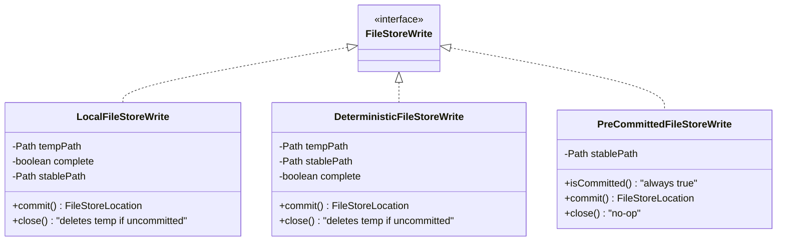
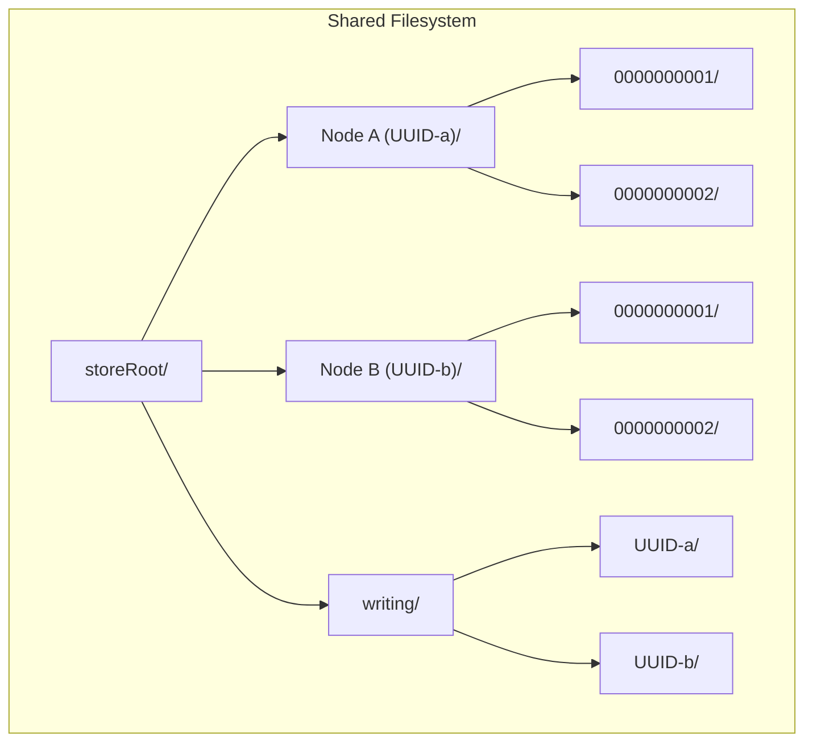
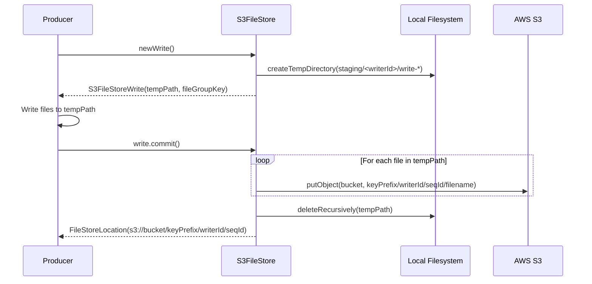
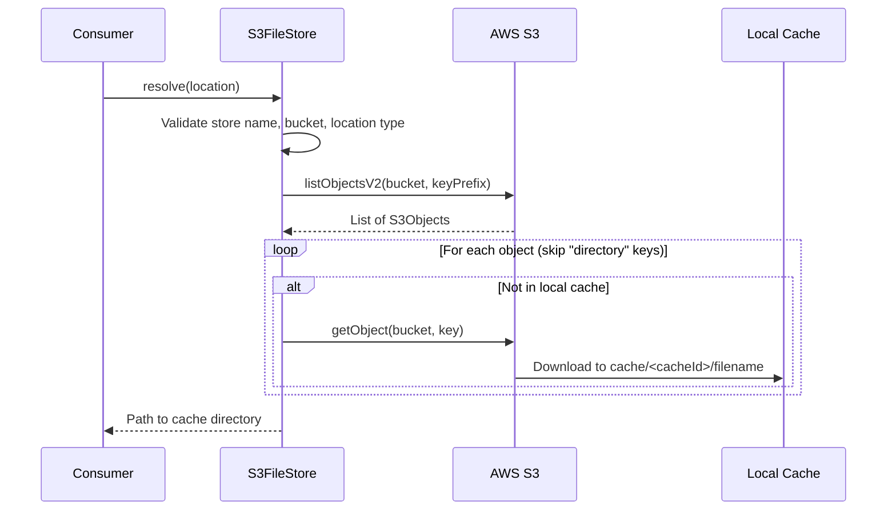
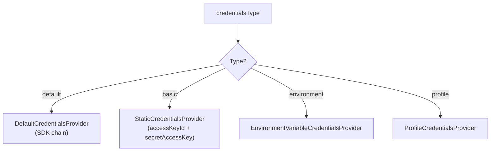
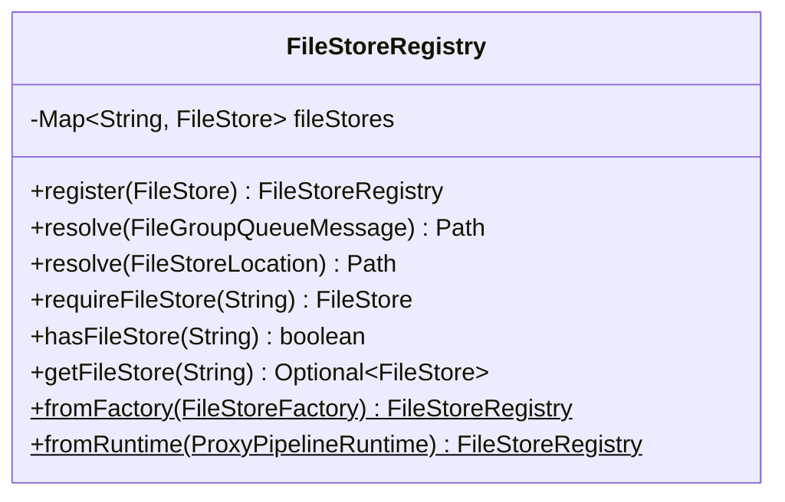
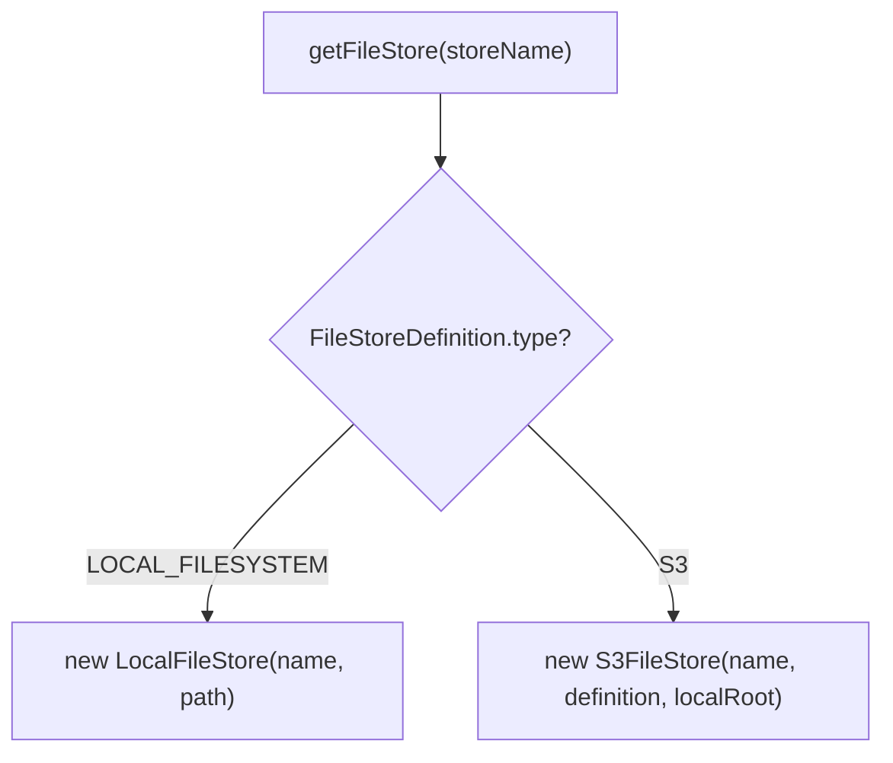

# Detailed Design — File Store Implementations

[← Back to architecture overview](../architecture.md)

## 1. Overview

File stores hold the actual data (file groups: `proxy.meta`, `proxy.zip`, `proxy.entries`). Each stage writes to a named file store. Two backing types are supported: local filesystem and S3.



---

## 2. LocalFileStore

### 2.1 Purpose

Local/shared filesystem implementation. Supports single-node and multi-node deployments with shared filesystems (NFS, EFS, GlusterFS).

### 2.2 Directory Layout

```
<storeRoot>/
├── <writerId>/                    ← Writer directory (UUID per node)
│   ├── 0000000001/                ← Committed file group
│   │   ├── proxy.meta
│   │   ├── proxy.zip
│   │   └── proxy.entries
│   ├── 0000000002/
│   └── ...
└── writing/                      ← Staging area
    └── <writerId>/
        └── write-1234567890/      ← In-progress write
```

### 2.3 Key Fields

| Field | Type | Description |
|---|---|---|
| `name` | `String` | Logical store name |
| `root` | `Path` | Store root directory (absolute, normalised) |
| `writerRoot` | `Path` | `root/<writerId>/` — this node's write directory |
| `tempRoot` | `Path` | `root/writing/<writerId>/` — staging area |
| `sequence` | `AtomicLong` | Monotonic counter for sequential IDs |

### 2.4 Write Flow (Sequential)



Key properties:
- **The move is the commit** — there is no marker file. A directory exists under
  `writerRoot` only once it is complete, so consumers cannot see a partial
  write. `AtomicMoveNotSupportedException` falls back to a non-atomic
  `Files.move`, which weakens that guarantee on filesystems lacking atomic
  rename.
- **Commit is idempotent** — a second `commit()` on the same handle returns the
  same `FileStoreLocation` without repeating the move.
- **Abandoned writes self-clean** — `close()` on an uncommitted handle deletes
  the staging directory.
- **Sequence isolation** — each writer has its own counter, no cross-node
  contention. `nextStablePath()` skips any id whose directory already exists, so
  a counter reset after restart cannot overwrite existing data.

### 2.5 Write Flow (Deterministic)



- **Idempotent** — because commit is an atomic move, a directory at the stable
  path *is* a complete file group. `Files.isDirectory(stablePath)` is therefore
  the whole completeness test, and a pre-committed handle is returned whose
  `commit()` is a no-op. Callers can check `isCommitted()` and skip writing.
- **Stable path** = `writerRoot/<fileGroupId>/`, so the same file group id always
  re-derives the same location on this node.
- Note the writer partitioning means "deterministic" is deterministic *per
  writer*, not globally: two nodes reprocessing the same file group would each
  produce their own copy under their own `writerId`.

### 2.6 Write Handle Types



### 2.7 Resolve

```java
Path resolve(FileStoreLocation location)
```

1. Validates `location.storeName()` matches this store
2. Validates `location.locationType()` is `LOCAL_FILESYSTEM`
3. Converts `file:///...` URI to `Path`
4. Validates the path is within the store root (security check)
5. Returns the absolute path

### 2.8 Delete

```java
void delete(FileStoreLocation location)
```

- Calls `resolve()` for validation
- Refuses to delete the store root or writer root (safety guard)
- Idempotent: if path doesn't exist, returns silently
- Recursively deletes the file group directory and all contents

### 2.9 Multi-Node Write Safety

When multiple proxy nodes share a filesystem, each node writes to its own writer directory:



- Each node has an **independent sequence counter**
- No cross-node contention on sequences
- `FileStoreLocation` carries the full absolute path (including writer ID)
- Consumers resolve any node's data via the complete path in the queue message

### 2.10 Health Check

Overrides `FileStore.healthCheck()` to verify the root and writer directories exist and are writable. Returns healthy with `root` and `writable` detail fields. Returns unhealthy with a diagnostic message if either directory check fails.

---

## 3. S3FileStore

### 3.1 Purpose

AWS S3 (or S3-compatible) implementation for distributed deployments with durable cloud storage.

### 3.2 S3 Object Layout

```
s3://<bucket>/<keyPrefix>/<writerId>/<seqId>/
    proxy.meta
    proxy.zip
    proxy.entries
```

As with the local store there is no marker object. `commit()` uploads the file
group's objects and the presence of objects under the key is what
`newDeterministicWrite()` tests via `hasObjectsInS3()`.

This is a weaker guarantee than the local store's atomic move: S3 has no atomic
multi-object commit, so a crash part-way through `uploadDirectory()` leaves a
partially-uploaded file group that looks complete to a subsequent deterministic
write. In practice the ownership-transfer ordering covers this — the reference
message is only published after `commit()` returns — so a partial upload is
never referenced, and it is left as an orphan rather than being consumed. See
[../future-work.md §9](../future-work.md#9-orphaned-file-cleanup).

### 3.3 Local Directory Layout

```
<localRoot>/
├── staging/                  ← Upload staging
│   └── <writerId>/
│       └── write-*/           ← Files before upload
└── cache/                    ← Download cache
    └── <cacheId>/             ← Cached file groups from S3
```

### 3.4 Key Fields

| Field | Type | Description |
|---|---|---|
| `name` | `String` | Logical store name |
| `bucket` | `String` | S3 bucket name |
| `keyPrefix` | `String` | Key prefix (normalised with trailing `/`) |
| `s3Client` | `S3Client` | AWS SDK S3 client |
| `localStagingRoot` | `Path` | Local staging directory |
| `localCacheRoot` | `Path` | Local download cache |
| `writerId` | `String` | UUID per node |
| `sequence` | `AtomicLong` | Monotonic counter |

### 3.5 Write Flow



### 3.6 Resolve Flow



- `resolve()` rejects a location whose `storeName`, `locationType` or `bucket`
  does not match this store, so a message that crossed stores fails loudly.
- Downloads are cached locally — `if (!Files.exists(localFile))` means a
  redelivered message re-uses whatever was already fetched.
- The cache directory name is the key prefix with `/` replaced by `_`, so it is
  stable across restarts and shared by every resolve of the same file group.
- Nothing evicts the cache; see [../future-work.md §3](../future-work.md#3-s3-streaming-reads).

### 3.7 Delete Flow

1. Lists all objects under the key prefix
2. Deletes each S3 object
3. Cleans up any local cache entry

### 3.8 Credentials



For S3-compatible stores (MinIO, LocalStack), set `endpointOverride` which also enables `forcePathStyle(true)`.

### 3.9 Health Check

Overrides `FileStore.healthCheck()` by:

1. Calling `headBucket(bucket)` to verify S3 connectivity
2. Checking the local staging and cache directories exist and are writable

Returns healthy with `bucket`, `keyPrefix`, and `localStagingWritable` detail fields. Returns unhealthy if the S3 call fails or if local directories are inaccessible.

---

## 4. FileStoreRegistry

Central lookup layer that maps logical store names to runtime `FileStore` instances:



- **Thread-safe** — uses `ConcurrentHashMap`
- **Two-step resolution**: `resolve(message)` → extracts `FileStoreLocation` → looks up store by `storeName` → calls `store.resolve(location)`
- Stage processors use the registry rather than holding direct file store references for input resolution

---

## 5. FileStoreFactory

Creates file store instances from `FileStoreDefinition` configuration:



File store instances are cached — the same logical name always returns the same instance.
