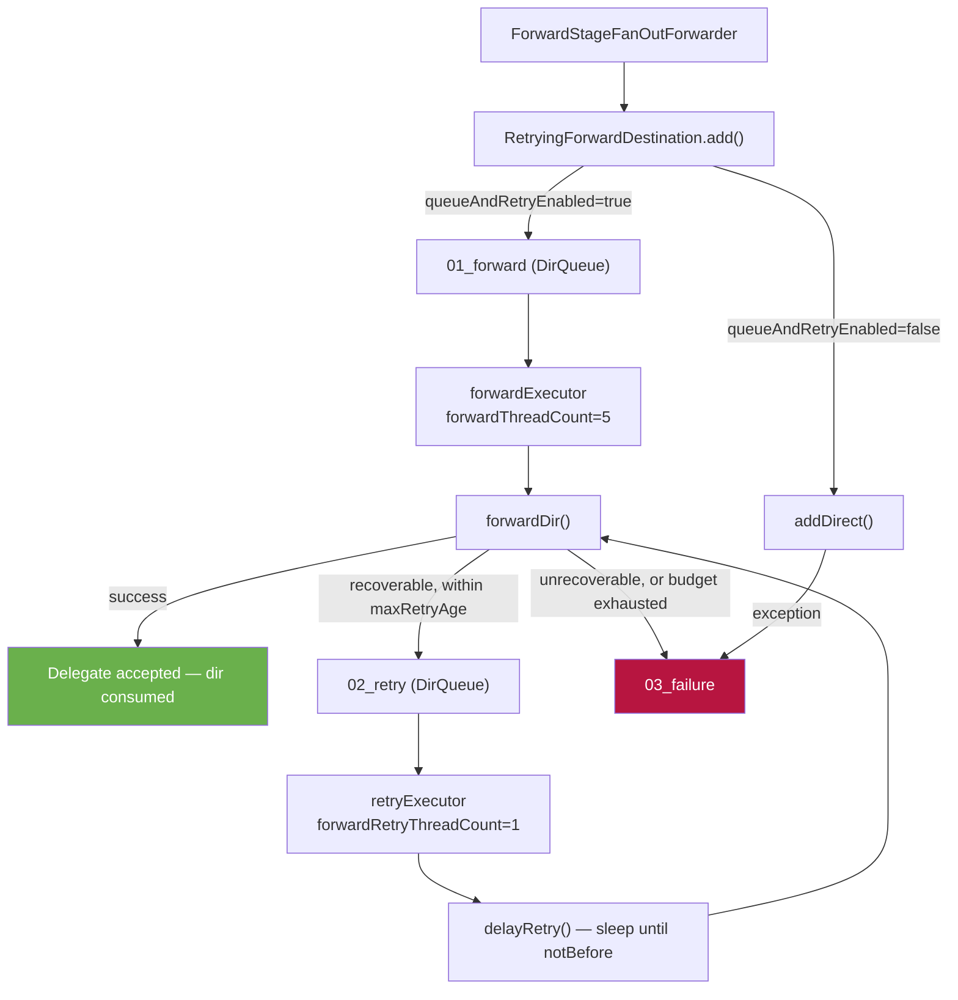

# Detailed Design — Forward Retry & Failure Handling

[← Back to architecture overview](../architecture.md)

## 1. Purpose

The forward stage ([stages/forward.md](../stages/forward.md)) ends when
`ForwardStageFanOutForwarder` hands a file group to a destination. Everything
after that point — the actual network or filesystem write, retry scheduling,
back-off, liveness pausing and terminal failure quarantine — belongs to
`RetryingForwardDestination`, which sits in the handler layer rather than the
pipeline package.

This is deliberate. The pipeline's ownership-transfer contract guarantees a file
group reaches *a* destination durably; it makes no attempt to model "the
downstream Stroom is refusing connections for the next six hours". That is a
per-destination concern with its own persistence, and it predates the pluggable
queue work.

The practical consequence is that a file group leaving the forward stage is
already acknowledged as far as `forwardingInput` is concerned. If forwarding
subsequently fails, the data is **not** returned to the pipeline queue — it is
held in this destination's own retry structure until it succeeds or is
quarantined.

## 2. Two Queue Tiers

The proxy runs two distinct queue mechanisms and it is easy to confuse them:

| | `FileGroupQueue` | `DirQueue` |
|---|---|---|
| Package | `stroom.proxy.app.pipeline.queue` | `stroom.proxy.app.handler` |
| Carries | Reference messages (JSON, ~500 bytes) | Directories, moved in place |
| Spans | Between pipeline stages | Within a single handler |
| Backends | Local filesystem, SQS, Kafka | Local filesystem only |
| Cross-process | Yes (SQS/Kafka) | No |
| Used by | All five stages | `Aggregator`, `PreAggregator`, `Forwarder`, `RetryingForwardDestination` |

`DirQueue` was the transport of the pre-pipeline architecture. It survives as
the intra-handler work-queue primitive: it allocates monotonically increasing
numbered item directories, adds items by atomic directory move, blocks
consumers on `next()`, recovers whatever is on disk at startup, and reports
read/write positions to `QueueMonitor`. See [data-path.md](../data-path.md) for
where each tier appears on disk.

## 3. Structure

Each forward destination gets its own directory tree under
`<data>/50_forwarding/<safeDestinationName>/`:

```
50_forwarding/<destination>/
  01_forward/    DirQueue — items awaiting their first send attempt
  02_retry/      DirQueue — items awaiting a retry
  03_failure/    ForwardFileDestination — terminal quarantine
```

`<safeDestinationName>` comes from `DirUtil.makeSafeName(destinationName)`, so
destination names containing path-hostile characters are still usable.



Two `ParallelExecutor`s registered with `ProxyServices` drive the two queues —
`"forward - <destination>"` and `"retry - <destination>"` — each wrapping a
`DirQueueTransfer` that pulls from its queue and applies `forwardDir` or
`retryDir` respectively.

## 4. Queue-and-Retry vs Direct

`add()` branches on `ForwardQueueConfig.isQueueAndRetryEnabled()` (default
`true`):

- **Queued** (`addWithQueueAndRetry`) — the source directory is moved into
  `01_forward` and the caller returns immediately. The caller is isolated from
  any delegate failure. This is what makes forwarding asynchronous with respect
  to the pipeline.
- **Direct** (`addDirect`) — the delegate is called inline. On exception the
  directory goes straight to `03_failure`; there is no retry. Useful for
  repeater-style deployments where the sender should learn about failure rather
  than have the proxy hold data.

## 5. Failure Classification

`forwardDir()` catches the delegate exception, appends a line to the file
group's `error.log`, and then decides whether the item may be retried:

1. **Is the error recoverable?** If the exception is a `ForwardException`, its
   `isRecoverable()` decides. Anything else is assumed recoverable.
2. **Is retrying enabled at all?** If `maxRetryAge` is zero, no retry state
   file is created and the item fails immediately.
3. **Has the attempt ceiling been hit?** `RetryState.MAX_ATTEMPTS` is
   `Short.MAX_VALUE` (32767) — a structural bound from the state file's binary
   layout, not a tuning knob.
4. **Is the item still within its retry budget?** The time since the *first*
   attempt must be less than `maxRetryAge`.

Recoverable and within budget → `02_retry`. Otherwise →
`moveToFailureDestination()`, which deletes the now-useless binary
`retry.state` file (the human-readable `error.log` is kept) and moves the
directory to `03_failure`.

Note that the age budget is measured from the first attempt, not the last, so a
destination that is down for longer than `maxRetryAge` quarantines its backlog
rather than retrying indefinitely.

## 6. Per-File-Group State

Two sidecar files travel with the file group directory:

| File | Format | Purpose |
|---|---|---|
| `error.log` | Text, append-only | One timestamped line per failed attempt: exception class, message with newlines flattened. Survives into `03_failure`. |
| `retry.state` | Binary | Attempt count and first/last attempt timestamps. Deleted when the item is quarantined. |

Keeping retry state on disk beside the data means the schedule survives restart:
a proxy that comes back up mid-back-off resumes the same delay curve rather than
restarting it.

## 7. Back-Off Schedule

`delayRetry()` computes when an item may next be attempted:

```java
retryDelayMs = retryDelayGrowthFactor > 1
    ? min(retryDelay * pow(retryDelayGrowthFactor, attempts), maxRetryDelay)
    : retryDelay;
notBefore = lastAttempt + retryDelayMs;
```

With the default `retryDelayGrowthFactor` of `1` the delay is flat. Setting it
above `1` produces exponential back-off, capped by `maxRetryDelay` — but note
that `maxRetryDelay` also defaults to 10 minutes, the same as `retryDelay`, so
raising the growth factor alone changes nothing. Raise both together.

The wait is a sleep loop in one-second slices, re-checking
`proxyServices.isShuttingDown()` and the thread interrupt flag each time, so a
shutdown during a long back-off is not blocked by it. If shutdown is detected
after the delay, `retryDir()` throws rather than attempting the send.

This is a head-of-line-blocking design: `02_retry` is a FIFO `DirQueue`, so a
retry thread sleeping on the item at the head holds up items behind it even if
their delays have already elapsed. With `forwardRetryThreadCount` defaulting to
`1`, a single long back-off stalls the whole retry queue for that destination.
There is a standing `TODO` in the source proposing a looping queue or a
`DelayQueue` to address this; raising `forwardRetryThreadCount` is the current
mitigation.

## 8. Liveness Pausing

If the delegate destination implements a liveness check
(`ForwardDestination.hasLivenessCheck()`), a frequency executor runs it every
`livenessCheckInterval` (default 1 minute). The result is applied to **both**
executors:

```java
forwardExecutor.setPauseState(!isLive);
retryExecutor.setPauseState(!isLive);
```

So a destination known to be down stops consuming its queues altogether rather
than burning through retry attempts — and, since the age budget runs from the
first attempt regardless, a long outage still eventually quarantines. Liveness
is assumed `true` at boot, and transitions are logged at `INFO` (recovery) and
`WARN` (failure).

## 9. Configuration

All knobs live on `ForwardQueueConfig`, subclassed by `ForwardHttpQueueConfig`
and `ForwardFileQueueConfig`:

| Property | Default | Effect |
|---|---|---|
| `queueAndRetryEnabled` | `true` | `false` forwards inline with no retry |
| `forwardDelay` | `PT0S` | Debug/test only — artificial delay before each attempt |
| `retryDelay` | `PT10M` | Base delay between attempts |
| `retryDelayGrowthFactor` | `1` | `>1` gives exponential back-off |
| `maxRetryDelay` | `PT10M` | Ceiling when growth factor applies |
| `maxRetryAge` | `P7D` | Total budget from first attempt; zero disables retry |
| `forwardThreadCount` | `5` | Threads consuming `01_forward` |
| `forwardRetryThreadCount` | `1` | Threads consuming `02_retry` |
| `livenessCheckInterval` | `PT1M` | Liveness poll period |
| `errorSubPathTemplate` | `PathTemplateConfig.DEFAULT` | Subdirectory layout under `03_failure` |

Example — a destination that tolerates a long outage with exponential back-off:

```yaml
forwardHttpDestinations:
  - name: "downstream-stroom"
    forwardUrl: "https://stroom.example.com/stroom/datafeed"
    queue:
      retryDelay: "PT1M"
      retryDelayGrowthFactor: 2
      maxRetryDelay: "PT30M"
      maxRetryAge: "P3D"
      forwardThreadCount: 10
      forwardRetryThreadCount: 4
```

> **`maxRetryDelay` defaults equal to `retryDelay`.** Both default to 10
> minutes, which means raising `retryDelayGrowthFactor` on its own has **no
> effect** — the very first growth step is immediately clamped back to the
> ceiling. Exponential back-off requires raising `maxRetryDelay` too, as the
> example above does.

## 10. Operational Handling of `03_failure`

The failure destination is a `ForwardFileDestinationImpl` writing into
`03_failure` with atomic moves — it is inside the proxy data directory, so a
move rather than a copy is safe. It is registered with `FileStores` under
`"forward - <destination> - failure"`, which is what surfaces it on the admin
monitoring endpoint.

Nothing drains `03_failure` automatically. It is a quarantine, and it will grow
without bound if left alone. Operational handling is manual or external:
inspect `error.log` in each file group to establish the cause, fix the
downstream problem, then move directories back into `01_forward` to replay
them. Monitor its size — see
[operations.md §Monitoring & Observability](../operations.md#monitoring--observability).
