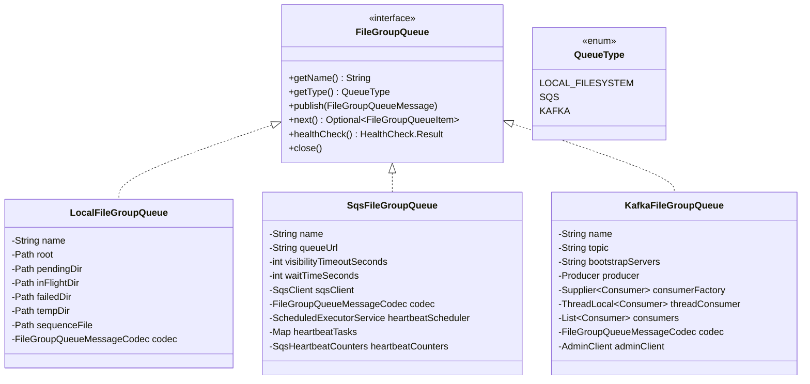
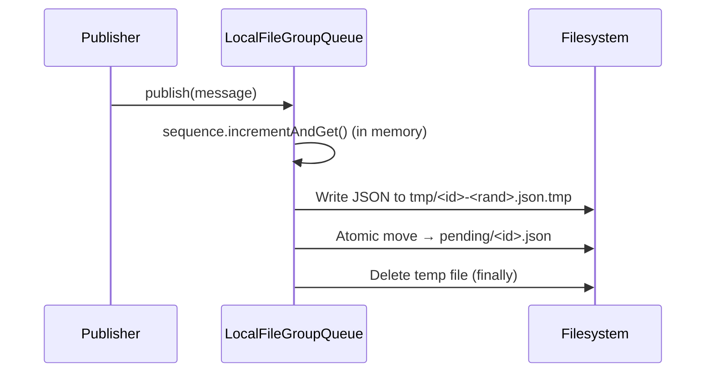
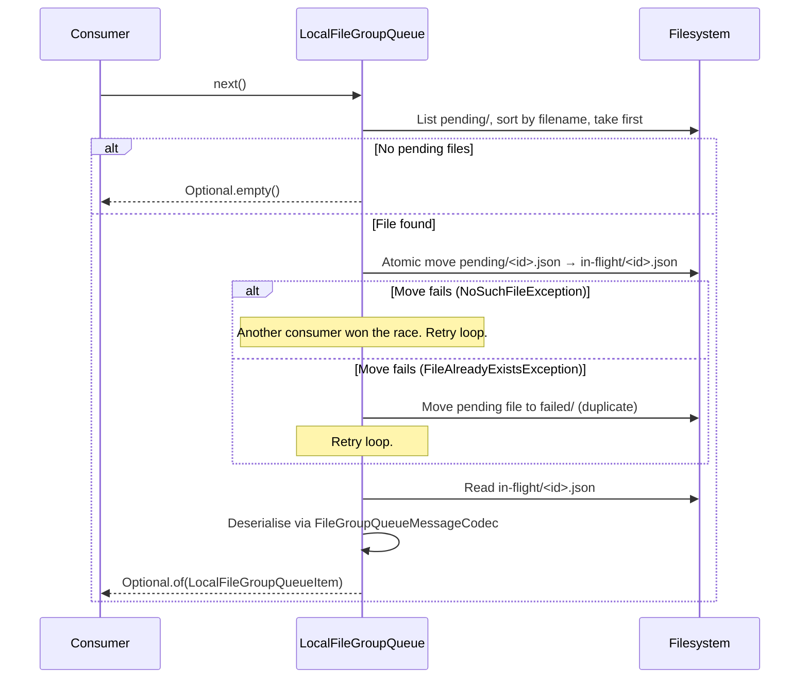
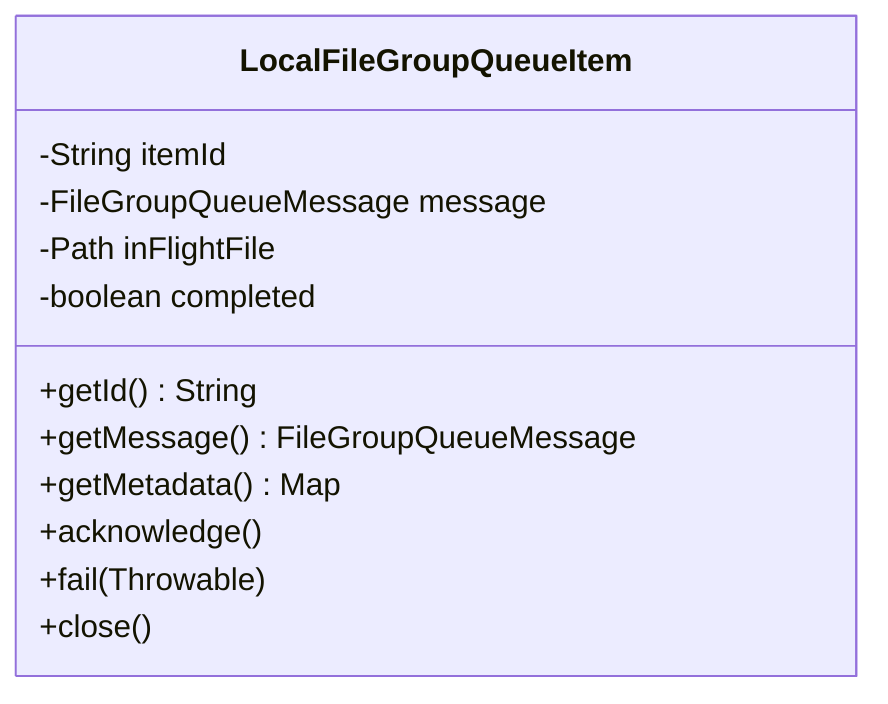
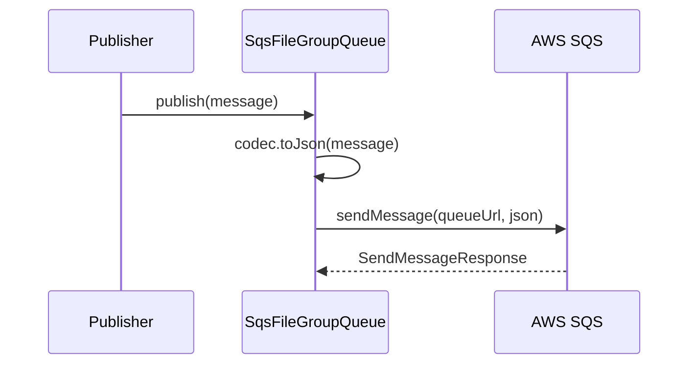
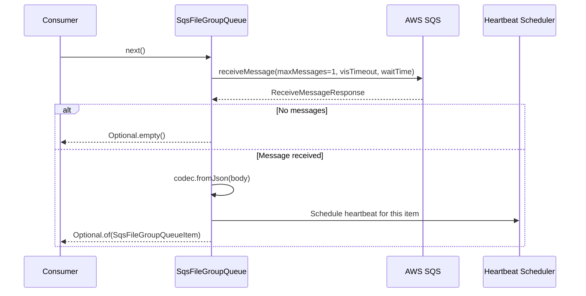
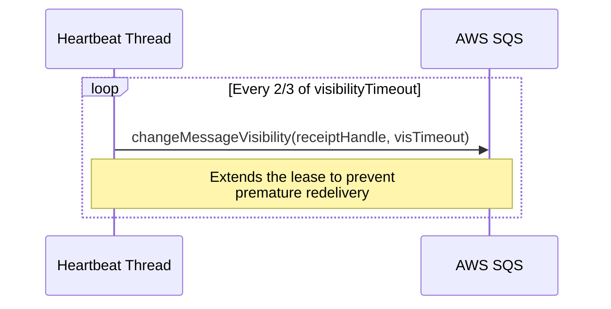
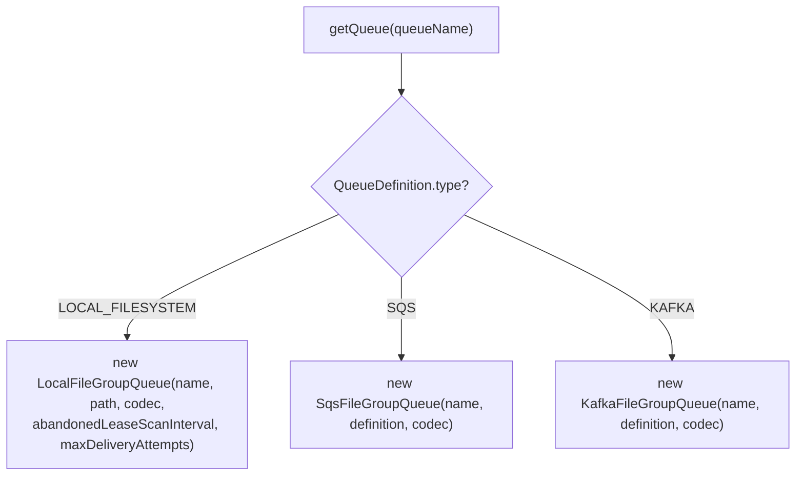

# Detailed Design — Queue Implementations

[← Back to architecture overview](../architecture.md)

## 1. Overview

All queue implementations share the `FileGroupQueue` interface. They transport `FileGroupQueueMessage` instances — lightweight JSON references (~500 bytes) — never moving or mutating the actual file-group data.



---

## 2. LocalFileGroupQueue

### 2.1 Purpose

Filesystem-based queue for single-process deployments, development, and testing. Messages are stored as numbered JSON files.

### 2.2 Directory Layout

```
<queueRoot>/
├── sequence.txt          ← Persisted id counter (a hint; see below)
├── pending/              ← Messages available to consumers
│   ├── 00000000000000000001.json
│   ├── 00000000000000000002.json
│   └── ...
├── in-flight/            ← Messages leased to consumers
│   └── 00000000000000000003.json
├── failed/               ← Corrupt or duplicate messages
│   ├── 00000000000000000004.duplicate-pending.1714842000000.json
│   └── 00000000000000000004.duplicate-pending.1714842000000.json.error.txt
└── tmp/                  ← Temp files during publication
```

### 2.3 Publish Flow



Key details:
- **Id allocation** is an in-memory `AtomicLong.incrementAndGet()` — no file I/O and
  no locking on the publish path. The counter is seeded at construction from the
  greater of the persisted `sequence.txt` value and the highest id found in
  `pending/`, `in-flight/` and `failed/`.
- **`sequence.txt` is a hint, not the source of truth.** It is written on `close()`
  so ids stay monotonic across a clean restart, but correctness does not depend on
  it: a lost, truncated or restored-out-of-step counter is corrected by the
  directory scan. This matters because `ATOMIC_MOVE` silently replaces its target,
  so a reused id would otherwise destroy a queued message with no error.
- **Durable write** — the temp file is written through a `FileChannel` and
  `force(true)`d before the move, so a published message survives power loss and
  not just process death.
- **Collision guard** — publish refuses to overwrite an existing `pending/` file,
  turning any residual id collision into a loud `FileAlreadyExistsException`
  rather than silent data loss.
- **Atomic publish** writes to `tmp/` first, then uses `Files.move(ATOMIC_MOVE)` to `pending/`
- **Sequence width** is 20 digits, zero-padded (`00000000000000000001`)
- The queue validates that `message.queueName()` matches the queue's name

> Allocation was originally guarded by a `FileChannel.lock()` on `sequence.txt`.
> File locks are held per JVM rather than per thread, so a second thread
> publishing to the same queue concurrently threw
> `OverlappingFileLockException` and lost its message. Concurrent publishers are
> now covered by `TestLocalFileGroupQueueConcurrency`.

### 2.4 Next (Consume) Flow



- `next()` is **non-blocking** — returns `Optional.empty()` immediately if no messages
- Uses `min()` on filename for FIFO ordering
- Race handling: if another consumer moved the file first, loops to try the next file

### 2.5 LocalFileGroupQueueItem



| Method | Behaviour |
|---|---|
| `acknowledge()` | Deletes the in-flight JSON file |
| `fail(error)` | Re-queues the message at the back of `pending/` under a new id with an incremented attempt count, or quarantines it in `failed/` once `maxDeliveryAttempts` is reached — see §2.7. |
| `close()` | Releases the lease. Not a substitute for `acknowledge()` or `fail()` — see §2.6. |

### 2.6 Recovering Leased Work

Two mechanisms, for two different ways of losing a consumer.

**On construction**, `recoverInFlightMessages()` moves every file from
`in-flight/` back to `pending/`. This covers a previous process that died while
holding leases. If a pending file with the same name already exists, the
in-flight file goes to `failed/` rather than overwriting it.

**While running**, `reclaimAbandonedLeases()` returns to `pending/` any in-flight
message whose lease is held by no live consumer. This covers the case the
constructor cannot: `FileGroupQueueWorker` logs and rethrows if `acknowledge()`
or `fail()` throws, which leaves the message in `in-flight/` with nobody left to
finish it. Without this the work was not lost, but it stopped until somebody
restarted the proxy.

The lease is claimed before the pending file moves into `in-flight/` — never
after, or a concurrent scan could take an item from a consumer about to start on
it — and released when the item is closed.

This is deliberately **not** a visibility timeout. Being confined to one process,
the queue knows exactly which in-flight messages a live consumer still holds, so
it never has to guess from elapsed time and can never take work from a consumer
that is merely slow. SQS and Kafka, being distributed, have no such option.

| Config key | Type | Default | Description |
|---|---|---|---|
| `abandonedLeaseScanInterval` | Duration | `PT10S` | Minimum gap between scans for abandoned leases |

```yaml
pipeline:
  queues:
    preAggregateInput:
      type: LOCAL_FILESYSTEM
      abandonedLeaseScanInterval: "PT30S"
```

The scan runs only when a poll finds nothing pending, so it costs a directory
listing on an otherwise idle queue and nothing at all on a busy one. Anything it
reclaims is logged at `WARN`: a consumer that neither acknowledges nor fails its
work is a bug somewhere.

Every consumer that sees a pending file claims its lease *before* attempting the
move, because the scan has to be blocked from the instant the in-flight file
could appear. Only the consumer that wins the move owns the lease and may release
it — a loser that released it would erase the winner's claim and hand a live item
straight to the next scan.

### 2.7 Retry and Quarantine

`findNextPendingFile()` always takes the lowest id. Returning a failed message to
`pending/` under its original id therefore put it back at the **head**, so it was
handed straight out again and everything behind it waited. One message the
pipeline could not process was enough to stop a queue completely.

`fail()` now re-queues under a **new** id, at the back, carrying a delivery-attempt
count in the message's attributes (`queue.deliveryAttempts`). The message id and
creation time are preserved, so a retry stays traceable as the same message
rather than looking like a new arrival.

Re-queuing needs a bound to go with it. At-least-once delivery makes
unprocessable messages normal: a message can legitimately reference a file group
that an earlier duplicate already consumed, and no amount of retrying will fix
that. After `maxDeliveryAttempts` the message is moved to `failed/` with the last
error beside it as `<name>.error.txt`, and logged at `ERROR`. That is a
quarantine an operator can inspect and replay, not a deletion.

| Config key | Type | Default | Description |
|---|---|---|---|
| `maxDeliveryAttempts` | int | `100` | Deliveries before a message is quarantined instead of re-queued |

```yaml
pipeline:
  queues:
    forwardingInput:
      type: LOCAL_FILESYSTEM
      maxDeliveryAttempts: 50
```

The replacement is written before the original is removed, so a crash in between
costs a duplicate — which the pipeline tolerates — rather than the loss the other
order would risk.

### 2.8 Monitoring Methods

| Method | Returns |
|---|---|
| `getApproximatePendingCount()` | Count of `.json` files in `pending/` |
| `getApproximateInFlightCount()` | Count of `.json` files in `in-flight/` |
| `getApproximateFailedCount()` | Count of `.json` files in `failed/` |
| `getOldestPendingItemTime()` | Last-modified time of oldest pending file |

### 2.9 Health Check

Overrides `FileGroupQueue.healthCheck()` to verify:

1. `pending/` directory exists and is writable
2. `in-flight/` directory exists and is writable

If both checks pass, the result includes `pendingCount`, `inFlightCount`, and `failedCount` as detail fields. If either directory check fails, the result is unhealthy with a diagnostic message.

---

## 3. SqsFileGroupQueue

### 3.1 Purpose

AWS SQS-backed queue for distributed deployments with multiple competing consumers.

### 3.2 Configuration

These are the keys under `pipeline.queues.<name>`:

| Config key | Type | Default | Description |
|---|---|---|---|
| `queueUrl` | String | **Required** | Full SQS queue URL. Validation fails without it. |
| `visibilityTimeout` | Duration | `PT30M` | Time before an unacknowledged message reappears |
| `waitTime` | Duration | `PT20S` | Long-poll wait time; 20s is the SQS maximum |

```yaml
pipeline:
  queues:
    forwardingInput:
      type: SQS
      queueUrl: "https://sqs.eu-west-2.amazonaws.com/123456789012/proxy-forwarding-input"
      visibilityTimeout: "PT15M"
      waitTime: "PT20S"
```

Both durations are `StroomDuration`, so they are written in ISO-8601 form and
converted to whole seconds for the SDK — `resolveVisibilityTimeout()` and
`resolveWaitTime()` fall back to `DEFAULT_VISIBILITY_TIMEOUT_SECONDS` (1800) and
`DEFAULT_WAIT_TIME_SECONDS` (20) when unset. Internally the class holds them as
the int fields `visibilityTimeoutSeconds` and `waitTimeSeconds`; those are **not**
config keys.

Credentials are not configurable per queue — `SqsClient.create()` uses the
default AWS provider chain (environment, system properties, profile, container
or instance role). This differs from `S3FileStore`, which does accept an
explicit `credentialsType`.

### 3.3 Publish Flow



### 3.4 Consume Flow



- `next()` uses **SQS long-polling** (blocks up to `waitTimeSeconds`)
- `maxNumberOfMessages` is always 1 to match the `FileGroupQueue` contract

### 3.5 Visibility Heartbeat



- Runs on a single daemon thread named `sqs-heartbeat-<queueName>`
- Interval: `max(1, visibilityTimeout * 2 / 3)` seconds
- Automatically cancelled on `acknowledge()`, `fail()`, or `close()`
- Failures are logged as warnings but don't crash the consumer

### 3.6 SqsFileGroupQueueItem

| Method | Behaviour |
|---|---|
| `acknowledge()` | Stops heartbeat, then `deleteMessage(receiptHandle)` |
| `fail(error)` | Stops heartbeat, then `changeMessageVisibility(receiptHandle, 0)` — makes message immediately available for retry |
| `close()` | Stops heartbeat |

### 3.7 SqsHeartbeatCounters

Thread-safe counters (`LongAdder`) tracking heartbeat operations:

| Counter | Incremented When |
|---|---|
| `attemptCount` | Each visibility extension attempt |
| `successCount` | Successful `changeMessageVisibility` call |
| `failureCount` | Failed visibility extension (exception caught) |
| `cancelledCount` | Heartbeat cancelled on `acknowledge()`/`fail()`/`close()` |

Accessed via `SqsFileGroupQueue.getHeartbeatCounters()`. Exported as Prometheus metrics by `PipelineMetricsRegistrar`.

### 3.8 Health Check

Overrides `FileGroupQueue.healthCheck()` using `GetQueueAttributes` with `ApproximateNumberOfMessages` and `ApproximateNumberOfMessagesNotVisible`. The result includes `queueUrl`, `approximateMessages`, `approximateInFlight`, and `activeHeartbeats` as detail fields. On failure, returns unhealthy with the exception message.

---

## 4. KafkaFileGroupQueue

### 4.1 Purpose

Kafka-backed queue for high-throughput distributed deployments with existing Kafka infrastructure.

### 4.2 Configuration

These are the keys under `pipeline.queues.<name>`:

| Config key | Type | Default | Description |
|---|---|---|---|
| `topic` | String | **Required** | Kafka topic name |
| `bootstrapServers` | String | **Required** | Comma-separated broker addresses |
| `producer` | Map | `{}` | Producer property overrides |
| `consumer` | Map | `{}` | Consumer property overrides |

Validation requires **both** `topic` and `bootstrapServers`; supplying one
without the other fails with `QUEUE_DEFINITION_INVALID`.

```yaml
pipeline:
  queues:
    forwardingInput:
      type: KAFKA
      topic: "stroom-proxy-forwarding-input"
      bootstrapServers: "kafka-1.example.com:9092,kafka-2.example.com:9092"
      consumer:
        group.id: "stroom-proxy-forwarding"
      producer:
        compression.type: "lz4"
```

#### Reserved properties

These are set by the queue and **cannot be overridden**. Supplying any of them
under `producer:`/`consumer:` is a `QUEUE_RESERVED_PROPERTY` validation error,
which halts startup:

| Property | Value | Why it is reserved |
|---|---|---|
| `max.poll.records` | `1` | `next()` returns one record per poll and discards the rest of the batch, so anything higher silently skips records until the consumer restarts or rebalances |
| `enable.auto.commit` | `false` | Acknowledgement is explicit; auto-commit would commit offsets for records that have not been processed |
| `key.deserializer` / `value.deserializer` | String / ByteArray | The codec requires a String key and `byte[]` value |
| `acks` | `all` | A weaker setting lets a publish report success before the record is durably replicated, breaking the no-data-loss guarantee at the point the ownership-transfer contract assumes the message is safe |
| `key.serializer` / `value.serializer` | String / ByteArray | Counterpart to the deserialisers |

They were previously applied *before* user overrides, so an override took effect
and was neither honoured visibly nor rejected. They are now applied last as well
as validated, so the built client is correct even if validation is bypassed.

#### Overridable defaults

Set by the queue but yours to change:

| Property | Default | Notes |
|---|---|---|
| `group.id` | `stroom-proxy-<queueName>` | Override when two pipelines share a cluster |
| `auto.offset.reset` | `earliest` | A new consumer group picks up the existing backlog |

Anything not listed above — `security.protocol`, `sasl.*`, `ssl.*`, `fetch.*`,
`session.timeout.ms`, `max.poll.interval.ms`, `compression.type` and so on — is
passed through untouched.

Credentials and TLS are not modelled as first-class config — supply them as
Kafka properties under `producer:`/`consumer:` (`security.protocol`,
`sasl.jaas.config`, and so on). None of those are reserved.

### 4.3 Key Design Decisions

- **Record key** = `fileGroupId` → provides partition affinity for related file groups
- **Value** = JSON bytes via `FileGroupQueueMessageCodec`
- **Auto-commit disabled** (`enable.auto.commit=false`) — explicit manual commit on `acknowledge()`
- **Max poll records = 1** to match the single-item `next()` contract
- **Poll timeout** = 100ms (non-blocking-ish)
- **One consumer per consuming thread** — see below

### 4.3.1 Threading

Each consuming thread gets **its own** `Consumer`, created on that thread's first
`next()` and subscribed to the shared consumer group. Kafka then distributes the
topic's partitions across them, which is the intended way to consume a topic in
parallel. The `Producer` is shared, because `KafkaProducer` is thread-safe.

A single shared consumer would be wrong twice over:

1. `KafkaConsumer` is not thread-safe and throws
   `ConcurrentModificationException` when two threads enter it, so any stage with
   `consumerThreads > 1` failed outright.
2. Even behind a lock it would be unsafe for offsets. `acknowledge()` commits
   `offset + 1`; whichever thread finished first would therefore acknowledge every
   earlier offset, including records other threads were still processing. Those
   records would be lost on restart.

Two consequences worth planning around:

- **Partition count caps parallelism.** Consumers in a group beyond the number of
  partitions are assigned nothing and sit idle, so `consumerThreads` above the
  topic's partition count buys nothing.
- **Subscription is lazy.** The queue joins the consumer group on the first
  `next()` rather than at construction, because consumers are created per thread.

Covered by `TestKafkaFileGroupQueueConcurrency`.

### 4.4 KafkaFileGroupQueueItem

| Method | Behaviour |
|---|---|
| `getId()` | `"<topic>-<partition>-<offset>"` |
| `acknowledge()` | `commitSync({TopicPartition → offset+1})` on the consumer that produced the record |
| `fail(error)` | No-op (does not commit offset; message redelivered on next poll) |
| `close()` | No-op |

### 4.5 Health Check

Overrides `FileGroupQueue.healthCheck()` using a lazily-created `AdminClient` (double-checked locking with `volatile` field). Calls `describeTopics(topic)` with a 5-second timeout. The result includes `topic` and `partitions` as detail fields. On timeout or failure, returns unhealthy with a diagnostic message. The `AdminClient` is closed when the queue is closed.

---

## 5. FileGroupQueueMessageCodec

Shared JSON serialisation/deserialisation for `FileGroupQueueMessage` used by all queue implementations:

| Method | Description |
|---|---|
| `toBytes(message)` | Serialise to JSON byte array |
| `fromBytes(bytes)` | Deserialise from JSON byte array |
| `toJson(message)` | Serialise to JSON string |
| `fromJson(json)` | Deserialise from JSON string |

Uses Jackson with `@JsonProperty` annotations on the `FileGroupQueueMessage` record.

---

## 6. FileGroupQueueFactory

Creates queue instances from `QueueDefinition` configuration:



Queue instances are cached — the same logical name always returns the same instance.
