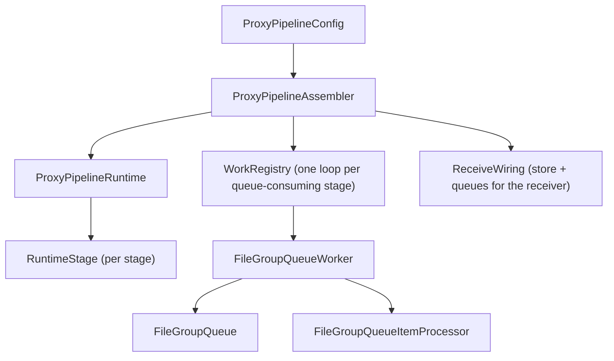
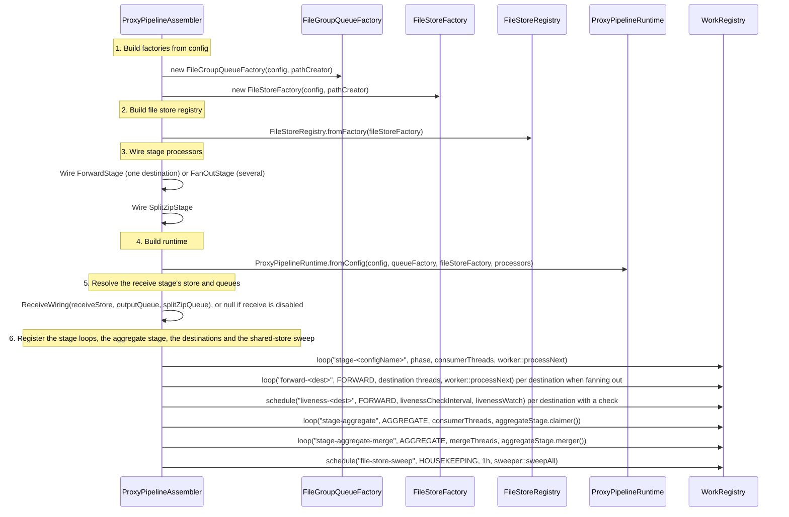
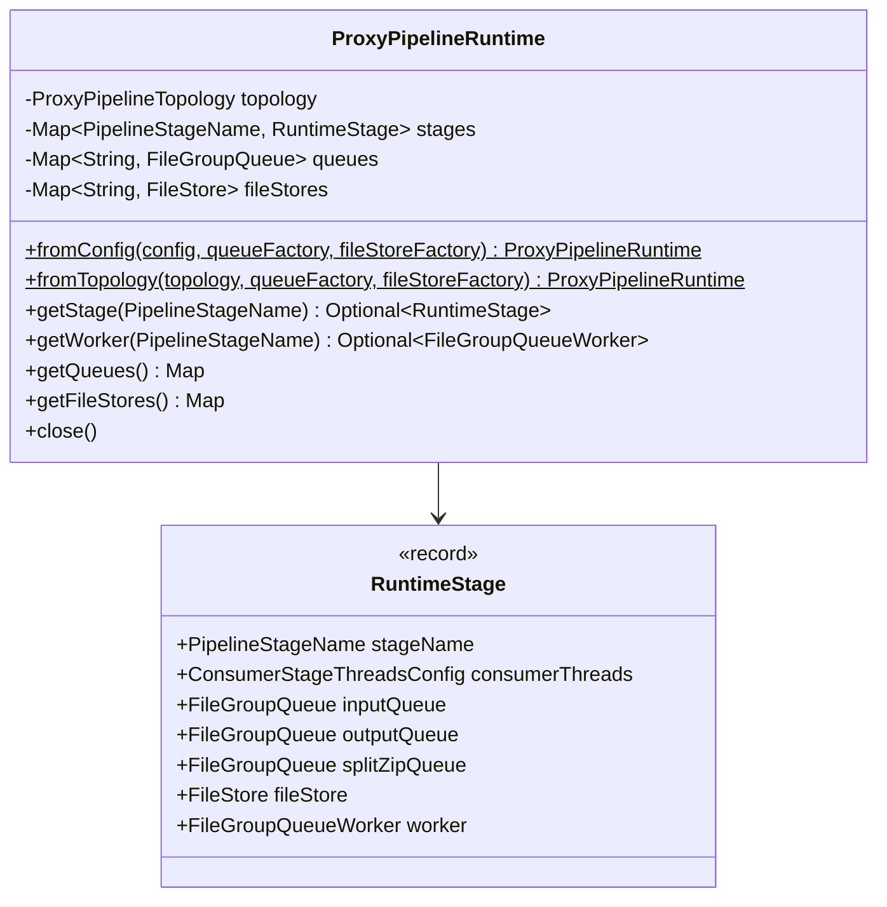
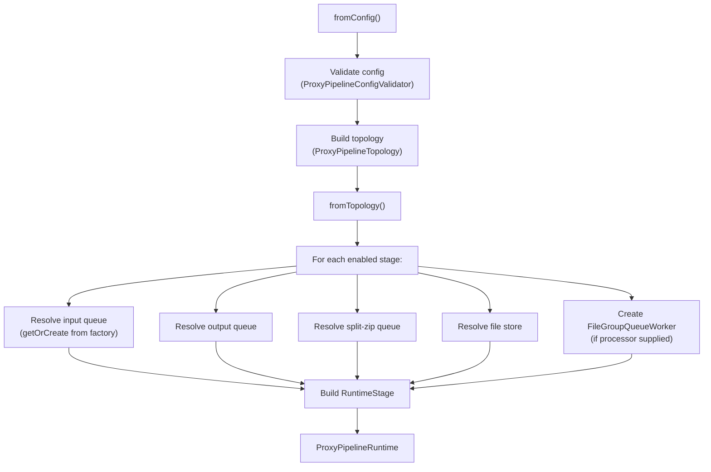
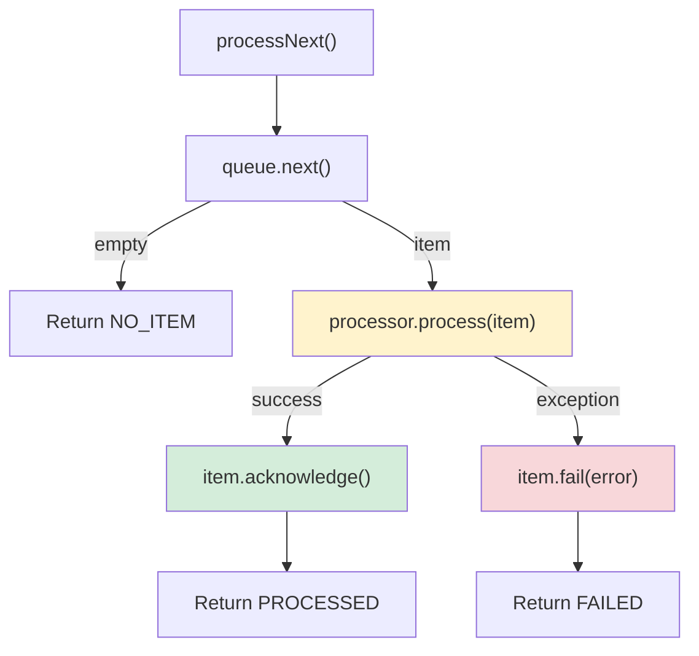
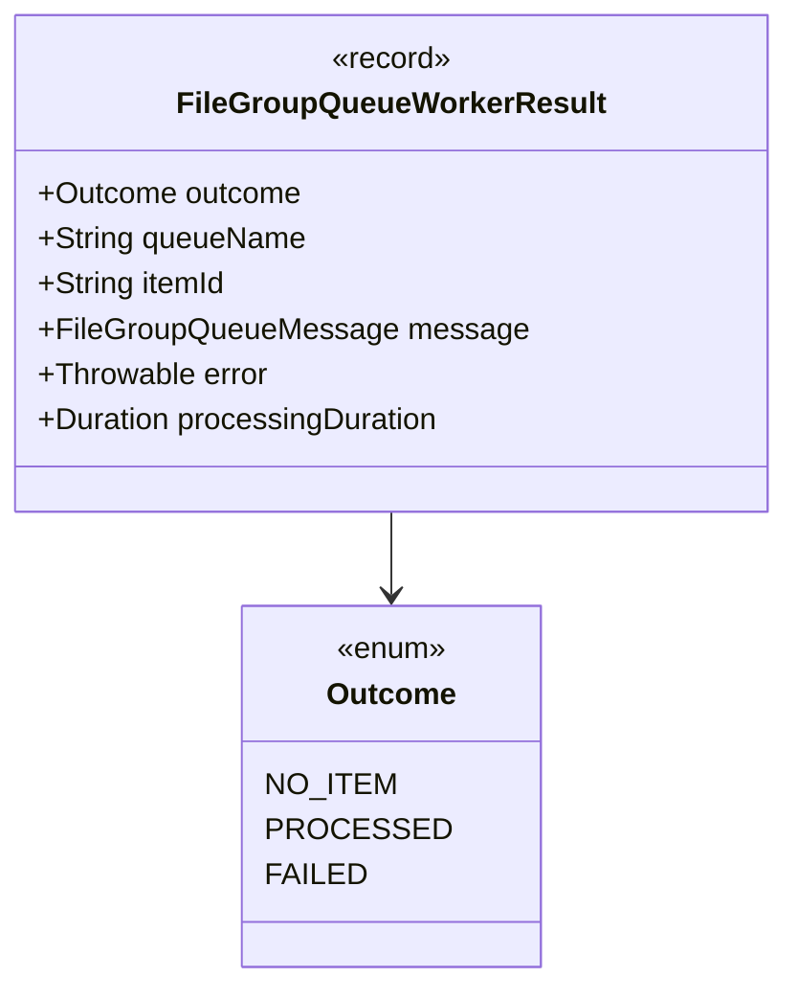
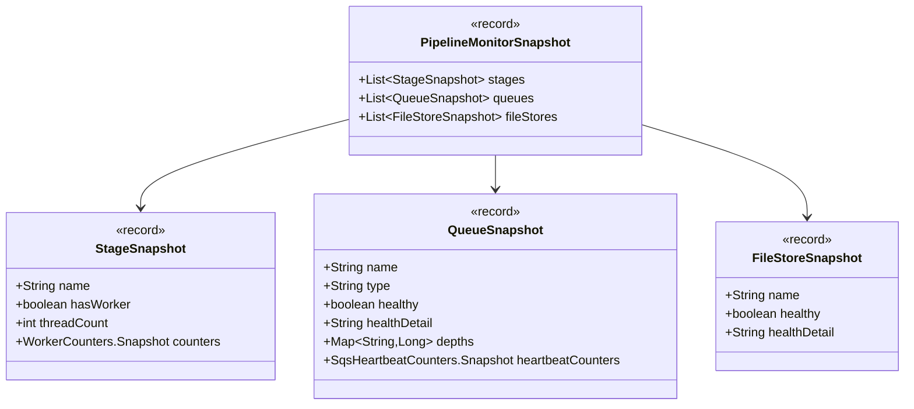

# Detailed Design — Runtime & Lifecycle

[← Back to architecture overview](../architecture.md)

## 1. Overview

The runtime layer assembles the pipeline from configuration, creates queue and file-store instances, wires stage processors to production handlers, and registers each queue-consuming stage as a loop with the `WorkRegistry` ([execution.md](execution.md)).



---

## 2. ProxyPipelineAssembler

### 2.1 Purpose

Bridges the new reference-message pipeline to existing production handlers. This is the top-level assembly class that wires everything together.

### 2.2 Assembly Sequence



### 2.3 Stage Processor Wiring

| Stage | Processor | Production Wiring |
|---|---|---|
| **Split Zip** | `SplitZipStage` | A `FileGroupQueueItemProcessor` over the split store and the aggregate input queue |
| **Forward** | `ForwardStage`, or `FanOutStage` with more than one destination | A `FileGroupQueueItemProcessor` over the destination, its give-up and its retry bounds; with fan-out, one `ForwardStage` worker per destination over its `forward-<dest>` queue ([stages/forward.md](../stages/forward.md)) |

### 2.4 The aggregate stage

The aggregate stage is not a worker over a processor: its claimer keeps the items it takes, so
`FileGroupQueueWorker`, which closes an item when `process()` returns, cannot drive it. The
assembler builds an `AggregateStage` from the stage's queues, store and bounds and registers its
two loops itself ([stages/aggregate.md §3](../stages/aggregate.md#3-the-interface)).

### 2.5 Outputs

| Property | Type | Description |
|---|---|---|
| `receiveWiring` | `ReceiveWiring` | The receive store and queues; `ProxyCoreModule` builds the `Receiver` from it, or a refusing one when it is null |
| `runtime` | `ProxyPipelineRuntime` | Full runtime model |

---

## 3. ProxyPipelineRuntime

### 3.1 Purpose

Immutable runtime model holding the topology, runtime stages, queues, and file stores.

### 3.2 Class Structure



`RuntimeStage` is a nested record of `ProxyPipelineRuntime`. Every optional
component is stored as a nullable field and exposed through an `Optional`
accessor (`getInputQueue()`, `getFileStore()`, `getWorker()`, …) alongside a
`hasX()` predicate, so callers never have to null-check directly.

There is also a separate top-level `PipelineStageRuntime` class in the same
package. It binds a `PipelineStage` (the topology model) to its resolved
queues, file store and worker, and exposes the same `Optional`/`hasX()` shape.
`RuntimeStage` is what `ProxyPipelineRuntime` stores internally.

### 3.3 Construction Flow



Queues and file stores are **deduplicated** — if two stages reference the same logical queue/store name, the same instance is shared.

---

## 4. Stage loops

Every background thread in the proxy belongs to the `WorkRegistry`; its contract, start and
stop ordering, backoffs and health are in [execution.md](execution.md). The assembler's part is
`ProxyPipelineAssembler.registerStages(registry, runtime)`, which registers one loop per
queue-consuming stage:

| | |
|---|---|
| Name | `stage-<configName>` — `stage-splitZip`, `stage-forward`; the aggregate stage registers `stage-aggregate` (claimers) and `stage-aggregate-merge` (merge workers) itself |
| Phase | The stage's own: `SPLIT_ZIP`, `AGGREGATE`, `FORWARD` |
| Threads | The stage's `threads.consumerThreads` |
| Task | `worker.processNext().loopOutcome()` — no item is `NOTHING`, a failed item is `FAILED`, anything else `PROCESSED` |

Threads are daemon threads named `stage-<configName>-<n>`. The registry starts the loops in
reverse phase order, so forward is draining before split-zip feeds it, and stops them in phase
order, so each stage has stopped feeding the next while the next is still draining.

If any file store is shared, the assembler also registers `file-store-sweep`, an hourly
`HOUSEKEEPING` schedule of `SharedFileStoreSweeper.sweepAll()`.

---

## 5. Backoffs

The loop, not the worker, decides what to do with an outcome:

| Outcome | Delay |
|---|---|
| `NOTHING` | None — the queue's `next()` already waited |
| `PROCESSED` | None — loop straight round |
| `FAILED` | 1 s, doubling per consecutive failure on that thread to a 30 s cap, reset by the next success |
| Task throws | 1 s |

The failure backoff is what stops a stuck message becoming a hot loop: `item.fail()` returns the
message to the queue, and the forward stage copies the file group to every healthy destination
on each attempt. The count is per thread, not per message, so a stuck item is retried about once
per interval per consumer thread. The delays are `WorkRegistry.Backoff.DEFAULT` and are not
configuration.

---

## 6. FileGroupQueueWorker

### 6.1 Purpose

Centralises the queue processing contract. All stages use the same worker, which provides consistent at-least-once semantics, error handling, structured logging, and metrics.

### 6.2 Processing Flow



### 6.3 Counters (FileGroupQueueWorkerCounters)

Thread-safe counters using `LongAdder`:

| Counter | Incremented When |
|---|---|
| `pollCount` | Every call to `processNext()` |
| `emptyPollCount` | Queue returns empty |
| `itemReceivedCount` | Queue returns an item |
| `itemProcessedCount` | `processor.process()` completes without exception |
| `itemAcknowledgedCount` | `item.acknowledge()` succeeds |
| `itemFailedCount` | `item.fail()` succeeds |
| `processorErrorCount` | `processor.process()` throws |
| `acknowledgeErrorCount` | `item.acknowledge()` throws |
| `failErrorCount` | `item.fail()` throws |
| `closeErrorCount` | `item.close()` throws |

### 6.4 MDC Structured Logging

Before calling `processor.process(item)`, the worker sets the following SLF4J MDC keys:

| MDC Key | Source | Description |
|---|---|---|
| `traceId` | `message.traceId()` | End-to-end correlation ID (only set if non-null) |
| `messageId` | `message.messageId()` | Queue message ID |
| `stageName` | `queue.getName()` | Pipeline stage name |

All MDC keys are cleared in a `finally` block after processing completes (success or failure).

### 6.5 Result Types



---

## 7. PipelineMonitorProvider

Collects runtime state into an immutable `PipelineMonitorSnapshot` for the admin monitoring endpoint:



The `buildSnapshot()` method now runs `healthCheck()` on each queue and file store, collects queue depths for `LocalFileGroupQueue` instances, and includes `SqsHeartbeatCounters.Snapshot` for SQS queues.

---

## 8. Integration with the Dropwizard Lifecycle

`ProxyLifecycle` — the proxy's Dropwizard `Managed` — owns the pipeline and the registry:

```java
// ProxyLifecycle.start()
runtime = pipelineAssemblerProvider.get().getRuntime();   // assembles; registers the stage loops
workRegistry.start();

// ProxyLifecycle.stop()
workRegistry.stop();
runtime.close();
```

`ProxyLifecycle` also starts `RefreshManager` before the registry and stops it after the runtime
is closed (E7): Dropwizard orders `Managed` beans by class name, so it cannot be left to it. The
feed-status cache is kept fresh by the `feed-status-refresh` schedule in `HOUSEKEEPING`.

The sources — `event-store-roll`, `zip-dir-scanner`, `sqs-poll` — are registered in
`ProxyLifecycle`'s constructor in the `INGRESS` phase, so they start after the stage loops and
stop before them. Nothing is submitted while the pipeline drains, and the runtime's queues and
stores are closed only once every thread that used them has stopped.

The assembler is fetched through a `Provider`, so pipeline construction — which
creates queues and file stores — is deferred until application startup rather
than happening during Guice injector creation. Instant forwarding skips assembly altogether.

---

## 9. PipelineHealthChecks

Aggregated Dropwizard health check implementing `HasHealthCheck`. Registered via `HasHealthCheckBinder` in `ProxyModule` and exposed on the admin `/healthcheck` endpoint.

### 9.1 Behaviour

- Iterates all queues and file stores from the runtime, calling `healthCheck()` on each; a probe that throws is logged at WARN and reported unhealthy
- Reports every registry loop's configured, live and paused state, and is unhealthy if a started loop has fewer live threads than configured
- If **all** components are healthy: returns healthy with a components detail map
- If **any** component is unhealthy: returns unhealthy with message "One or more pipeline components are unhealthy" and component-level details

### 9.2 Dependencies

Uses `Provider<ProxyPipelineAssembler>` to lazily access the runtime (queues/stores are created dynamically at assembly time, not at injection time).

---

## 10. PipelineMetricsRegistrar

Registers Codahale gauges for the pipeline runtime. Called from `ProxyCoreModule` immediately after assembler construction. Gauges are bridged to Prometheus format by the existing `PrometheusModule`.

### 10.1 Registered Metrics

| Category | Metrics | Source |
|---|---|---|
| Per-stage items | `items.received`, `items.processed`, `items.acknowledged`, `items.failed` | `FileGroupQueueWorkerCounters` |
| Per-stage errors | `errors.processor`, `errors.acknowledge`, `errors.fail`, `errors.close` | `FileGroupQueueWorkerCounters` |
| Per-stage polls | `polls.total`, `polls.empty` | `FileGroupQueueWorkerCounters` |
| Per-queue depth | `pending`, `inflight`, `failed` | `LocalFileGroupQueue` only |
| Per-queue heartbeat | `heartbeat.attempts`, `heartbeat.successes`, `heartbeat.failures` | `SqsHeartbeatCounters` |

All metrics are prefixed with `stroom.proxy.pipeline.`. Stage metrics include the stage config name; queue metrics include the logical queue name.
