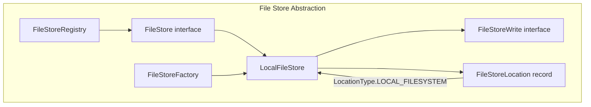
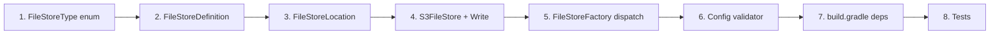

# Phase VI: S3 FileStore Integration — Detailed Plan

## Goal

Allow pipeline file stores to be backed by S3 instead of (or in addition to) local filesystem storage. When a stage writes its output to an S3-backed store, the file-group data is uploaded to S3, and the `FileStoreLocation` carries an `s3://` URI. When another stage reads from that location, the file group is downloaded to a local staging directory so existing stage processors can operate on local `Path` references unchanged.

## Current Architecture



Key facts:
- `FileStore` has 5 methods: `getName()`, `newWrite()`, `resolve()`, `delete()`, `isComplete()`, `newDeterministicWrite()`
- `FileStoreWrite.getPath()` returns a local `Path` — stages write files to this path, then call `commit()`
- `FileStoreLocation.LocationType` is currently an enum with only `LOCAL_FILESYSTEM`
- All 4 stage processors call `fileStoreRegistry.resolve(message)` to get a local `Path`, then operate on it
- `FileStoreFactory.createFileStore()` always creates `LocalFileStore` — no type dispatch
- `FileStoreDefinition` has only a `path` field — no type discriminator
- The existing `stroom-aws:stroom-aws-s3-impl` module has a fully featured `S3Manager` with upload/download/delete, `S3ClientConfig` with region/credentials/endpoint, and uses AWS SDK v2 (`libs.aws = "2.31.68"`)
- The proxy already has `libs.aws.sqs` as a runtime dependency for `SqsFileGroupQueue`

---

## User Review Required

> [!IMPORTANT]
> The S3 file store requires a **local staging directory** for both writes and reads, because stage processors operate on `Path` references. This is a fundamental design constraint of the current `FileStoreWrite.getPath()` contract. We can optimise this later (streaming directly from S3) but it requires deeper processor refactoring.

> [!WARNING]
> This adds `libs.aws.s3.transfer.manager` and `libs.aws.sts` as dependencies to `stroom-proxy-app`. The `s3` module itself is already transitively available via the AWS BOM. The proxy already has `libs.aws.sqs` so the AWS SDK is not a new top-level dependency.

## Confirmed Design Decisions

1. **Staging directory lifecycle** ✅ — **Throwaway temp directory** under the store root's `cache/` subdirectory, cleaned up on `delete()`. A persistent cache with size-based eviction can be added later if needed.

2. **S3-compatible stores** ✅ — **Supported** via `endpointOverride` (MinIO, Cloudflare R2, LocalStack). The existing `S3ClientConfig.endpointOverride` field handles this — no additional code needed.

3. **Credentials model** ✅ — **Embedded inline** in `FileStoreDefinition` with `region`, `bucket`, `keyPrefix`, `endpointOverride`, and credentials type. Full `S3ClientConfig` is overkill for proxy use; fields can be added later.

4. **Bucket per store** ✅ — **Single bucket** per file store definition, with a `keyPrefix` that defaults to the store name. Maps naturally to per-store isolation.

5. **File-group layout** ✅ — **Separate objects** under a key prefix (e.g. `receiveStore/0000000001/proxy.meta`, `.../proxy.zip`, `.../proxy.entries`, `.../.committed`). Simpler, avoids double-compression, aligns with `LocalFileStore` on-disk layout.

---

## Proposed Changes

### Step 1: Config Model Extensions

---

#### [MODIFY] [FileStoreDefinition.java](file:///home/stroomdev66/work/proxy_distributed_queues/stroom-proxy/stroom-proxy-app/src/main/java/stroom/proxy/app/pipeline/FileStoreDefinition.java)

Add type discriminator and S3 config fields:

```java
@JsonPropertyOrder(alphabetic = true)
public class FileStoreDefinition extends AbstractConfig implements IsProxyConfig {

    private final FileStoreType type;      // NEW — defaults to LOCAL_FILESYSTEM
    private final String path;             // existing — for LOCAL_FILESYSTEM only

    // S3-specific fields (only used when type == S3)
    private final String region;
    private final String bucket;
    private final String keyPrefix;        // defaults to store name
    private final String endpointOverride; // for MinIO/R2/LocalStack
    private final String credentialsType;  // "default", "basic", "environment", "profile"
    private final String accessKeyId;      // for credentialsType=basic
    private final String secretAccessKey;  // for credentialsType=basic
    private final String localCachePath;   // local staging dir for resolve()
}
```

#### [NEW] `FileStoreType.java`

Simple enum:

```java
public enum FileStoreType {
    LOCAL_FILESYSTEM,
    S3
}
```

#### [MODIFY] [FileStoreLocation.java](file:///home/stroomdev66/work/proxy_distributed_queues/stroom-proxy/stroom-proxy-app/src/main/java/stroom/proxy/app/pipeline/FileStoreLocation.java)

Add `S3` to `LocationType` enum and add factory method:

```java
public enum LocationType {
    LOCAL_FILESYSTEM,
    S3
}

public static FileStoreLocation s3(String storeName, String bucket, String key) {
    return new FileStoreLocation(
            storeName,
            LocationType.S3,
            "s3://" + bucket + "/" + key,
            Map.of());
}

@JsonIgnore
public boolean isS3() {
    return LocationType.S3.equals(locationType);
}
```

Update the constructor validation — `LOCAL_FILESYSTEM` requires `file:` scheme; `S3` requires `s3://` scheme.

---

### Step 2: S3FileStore Implementation

---

#### [NEW] `S3FileStore.java`

Implements `FileStore`. Core design:

```
S3FileStore
├── name: String
├── bucket: String  
├── keyPrefix: String (e.g. "receiveStore/")
├── s3Client: S3Client
├── localStagingRoot: Path (for writes and resolve cache)
├── sequence: AtomicLong (like LocalFileStore)
│
├── newWrite() → S3FileStoreWrite
│   1. Creates local temp dir under staging root
│   2. getPath() returns temp dir (stages write here)
│   3. commit():
│      a. Uploads each file to s3://bucket/keyPrefix/writerId/seqId/filename
│      b. Uploads .committed marker
│      c. Cleans up local staging
│      d. Returns FileStoreLocation(S3, "s3://bucket/keyPrefix/writerId/seqId")
│
├── newDeterministicWrite(fileGroupId) → S3FileStoreWrite
│   1. Checks if s3://bucket/keyPrefix/writerId/fileGroupId/.committed exists
│   2. If yes: returns PreCommittedS3Write (no upload needed)
│   3. If no: creates local temp dir, writes locally, commits uploads
│
├── resolve(location) → Path
│   1. Parse S3 URI from location
│   2. List objects under the key prefix
│   3. Download each to local cache dir: localStagingRoot/cache/<hash>/
│   4. Return the local cache directory path
│
├── delete(location)
│   1. Parse S3 URI
│   2. Delete all objects under the key prefix
│   3. Also delete any local cache entry
│
└── isComplete(location)
    1. HEAD s3://bucket/key/.committed
    2. Return exists
```

**Key S3 operations** (reusing patterns from `S3Manager`):

| Operation | SDK Method | Notes |
|-----------|-----------|-------|
| Upload file | `s3Client.putObject(PutObjectRequest, Path)` | Per-file upload (proxy.meta, proxy.zip, etc.) |
| Download file | `s3Client.getObject(GetObjectRequest, Path)` | Download to local staging |
| Check exists | `s3Client.headObject(HeadObjectRequest)` | For `.committed` marker |
| Delete | `s3Client.deleteObject(DeleteObjectRequest)` | Per-file; need to list+delete prefix |
| List prefix | `s3Client.listObjectsV2(ListObjectsV2Request)` | For resolve and delete operations |

**Client construction**: Build `S3Client` from `FileStoreDefinition` fields (region, credentials, endpoint). Cache the client for the lifetime of the `S3FileStore` instance (created once by the factory).

#### [NEW] `S3FileStoreWrite.java`

Inner class or separate file implementing `FileStoreWrite`:
- `getPath()` → local temp staging directory
- `commit()` → upload all files in staging dir to S3, write `.committed`, clean staging, return `FileStoreLocation.s3(...)`
- `close()` → delete staging dir if not committed
- `isCommitted()` → boolean flag

---

### Step 3: Factory Dispatch

---

#### [MODIFY] [FileStoreFactory.java](file:///home/stroomdev66/work/proxy_distributed_queues/stroom-proxy/stroom-proxy-app/src/main/java/stroom/proxy/app/pipeline/FileStoreFactory.java)

Change `createFileStore()` to dispatch on type:

```java
private FileStore createFileStore(final String fileStoreName) {
    final FileStoreDefinition definition = fileStoreDefinitions.get(fileStoreName);
    if (definition == null) {
        throw new IllegalArgumentException("No file store definition for: " + fileStoreName);
    }
    
    return switch (definition.getType()) {
        case LOCAL_FILESYSTEM -> new LocalFileStore(
                fileStoreName,
                getLocalFilesystemPath(fileStoreName, definition));
        case S3 -> new S3FileStore(
                fileStoreName,
                definition,
                pathCreator);
    };
}
```

No other factory changes needed — the caching and registry wiring remain the same.

---

### Step 4: Validation

---

#### [MODIFY] [ProxyPipelineConfigValidator.java](file:///home/stroomdev66/work/proxy_distributed_queues/stroom-proxy/stroom-proxy-app/src/main/java/stroom/proxy/app/pipeline/ProxyPipelineConfigValidator.java)

Add S3-specific validation rules:

```java
private void validateFileStoreDefinition(String name, FileStoreDefinition def, List<String> errors) {
    if (def.getType() == FileStoreType.S3) {
        if (isBlank(def.getBucket())) {
            errors.add("S3 file store '" + name + "' must have a bucket");
        }
        if (isBlank(def.getRegion())) {
            errors.add("S3 file store '" + name + "' must have a region");
        }
    }
}
```

---

### Step 5: Dependencies

---

#### [MODIFY] `build.gradle` (stroom-proxy-app)

```groovy
// existing:
implementation libs.aws.sqs

// add:
implementation libs.aws.s3.transfer.manager   // for upload/download
implementation libs.aws.sts                    // for assumed-role credentials
```

> [!NOTE]
> The AWS S3 SDK module itself is already available through the `aws-bom` platform dependency declared in the root `build.gradle` (line 199). We only need to add the explicit module references.

---

### Step 6: Tests

---

#### [NEW] `TestS3FileStore.java`

Unit tests with a **mock S3Client** (or a simple stub). Verifies:
- `newWrite()` creates local staging; `commit()` calls `putObject()` for each file + `.committed`; returns S3-typed `FileStoreLocation`
- `resolve()` calls `listObjectsV2()` + `getObject()` for each file; returns local cache path
- `delete()` calls `listObjectsV2()` + `deleteObject()` for each
- `isComplete()` calls `headObject()` on `.committed`; returns true/false
- `newDeterministicWrite()` returns pre-committed when marker exists; creates new when not
- Error handling: upload failure rolls back; download failure throws `IOException`

#### [NEW] `TestS3FileStoreIntegration.java` (optional)

Integration tests against LocalStack (only runs with `-Ps3-integration` profile):
- Full lifecycle: write → commit → resolve → verify content → delete
- Concurrent multi-file-group writes
- Idempotent replay with deterministic writes

#### [MODIFY] `TestFileStoreFactory.java`

Add test cases:
- S3-typed definition creates `S3FileStore`
- LOCAL_FILESYSTEM-typed definition still creates `LocalFileStore`  
- Missing bucket for S3 type throws validation error

#### [NEW] `TestFileStoreContract.java`

Abstract contract test that both `LocalFileStore` and `S3FileStore` implementations must pass:

```java
abstract class TestFileStoreContract {
    abstract FileStore createFileStore(Path testDir);
    
    @Test void testWriteCommitResolveContent() { ... }
    @Test void testIsCompleteAfterCommit() { ... }
    @Test void testDeleteMakesResolveInvalid() { ... }
    @Test void testDeterministicWriteIdempotency() { ... }
    @Test void testUncommittedWriteCleanedOnClose() { ... }
}

class TestLocalFileStoreContract extends TestFileStoreContract {
    @Override FileStore createFileStore(Path testDir) { return new LocalFileStore("test", testDir); }
}

class TestS3FileStoreContract extends TestFileStoreContract {
    @Override FileStore createFileStore(Path testDir) { return createMockS3FileStore(testDir); }
}
```

---

## File Summary

| File | Action | Component |
|------|--------|-----------|
| `FileStoreType.java` | NEW | Config enum |
| `FileStoreDefinition.java` | MODIFY | Add type + S3 fields |
| `FileStoreLocation.java` | MODIFY | Add `S3` LocationType, factory, validation |
| `S3FileStore.java` | NEW | S3 FileStore implementation |
| `S3FileStoreWrite.java` | NEW | S3 write handle |
| `FileStoreFactory.java` | MODIFY | Type dispatch |
| `ProxyPipelineConfigValidator.java` | MODIFY | S3 validation rules |
| `build.gradle` | MODIFY | Add S3 + STS dependencies |
| `TestS3FileStore.java` | NEW | Unit tests with mock |
| `TestS3FileStoreIntegration.java` | NEW | LocalStack integration (optional) |
| `TestFileStoreFactory.java` | MODIFY | S3 dispatch tests |
| `TestFileStoreContract.java` | NEW | Shared contract tests |

---

## Execution Order



**Estimated effort**: Large (the implementation is straightforward given the `LocalFileStore` template, but S3 error handling, local staging lifecycle, and testing add significant volume).

---

## Verification Plan

### Automated Tests
- `./gradlew :stroom-proxy:stroom-proxy-app:test --tests "stroom.proxy.app.pipeline.TestS3FileStore"` — mock S3 unit tests
- `./gradlew :stroom-proxy:stroom-proxy-app:test --tests "stroom.proxy.app.pipeline.TestFileStoreContract"` — contract tests
- `./gradlew :stroom-proxy:stroom-proxy-app:test --tests "stroom.proxy.app.pipeline.*"` — full regression suite
- `./gradlew :stroom-proxy:stroom-proxy-app:compileJava` — compile check

### Manual Verification
- Configure a file store as S3-backed in proxy YAML, start the proxy, verify data flows through
- Test with LocalStack or MinIO via `endpointOverride`
