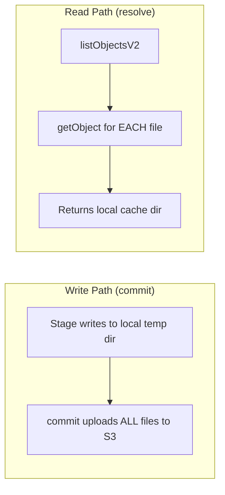
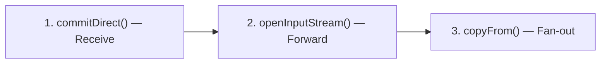

# S3 Streaming Optimisation Plan

## Goal

Eliminate unnecessary local disk I/O by streaming data directly to/from S3 where the stage processor's access pattern allows it. Currently the `S3FileStore` always stages locally on writes and downloads fully on reads. This plan identifies which operations can be streamed and which cannot.

---

## Current Data Flow (100% Local Staging)



**Problem**: For large zip files (hundreds of MB), this creates double I/O:
1. **Write**: stage writes to local disk → then uploads to S3 (read + upload)
2. **Read**: S3 download → local disk → stage reads from local disk (download + read)

---

## Per-Stage Analysis

### 1. ReceiveStagePublisher — WRITE-ONLY

**Current**: Copies received files into `FileStoreWrite.getPath()` (local staging), then `commit()` uploads to S3.

**Access pattern**: Sequential write of 3 files (`proxy.meta`, `proxy.zip`, `proxy.entries`), then commit.

**Can stream?** ✅ **Yes — direct upload**

The receive publisher already has the files on local disk (the receive temp dir). Instead of copy-to-staging → upload, we can upload the received files **directly** from the receive temp dir. This requires a new `FileStore` method:

```java
/**
 * Commit an existing local directory directly to the store,
 * skipping the local staging step. For S3 stores this uploads
 * files directly from the source directory.
 */
FileStoreLocation commitDirect(Path sourceDir) throws IOException;
```

**Savings**: Eliminates one full copy of the file group to local staging.

---

### 2. SplitZipStageProcessor — READ + WRITE

**Current**:
- **Read**: `fileStoreRegistry.resolve(message)` → downloads all files from S3 → returns local dir
- **Write**: `outputStore.newWrite()` → local staging → `commit()` uploads

**Access pattern**: 
- Reads: Opens `proxy.zip` as a `ZipInputStream`, reads `proxy.meta` line by line, reads `proxy.entries`
- Writes: Creates N output file groups (one per feed), each with `proxy.meta`, `proxy.zip`, `proxy.entries`

**Can stream reads?** ⚠️ **Partially — `proxy.meta` and `proxy.entries` yes, `proxy.zip` no**

`proxy.meta` and `proxy.entries` are small text files — they could be fetched as in-memory byte arrays. However, `proxy.zip` is read as a `ZipInputStream` which is inherently sequential — S3 `GetObject` returns an `InputStream` that could be wrapped directly, but `ZipSplitter.splitZip()` requires random access (it reads the zip entry list). **Must download `proxy.zip` locally.**

**Can stream writes?** ❌ **No** — the split function writes files incrementally. The output zip is built entry-by-entry, so we can't upload until it's complete.

> [!NOTE]
> The split-zip stage is the hardest to optimise because `ZipSplitter` needs `Path`-based access to `proxy.zip` for random-access zip parsing. Streaming is only possible if we refactored `ZipSplitter` to accept `InputStream`s, which is a major rewrite.

---

### 3. PreAggregateStageProcessor — READ-ONLY (relative to FileStore)

**Current**: `fileStoreRegistry.resolve(message)` → downloads from S3 → returns local dir → passes to `PreAggregator.addDir(Path)`

**Access pattern**: `PreAggregator` reads the feed key from `proxy.meta`, reads `proxy.entries`, and then moves/copies `proxy.zip` into an open aggregate directory.

**Can stream reads?** ⚠️ **Meta + entries: yes. Zip: no.**

Same as split-zip — the meta and entries are small and could be fetched as byte arrays. But the zip is moved/copied into an aggregate directory which requires local disk presence.

---

### 4. AggregateStageProcessor — READ-ONLY (relative to FileStore)

**Current**: Same pattern as pre-aggregate.

**Access pattern**: `Aggregator.addDir(Path)` reads subdirectories, merges zip files, combines headers.

**Can stream reads?** ❌ **No** — the aggregator does heavy random-access I/O across multiple files and directories. Must be local.

---

### 5. ForwardStageProcessor / ForwardStageFanOutForwarder — READ + WRITE

**Current**:
- **Read**: `fileStoreRegistry.resolve(message)` → downloads from S3
- **Write** (fan-out): `destination.fileStore().newWrite()` → copies source to staging → uploads

**Access pattern**: 
- Forward: Validates file group exists, then sends via HTTP POST (reads `proxy.meta`, streams `proxy.zip`)
- Fan-out: Copies entire source dir into N destination file stores

**Can stream reads?** ✅ **Yes — for HTTP forwarding**

The actual forward HTTP POST reads `proxy.zip` as a sequential `InputStream`. If we add a `FileStore.openInputStream(location, filename)` method, the forwarder could stream directly from S3 without downloading first.

**Can stream fan-out writes?** ✅ **Yes — direct upload**

Fan-out copies the source dir into N destination stores. If both source and destination are S3, this could use **S3 server-side copy** (`CopyObject`) instead of download + re-upload.

---

## Summary Matrix

| Stage | Read | Write | Streaming Feasible? | Savings |
|-------|------|-------|---------------------|---------|
| **Receive** | — | ✅ Direct upload | ✅ Yes | Eliminates staging copy |
| **SplitZip** | ❌ Needs local zip | ❌ Incremental | ❌ No | — |
| **PreAggregate** | ⚠️ Meta only | — | ⚠️ Minor | Small (meta ~1KB) |
| **Aggregate** | ❌ Heavy random I/O | — | ❌ No | — |
| **Forward (HTTP)** | ✅ Sequential stream | — | ✅ Yes | Eliminates full download |
| **Forward (fan-out)** | ✅ S3 server copy | ✅ S3 server copy | ✅ Yes | Eliminates download + re-upload |

---

## Proposed Changes (Priority Order)

### Priority 1: Direct Upload on Receive (High value, Low effort)

#### [NEW] `FileStore.commitDirect(Path sourceDir)` method

Add to the `FileStore` interface:

```java
/**
 * Commit files from an existing local directory directly to the store,
 * bypassing the staging step. For local stores this is a move/copy.
 * For S3 stores this uploads directly from the source directory.
 *
 * @param sourceDir Directory containing files to commit.
 * @return The stable store location.
 */
default FileStoreLocation commitDirect(Path sourceDir) throws IOException {
    // Default implementation: copy into a newWrite(), then commit.
    try (final FileStoreWrite write = newWrite()) {
        copyAll(sourceDir, write.getPath());
        return write.commit();
    }
}
```

#### [MODIFY] `S3FileStore` — override `commitDirect()`

Upload files directly from the source directory without copying to staging first.

#### [MODIFY] `ReceiveStagePublisher`

Replace `newWrite()` + `copyDirectoryContents()` + `commit()` with `commitDirect(receivedDir)`.

**Effort**: Small. **Impact**: Eliminates one full local copy per received file group.

---

### Priority 2: Stream Forward from S3 (High value, Medium effort)

#### [NEW] `FileStore.openInputStream(FileStoreLocation, String filename)` method

```java
/**
 * Open an InputStream to a specific file within a stored file group.
 * For local stores, opens the file directly. For S3 stores, opens an
 * S3 GetObject response stream without downloading to disk.
 */
InputStream openInputStream(FileStoreLocation location, String filename) throws IOException;
```

#### [MODIFY] `ForwardStageProcessor` / production forward adapter

Instead of `resolve()` → local Path → open stream, use `openInputStream()` to stream `proxy.zip` directly from S3 to the HTTP POST body.

**Effort**: Medium — requires the forward adapter to accept `InputStream` instead of `Path`.

---

### Priority 3: S3 Server-Side Copy for Fan-Out (Medium value, Medium effort)

#### [NEW] `FileStore.copyFrom(FileStoreLocation source, FileStore sourceStore)` method

```java
/**
 * Copy a file group from another store into this store.
 * When both stores are S3 on the same bucket/region, uses server-side copy.
 * Otherwise falls back to download + upload.
 */
FileStoreLocation copyFrom(FileStoreLocation source, FileStore sourceStore) throws IOException;
```

#### [MODIFY] `ForwardStageFanOutForwarder`

Replace `copyDirectory(sourceDir, write.getPath())` with `destination.fileStore().copyFrom(source, inputStore)`.

**Effort**: Medium. **Impact**: For S3→S3 fan-out, eliminates all local I/O.

---

### Not Recommended

| Optimisation | Why Not |
|--------------|---------|
| Streaming reads for SplitZip | `ZipSplitter` requires random-access zip parsing; refactoring to `InputStream` is a major rewrite with risk |
| Streaming reads for Aggregate | Aggregator does heavy multi-file random I/O; fundamentally incompatible with streaming |
| Streaming meta/entries for PreAggregate | Files are ~1KB; the savings are negligible vs. the added complexity |

---

## Execution Order



| Priority | Change | Effort | Impact |
|----------|--------|--------|--------|
| **1** | `commitDirect()` on receive | Small | High — removes copy for every ingest |
| **2** | `openInputStream()` for forward | Medium | High — removes full download before HTTP POST |
| **3** | S3 server-side copy for fan-out | Medium | Medium — removes download+reupload for multi-dest |

---

## Open Questions

1. **Should `commitDirect()` delete the source directory?** The receive publisher currently deletes the temp dir after publish. If `commitDirect()` takes ownership and deletes, the publisher code is simpler. But if it doesn't delete, the publisher retains control.

2. **Should `openInputStream()` support byte-range reads?** Not needed now, but could be useful for future partial-file access. Recommend starting without range support.

3. **Should S3 server-side copy fall back to download+upload when source and destination are in different regions?** S3 `CopyObject` works cross-region but is slower. Recommend always attempting server-side copy and letting the SDK handle it.
