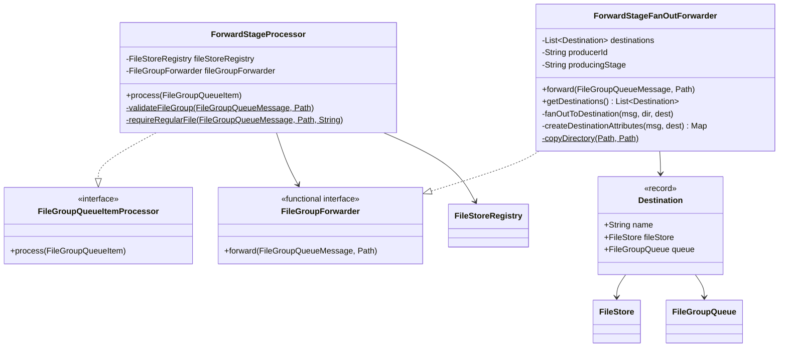
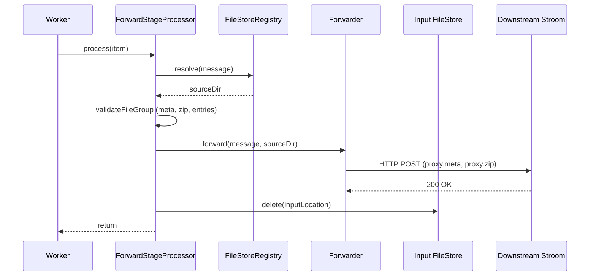
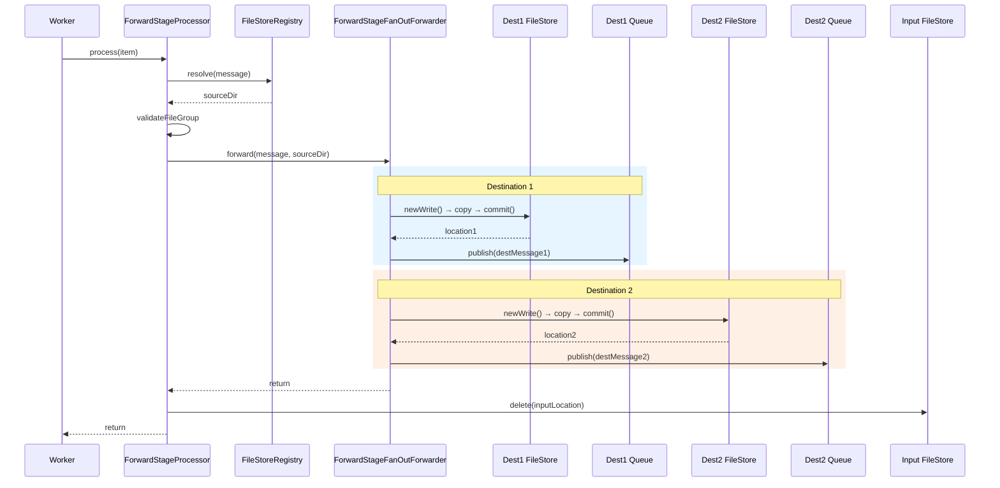
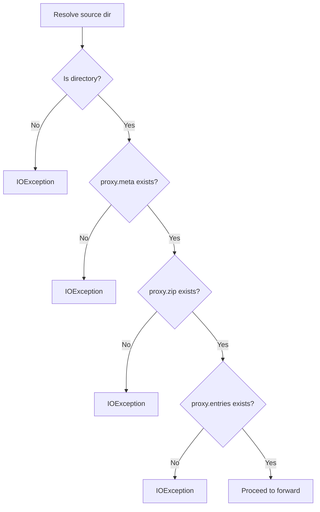

# Detailed Design — Forward Stage

[← Back to architecture overview](../architecture.md)

## 1. Purpose

The forward stage sends fully aggregated data to one or more downstream Stroom instances. It is the terminal stage of the pipeline — it has no output queue. It supports both single-destination and multi-destination (fan-out) forwarding via a pluggable `FileGroupForwarder` interface.

## 2. Class Diagram



## 3. Constructor Parameters

### ForwardStageProcessor

| Parameter | Type | Required | Description |
|---|---|---|---|
| `fileStoreRegistry` | `FileStoreRegistry` | Yes | Resolves input message locations |
| `fileGroupForwarder` | `FileGroupForwarder` | Yes | Pluggable forwarding adapter |

### ForwardStageFanOutForwarder

| Parameter | Type | Required | Description |
|---|---|---|---|
| `destinations` | `List<Destination>` | Yes (≥1) | Target destinations |
| `producerId` | `String` | Yes | Node identifier for provenance |
| `producingStage` | `String` | No | Defaults to `"forwardFanOut"` |

### Destination (Record)

| Field | Type | Description |
|---|---|---|
| `name` | `String` | Logical destination name |
| `fileStore` | `FileStore` | Destination-owned file store |
| `queue` | `FileGroupQueue` | Destination forwarding queue |

## 4. Single-Destination Sequence



In production single-destination mode, the `FileGroupForwarder` is wired as:
```java
(message, sourceDir) -> forwarder.add(sourceDir)
```

## 5. Fan-Out (Multi-Destination) Sequence



### Fan-Out Durability

The critical ordering is:
1. Copy to **all** destination stores and publish **all** destination messages
2. **Then** delete input (done by `ForwardStageProcessor`)
3. **Then** acknowledge input message (done by `FileGroupQueueWorker`)

If a crash occurs after some destinations but not all, the input message is
redelivered. No destination misses data; delivery is at-least-once, so some may
see duplicates.

#### Destination Isolation

A retry must not re-deliver to destinations that already succeeded. The fan-out
aborts at the first failing destination and the worker fails the whole item, so
without isolation a single unreachable destination would restart the loop and
copy the file group to every healthy destination again — and again on every
retry. Measured against a permanently failing destination and no retry backoff,
that produced over a thousand duplicate deliveries per second from one file
group, plus an orphaned copy in the failing destination's store per attempt.

Destinations already delivered for a given `fileGroupId` are therefore recorded
and skipped on retry. The record is:

- **In memory only.** Losing it across a restart re-delivers, which at-least-once
  permits. Making it durable would buy exactly-once, which is not the contract.
- **Written only after that destination's `publish()` returns**, so a skipped
  destination provably holds both the data and its queue message.
- **Discarded once every destination succeeds** — the message is about to be
  acknowledged and will not come back.
- **Bounded** by `MAX_TRACKED_FILE_GROUPS` (10,000) and a one-hour expiry.
  Entries exist only for partially-complete fan-outs, so this is normally near
  empty; eviction costs at most a duplicate delivery.

The failing destination still accumulates one committed-but-unpublished file
group per attempt in its own store — the ordinary orphan case, now bounded by
the retry backoff rather than unbounded. See
[../future-work.md §10](../future-work.md#10-orphaned-file-cleanup).

## 6. Destination Message Attributes

Fan-out messages include traceability attributes:

| Attribute Key | Value |
|---|---|
| `forwardDestination` | Logical destination name |
| `sourceMessageId` | Original input message ID |
| `sourceQueueName` | Original input queue name |

Plus any attributes from the source message are copied through.

## 7. File Group Validation

Before forwarding, the processor validates that the file group contains all expected files:



This validation catches broken handoffs early — before forwarding rather than after acknowledgement.

## 8. Responsibility Split

| Responsibility | Owner |
|---|---|
| Resolve input location | `ForwardStageProcessor` |
| Validate file group | `ForwardStageProcessor` |
| Copy to destinations | `ForwardStageFanOutForwarder` |
| Publish destination messages | `ForwardStageFanOutForwarder` |
| Delete input from source store | `ForwardStageProcessor` |
| Acknowledge input message | `FileGroupQueueWorker` |
