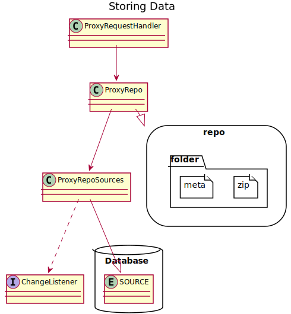
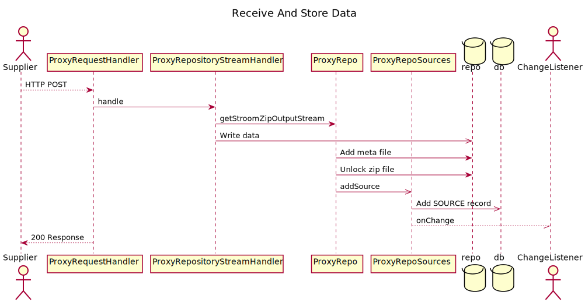
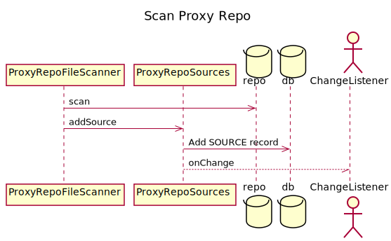
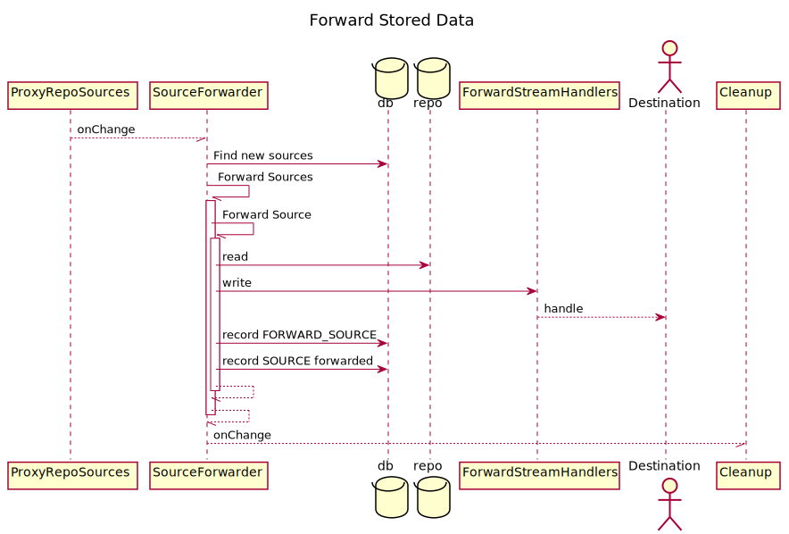
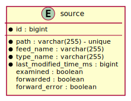

# Forward Only Proxy
If the proxy is not set to store data then is may forward to a single destination.
If no destinations are configured then it will error on startup.
Only a single destination can be used without storing as multiple destinations would fail for all if only a single destination failed and all would be limited by the performance of the slowest.
If more than one destination is configured then it will error on startup.
Forwarding data directly does not involve the use of the repository or any database.
Any errors encountered while forwarding to the destination are relayed back to the supplier. 

# Storing Data
If the proxy is configured to store data then when data is received via the `ProxyRequestHandler` it is written to the repository with the repository path created by the repository path pattern.
The data is written in `.zip.lock` files.
At the end of writing if the data has been received successfully the zip file has the `.lock` extension removed.
The meta is then written alongside in `.meta` files. 
Prior to telling the sender that the data was successfully received the database has a record added to the SOURCE table.
If the database is updated successfully then the servlet returns a success response, the system notifies listeners that there is a new source available.

# Reading Stored Data
In some cases it is desirable to have a proxy that will not receive any data directly but will have data added to its file repository by an external process.
In this case the proxy needs to record the existence of source in its file repository before it can do anything with it, such as forwarding it.
To record the existence of source it is possible to configure a `scanner` to scan the proxy repository and add any new sources that are found.
The scanning frequency can be configured.

# Forwarding Stored Data
Proxy can forward stored data to multiple destinations without performing any aggregation if aggregation is disabled.
The sequence for forwarding data without aggregation looks like this:

When new sources are added to the `source` table (either as a result of receiving data or as a result of scanning the repository) a change event is fired from `ProxyRepoSources` to all registered listeners.
In source data forwarding mode the `SourceForwarder` is registered as a listener on `ProxyRepoSources`.
The `SourceForwarder` runs asynchronously and will try and forward all new sources whenever it is notified of new sources.
It will either be waiting for new sources to be added or will be forwarding in which case it will either wait again at the end of it's forwarding activity if no new sources have arrived since it started or will try to forward any new sources that have arrived since it previously began forwarding.
The `SourceForwarder` will find sources to forward and will try and send each asynchronously to each of the forward destinations.
When a source is successfully sent to a destination a record is added to the `forward_cource` table.
When a source has been sent to all destinations the source table is updated to set `forwarded` to `true` so that the system no longer tries to forward the source.
After setting the `forwarded` flag the `forward_source` records are deleted prior to firing a change event to any listeners.

If an error occurs when forwarding a source it is recorded in the `forward_source` table and the `source` table has the `forward_error` flag set so that the proxy stops trying to forward the source until a retry attempt is made.
If a forwarding error is recorded it will be logged.
Without forwarding being marked as successful the source will not be deleted.

## Retry Forwarding
If forwarding retry is configured then based on the retry schedule all `forward_source` records with errors will be deleted and all `source` `forward_error` flags will be reset.
After clearing the failures forwarding is attempted again.
The proxy may continue to fail to forward data until all configured destinations can be sent the data.

## Cleanup
The `Cleanup` service is registered as a listener of the `SourceForwarder` and will run asynchronously whenever a change event is received if not already running and will run again if any changes occur after it starts running.
The  `Cleanup` service will delete any `source` records and associated repository files if forwarding has been completed for a source.

# Aggregating and Forwarding Stored Data

## Retry Forwarding

## Cleanup

# Database Structure

## Complete Entity Relationship Model
The DB entities and the relationships between them all is shown below:

## Source Entity
Storing a record of received source data or scanned source data only uses the source entity:

## Forward Stored Data
Forwarding stored data without performing any aggregation uses the following entities:

## Aggregating and Forwarding Aggregate Data
Aggregating and forwarding aggregate data uses the following entities:

