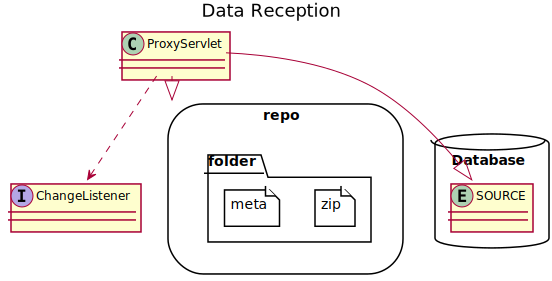
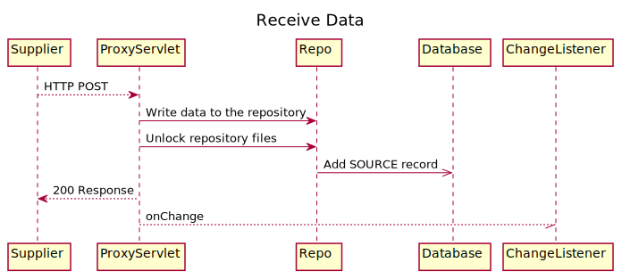

# Forward Only Proxy

# Storing Data
When data is received via the ProxyServlet it is written to the repository with the repository path created by the repository path pattern.
The data is written in `*.zip.lock` files with meta stored alongside in `*.meta` files.
Once receipt of the data is complete the lock extension is removed from the zip file and the database has a record added to the SOURCE table.
If the database is updated successfully then the servlet returns a success response and the system notifies listeners that there is a new source available.

# Reading Stared Data

# Forwarding Stored Data

## Retry Forwarding

## Cleanup

# Aggregating and Forwarding Stored Data

## Retry Forwarding

## Cleanup

