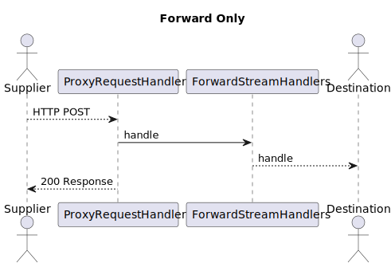
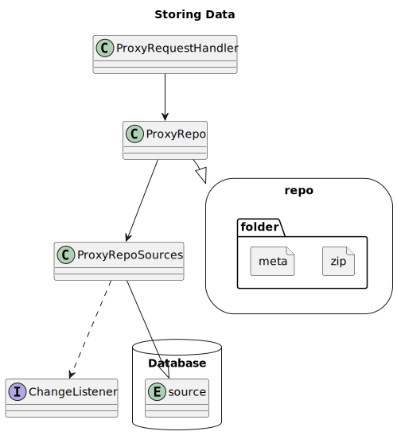
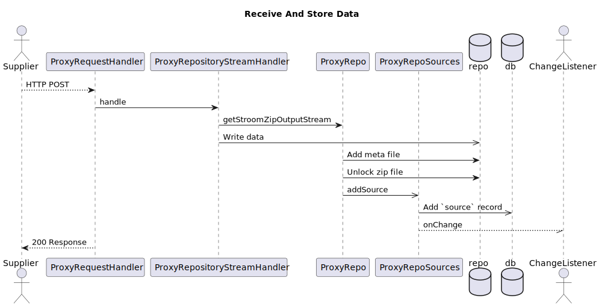
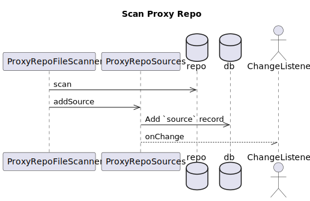
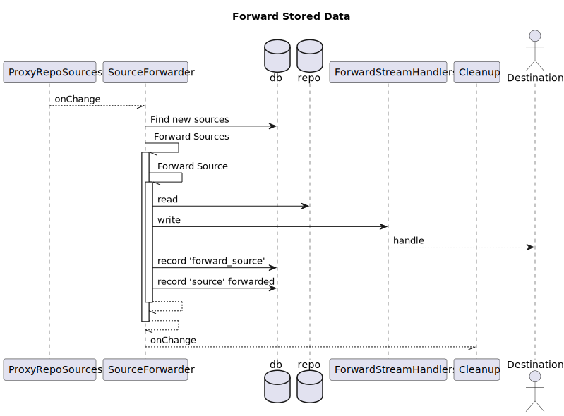
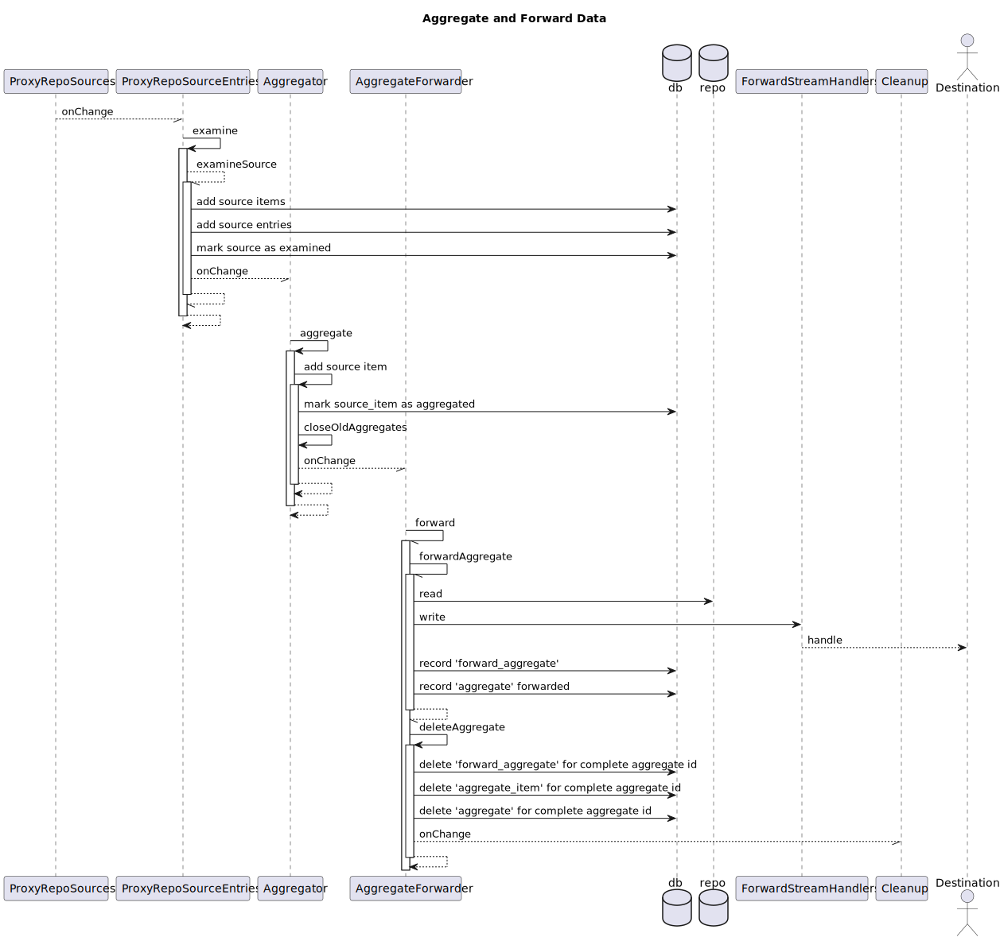
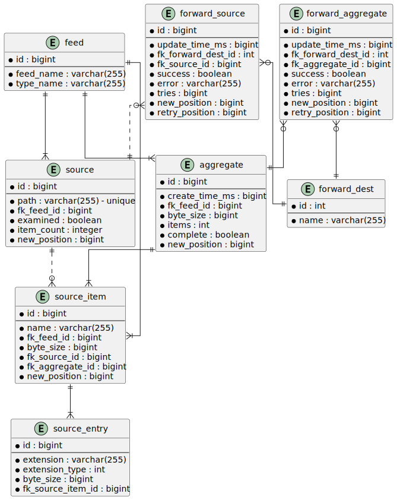
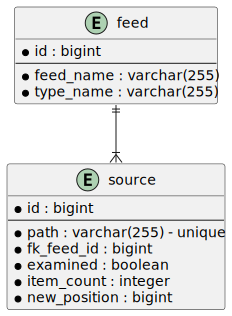
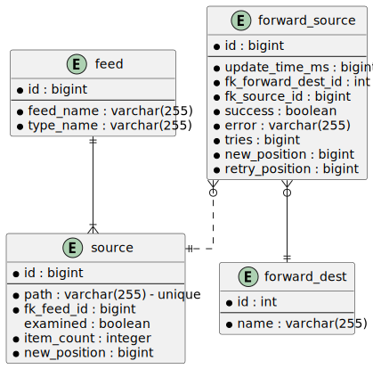
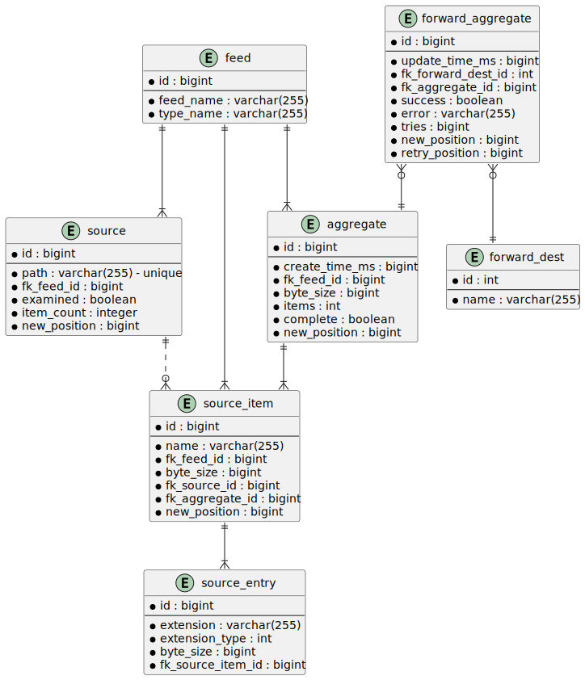

# Introduction
Stroom proxy can be configured to operate in various ways to meet certain use cases.

# Use Cases
The use cases include but may not be limited to the following:

* Repeater (Forward Only) - The proxy receives data and immediately repeats it to another destination (single only).
* Receive + Store - Stroom Proxy receives data and stores it in a configured repository.
* Receive + Store + Forward - The same as receive and store but can then forward to one or more destinations.
* Receive + Store + Aggregate + Forward - Also aggregates data prior to forwarding to one or more destinations.
* Scan + Forward - Scans the contents of a store and forwards to one or more destinations.
* Scan + Aggregate + Forward - Also aggregates data prior to forwarding to one or more destinations.
  
## Repeater
This use case is to create a centralised logging point in one location on a network that is then able to send data to another location that the sources may not be able to reach directly.
When used this way the proxy simply echoes data to another destination without any processing or storage of the data.
Any errors that occur forwarding data to the destination are returned back to the sender.
Some minimal data validity checking is performed to ensure the HTTP headers provided by the sender contain the necessary information, i.e. a feed name.
Feed names can be checked against a policy to ensure they are valid. 

## Receive + Store
Stroom Proxy is configured to receive and store data to disk.
The data on disk can then be copied and transferred elsewhere by some other process.
Stroom Proxy Aggregation uses data in a Stroom Proxy store to ingest data into the Stroom Application.
If errors occur while receiving data the data files in the store are deleted or in the case of sudden shutdown of Stroom Proxy would not be unlocked.

- Note: We may need repository rolling to be added if part of this use case is to copy data from a repository to another location.

## Receive + Store + Forward
Once data is stored Stroom Proxy will tell the sender that it has successfully received the data.
Stored data is then forwarded to one or more configured destinations.
Errors that occur when sending the data are logged.

## Receive + Store + Aggregate + Forward
Prior to forwarding data Stroom Proxy can be configured to aggregate it so that multiple small streams of data that belong to the same feed can be packaged and compressed together into a single archive.
Aggregating data reduces the number of connections required between nodes in the data receipt network and also reduces the network bandwidth required as log data compresses very efficiently due the degree of repetition in the log data.

## Scan + Forward
Stroom Proxy data that has been stored in a repository via a separate process, e.g. a remote `Receive + Store` Stroom Proxy, can be forwarded by scanning a repository for files and forwarding them to one or more configured destinations.

## Scan + Aggregate + Forward
This is the same as `Scan + Forward` but adds in the aggregation step previously described.

# Stages
Stroom Proxy has several stages that can be configured to meet the above use cases. The stages are as follows:
* Receive - Servlet responsible for data receipt
* Store - Data storage
* Scan - A process for finding data in a detached store, i.e. not one that is receiving data via the servlet.
* Examine - A process that looks at zipped stored data and finds out what files are contained within and records attributes such as feed and uncompressed size.
* Aggregate - Uses the results of examination to form aggregated output based on configured aggregate size, number of items etc.
* Forward - Sends data on to one or more destinations.
* Cleanup - Deletes old source entries and sources that have been successfully forwarded.

Depending on configuration the stages are enabled and wired together by `ProxyLifecycle`.
The `Scan`, `Examine`, `Aggregate`, `Forward` and `Cleanup` stages operate independently performing their processing in separate threads.
The only exception to this is that data storage occurs in the same thread as receive.
If store is disabled then forwarding happens in the same thread as receive and `ProxyLifecycle` does nothing. 

Each stage notifies subsequent stages when there is new work to be done.
This may wake up a subsequent stage if it is waiting for new work or just let it know that it needs to keep processing.

## Receive
Data is received by the `ProxyRequestHandler` servlet.
It can be configured to apply receipt policies to reject or drop data that does not meet certain feed requirements. 

- Note: Additional validity checking could be added such as rejecting data that is larger than a configured size (see gh-1429).

## Store
Data is stored in folders and files according to the configured repository path pattern.

## Scan
For stores that are not being populated by receiving data via the servlet a scanning process can be configured to discover data in a store.
How often the store is scanned can be configured.

## Examine
An asynchronous process looks at repository files and discovers their contents.
All discovered information about a repository file is stored in a database.
Details about the contents of repository files needs to be known for the aggregation stage to be able to operate.

## Aggregate
The aggregation stage pulls together items from multiple repository files to form aggregate items.
This asynchronous process operates on the examined repository file contents.
The aggregates produced only contain data for a specific feed with the size and number of constituent items determined by configuration.
An aggregate is complete when it reaches a configurable age.

## Forward
The forwarding stage will forward received data synchronously if the Stroom Proxy is configured to just repeat received data (forward only).

The forwarding stage will forward stored source if storing is configured without aggregation.
Forwarding to each destination is asynchronous and any failures are logged.

The forwarding stage will forward completed aggregates if aggregation is enabled.
Forwarding to each destination is asynchronous and any failures are logged.

## Cleanup
When a source has been successfully sent to all forward destinations or all entries of a source have been added to aggregates that have themselves all been successfully sent to forward destinations a source is ready for deletion.
The cleanup process removes the necessary items from the database and removes files from the repository.
The cleanup process runs asynchronously.

# Design
## Repeater (Forward Only)
If the proxy is not set to store data then is may forward to a single destination.
Only a single destination can be used without storing as multiple destinations would fail for all if only a single destination failed and all would be limited by the performance of the slowest.
If no destinations or more than one destination is configured then Stroom Proxy will error on startup.
Forwarding data directly does not involve the use of the repository or any database.
Any errors encountered while forwarding to the destination are relayed back to the supplier. 

## Receive and Store
If the proxy is configured to store data then when data is received via the `ProxyRequestHandler` it is written to the repository with the repository path created by the repository path pattern.
The data is written in `.zip.lock` files.
At the end of writing if the data has been received successfully the zip file has the `.lock` extension removed.
The meta is then written alongside in `.meta` files. 
Prior to telling the sender that the data was successfully received the database has a record added to the `source` table.
If the database is updated successfully then the servlet returns a success response, the system notifies listeners that there is a new source available.

# Reading Stored Data
In some cases it is desirable to have a proxy that will not receive any data directly but will have data added to its file repository by an external process.
In this case the proxy needs to record the existence of source in its file repository before it can do anything with it, such as forwarding it.
To record the existence of source it is possible to configure a `scanner` to scan the proxy repository and add any new sources that are found.
The scanning frequency can be configured.

# Forwarding Stored Data
Proxy can forward stored data to multiple destinations without performing any aggregation if aggregation is disabled.
The sequence for forwarding data without aggregation looks like this:

When new sources are added to the `source` table (either as a result of receiving data or as a result of scanning the repository) a change event is fired from `ProxyRepoSources` to all registered listeners.
In source data forwarding mode the `SourceForwarder` is registered as a listener on `ProxyRepoSources`.
The `SourceForwarder` runs asynchronously and will try and forward all new sources whenever it is notified of new sources.
It will either be waiting for new sources to be added or will be forwarding in which case it will either wait again at the end of it's forwarding activity if no new sources have arrived since it started or will try to forward any new sources that have arrived since it previously began forwarding.
The `SourceForwarder` will find sources to forward and will try and send each asynchronously to each of the forward destinations.
When a source is successfully sent to a destination a record is added to the `forward_source` table.
When a source has been sent to all destinations the source table is updated to set `forwarded` to `true` so that the system no longer tries to forward the source.
After setting the `forwarded` flag the `forward_source` records are deleted prior to firing a change event to any listeners.

If an error occurs when forwarding a source it is recorded in the `forward_source` table and the `source` table has the `forward_error` flag set so that the proxy stops trying to forward the source until a retry attempt is made.
If a forwarding error is recorded it will be logged.
Without forwarding being marked as successful the source will not be deleted.

## Retry Forwarding
If forwarding retry is configured then based on the retry schedule all `forward_source` records with errors will be deleted and all `source` `forward_error` flags will be reset.
After clearing the failures forwarding is attempted again.
The proxy may continue to fail to forward data until all configured destinations can be sent the data.

## Cleanup
`Cleanup` is registered as a listener of the `SourceForwarder` and will run asynchronously whenever a change event is received if not already running and will run again if any changes occur after it starts running.
`Cleanup` will delete any `source` records and associated repository files if forwarding has been completed for a source.
`Cleanup` deletes repository files before database entries to avoid source being added again by a rescan.

# Aggregating and Forwarding Stored Data
If proxy is configured to store data and aggregate it before forwarding the process follows the sequence below:

After new `source` entries are added via `ProxyRepoSources` an `onChange` event is fired.

The `ProxyRepoEntries` is registered to listen for new sources.
When it is notified of new source data it asynchronously starts to examine it.
Each new source will be examined by opening the source zip file so entries can be recorded in the database.
The database records source items in terms of named data files and also records the associated meta and context entries.
Uncompressed file sizes are recorded.
Feed and type names are parsed from meta and also recorded. 
When all of the source has been examined the `source` is marked as having been `examined` so it is not examined again.
The `ProxyRepoEntries` fires an `onChange` event to notify listeners that new source entries are available.
Note that all entries are added in a single transaction, so they are not available until source examination is complete.

The `Aggregator` is registered to listen for new examined sources.
It will perform aggregation on new examined sources asynchronously when notified.
All `source_items` and `source_entries` are added to appropriate aggregates based on the configured maximum size of aggregates and the maximum number of entries.
Aggregates are separated by feed and type as recorded against `source_items`
When a `source_item` is added to an aggregate it is marked as `aggregated`.
Aggregates that are older than the aggregation frequency are marked `complete` and an `onChange` event is fired to notify all registered listeners that a new aggregate is ready for forwarding.

The `AggregateForwarder` is registered to listen for new aggregates.
The `AggregateForwarder` will find completed aggregates to forward and will try and send each asynchronously to each of the forward destinations.
When an aggregate is successfully sent to a destination a record is added to the `forward_aggregate` table.
When an aggregate has been sent to all destinations the aggregate table is updated to set `forwarded` to `true` so that the system no longer tries to forward the aggregate.
After setting the `forwarded` flag the `forward_aggregate`, `aggregate_item` and `aggregate` records are deleted prior to firing a change event to any listeners.

If an error occurs when forwarding an aggregate it is recorded in the `forward_aggregate` table and the `aggregate` table has the `forward_error` flag set so that the proxy stops trying to forward the aggregate until a retry attempt is made.
If a forwarding error is recorded it will be logged.
Without forwarding being marked as successful the aggregate will not be deleted.

## Retry Forwarding
If forwarding retry is configured then based on the retry schedule all `forward_aggregate` records with errors will be deleted and all `aggregate` `forward_error` flags will be reset.
After clearing the failures forwarding is attempted again.
The proxy may continue to fail to forward data until all configured destinations can be sent the data.

## Cleanup
`Cleanup` is registered as a listener of the `AggregateForwarder` and will run asynchronously whenever a change event is received if not already running and will run again if any changes occur after it starts running.
`Cleanup` will delete all `source_item` and related `source_entry` records that are marked as `aggregated` if associated `aggregate_item` records have been deleted.
`Cleanup` will delete any `source` records that are marked as having been `examined` that no longer have any associated `source_item` records.
All repository files associated with a `source` being deleted are also deleted.
`Cleanup` deletes repository files before database entries to avoid source being added again by a rescan.

# Database Structure

## Complete Entity Relationship Model
The DB entities and the relationships between them all is shown below:

## Source Entity
Storing a record of received source data or scanned source data only uses the source entity:

## Forward Stored Data
Forwarding stored data without performing any aggregation uses the following entities:

## Aggregating and Forwarding Aggregate Data
Aggregating and forwarding aggregate data uses the following entities:

