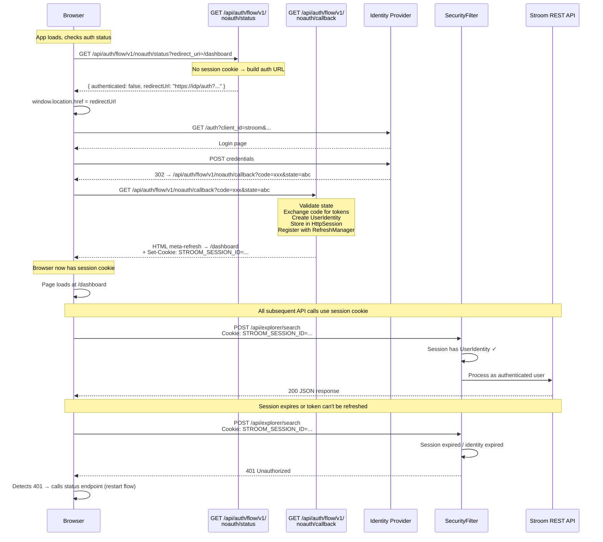

# BFF Authentication Design

## Background

Stroom's authentication is a Backend-for-Frontend (BFF) pattern:

- `SecurityFilter` handles the OIDC Authorization Code flow
- Tokens (access, refresh, ID) are stored **server-side** in the `HttpSession`
- The browser only holds an **httpOnly, Secure, SameSite** session cookie (`STROOM_SESSION_ID`)
- `RefreshManager` refreshes tokens server-side before they expire
- The UI never sees or handles tokens

Previously the auth flow was **redirect-driven**: `SecurityFilter` responded with HTTP 307 redirects
to the IdP and HTML meta-refreshes for callbacks. This works for the GWT UI (served from the same
origin by Stroom) but not for an SPA served externally (e.g. the Leptos UI via NGINX or Trunk),
which needs **API-driven** auth: JSON responses telling it where to redirect, and a dedicated
callback endpoint.

The auth flow has been decoupled so that **all UIs use the same mechanism** regardless of how they
are served (by Stroom, NGINX, or Trunk).

## Deployment Model

```
                         NGINX (or Trunk in dev)
                         ┌──────────────────────┐
                         │                      │
Browser ──── HTTPS ────▶ │  /          → Leptos │  (static WASM + HTML)
                         │                      │
                         │  /stroom/   → Stroom │  (GWT UI)
                         │                      │
                         │  /api/*     → Stroom │  (REST API + auth endpoints)
                         │                      │
                         └──────────────────────┘
```

Because NGINX (or Trunk's proxy in dev) presents everything on the **same origin**, the existing
`STROOM_SESSION_ID` cookie is shared between the Leptos UI and Stroom API. No CORS, no new cookies,
no separate session store needed.

---

## Auth Flow API

### Endpoints

Two unauthenticated endpoints on the Stroom REST API:

| Method | Path | Purpose |
|--------|------|---------|
| `GET` | `/api/auth/flow/v1/noauth/status` | Check if caller is authenticated. If not, return the OIDC redirect URL |
| `GET` | `/api/auth/flow/v1/noauth/callback` | OIDC callback — exchange code for tokens, create session, redirect to original page |

### Status Endpoint

**Request:**
```
GET /api/auth/flow/v1/noauth/status?redirect_uri=/dashboard
```

**Response (authenticated):**
```json
{
  "authenticated": true,
  "subjectId": "admin",
  "displayName": "Admin User",
  "expiresInSec": 3600
}
```

**Response (unauthenticated):**
```json
{
  "authenticated": false,
  "redirectUrl": "https://idp.example.com/auth?client_id=stroom&redirect_uri=https://stroom.example.com/api/auth/flow/v1/noauth/callback&state=abc&nonce=xyz&response_type=code&scope=openid"
}
```

The `redirect_uri` query parameter tells the status endpoint where to send the user after
authentication. This becomes the `initiatingUri` stored in the `AuthenticationState`, while
the OIDC `redirect_uri` sent to the IdP is always the callback endpoint.

### Callback Endpoint

**Request (from IdP redirect):**
```
GET /api/auth/flow/v1/noauth/callback?code=xxx&state=abc
```

**Behaviour:**
1. Validates `state` against `AuthenticationStateCache`
2. Exchanges `code` for tokens via `StroomUserIdentityFactory.getAuthFlowUserIdentity()`
3. Creates `HttpSession` with `UserIdentity`, registers token with `RefreshManager`
4. Responds with HTML `<meta http-equiv="refresh">` to redirect to the `initiatingUri`
5. The `Set-Cookie: STROOM_SESSION_ID` header is included in the response

The meta-refresh technique (rather than a 302 redirect) ensures the cookie is fully set before
the browser navigates away, which is the proven approach used by the existing auth flow.

---

## Authentication Flow



## How This Works for Both UIs

Both the GWT and Leptos UIs use the same auth mechanism:

| Step | How it works |
|------|--------------|
| Detect unauthenticated | Bootstrap JS calls `GET /api/auth/flow/v1/noauth/status` → gets redirect URL |
| Redirect to IdP | Bootstrap JS does `window.location = redirectUrl` |
| Login (internal IdP) | `/signIn` served unauthenticated by `SignInServlet` → GWT login form |
| OIDC callback | IdP redirects to `/api/auth/flow/v1/noauth/callback` → `AuthFlowResourceImpl` handles |
| Code exchange | `StroomUserIdentityFactory.getAuthFlowUserIdentity()` |
| Session creation | `HttpSession` + `STROOM_SESSION_ID` cookie |
| Token refresh | `RefreshManager` background thread |
| Authenticated requests | `SecurityFilter` checks session → `UserIdentity` found |
| Session expiry | API returns 401 → UI restarts auth flow |
| Logout | `GET /api/session/v1/logout` |

The only difference between GWT and Leptos is **what loads after auth is confirmed**: GWT loads
`stroom.nocache.js`, Leptos loads WASM. The auth flow is identical.

---

## CSRF Protection

Since authentication is cookie-based, the application is vulnerable to Cross-Site Request Forgery
(CSRF) on state-changing requests. The standard mitigation for API-driven SPAs is a **custom header
check**: browsers prevent cross-site JavaScript from adding custom headers, so if the header is
present, the request must have originated from same-origin code.

This is the same approach used by **Duende BFF** (`X-CSRF: 1`) and **Curity Token Handler**
(`token-handler-version: 1`). It aligns with Meta's first-party BFF implementation and the IETF
Token Mediating and Session Information Protocol recommendations.

### How It Works

1. **All legitimate API calls** (from GWT, Leptos, or the bootstrap script) add a custom header:
   `X-CSRF: 1`
2. **`SecurityFilter`** checks for this header on non-GET, non-OPTIONS requests to authenticated
   endpoints
3. **Cross-site attacks** (e.g. a malicious `<form>` POST to `/api/explorer/delete`) cannot add
   custom headers — the browser blocks it
4. **GET requests are exempt** — they must be idempotent (no side effects), so CSRF on GET is not
   a concern
5. **Unauthenticated endpoints are exempt** — they don't have a session to abuse

### Request Flow

```
Unauthenticated requests (no session) → 401 (no CSRF check — nothing to abuse)
Authenticated GET requests             → allowed without the header
Authenticated POST/PUT/DELETE + X-CSRF  → allowed
Authenticated POST/PUT/DELETE - X-CSRF  → 403 Forbidden
```

### Client-Side Implementation

**GWT**: `RestDispatcher.send()` adds `X-CSRF: 1` to every request via `builder.setHeader()`.
This is the single point through which all RestyGWT REST calls pass.

**Leptos**: The API call wrapper must include `.header("X-CSRF", "1")` on all state-changing
requests.

**Bootstrap script**: Only calls `GET /status` (exempt from CSRF check).

---

## SecurityFilter Simplification

Previously `SecurityFilter` had two distinct paths:
- **API requests**: Check session → 401 if unauthenticated
- **`StroomServlet` requests**: Run the full OIDC redirect flow (`doOpenIdFlow`)

The `doOpenIdFlow` path has been removed. `StroomServlet` is now treated as a static resource
(like `SignInServlet`), and the auth check is done client-side by the bootstrap script. This means:

- `SecurityFilter` no longer initiates OIDC redirects
- `SecurityFilter` no longer handles OIDC callback params (`code`, `state`)
- The removed methods are: `doOpenIdFlow()`, `isStroomUIServlet()`, `getPostAuthRedirectUri()`
- The `UriFactory` dependency has been removed from `SecurityFilter`

## AppServlet Bootstrap

`AppServlet.doGet()` now injects an inline JavaScript bootstrap script (via the `@BOOTSTRAP@`
placeholder in `app.html`) instead of directly loading the GWT script via `<script src='...'>`.

The bootstrap script:
1. Calls `fetch('/api/auth/flow/v1/noauth/status?redirect_uri=' + encodeURIComponent(window.location.href))`
2. If `authenticated === true`, dynamically creates a `<script>` element to load the GWT JS
3. If `authenticated === false`, redirects to `auth.redirectUrl`
4. On error, displays a message in the `#loadingText` element

### SignInServlet Exception

`SignInServlet` overrides `useBootstrap()` to return `false` — it loads the GWT script directly
without the auth check. This is because the sign-in page IS the internal IdP login form: redirecting
to the IdP from the login page would create an infinite redirect loop.

---

## AuthenticationState — Dual URI Support

`AuthenticationState` now supports separate callback and initiating URIs via a second constructor:

- `redirectUri` → the OIDC `redirect_uri` parameter sent to the IdP (the callback endpoint)
- `initiatingUri` → the page the user was originally trying to visit (where they go after auth)

Previously both were derived from the same URL. `AuthenticationStateCache` has a corresponding
`create(initiatingUrl, callbackUri, prompt)` overload.

The existing constructor and single-URL `create` method are unchanged — the old GWT flow
(if invoked through `OpenIdManager`) continues to work identically.

---

## OIDC Client Registration

### Internal IdP

No configuration change needed. The internal IdP validates `redirect_uri` against
`oAuth2Client.getUriPattern()`, which defaults to `".*"` (matches any URI). The new callback
endpoint's URI is accepted out of the box.

### External IdP

When using an external IdP (Keycloak, Cognito, etc.), the new callback URI
(`/api/auth/flow/v1/noauth/callback`) must be added to the client's allowed redirect URIs
in the IdP's admin console. This is a deployment/configuration task, not a code change.

---

## Proxy Configuration

### Trunk (Development)

```toml
# Trunk.toml — Leptos UI development configuration

[build]
target = "index.html"

[serve]
address = "127.0.0.1"
port = 8080

# API requests → Stroom backend (no rewrite — preserve /api/ prefix)
[[proxy]]
backend = "https://localhost:8443/api/"
insecure = true

# Internal IdP sign-in page → Stroom
[[proxy]]
backend = "https://localhost:8443/signIn"
insecure = true

# GWT UI (optional, for testing alongside Leptos)
[[proxy]]
backend = "https://localhost:8443/stroom/"
insecure = true

# UI static resources for sign-in page
[[proxy]]
backend = "https://localhost:8443/ui/"
insecure = true
```

### Stroom Configuration for Trunk Dev

```yaml
appConfig:
  publicUri: "http://localhost:8080"       # Trunk dev server origin
  nodeUri: "https://localhost:8443"        # Stroom's actual address

  sessionCookie:
    secure: false    # Trunk serves HTTP — browser rejects Secure cookies over HTTP
    httpOnly: true   # Tokens inaccessible to JS (default)
    sameSite: "LAX"  # LAX needed for IdP redirect back (STRICT blocks cross-site navigations)
```

**Important**: `sameSite` must be `LAX` during development. After login, the IdP redirects the
browser back to the callback URL — `STRICT` would prevent the session cookie being sent on that
cross-site navigation. `LAX` allows cookies on top-level navigations (GET) while still blocking
cross-site POST requests.

For production with NGINX (HTTPS), the defaults (`secure=true`, `sameSite=STRICT`) are fine.

### Production NGINX

```nginx
server {
    listen 443 ssl;
    server_name stroom.example.com;

    ssl_certificate     /etc/ssl/certs/stroom.crt;
    ssl_certificate_key /etc/ssl/private/stroom.key;

    # Leptos WASM app — static files
    location / {
        root /usr/share/nginx/html/leptos-ui;
        try_files $uri $uri/ /index.html;
    }

    # Stroom REST API + auth flow endpoints
    location /api/ {
        proxy_pass https://stroom-backend:8443/api/;
        proxy_set_header Host $host;
        proxy_set_header X-Real-IP $remote_addr;
        proxy_set_header X-Forwarded-For $proxy_add_x_forwarded_for;
        proxy_set_header X-Forwarded-Proto $scheme;
        proxy_pass_request_headers on;
    }

    # Internal IdP sign-in page (if using Stroom's internal IdP)
    location /signIn {
        proxy_pass https://stroom-backend:8443/signIn;
        proxy_set_header Host $host;
        proxy_set_header X-Forwarded-For $proxy_add_x_forwarded_for;
        proxy_set_header X-Forwarded-Proto $scheme;
    }

    # UI resources for sign-in page
    location /ui/ {
        proxy_pass https://stroom-backend:8443/ui/;
        proxy_set_header Host $host;
    }

    # Optional: GWT UI (if both UIs coexist)
    location /stroom/ {
        proxy_pass https://stroom-backend:8443/stroom/;
        proxy_set_header Host $host;
        proxy_set_header X-Forwarded-For $proxy_add_x_forwarded_for;
        proxy_set_header X-Forwarded-Proto $scheme;
    }
}
```

### Serving the GWT UI from NGINX

With the auth flow changes, the GWT UI uses the same API-driven auth as Leptos. Serving it from
NGINX is purely a deployment configuration:

| Path | Content | Source |
|------|---------|--------|
| `/` | `bootstrap.html` — auth-check + dynamic GWT script load | Static file (equivalent to what `AppServlet` generates) |
| `/signIn` | Login page — proxy to `SignInServlet` | Proxied to Stroom |
| `/ui/*` | GWT compiled JS, CSS, images | Static files from GWT build output |
| `/api/*` | REST API + auth endpoints | Proxied to Stroom |

The auth behaviour is **identical** whether the GWT UI is served by Stroom (`AppServlet` with
embedded bootstrap) or by NGINX (`bootstrap.html` static file). The only difference is cosmetic —
Stroom can personalise the title/theme in the HTML before it reaches the browser.

---

## Comparison: Trunk (Dev) vs NGINX (Production)

| Concern | Trunk (Dev) | NGINX (Production) |
|---------|-------------|---------------------|
| Leptos static files | Built + served by Trunk | Pre-built, served from disk |
| API proxy | `[[proxy]] backend = "https://..."` | `location /api/ { proxy_pass ... }` |
| Same-origin | `http://localhost:8080` | `https://stroom.example.com` |
| Session cookie | Works — same origin | Works — same origin |
| HTTPS | Optional (HTTP proxy to HTTPS backend) | NGINX terminates TLS |
| Hot reload | Yes — Trunk rebuilds WASM on save | No — static deployment |
